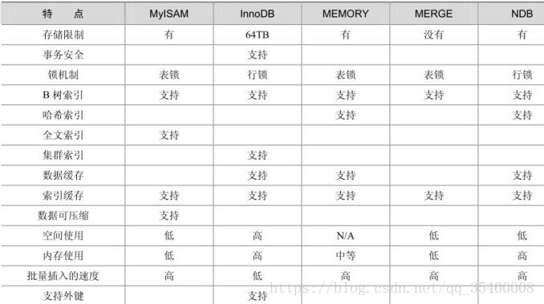

# mysql




# redis

> ```php
> //centos下看是否安装redis及其版本号
> # redis-server -v
> 
> Redis server v=6.0.6 sha=00000000:0 malloc=jemalloc-5.1.0 bits=64 build=3f4720fbc51b9c9
> //版本为5.1.0
> ```
>
> 

## 概述

### 1、官方文档

官网：https://redis.io/

官方推荐文档：https://github.com/redis/redis-doc

指令文档：https://github.com/redis/redis-doc/blob/master/commands.json

指令文档：https://redis.io/commands/+指令

| 场景        | 调用                       | 路径                                          | 备注                                          |
| ----------- | -------------------------- | --------------------------------------------- | --------------------------------------------- |
| php原生支持 | new \Redis()               | php.jar > stubs > redis > Redis.php           | 需要php_redis.dll文件，配置php.ini的extension |
| yii2支持    | new yii\redis\Connection() | app/vendor/yiisoft/yii2-redis/src/Connect.php | 不用安装redis扩展                             |

### 2、查看版本号

| 序号 | 位置              | 指令            | 备注 |
| ---- | ----------------- | --------------- | ---- |
| 1    | 在redis内部       | info+回车       |      |
| 2    | 在linux或者window | redis-server -v |      |

### 3、进入redis

> ```shell
> #redis-cli -h 127.0.0.1 -p 6379 -a myPassword
> ```

### 4、null与nil

redis种null的写法是nil

### 5、解析command

> ```php
> <?php
> $redisArr = include_once './redis-command.php';
> $data = [];
> $maxVersion = 0;
> foreach ($redisArr as $command => $remark){
>     $group = $remark['group'];
>     $version = explode('.', $remark['since']);
>     $remark['version'] = $version[0];
>     $maxVersion < $version[0] && $maxVersion = $version[0];
>     if(!isset($data[$group])) $data[$group] = [];
>     $data[$group][$command] = $remark;
> }
> echo "version:".$maxVersion.'<br>';
> $i = 1;
> foreach ($data as $group => $commands){
>     echo $i++ . '-'.$group  . '<br>';
>     showCommand($commands);
> }
> 
> function showCommand($commands, $version = 0){
>     $j = 1;
>     foreach ($commands as $command => $remark){
> //        if($command == 'SET') var_dump($remark);
>         if($remark['version'] == $version){
>             $o = [];
>             if(isset($remark['complexity'])){
>                 $oA = explode(' ', $remark['complexity']);
>                 foreach ($oA as $oi){
>                     if(stripos($oi, 'O(') !== 0){
>                         continue;
>                     }else{
>                         $oi && $o[] = $oi;
>                     }
>                 }
>                 if($o){
>                     foreach ($o as &$oj){
>                         $oj = trim($oj,'., ');
>                         if(stripos($oj, 'O(') !== 0){
>                             $oj = '?-?';
>                         }elseif(substr_count($oj, '(') != substr_count($oj, ')')){
>                             $oj .= '?';
>                         }
>                     }
>                     $o = array_unique($o);
>                     $o = implode('/', $o);
>                 }
>             }
>             $o || $o = "无";
>             $c = strtolower($command);
>             $s = str_pad($j++,2,0,STR_PAD_LEFT).'='.$version.'='.$o.'='. $c.'=<a href="https://redis.io/commands/'.strtr($command,' ', '-').'">';
>             !isset($remark['arguments']) && $remark['arguments'] = [];
>             foreach ($remark['arguments'] as $param){
>                 if(isset($param['enum'])){
>                     $p =implode('|', $param['enum']);
>                 }elseif(is_array($param['name'])){
>                     $p = implode(' ', $param['name']);
>                 }else{
>                     $p = $param['name'];
>                 }
> 
>                 if(isset($param['multiple']) && $param['multiple']) $p .=" [{$p} ...]";
>                 if(isset($param['optional']) && $param['optional']){
>                     $c .= "  [" . $p .']';
>                 }else{
>                     $c .= "  " . $p;
>                 }
>             }
>             echo $s.="{$c}</a><br>";
>         }
>     }
>     $version < 10 && showCommand($commands, $version + 1);
> }
> ```
>
> 

## (一)、string

| 序号                                        | 复杂度                   | 版   | 功能  | 指令        | 指令参数                                                     |
| ------------------------------------------- | ------------------------ | ---- | ----- | ----------- | ------------------------------------------------------------ |
| [1](https://redis.io/commands/set)          | O(1)                     | 1    | 入    | set         | set key value [EX seconds\|PX milliseconds\|KEEPTTL] [NX\|XX] |
| [2](https://redis.io/commands/setnx)        | O(1)                     | 1    | 入    | setnx       | setnx key value                                              |
| [3](https://redis.io/commands/msetnx)       | O(N)                     | 1    | 入    | msetnx      | msetnx key value [key value ...]                             |
| [4](https://redis.io/commands/append)       | O(1)                     | 2    | 入    | append      | append key value                                             |
| [5](https://redis.io/commands/psetex)       | O(1)                     | 2    | 入    | psetex      | psetex key milliseconds value                                |
| [6](https://redis.io/commands/setbit)       | O(1)                     | 2    | 入    | setbit      | setbit key offset value                                      |
| [7](https://redis.io/commands/setex)        | O(1)                     | 2    | 入    | setex       | setex key seconds value                                      |
| [8](https://redis.io/commands/setrange)     | O(1)/O(M)                | 2    | 入    | setrange    | setrange key offset value                                    |
| [9](https://redis.io/commands/get)          | O(1)                     | 1    | 取    | get         | get key                                                      |
| [10](https://redis.io/commands/mget)        | O(N)                     | 1    | 取    | mget        | mget key [key ...]                                           |
| [11](https://redis.io/commands/mset)        | O(N)                     | 1    | 取    | mset        | mset key value [key value ...]                               |
| [12](https://redis.io/commands/getbit)      | O(1)                     | 2    | 取    | getbit      | getbit key offset                                            |
| [13](https://redis.io/commands/getrange)    | O(N)/O(1)                | 2    | 取    | getrange    | getrange key start end                                       |
| [14](https://redis.io/commands/getset)      | O(1)                     | 1    | 入+取 | getset      | getset key value                                             |
| [15](https://redis.io/commands/decr)        | O(1)                     | 1    | 减    | decr        | decr key                                                     |
| [16](https://redis.io/commands/decrby)      | O(1)                     | 1    | 减    | decrby      | decrby key decrement                                         |
| [17](https://redis.io/commands/incr)        | O(1)                     | 1    | 增    | incr        | incr key                                                     |
| [18](https://redis.io/commands/incrby)      | O(1)                     | 1    | 增    | incrby      | incrby key increment                                         |
| [19](https://redis.io/commands/incrbyfloat) | O(1)                     | 2    | 增    | incrbyfloat | incrbyfloat key increment                                    |
| [20](https://redis.io/commands/bitcount)    | O(N)                     | 2    |       | bitcount    | bitcount key [start end]                                     |
| [21](https://redis.io/commands/bitop)       | O(N)                     | 2    |       | bitop       | bitop operation destkey key [key ...]                        |
| [22](https://redis.io/commands/bitpos)      | O(N)                     | 2    |       | bitpos      | bitpos key bit [start] [end]                                 |
| [23](https://redis.io/commands/strlen)      | O(1)                     | 2    | 长    | strlen      | strlen key                                                   |
| [24](https://redis.io/commands/bitfield)    | O(1)                     | 3    |       | bitfield    | bitfield key [type offset] [type offset value] [type offset increment] [WRAP\|SAT\|FAIL] |
| [25](https://redis.io/commands/stralgo)     | O(strlen(s1)*strlen(s2)) | 6    |       | stralgo     | stralgo LCS algo-specific-argument [algo-specific-argument ...] |

> * getset既存也取。因为第一次getset的时候，库种没有值，故而返回null，但是存入是成功了的

| 参数                         | 功能                    | 备注       |
| ---------------------------- | ----------------------- | ---------- |
| EX senconds\|PX milliseconds | 过期时间(秒和毫秒)      | \>= 2.6.12 |
| NX\|XX                       | 不存在则存入/存在才存入 | \>= 2.6.12 |
| KEEPTTL                      |                         |            |

## (二)、hash

### 1、增/改

### 2、删

### 3、查

### 4、属性

## (三)、list

1、增/改

2、删

3、查

4、属性

## (四)、set

1、增/改

2、删

3、查

4、属性

## (五)、zset

1、增/改

2、删

3、查

4、属性

## 其他

### (一)、安装

#### 1、linux安装

#### 2、windows安装

参考链接：  https://www.cnblogs.com/liuqingzheng/p/9831331.html

##### a、下载安装包

​       https://github.com/microsoftarchive/redis/releases   选择.msi

##### b、运行msi进行安装

##### c、设密码

>安装完毕后，需要先做一些设定工作，以便服务启动后能正常运行。使用文本编辑器，这里使用Notepad++，打开Redis服务配置文件。**注意：不要找错了，通常为redis.windows-service.conf，而不是redis.windows.conf。后者是以非系统服务方式启动程序使用的配置文件。**
>
>
>
>10、找到含有requirepass字样的地方，追加一行，输入requirepass 12345。这是访问Redis时所需的密码，一般测试情况下可以不用设定密码。不过，即使是作为本地访问，也建议设定一个密码。此处以简单的12345来演示。


##### d、启动服务

>点击“开始”>右击“计算机”>选择“管理”。在左侧栏中依次找到并点击“计算机管理（本地）”>服务和应用程序>服务。再在右侧找到Redis名称的服务，查看启动情况。如未启动，则手动启动之。正常情况下，服务应该正常启动并运行了。

##### e、ok拉---修改php.ini

###### I、下载php_redis.dll

phpredis扩展下载地址  http://windows.php.net/downloads/pecl/snaps/redis/

###### II、把php_redis.dll放在php目录下

将下载好的php_redis.dll放入E:\wamp64\bin\php\php5.6.25\ext文件夹中

###### III、修改php.ini文件

E:\wamp64\bin\apache\apache2.4.23\bin\php.ini添加代码:

 			extension=php_redis.dll

# memcached

一、string

二、

三、

四、

五、

其他

(一)、安装

1、linux安装

2、windows安装


# 数据结构

二叉排序树 → 二叉平衡树 → B-Tree（B树） → B+Tree（B+树）

## 二叉排序树  

## 二叉平衡树 

## B-Tree（B树）

## B+Tree（B+树）

# 问题

## (一)、缓存穿透

缓存穿透是指查询一个一定不存在的数据，因为这个数据不存在，所以永远不会被缓存，所以每次请求都会去请求数据库。

## (二)、缓存穿刺

当热点KEY在失效的瞬间，海量的请求会不会产生大量的数据库请求，从而导致数据库崩溃？


### 1、互斥锁

互斥锁指的是在缓存KEY过期去更新的时候，先让程序去获取锁，只有获取到锁的线程才有资格去更新缓存KEY

## (三)、缓存雪崩

缓存雪崩是指在我们设置缓存时采用了相同的过期时间，导致缓存在某一时刻同时失效，请求全部转发到数据库，最终导致数据库瞬时压力过大而崩溃。