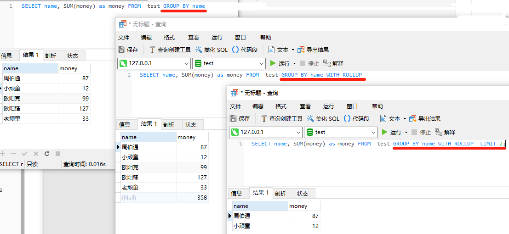

# 一、mysql(5.7)

## (一)、基础语法

### 1、注释

> 三种注释方式

单行注释

> ```sql
> select * from table #我是注释
> select * from table -- 我是注释
> ```
>
> --后面必须带==至少一个空格和控制符==

多行注释

> ```sql
> /*
> select * from table
> */
> ```


### 2、命名规范及大小写

https://dev.mysql.com/doc/refman/5.7/en/identifier-length.html

|                 | Identifier Type          | 最大长度(字符)                                               | 区分大小写 |
| --------------- | :----------------------- | :----------------------------------------------------------- | ---------- |
| 数据库名称      | Database                 | 64 ([`NDB`](https://dev.mysql.com/doc/refman/5.7/en/mysql-cluster.html) storage engine: 63) |            |
| 表名            | Table                    | 64 ([`NDB`](https://dev.mysql.com/doc/refman/5.7/en/mysql-cluster.html) storage engine: 63) |            |
| 列名            | Column                   | 64                                                           |            |
| 索引名          | Index                    | 64                                                           |            |
| 约束            | Constraint               | 64                                                           |            |
| 存储过程/函数名 | Stored Program           | 64                                                           |            |
| 视图名          | View                     | 64                                                           |            |
|                 | Tablespace               | 64                                                           |            |
|                 | Server                   | 64                                                           |            |
|                 | Log File Group           | 64                                                           |            |
| 别名            | Alias                    | 256 (see exception following table)                          |            |
| label标签       | Compound Statement Label | 16                                                           |            |
| 用户变量名称    | User-Defined Variable    | 64                                                           |            |

#### 大小写问题

>
>
>列，索引，存储的例程和事件名称在任何平台上都不区分大小写，列别名也不区分大小写。
>
>但是，日志文件组的名称区分大小写。这与标准SQL不同。
>
>默认情况下，表别名在Unix上区分大小写，但在Windows或macOS上不区分大小写。
>
>
>
>大小写问题受全局变量影响：       
>
>[**mysqld**](https://dev.mysql.com/doc/refman/5.7/en/mysqld.html). [`lower_case_table_names`](https://dev.mysql.com/doc/refman/5.7/en/server-system-variables.html#sysvar_lower_case_table_names)
>
>
>
>```sql
>SHOW GLOBAL VARIABLES
>或者
>SHOW VARIABLES
>或
>SHOW GLOBAL VARIABLES LIKE 'lower_case_table_names'
>或者
>SELECT  @@lower_case_table_names;
>```
>
>

### 3、变量

#### (1)、用户变量

https://dev.mysql.com/doc/refman/5.7/en/user-variables.html

语法

> ```sql
> SET @var_name = expr [, @var_name = expr] ...
> ```

举例

>```sql
>set @var1=1;
>set @var2:=2;
>#select @var3=3; #这个是错误的，会用@var3变量与数字3作比较，是否相等
>select @var3:=3; #
>
>SELECT @var1,@var2,@var3;
>```
>


>| 关键字 | =      | :=   | 输出显示 |          |
>| ------ | ------ | ---- | -------- | -------- |
>| set    | 支持   | 支持 | 不显示   | 建议用   |
>| select | 不支持 | 支持 | 会显示   | 不建议用 |

#### (2)、局部变量

https://dev.mysql.com/doc/refman/5.7/en/declare-local-variable.html

语法

> ```sql
> DECLARE var_name [, var_name] ... type [DEFAULT value]
> ```
>
> 如果没有default设置，则默认是null

举例

> ```sql
> declare var1 varchar(50);
> ```

#### (3)、全局变量(系统变量)

https://dev.mysql.com/doc/refman/5.7/en/server-system-variable-reference.html

> 调用使用两个@：@@
>
> ```sql
> SELECT  @@lower_case_table_names;
> ```

### 4、运算符

https://dev.mysql.com/doc/refman/5.7/en/non-typed-operators.html

>| 优先级 | 名称                                                         | 描述                                                         |
>| ------ | :----------------------------------------------------------- | :----------------------------------------------------------- |
>| 1      | [`INTERVAL`](https://dev.mysql.com/doc/refman/5.7/en/expressions.html#temporal-intervals) | 时间间隔                                                     |
>| 2      | [`BINARY`](https://dev.mysql.com/doc/refman/5.7/en/cast-functions.html#operator_binary) | 将字符串转换为二进制字符串                                   |
>| 3      | [`!`](https://dev.mysql.com/doc/refman/5.7/en/logical-operators.html#operator_not) | 取反值                                                       |
>| 4      | [`-`](https://dev.mysql.com/doc/refman/5.7/en/arithmetic-functions.html#operator_unary-minus) | 取反(正数取反)                                               |
>| 4      | [`~`](https://dev.mysql.com/doc/refman/5.7/en/bit-functions.html#operator_bitwise-invert) | 按位反转                                                     |
>| 5      | [`^`](https://dev.mysql.com/doc/refman/5.7/en/bit-functions.html#operator_bitwise-xor) | 按位异或                                                     |
>| 6      | [`*`](https://dev.mysql.com/doc/refman/5.7/en/arithmetic-functions.html#operator_times) [`DIV`](https://dev.mysql.com/doc/refman/5.7/en/arithmetic-functions.html#operator_div) [`/`](https://dev.mysql.com/doc/refman/5.7/en/arithmetic-functions.html#operator_divide) [`%`， `MOD`](https://dev.mysql.com/doc/refman/5.7/en/arithmetic-functions.html#operator_mod) | 乘/除/取模                                                   |
>| 7      | [`+`](https://dev.mysql.com/doc/refman/5.7/en/arithmetic-functions.html#operator_plus) [`-`](https://dev.mysql.com/doc/refman/5.7/en/arithmetic-functions.html#operator_minus) | 加减                                                         |
>| 8      | [`>>`](https://dev.mysql.com/doc/refman/5.7/en/bit-functions.html#operator_right-shift) [`<<`](https://dev.mysql.com/doc/refman/5.7/en/bit-functions.html#operator_left-shift) | 右移 右移                                                    |
>| 9      | [`&`](https://dev.mysql.com/doc/refman/5.7/en/bit-functions.html#operator_bitwise-and) | 按位与                                                       |
>| 10     | [`|`](https://dev.mysql.com/doc/refman/5.7/en/bit-functions.html#operator_bitwise-or) | 按位或                                                       |
>| 11     | [`=`](https://dev.mysql.com/doc/refman/5.7/en/comparison-operators.html#operator_equal) | 平等算子                                                     |
>| 11     | [`<=>`](https://dev.mysql.com/doc/refman/5.7/en/comparison-operators.html#operator_equal-to) | NULL安全等于运算符                                           |
>| 11     | [`>=`](https://dev.mysql.com/doc/refman/5.7/en/comparison-operators.html#operator_greater-than-or-equal) | 大于或等于运算符                                             |
>| 11     | [`>`](https://dev.mysql.com/doc/refman/5.7/en/comparison-operators.html#operator_greater-than) | 大于运算符                                                   |
>| 11     | [`<=`](https://dev.mysql.com/doc/refman/5.7/en/comparison-operators.html#operator_less-than-or-equal) | 小于或等于运算符                                             |
>| 11     | [`<`](https://dev.mysql.com/doc/refman/5.7/en/comparison-operators.html#operator_less-than) | 少于运算符                                                   |
>| 11     | [`<>`， `!=`](https://dev.mysql.com/doc/refman/5.7/en/comparison-operators.html#operator_not-equal) | 不等于运算符                                                 |
>| 11     | [`IS`](https://dev.mysql.com/doc/refman/5.7/en/comparison-operators.html#operator_is) | 针对布尔值测试值                                             |
>| 11     | [`LIKE`](https://dev.mysql.com/doc/refman/5.7/en/string-comparison-functions.html#operator_like) | 简单模式匹配                                                 |
>| 11     | [`REGEXP`](https://dev.mysql.com/doc/refman/5.7/en/regexp.html#operator_regexp) | 字符串是否匹配正则表达式                                     |
>| 11     | [`IN()`](https://dev.mysql.com/doc/refman/5.7/en/comparison-operators.html#operator_in) | 一个值是否在一组值内                                         |
>| 12     | [`BETWEEN ... AND ...`](https://dev.mysql.com/doc/refman/5.7/en/comparison-operators.html#operator_between) | 值是否在值范围内                                             |
>| 12     | [`CASE`](https://dev.mysql.com/doc/refman/5.7/en/flow-control-functions.html#operator_case) | 案例操作员                                                   |
>| 13     | [`NOT`](https://dev.mysql.com/doc/refman/5.7/en/logical-operators.html#operator_not) | 取反值                                                       |
>| 14     | [`AND`， `&&`](https://dev.mysql.com/doc/refman/5.7/en/logical-operators.html#operator_and) | 逻辑与                                                       |
>| 15     | [`XOR`](https://dev.mysql.com/doc/refman/5.7/en/logical-operators.html#operator_xor) | 逻辑异或                                                     |
>| 16     | [`OR`， `||`](https://dev.mysql.com/doc/refman/5.7/en/logical-operators.html#operator_or) | 逻辑或                                                       |
>| 17     | [`:=`](https://dev.mysql.com/doc/refman/5.7/en/assignment-operators.html#operator_assign-value) | 赋值                                                         |
>| 17     | [`=`](https://dev.mysql.com/doc/refman/5.7/en/assignment-operators.html#operator_assign-equal) | 分配值（作为[`SET`](https://dev.mysql.com/doc/refman/5.7/en/set-variable.html) 语句的一部分 ，或作为语句的`SET`子句的 一部分[`UPDATE`](https://dev.mysql.com/doc/refman/5.7/en/update.html)） |
>|        | [`->`](https://dev.mysql.com/doc/refman/5.7/en/json-search-functions.html#operator_json-column-path) | 评估路径后从JSON列返回值；等效于JSON_EXTRACT（）。           |
>|        | [`->>`](https://dev.mysql.com/doc/refman/5.7/en/json-search-functions.html#operator_json-inline-path) （介绍5.7.13） | 在评估路径并取消引用结果后，从JSON列返回值；等效于JSON_UNQUOTE（JSON_EXTRACT（））。 |
>|        | [`IS NOT`](https://dev.mysql.com/doc/refman/5.7/en/comparison-operators.html#operator_is-not) | 针对布尔值测试值                                             |
>|        | [`IS NOT NULL`](https://dev.mysql.com/doc/refman/5.7/en/comparison-operators.html#operator_is-not-null) | 非空值测试                                                   |
>|        | [`IS NULL`](https://dev.mysql.com/doc/refman/5.7/en/comparison-operators.html#operator_is-null) | 空值测试                                                     |
>|        | [`NOT BETWEEN ... AND ...`](https://dev.mysql.com/doc/refman/5.7/en/comparison-operators.html#operator_not-between) | 值是否不在值范围内                                           |
>|        | [`NOT IN()`](https://dev.mysql.com/doc/refman/5.7/en/comparison-operators.html#operator_not-in) | 一个值是否不在一组值内                                       |
>|        | [`NOT LIKE`](https://dev.mysql.com/doc/refman/5.7/en/string-comparison-functions.html#operator_not-like) | 否定简单模式匹配                                             |
>|        | [`NOT REGEXP`](https://dev.mysql.com/doc/refman/5.7/en/regexp.html#operator_not-regexp) | 否REGEXP                                                     |
>|        | [`RLIKE`](https://dev.mysql.com/doc/refman/5.7/en/regexp.html#operator_regexp) | 字符串是否匹配正则表达式                                     |
>|        | [`SOUNDS LIKE`](https://dev.mysql.com/doc/refman/5.7/en/string-functions.html#operator_sounds-like) | 比较声音                                                     |

### 5、表达式

https://dev.mysql.com/doc/refman/5.7/en/expressions.html

>```sql
>expr:
>    expr OR expr
>  | expr || expr
>  | expr XOR expr
>  | expr AND expr
>  | expr && expr
>  | NOT expr
>  | ! expr
>  | boolean_primary IS [NOT] {TRUE | FALSE | UNKNOWN}
>  | boolean_primary
>
>boolean_primary:
>    boolean_primary IS [NOT] NULL
>  | boolean_primary <=> predicate
>  | boolean_primary comparison_operator predicate
>  | boolean_primary comparison_operator {ALL | ANY} (subquery)
>  | predicate
>
>comparison_operator: = | >= | > | <= | < | <> | !=
>
>predicate:
>    bit_expr [NOT] IN (subquery)
>  | bit_expr [NOT] IN (expr [, expr] ...)
>  | bit_expr [NOT] BETWEEN bit_expr AND predicate
>  | bit_expr SOUNDS LIKE bit_expr
>  | bit_expr [NOT] LIKE simple_expr [ESCAPE simple_expr]
>  | bit_expr [NOT] REGEXP bit_expr
>  | bit_expr
>
>bit_expr:
>    bit_expr | bit_expr
>  | bit_expr & bit_expr
>  | bit_expr << bit_expr
>  | bit_expr >> bit_expr
>  | bit_expr + bit_expr
>  | bit_expr - bit_expr
>  | bit_expr * bit_expr
>  | bit_expr / bit_expr
>  | bit_expr DIV bit_expr
>  | bit_expr MOD bit_expr
>  | bit_expr % bit_expr
>  | bit_expr ^ bit_expr
>  | bit_expr + interval_expr
>  | bit_expr - interval_expr
>  | simple_expr
>
>simple_expr:
>    literal
>  | identifier
>  | function_call
>  | simple_expr COLLATE collation_name
>  | param_marker
>  | variable
>  | simple_expr || simple_expr
>  | + simple_expr
>  | - simple_expr
>  | ~ simple_expr
>  | ! simple_expr
>  | BINARY simple_expr
>  | (expr [, expr] ...)
>  | ROW (expr, expr [, expr] ...)
>  | (subquery)
>  | EXISTS (subquery)
>  | {identifier expr}
>  | match_expr
>  | case_expr
>  | interval_expr
>```

### 6、流程控制

存储过程和函数，触发器和事件

#### (1)、case

https://dev.mysql.com/doc/refman/5.7/en/case.html

>```sql
>CASE case_value
>    WHEN when_value THEN statement_list
>    [WHEN when_value THEN statement_list] ...
>    [ELSE statement_list]
>END CASE
>```
>
>Or:
>
>```sql
>CASE
>    WHEN search_condition THEN statement_list
>    [WHEN search_condition THEN statement_list] ...
>    [ELSE statement_list]
>END CASE
>```

#### (2)、if

https://dev.mysql.com/doc/refman/5.7/en/if.html

> ```sql
> IF search_condition THEN statement_list
>     [ELSEIF search_condition THEN statement_list] ...
>     [ELSE statement_list]
> END IF
> ```


#### (3)、loop

https://dev.mysql.com/doc/refman/5.7/en/loop.html

> ```sql
> [begin_label:] LOOP
>     statement_list
> END LOOP [end_label]
> ```

#### (4)、repeat

https://dev.mysql.com/doc/refman/5.7/en/repeat.html

> ```sql
> [begin_label:] REPEAT
>     statement_list
> UNTIL search_condition
> END REPEAT [end_label]
> ```

#### (5)、while

https://dev.mysql.com/doc/refman/5.7/en/while.html

> ```sql
> [begin_label:] WHILE search_condition DO
>     statement_list
> END WHILE [end_label]
> ```

#### (6)、iterate(continue)

https://dev.mysql.com/doc/refman/5.7/en/iterate.html

> 仅限使用于 [`LOOP`](https://dev.mysql.com/doc/refman/5.7/en/loop.html), [`REPEAT`](https://dev.mysql.com/doc/refman/5.7/en/repeat.html), 和[`WHILE`](https://dev.mysql.com/doc/refman/5.7/en/while.html)
>
> ```sql
> ITERATE label
> ```

##### (7)、leave(break)

https://dev.mysql.com/doc/refman/5.7/en/leave.html

> 可使用于 [`LOOP`](https://dev.mysql.com/doc/refman/5.7/en/loop.html), [`REPEAT`](https://dev.mysql.com/doc/refman/5.7/en/repeat.html), 和[`WHILE`](https://dev.mysql.com/doc/refman/5.7/en/while.html)
>
> ==也可使用于begin...end==
>
> ```sql
> LEAVE label
> ```

### 7、标签label

https://dev.mysql.com/doc/refman/5.7/en/statement-labels.html

> ```sql
> [begin_label:] BEGIN
>     [statement_list]
> END [end_label]
> 
> [begin_label:] LOOP
>     statement_list
> END LOOP [end_label]
> 
> [begin_label:] REPEAT
>     statement_list
> UNTIL search_condition
> END REPEAT [end_label]
> 
> [begin_label:] WHILE search_condition DO
>     statement_list
> END WHILE [end_label]
> ```

### 8、declare

#### (1)、var定义局部变量

> ```sql
> DECLARE var_name [, var_name] ... type [DEFAULT value]
> ```

#### (2)、handler

https://dev.mysql.com/doc/refman/5.7/en/declare-handler.html

> ```sql
> DECLARE handler_action HANDLER
>     FOR condition_value [, condition_value] ...
>     statement
> 
> handler_action: {
>     CONTINUE
>   | EXIT
>   | UNDO
> }
> 
> condition_value: {
>     mysql_error_code
>   | SQLSTATE [VALUE] sqlstate_value
>   | condition_name
>   | SQLWARNING
>   | NOT FOUND
>   | SQLEXCEPTION
> }
> ```
>
> 

#### (3)、condition

https://dev.mysql.com/doc/refman/5.7/en/declare-condition.html

> ```sql
> DECLARE condition_name CONDITION FOR condition_value
> 
> condition_value: {
>     mysql_error_code
>   | SQLSTATE [VALUE] sqlstate_value
> }
> ```


>-- 定义主键重复错误
>
>-- ERROR 1062 (23000): Duplicate entry '60' for key 'PRIMARY'
>
> 
>
>-- 方法一：使用sqlstate_value 
>
>DECLARE primary_key_duplicate CONDITION FOR SQLSTATE '23000' ; 
>
> 
>
>-- 方法二：使用mysql_error_code 
>
>DECLARE primary_key_duplicate CONDITION FOR 1062 ;


#### (4)、游标

https://dev.mysql.com/doc/refman/5.7/en/declare-cursor.html

### 9、set

https://dev.mysql.com/doc/refman/5.7/en/set-statement.html

### 10、游标

>定义游标
>
>```sql
>DECLARE cursor_name CURSOR FOR select_statement
>```
>
>打开游标
>
>```sql
>OPEN cursor_name
>```
>
>从游标中数据塞入到变量   (放在循环中)
>
>```sql
>FETCH [[NEXT] FROM] cursor_name INTO var_name [, var_name] ...
>```
>
>#  一、mysql(5.7)
>
>## (一)、基础语法
>
>### 1、注释
>
>> 三种注释方式
>
>单行注释
>
>> 1
>>
>> ```
>> select * from table #我是注释
>> ```
>>
>> 2
>>
>> ```
>> select * from table -- 我是注释
>> ```
>>
>> --后面必须带至少一个空格和控制符
>
>多行注释
>
>> 1
>>
>> ```
>> /*
>> ```
>>
>> 2
>>
>> ```
>> select * from table
>> ```
>>
>> 3
>>
>> ```
>> */
>> ```
>
>
>
>### 2、命名规范及大小写
>
>https://dev.mysql.com/doc/refman/5.7/en/identifier-length.html
>
>|                 | Identifier Type          | 最大长度(字符)                                               | 区分大小写 |
>| --------------- | :----------------------- | :----------------------------------------------------------- | ---------- |
>| 数据库名称      | Database                 | 64 ([`NDB`](https://dev.mysql.com/doc/refman/5.7/en/mysql-cluster.html) storage engine: 63) |            |
>| 表名            | Table                    | 64 ([`NDB`](https://dev.mysql.com/doc/refman/5.7/en/mysql-cluster.html) storage engine: 63) |            |
>| 列名            | Column                   | 64                                                           |            |
>| 索引名          | Index                    | 64                                                           |            |
>| 约束            | Constraint               | 64                                                           |            |
>| 存储过程/函数名 | Stored Program           | 64                                                           |            |
>| 视图名          | View                     | 64                                                           |            |
>|                 | Tablespace               | 64                                                           |            |
>|                 | Server                   | 64                                                           |            |
>|                 | Log File Group           | 64                                                           |            |
>| 别名            | Alias                    | 256 (see exception following table)                          |            |
>| label标签       | Compound Statement Label | 16                                                           |            |
>| 用户变量名称    | User-Defined Variable    | 64                                                           |            |
>
>#### 大小写问题
>
>> 列，索引，存储的例程和事件名称在任何平台上都不区分大小写，列别名也不区分大小写。
>>
>> 但是，日志文件组的名称区分大小写。这与标准SQL不同。
>>
>> 默认情况下，表别名在Unix上区分大小写，但在Windows或macOS上不区分大小写。
>>
>> 
>>
>> 大小写问题受全局变量影响：       
>>
>> [**mysqld**](https://dev.mysql.com/doc/refman/5.7/en/mysqld.html). [`lower_case_table_names`](https://dev.mysql.com/doc/refman/5.7/en/server-system-variables.html#sysvar_lower_case_table_names)
>>
>> 
>>
>> 1
>>
>> ```
>> SHOW GLOBAL VARIABLES
>> ```
>>
>> 2
>>
>> ```
>> 或者
>> ```
>>
>> 3
>>
>> ```
>> SHOW VARIABLES
>> ```
>>
>> 4
>>
>> ```
>> 或
>> ```
>>
>> 5
>>
>> ```
>> SHOW GLOBAL VARIABLES LIKE 'lower_case_table_names'
>> ```
>>
>> 6
>>
>> ```
>> 或者
>> ```
>>
>> 7
>>
>> ```
>> SELECT  @@lower_case_table_names;
>> ```
>
>### 3、变量
>
>#### (1)、用户变量
>
>https://dev.mysql.com/doc/refman/5.7/en/user-variables.html
>
>语法
>
>> 1
>>
>> ```
>> SET @var_name = expr [, @var_name = expr] ...
>> ```
>
>举例
>
>> 1
>>
>> ```
>> set @var1=1;
>> ```
>>
>> 2
>>
>> ```
>> set @var2:=2;
>> ```
>>
>> 3
>>
>> ```
>> #select @var3=3; #这个是错误的，会用@var3变量与数字3作比较，是否相等
>> ```
>>
>> 4
>>
>> ```
>> select @var3:=3; #
>> ```
>>
>> 5
>>
>> ```
>> 
>> ```
>>
>> 6
>>
>> ```
>> SELECT @var1,@var2,@var3;
>> ```
>
>
>
>> | 关键字 | =      | :=   | 输出显示 |          |
>> | ------ | ------ | ---- | -------- | -------- |
>> | set    | 支持   | 支持 | 不显示   | 建议用   |
>> | select | 不支持 | 支持 | 会显示   | 不建议用 |
>
>#### (2)、局部变量
>
>https://dev.mysql.com/doc/refman/5.7/en/declare-local-variable.html
>
>语法
>
>> 1
>>
>> ```
>> DECLARE var_name [, var_name] ... type [DEFAULT value]
>> ```
>>
>> 如果没有default设置，则默认是null
>
>举例
>
>> 1
>>
>> ```
>> declare var1 varchar(50);
>> ```
>
>#### (3)、全局变量(系统变量)
>
>https://dev.mysql.com/doc/refman/5.7/en/server-system-variable-reference.html
>
>> 调用使用两个@：@@
>>
>> 1
>>
>> ```
>> SELECT  @@lower_case_table_names;
>> ```
>
>### 4、运算符
>
>https://dev.mysql.com/doc/refman/5.7/en/non-typed-operators.html
>
>> | 优先级 | 名称                                                         | 描述                                                         |
>> | ------ | :----------------------------------------------------------- | :----------------------------------------------------------- |
>> | 1      | [`INTERVAL`](https://dev.mysql.com/doc/refman/5.7/en/expressions.html#temporal-intervals) | 时间间隔                                                     |
>> | 2      | [`BINARY`](https://dev.mysql.com/doc/refman/5.7/en/cast-functions.html#operator_binary) | 将字符串转换为二进制字符串                                   |
>> | 3      | [`!`](https://dev.mysql.com/doc/refman/5.7/en/logical-operators.html#operator_not) | 取反值                                                       |
>> | 4      | [`-`](https://dev.mysql.com/doc/refman/5.7/en/arithmetic-functions.html#operator_unary-minus) | 取反(正数取反)                                               |
>> | 4      | [`~`](https://dev.mysql.com/doc/refman/5.7/en/bit-functions.html#operator_bitwise-invert) | 按位反转                                                     |
>> | 5      | [`^`](https://dev.mysql.com/doc/refman/5.7/en/bit-functions.html#operator_bitwise-xor) | 按位异或                                                     |
>> | 6      | [`*`](https://dev.mysql.com/doc/refman/5.7/en/arithmetic-functions.html#operator_times) [`DIV`](https://dev.mysql.com/doc/refman/5.7/en/arithmetic-functions.html#operator_div) [`/`](https://dev.mysql.com/doc/refman/5.7/en/arithmetic-functions.html#operator_divide) [`%`， `MOD`](https://dev.mysql.com/doc/refman/5.7/en/arithmetic-functions.html#operator_mod) | 乘/除/取模                                                   |
>> | 7      | [`+`](https://dev.mysql.com/doc/refman/5.7/en/arithmetic-functions.html#operator_plus) [`-`](https://dev.mysql.com/doc/refman/5.7/en/arithmetic-functions.html#operator_minus) | 加减                                                         |
>> | 8      | [`>>`](https://dev.mysql.com/doc/refman/5.7/en/bit-functions.html#operator_right-shift) [`<<`](https://dev.mysql.com/doc/refman/5.7/en/bit-functions.html#operator_left-shift) | 右移 右移                                                    |
>> | 9      | [`&`](https://dev.mysql.com/doc/refman/5.7/en/bit-functions.html#operator_bitwise-and) | 按位与                                                       |
>> | 10     | [`|`](https://dev.mysql.com/doc/refman/5.7/en/bit-functions.html#operator_bitwise-or) | 按位或                                                       |
>> | 11     | [`=`](https://dev.mysql.com/doc/refman/5.7/en/comparison-operators.html#operator_equal) | 平等算子                                                     |
>> | 11     | [`<=>`](https://dev.mysql.com/doc/refman/5.7/en/comparison-operators.html#operator_equal-to) | NULL安全等于运算符                                           |
>> | 11     | [`>=`](https://dev.mysql.com/doc/refman/5.7/en/comparison-operators.html#operator_greater-than-or-equal) | 大于或等于运算符                                             |
>> | 11     | [`>`](https://dev.mysql.com/doc/refman/5.7/en/comparison-operators.html#operator_greater-than) | 大于运算符                                                   |
>> | 11     | [`<=`](https://dev.mysql.com/doc/refman/5.7/en/comparison-operators.html#operator_less-than-or-equal) | 小于或等于运算符                                             |
>> | 11     | [`<`](https://dev.mysql.com/doc/refman/5.7/en/comparison-operators.html#operator_less-than) | 少于运算符                                                   |
>> | 11     | [`<>`， `!=`](https://dev.mysql.com/doc/refman/5.7/en/comparison-operators.html#operator_not-equal) | 不等于运算符                                                 |
>> | 11     | [`IS`](https://dev.mysql.com/doc/refman/5.7/en/comparison-operators.html#operator_is) | 针对布尔值测试值                                             |
>> | 11     | [`LIKE`](https://dev.mysql.com/doc/refman/5.7/en/string-comparison-functions.html#operator_like) | 简单模式匹配                                                 |
>> | 11     | [`REGEXP`](https://dev.mysql.com/doc/refman/5.7/en/regexp.html#operator_regexp) | 字符串是否匹配正则表达式                                     |
>> | 11     | [`IN()`](https://dev.mysql.com/doc/refman/5.7/en/comparison-operators.html#operator_in) | 一个值是否在一组值内                                         |
>> | 12     | [`BETWEEN ... AND ...`](https://dev.mysql.com/doc/refman/5.7/en/comparison-operators.html#operator_between) | 值是否在值范围内                                             |
>> | 12     | [`CASE`](https://dev.mysql.com/doc/refman/5.7/en/flow-control-functions.html#operator_case) | 案例操作员                                                   |
>> | 13     | [`NOT`](https://dev.mysql.com/doc/refman/5.7/en/logical-operators.html#operator_not) | 取反值                                                       |
>> | 14     | [`AND`， `&&`](https://dev.mysql.com/doc/refman/5.7/en/logical-operators.html#operator_and) | 逻辑与                                                       |
>> | 15     | [`XOR`](https://dev.mysql.com/doc/refman/5.7/en/logical-operators.html#operator_xor) | 逻辑异或                                                     |
>> | 16     | [`OR`， `||`](https://dev.mysql.com/doc/refman/5.7/en/logical-operators.html#operator_or) | 逻辑或                                                       |
>> | 17     | [`:=`](https://dev.mysql.com/doc/refman/5.7/en/assignment-operators.html#operator_assign-value) | 赋值                                                         |
>> | 17     | [`=`](https://dev.mysql.com/doc/refman/5.7/en/assignment-operators.html#operator_assign-equal) | 分配值（作为[`SET`](https://dev.mysql.com/doc/refman/5.7/en/set-variable.html) 语句的一部分 ，或作为语句的`SET`子句的 一部分[`UPDATE`](https://dev.mysql.com/doc/refman/5.7/en/update.html)） |
>> |        | [`->`](https://dev.mysql.com/doc/refman/5.7/en/json-search-functions.html#operator_json-column-path) | 评估路径后从JSON列返回值；等效于JSON_EXTRACT（）。           |
>> |        | [`->>`](https://dev.mysql.com/doc/refman/5.7/en/json-search-functions.html#operator_json-inline-path) （介绍5.7.13） | 在评估路径并取消引用结果后，从JSON列返回值；等效于JSON_UNQUOTE（JSON_EXTRACT（））。 |
>> |        | [`IS NOT`](https://dev.mysql.com/doc/refman/5.7/en/comparison-operators.html#operator_is-not) | 针对布尔值测试值                                             |
>> |        | [`IS NOT NULL`](https://dev.mysql.com/doc/refman/5.7/en/comparison-operators.html#operator_is-not-null) | 非空值测试                                                   |
>> |        | [`IS NULL`](https://dev.mysql.com/doc/refman/5.7/en/comparison-operators.html#operator_is-null) | 空值测试                                                     |
>> |        | [`NOT BETWEEN ... AND ...`](https://dev.mysql.com/doc/refman/5.7/en/comparison-operators.html#operator_not-between) | 值是否不在值范围内                                           |
>> |        | [`NOT IN()`](https://dev.mysql.com/doc/refman/5.7/en/comparison-operators.html#operator_not-in) | 一个值是否不在一组值内                                       |
>> |        | [`NOT LIKE`](https://dev.mysql.com/doc/refman/5.7/en/string-comparison-functions.html#operator_not-like) | 否定简单模式匹配                                             |
>> |        | [`NOT REGEXP`](https://dev.mysql.com/doc/refman/5.7/en/regexp.html#operator_not-regexp) | 否REGEXP                                                     |
>> |        | [`RLIKE`](https://dev.mysql.com/doc/refman/5.7/en/regexp.html#operator_regexp) | 字符串是否匹配正则表达式                                     |
>> |        | [`SOUNDS LIKE`](https://dev.mysql.com/doc/refman/5.7/en/string-functions.html#operator_sounds-like) | 比较声音                                                     |
>
>### 5、表达式
>
>https://dev.mysql.com/doc/refman/5.7/en/expressions.html
>
>> 1
>>
>> ```
>> expr:
>> ```
>>
>> 2
>>
>> ```
>> expr OR expr
>> ```
>>
>> 3
>>
>> ```
>> | expr || expr
>> ```
>>
>> 4
>>
>> ```
>> | expr XOR expr
>> ```
>>
>> 5
>>
>> ```
>> | expr AND expr
>> ```
>>
>> 6
>>
>> ```
>> | expr && expr
>> ```
>>
>> 7
>>
>> ```
>> | NOT expr
>> ```
>>
>> 8
>>
>> ```
>> | ! expr
>> ```
>>
>> 9
>>
>> ```
>> | boolean_primary IS [NOT] {TRUE | FALSE | UNKNOWN}
>> ```
>>
>> 10
>>
>> ```
>> | boolean_primary
>> ```
>>
>> 11
>>
>> ```
>> 
>> ```
>>
>> 12
>>
>> ```
>> boolean_primary:
>> ```
>>
>> 13
>>
>> ```
>> boolean_primary IS [NOT] NULL
>> ```
>>
>> 14
>>
>> ```
>> | boolean_primary <=> predicate
>> ```
>>
>> 15
>>
>> ```
>> | boolean_primary comparison_operator predicate
>> ```
>>
>> 16
>>
>> ```
>> | boolean_primary comparison_operator {ALL | ANY} (subquery)
>> ```
>>
>> 17
>>
>> ```
>> | predicate
>> ```
>>
>> 18
>>
>> ```
>> 
>> ```
>>
>> 19
>>
>> ```
>> comparison_operator: = | >= | > | <= | < | <> | !=
>> ```
>>
>> 20
>>
>> ```
>> 
>> ```
>>
>> 21
>>
>> ```
>> predicate:
>> ```
>>
>> 22
>>
>> ```
>> bit_expr [NOT] IN (subquery)
>> ```
>>
>> 23
>>
>> ```
>> | bit_expr [NOT] IN (expr [, expr] ...)
>> ```
>>
>> 24
>>
>> ```
>> | bit_expr [NOT] BETWEEN bit_expr AND predicate
>> ```
>>
>> 25
>>
>> ```
>> | bit_expr SOUNDS LIKE bit_expr
>> ```
>>
>> 26
>>
>> ```
>> | bit_expr [NOT] LIKE simple_expr [ESCAPE simple_expr]
>> ```
>>
>> 27
>>
>> ```
>> | bit_expr [NOT] REGEXP bit_expr
>> ```
>>
>> 28
>>
>> ```
>> | bit_expr
>> ```
>>
>> 29
>>
>> ```
>> 
>> ```
>>
>> 30
>>
>> ```
>> bit_expr:
>> ```
>>
>> 31
>>
>> ```
>> bit_expr | bit_expr
>> ```
>>
>> 32
>>
>> ```
>> | bit_expr & bit_expr
>> ```
>>
>> 33
>>
>> ```
>> | bit_expr << bit_expr
>> ```
>>
>> 34
>>
>> ```
>> | bit_expr >> bit_expr
>> ```
>>
>> 35
>>
>> ```
>> | bit_expr + bit_expr
>> ```
>>
>> 36
>>
>> ```
>> | bit_expr - bit_expr
>> ```
>>
>> 37
>>
>> ```
>> | bit_expr * bit_expr
>> ```
>>
>> 38
>>
>> ```
>> | bit_expr / bit_expr
>> ```
>>
>> 39
>>
>> ```
>> | bit_expr DIV bit_expr
>> ```
>>
>> 40
>>
>> ```
>> | bit_expr MOD bit_expr
>> ```
>>
>> 41
>>
>> ```
>> | bit_expr % bit_expr
>> ```
>>
>> 42
>>
>> ```
>> | bit_expr ^ bit_expr
>> ```
>>
>> 43
>>
>> ```
>> | bit_expr + interval_expr
>> ```
>>
>> 44
>>
>> ```
>> | bit_expr - interval_expr
>> ```
>>
>> 45
>>
>> ```
>> | simple_expr
>> ```
>>
>> 46
>>
>> ```
>> 
>> ```
>>
>> 47
>>
>> ```
>> simple_expr:
>> ```
>>
>> 48
>>
>> ```
>> literal
>> ```
>>
>> 49
>>
>> ```
>> | identifier
>> ```
>>
>> 50
>>
>> ```
>> | function_call
>> ```
>>
>> 51
>>
>> ```
>> | simple_expr COLLATE collation_name
>> ```
>>
>> 52
>>
>> ```
>> | param_marker
>> ```
>>
>> 53
>>
>> ```
>> | variable
>> ```
>>
>> 54
>>
>> ```
>> | simple_expr || simple_expr
>> ```
>>
>> 55
>>
>> ```
>> | + simple_expr
>> ```
>>
>> 56
>>
>> ```
>> | - simple_expr
>> ```
>>
>> 57
>>
>> ```
>> | ~ simple_expr
>> ```
>>
>> 58
>>
>> ```
>> | ! simple_expr
>> ```
>>
>> 59
>>
>> ```
>> | BINARY simple_expr
>> ```
>>
>> 60
>>
>> ```
>> | (expr [, expr] ...)
>> ```
>>
>> 61
>>
>> ```
>> | ROW (expr, expr [, expr] ...)
>> ```
>>
>> 62
>>
>> ```
>> | (subquery)
>> ```
>>
>> 63
>>
>> ```
>> | EXISTS (subquery)
>> ```
>>
>> 64
>>
>> ```
>> | {identifier expr}
>> ```
>>
>> 65
>>
>> ```
>> | match_expr
>> ```
>>
>> 66
>>
>> ```
>> | case_expr
>> ```
>>
>> 67
>>
>> ```
>> | interval_expr
>> ```
>
>### 6、流程控制
>
>存储过程和函数，触发器和事件
>
>#### (1)、case
>
>https://dev.mysql.com/doc/refman/5.7/en/case.html
>
>> 1
>>
>> ```
>> CASE case_value
>> ```
>>
>> 2
>>
>> ```
>> WHEN when_value THEN statement_list
>> ```
>>
>> 3
>>
>> ```
>> [WHEN when_value THEN statement_list] ...
>> ```
>>
>> 4
>>
>> ```
>> [ELSE statement_list]
>> ```
>>
>> 5
>>
>> ```
>> END CASE
>> ```
>>
>> Or:
>>
>> 1
>>
>> ```
>> CASE
>> ```
>>
>> 2
>>
>> ```
>> WHEN search_condition THEN statement_list
>> ```
>>
>> 3
>>
>> ```
>> [WHEN search_condition THEN statement_list] ...
>> ```
>>
>> 4
>>
>> ```
>> [ELSE statement_list]
>> ```
>>
>> 5
>>
>> ```
>> END CASE
>> ```
>
>#### (2)、if
>
>https://dev.mysql.com/doc/refman/5.7/en/if.html
>
>> 1
>>
>> ```
>> IF search_condition THEN statement_list
>> ```
>>
>> 2
>>
>> ```
>>  [ELSEIF search_condition THEN statement_list] ...
>> ```
>>
>> 3
>>
>> ```
>>  [ELSE statement_list]
>> ```
>>
>> 4
>>
>> ```
>> END IF
>> ```
>
>
>
>#### (3)、loop
>
>https://dev.mysql.com/doc/refman/5.7/en/loop.html
>
>> 1
>>
>> ```
>> [begin_label:] LOOP
>> ```
>>
>> 2
>>
>> ```
>>  statement_list
>> ```
>>
>> 3
>>
>> ```
>> END LOOP [end_label]
>> ```
>
>#### (4)、repeat
>
>https://dev.mysql.com/doc/refman/5.7/en/repeat.html
>
>> 1
>>
>> ```
>> [begin_label:] REPEAT
>> ```
>>
>> 2
>>
>> ```
>>  statement_list
>> ```
>>
>> 3
>>
>> ```
>> UNTIL search_condition
>> ```
>>
>> 4
>>
>> ```
>> END REPEAT [end_label]
>> ```
>
>#### (5)、while
>
>https://dev.mysql.com/doc/refman/5.7/en/while.html
>
>> 1
>>
>> ```
>> [begin_label:] WHILE search_condition DO
>> ```
>>
>> 2
>>
>> ```
>>  statement_list
>> ```
>>
>> 3
>>
>> ```
>> END WHILE [end_label]
>> ```
>
>#### (6)、iterate(continue)
>
>https://dev.mysql.com/doc/refman/5.7/en/iterate.html
>
>> 仅限使用于 [`LOOP`](https://dev.mysql.com/doc/refman/5.7/en/loop.html), [`REPEAT`](https://dev.mysql.com/doc/refman/5.7/en/repeat.html), 和[`WHILE`](https://dev.mysql.com/doc/refman/5.7/en/while.html)
>>
>> 1
>>
>> ```
>> ITERATE label
>> ```
>
>##### (7)、leave(break)
>
>https://dev.mysql.com/doc/refman/5.7/en/leave.html
>
>> 可使用于 [`LOOP`](https://dev.mysql.com/doc/refman/5.7/en/loop.html), [`REPEAT`](https://dev.mysql.com/doc/refman/5.7/en/repeat.html), 和[`WHILE`](https://dev.mysql.com/doc/refman/5.7/en/while.html)
>>
>> 也可使用于begin...end
>>
>> 1
>>
>> ```
>> LEAVE label
>> ```
>
>### 7、标签label
>
>https://dev.mysql.com/doc/refman/5.7/en/statement-labels.html
>
>> 1
>>
>> ```
>> [begin_label:] BEGIN
>> ```
>>
>> 2
>>
>> ```
>>  [statement_list]
>> ```
>>
>> 3
>>
>> ```
>> END [end_label]
>> ```
>>
>> 4
>>
>> ```
>> 
>> ```
>>
>> 5
>>
>> ```
>> [begin_label:] LOOP
>> ```
>>
>> 6
>>
>> ```
>>  statement_list
>> ```
>>
>> 7
>>
>> ```
>> END LOOP [end_label]
>> ```
>>
>> 8
>>
>> ```
>> 
>> ```
>>
>> 9
>>
>> ```
>> [begin_label:] REPEAT
>> ```
>>
>> 10
>>
>> ```
>>  statement_list
>> ```
>>
>> 11
>>
>> ```
>> UNTIL search_condition
>> ```
>>
>> 12
>>
>> ```
>> END REPEAT [end_label]
>> ```
>>
>> 13
>>
>> ```
>> 
>> ```
>>
>> 14
>>
>> ```
>> [begin_label:] WHILE search_condition DO
>> ```
>>
>> 15
>>
>> ```
>>  statement_list
>> ```
>>
>> 16
>>
>> ```
>> END WHILE [end_label]
>> ```
>
>### 8、declare
>
>#### (1)、var定义局部变量
>
>> 1
>>
>> ```
>> DECLARE var_name [, var_name] ... type [DEFAULT value]
>> ```
>
>#### (2)、handler
>
>https://dev.mysql.com/doc/refman/5.7/en/declare-handler.html
>
>> 1
>>
>> ```
>> DECLARE handler_action HANDLER
>> ```
>>
>> 2
>>
>> ```
>>  FOR condition_value [, condition_value] ...
>> ```
>>
>> 3
>>
>> ```
>>  statement
>> ```
>>
>> 4
>>
>> ```
>> 
>> ```
>>
>> 5
>>
>> ```
>> handler_action: {
>> ```
>>
>> 6
>>
>> ```
>>  CONTINUE
>> ```
>>
>> 7
>>
>> ```
>> | EXIT
>> ```
>>
>> 8
>>
>> ```
>> | UNDO
>> ```
>>
>> 9
>>
>> ```
>> }
>> ```
>>
>> 10
>>
>> ```
>> 
>> ```
>>
>> 11
>>
>> ```
>> condition_value: {
>> ```
>>
>> 12
>>
>> ```
>>  mysql_error_code
>> ```
>>
>> 13
>>
>> ```
>> | SQLSTATE [VALUE] sqlstate_value
>> ```
>>
>> 14
>>
>> ```
>> | condition_name
>> ```
>>
>> 15
>>
>> ```
>> | SQLWARNING
>> ```
>>
>> 16
>>
>> ```
>> | NOT FOUND
>> ```
>>
>> 17
>>
>> ```
>> | SQLEXCEPTION
>> ```
>>
>> 18
>>
>> ```
>> }
>> ```
>
>#### (3)、condition
>
>https://dev.mysql.com/doc/refman/5.7/en/declare-condition.html
>
>> 1
>>
>> ```
>> DECLARE condition_name CONDITION FOR condition_value
>> ```
>>
>> 2
>>
>> ```
>> 
>> ```
>>
>> 3
>>
>> ```
>> condition_value: {
>> ```
>>
>> 4
>>
>> ```
>>  mysql_error_code
>> ```
>>
>> 5
>>
>> ```
>> | SQLSTATE [VALUE] sqlstate_value
>> ```
>>
>> 6
>>
>> ```
>> }
>> ```
>
>
>
>> -- 定义主键重复错误
>>
>> -- ERROR 1062 (23000): Duplicate entry '60' for key 'PRIMARY'
>>
>> 
>>
>> -- 方法一：使用sqlstate_value 
>>
>> DECLARE primary_key_duplicate CONDITION FOR SQLSTATE '23000' ; 
>>
>> 
>>
>> -- 方法二：使用mysql_error_code 
>>
>> DECLARE primary_key_duplicate CONDITION FOR 1062 ;
>
>
>
>#### (4)、游标
>
>https://dev.mysql.com/doc/refman/5.7/en/declare-cursor.html
>
>### 9、set
>
>https://dev.mysql.com/doc/refman/5.7/en/set-statement.html
>
>### 10、游标
>
>> 定义游标
>>
>> 1
>>
>> ```
>> DECLARE cursor_name CURSOR FOR select_statement
>> ```
>>
>> 打开游标
>>
>> 1
>>
>> ```
>> OPEN cursor_name
>> ```
>>
>> 从游标中数据塞入到变量   (放在循环中)
>>
>> 1
>>
>> ```
>> FETCH [[NEXT] FROM] cursor_name INTO var_name [, var_name] ...
>> ```
>
>关闭游标
>
>```sql
>CLOSE cursor_name
>```


### 11、sql预处理

>接收需要处理得sql
>
>```sql
>PREPARE stmt_name FROM preparable_stmt
>
>#preparable_stmt 必须是用户变量
>```
>
> 给sql绑定值并执行
>
>```sql
>EXECUTE stmt_name
>    [USING @var_name [, @var_name] ...]
>```
>
> 回收预处理
>
>```sql
>{DEALLOCATE | DROP} PREPARE stmt_name
>#回收是避免触及预执行的上限
>#上限由全局变量决定： @@max_prepared_stmt_count 
>```
>


### 12、官方错误编码

client：    https://dev.mysql.com/doc/mysql-errors/5.7/en/client-error-reference.html

service：  https://dev.mysql.com/doc/mysql-errors/5.7/en/server-error-reference.html

全局：       https://dev.mysql.com/doc/mysql-errors/5.7/en/global-error-reference.html


## (二)、功能

| 简称 | 全称                       | 功能     | 备注 |
| ---- | -------------------------- | -------- | ---- |
| DDL  | Data Definition Language   | 结构定义 |      |
| DML  | Data Manipulation Language | 操作数据 |      |
| DQL  | Data Query Language        | 查询     |      |
| DCL  | Data Control Language      |          |      |


### 1、DDL

ddl词汇定义：https://dev.mysql.com/doc/refman/5.7/en/glossary.html#glos_ddl

官网：https://dev.mysql.com/doc/refman/5.7/en/sql-data-definition-statements.html

#### (1)、database

##### (a)、create

>```sql
>CREATE {DATABASE | SCHEMA} [IF NOT EXISTS] db_name
>    [create_option] ...
>
>create_option: [DEFAULT] {
>    CHARACTER SET [=] charset_name
>  | COLLATE [=] collation_name
>}
>```

##### (b)、drop

> ```sql
> DROP {DATABASE | SCHEMA} [IF EXISTS] db_name
> ```

##### (c)、alert


> 只能修改数据的的字符集信息。==不能更改数据库名==
>
> ```sql
> ALTER {DATABASE | SCHEMA} [db_name]
>     alter_option ...
> ALTER {DATABASE | SCHEMA} db_name
>     UPGRADE DATA DIRECTORY NAME
> 
> alter_option: {
>     [DEFAULT] CHARACTER SET [=] charset_name
>   | [DEFAULT] COLLATE [=] collation_name
> }
> ```
>
> ==该`UPGRADE DATA DIRECTORY NAME`子句在MySQL 5.7中已弃用，在MySQL 8.0中已删除==

##### (d)、示例

>| 操作   | 示例                                                     | 备注              |
>| ------ | -------------------------------------------------------- | ----------------- |
>| create | CREATE DATABASE IF NOT EXISTS test2 CHARACTER SET='utf8' | 是utf8而不是utf-b |
>| alter  | ALTER DATABASE test2 CHARACTER SET='utf8mb4'             |                   |
>| drop   | DROP DATABASE IF EXISTS test1                            |                   |

#### (2)、table

##### (a)、create

>```sql
>CREATE [TEMPORARY] TABLE [IF NOT EXISTS] tbl_name
>    (create_definition,...)
>    [table_options]
>    [partition_options]
>
>CREATE [TEMPORARY] TABLE [IF NOT EXISTS] tbl_name
>    [(create_definition,...)]
>    [table_options]
>    [partition_options]
>    [IGNORE | REPLACE]
>    [AS] query_expression
>
>CREATE [TEMPORARY] TABLE [IF NOT EXISTS] tbl_name
>    { LIKE old_tbl_name | (LIKE old_tbl_name) }
>
>/*******************************************************************/
>##字段和索引的定义
>create_definition: {
>    col_name column_definition
>  | {INDEX | KEY} [index_name] [index_type] (key_part,...)
>      [index_option] ...
>  | {FULLTEXT | SPATIAL} [INDEX | KEY] [index_name] (key_part,...)
>      [index_option] ...
>  | [CONSTRAINT [symbol]] PRIMARY KEY
>      [index_type] (key_part,...)
>      [index_option] ...
>  | [CONSTRAINT [symbol]] UNIQUE [INDEX | KEY]
>      [index_name] [index_type] (key_part,...)
>      [index_option] ...
>  | [CONSTRAINT [symbol]] FOREIGN KEY
>      [index_name] (col_name,...)
>      reference_definition
>  | CHECK (expr)
>}
>##字段类型、默认值、字符集等
>column_definition: {
>    data_type [NOT NULL | NULL] [DEFAULT default_value]
>      [AUTO_INCREMENT] [UNIQUE [KEY]] [[PRIMARY] KEY]
>      [COMMENT 'string']
>      [COLLATE collation_name]
>      [COLUMN_FORMAT {FIXED | DYNAMIC | DEFAULT}]
>      [STORAGE {DISK | MEMORY}]
>      [reference_definition]
>  | data_type
>      [COLLATE collation_name]
>      [GENERATED ALWAYS] AS (expr)
>      [VIRTUAL | STORED] [NOT NULL | NULL]
>      [UNIQUE [KEY]] [[PRIMARY] KEY]
>      [COMMENT 'string']
>      [reference_definition]
>}
>
>data_type:
>    (see Chapter 11, Data Types)
>
>key_part:
>    col_name [(length)] [ASC | DESC]
>
>index_type:
>    USING {BTREE | HASH}
>
>index_option: {
>    KEY_BLOCK_SIZE [=] value
>  | index_type
>  | WITH PARSER parser_name
>  | COMMENT 'string'
>}
>
>reference_definition:
>    REFERENCES tbl_name (key_part,...)
>      [MATCH FULL | MATCH PARTIAL | MATCH SIMPLE]
>      [ON DELETE reference_option]
>      [ON UPDATE reference_option]
>
>reference_option:
>    RESTRICT | CASCADE | SET NULL | NO ACTION | SET DEFAULT
>
>table_options:
>    table_option [[,] table_option] ...
>
>table_option: {
>    AUTO_INCREMENT [=] value
>  | AVG_ROW_LENGTH [=] value
>  | [DEFAULT] CHARACTER SET [=] charset_name
>  | CHECKSUM [=] {0 | 1}
>  | [DEFAULT] COLLATE [=] collation_name
>  | COMMENT [=] 'string'
>  | COMPRESSION [=] {'ZLIB' | 'LZ4' | 'NONE'}
>  | CONNECTION [=] 'connect_string'
>  | {DATA | INDEX} DIRECTORY [=] 'absolute path to directory'
>  | DELAY_KEY_WRITE [=] {0 | 1}
>  | ENCRYPTION [=] {'Y' | 'N'}
>  | ENGINE [=] engine_name
>  | INSERT_METHOD [=] { NO | FIRST | LAST }
>  | KEY_BLOCK_SIZE [=] value
>  | MAX_ROWS [=] value
>  | MIN_ROWS [=] value
>  | PACK_KEYS [=] {0 | 1 | DEFAULT}
>  | PASSWORD [=] 'string'
>  | ROW_FORMAT [=] {DEFAULT | DYNAMIC | FIXED | COMPRESSED | REDUNDANT | COMPACT}
>  | STATS_AUTO_RECALC [=] {DEFAULT | 0 | 1}
>  | STATS_PERSISTENT [=] {DEFAULT | 0 | 1}
>  | STATS_SAMPLE_PAGES [=] value
>  | TABLESPACE tablespace_name [STORAGE {DISK | MEMORY}]
>  | UNION [=] (tbl_name[,tbl_name]...)
>}
>
>partition_options:
>    PARTITION BY
>        { [LINEAR] HASH(expr)
>        | [LINEAR] KEY [ALGORITHM={1 | 2}] (column_list)
>        | RANGE{(expr) | COLUMNS(column_list)}
>        | LIST{(expr) | COLUMNS(column_list)} }
>    [PARTITIONS num]
>    [SUBPARTITION BY
>        { [LINEAR] HASH(expr)
>        | [LINEAR] KEY [ALGORITHM={1 | 2}] (column_list) }
>      [SUBPARTITIONS num]
>    ]
>    [(partition_definition [, partition_definition] ...)]
>
>partition_definition:
>    PARTITION partition_name
>        [VALUES
>            {LESS THAN {(expr | value_list) | MAXVALUE}
>            |
>            IN (value_list)}]
>        [[STORAGE] ENGINE [=] engine_name]
>        [COMMENT [=] 'string' ]
>        [DATA DIRECTORY [=] 'data_dir']
>        [INDEX DIRECTORY [=] 'index_dir']
>        [MAX_ROWS [=] max_number_of_rows]
>        [MIN_ROWS [=] min_number_of_rows]
>        [TABLESPACE [=] tablespace_name]
>        [(subpartition_definition [, subpartition_definition] ...)]
>
>subpartition_definition:
>    SUBPARTITION logical_name
>        [[STORAGE] ENGINE [=] engine_name]
>        [COMMENT [=] 'string' ]
>        [DATA DIRECTORY [=] 'data_dir']
>        [INDEX DIRECTORY [=] 'index_dir']
>        [MAX_ROWS [=] max_number_of_rows]
>        [MIN_ROWS [=] min_number_of_rows]
>        [TABLESPACE [=] tablespace_name]
>
>query_expression:
>    SELECT ...   (Some valid select or union statement)
>```
>
>==如果带有temporary，不会隐式提交，也不会回滚==

##### (b)、drop

> ```sql
> DROP [TEMPORARY] TABLE [IF EXISTS]
>     tbl_name [, tbl_name] ...
>     [RESTRICT | CASCADE]
> ```
>
> 删除表也
>
> 会删除该表的所有触发器。
>
> 会删除该表的所有分区
>
> ==如果带有temporary，不会隐式提交，也不会回滚==

##### (c)、alert

> ```sql
> ALTER TABLE tbl_name
>     [alter_option [, alter_option] ...]
>     [partition_options]
> 
> alter_option: {
>     table_options
>   | ADD [COLUMN] col_name column_definition
>         [FIRST | AFTER col_name]
>   | ADD [COLUMN] (col_name column_definition,...)
>   | ADD {INDEX | KEY} [index_name]
>         [index_type] (key_part,...) [index_option] ...
>   | ADD {FULLTEXT | SPATIAL} [INDEX | KEY] [index_name]
>         (key_part,...) [index_option] ...
>   | ADD [CONSTRAINT [symbol]] PRIMARY KEY
>         [index_type] (key_part,...)
>         [index_option] ...
>   | ADD [CONSTRAINT [symbol]] UNIQUE [INDEX | KEY]
>         [index_name] [index_type] (key_part,...)
>         [index_option] ...
>   | ADD [CONSTRAINT [symbol]] FOREIGN KEY
>         [index_name] (col_name,...)
>         reference_definition
>   | ADD CHECK (expr)
>   | ALGORITHM [=] {DEFAULT | INPLACE | COPY}
>   | ALTER [COLUMN] col_name {SET DEFAULT literal | DROP DEFAULT}
>   | CHANGE [COLUMN] old_col_name new_col_name column_definition
>         [FIRST | AFTER col_name]
>   | [DEFAULT] CHARACTER SET [=] charset_name [COLLATE [=] collation_name]
>   | CONVERT TO CHARACTER SET charset_name [COLLATE collation_name]
>   | {DISABLE | ENABLE} KEYS
>   | {DISCARD | IMPORT} TABLESPACE
>   | DROP [COLUMN] col_name
>   | DROP {INDEX | KEY} index_name
>   | DROP PRIMARY KEY
>   | DROP FOREIGN KEY fk_symbol
>   | FORCE
>   | LOCK [=] {DEFAULT | NONE | SHARED | EXCLUSIVE}
>   | MODIFY [COLUMN] col_name column_definition
>         [FIRST | AFTER col_name]
>   | ORDER BY col_name [, col_name] ...
>   | RENAME {INDEX | KEY} old_index_name TO new_index_name
>   | RENAME [TO | AS] new_tbl_name
>   | {WITHOUT | WITH} VALIDATION
> }
> 
> partition_options:
>     partition_option [partition_option] ...
> 
> partition_option: {
>     ADD PARTITION (partition_definition)
>   | DROP PARTITION partition_names
>   | DISCARD PARTITION {partition_names | ALL} TABLESPACE
>   | IMPORT PARTITION {partition_names | ALL} TABLESPACE
>   | TRUNCATE PARTITION {partition_names | ALL}
>   | COALESCE PARTITION number
>   | REORGANIZE PARTITION partition_names INTO (partition_definitions)
>   | EXCHANGE PARTITION partition_name WITH TABLE tbl_name [{WITH | WITHOUT} VALIDATION]
>   | ANALYZE PARTITION {partition_names | ALL}
>   | CHECK PARTITION {partition_names | ALL}
>   | OPTIMIZE PARTITION {partition_names | ALL}
>   | REBUILD PARTITION {partition_names | ALL}
>   | REPAIR PARTITION {partition_names | ALL}
>   | REMOVE PARTITIONING
>   | UPGRADE PARTITIONING
> }
> 
> key_part:
>     col_name [(length)] [ASC | DESC]
> 
> index_type:
>     USING {BTREE | HASH}
> 
> index_option: {
>     KEY_BLOCK_SIZE [=] value
>   | index_type
>   | WITH PARSER parser_name
>   | COMMENT 'string'
> }
> 
> table_options:
>     table_option [[,] table_option] ...
> 
> table_option: {
>     AUTO_INCREMENT [=] value
>   | AVG_ROW_LENGTH [=] value
>   | [DEFAULT] CHARACTER SET [=] charset_name
>   | CHECKSUM [=] {0 | 1}
>   | [DEFAULT] COLLATE [=] collation_name
>   | COMMENT [=] 'string'
>   | COMPRESSION [=] {'ZLIB' | 'LZ4' | 'NONE'}
>   | CONNECTION [=] 'connect_string'
>   | {DATA | INDEX} DIRECTORY [=] 'absolute path to directory'
>   | DELAY_KEY_WRITE [=] {0 | 1}
>   | ENCRYPTION [=] {'Y' | 'N'}
>   | ENGINE [=] engine_name
>   | INSERT_METHOD [=] { NO | FIRST | LAST }
>   | KEY_BLOCK_SIZE [=] value
>   | MAX_ROWS [=] value
>   | MIN_ROWS [=] value
>   | PACK_KEYS [=] {0 | 1 | DEFAULT}
>   | PASSWORD [=] 'string'
>   | ROW_FORMAT [=] {DEFAULT | DYNAMIC | FIXED | COMPRESSED | REDUNDANT | COMPACT}
>   | STATS_AUTO_RECALC [=] {DEFAULT | 0 | 1}
>   | STATS_PERSISTENT [=] {DEFAULT | 0 | 1}
>   | STATS_SAMPLE_PAGES [=] value
>   | TABLESPACE tablespace_name [STORAGE {DISK | MEMORY}]
>   | UNION [=] (tbl_name[,tbl_name]...)
> }
> 
> partition_options:
>     (see CREATE TABLE options)
> ```

##### (d)、示例

>创建表

>> ```sql
>> CREATE TABLE IF NOT EXISTS `table_name`(
>>    `id` INT UNSIGNED AUTO_INCREMENT,
>>    `title` VARCHAR(100) CHARACTER SET 'utf8mb4' NOT NULL,
>>    `author` VARCHAR(40) NOT NULL,
>>    `date` DATE,
>>    PRIMARY KEY ( `id` )
>> )ENGINE=InnoDB DEFAULT CHARSET=utf8mb4;
>> ```
>
>
>
> 删除表
>
>> ```sql
>> DROP TABLE IF EXISTS table_nam
>> ```


>修改
>
>ALTER TABLE *tbl_name*
>
>| 类型 | 属性                      | 示例                                                         | 备注                                           |
>| ---- | ------------------------- | ------------------------------------------------------------ | ---------------------------------------------- |
>| 表   | 名称                      | RENAME [TO\|AS] new_tbl_name                                 |                                                |
>| 字段 | 改字段定义+名称           | CHANGE [COLUMN] *old_col_name* *new_col_name* *column_definition  [FIRST\|AFTER *col_name*] | 修改备注也算是定义                             |
>|      | 改字段定义                | MODIFY [COLUMN] *col_name* *column_definition  [FIRST\|AFTER *col_name*] |                                                |
>|      | 删除                      | DROP [COLUMN] *col_name*                                     |                                                |
>|      | 默认值                    | ALTER [COLUMN] *col_name* {SET DEFAULT *literal* \| DROP DEFAULT} |                                                |
>|      | 改字符集(表默认+所有字段) | CONVERT TO CHARACTER SET *charset_name* [COLLATE *collation_name*] | a字段原为utf8,若该sql修改，改表的同时会改a字段 |
>|      | 改字符集(表默认的)        | [DEFAULT] CHARACTER SET [=] *charset_name* [COLLATE [=] *collation_name*] |                                                |
>|      | 字段顺序                  | ORDER BY *col_name* [, *col_name*] ...                       |                                                |
>| 索引 | 名称                      | RENAME {INDEX\|KEY} old_index_name TO new_index_name         |                                                |
>|      | 删除                      | DROP FOREIGN KEY *fk_symbol*                                 |                                                |
>|      |                           | DROP PRIMARY KEY                                             |                                                |
>|      |                           | DROP {INDEX\|KEY} *index_name*                               |                                                |


##### (e)、table option

| option                                                       | 功能                                                 |
| ------------------------------------------------------------ | ---------------------------------------------------- |
| AUTO_INCREMENT [=] *value*                                   | 自增字段的起始值                                     |
| AVG_ROW_LENGTH [=] *value*                                   |                                                      |
| [DEFAULT] CHARACTER SET [=] *charset_name*                   | 字符集                                               |
| [DEFAULT] COLLATE [=] *collation_name*                       | 字符校验                                             |
| CHECKSUM [=] {0 \| 1}                                        | 记录操作实时校验                                     |
| COMMENT [=] '*string*'                                       | 备注                                                 |
| COMPRESSION [=] {'ZLIB' \| 'LZ4' \| 'NONE'}                  | 页面级压缩算法                                       |
| CONNECTION [=] '*connect_string*'                            | federated表的连接字符串                              |
| {DATA \| INDEX} DIRECTORY [=] '*absolute path to directory*' | 表或索引存放目录                                     |
| DELAY_KEY_WRITE [=] {0 \| 1}                                 | 索引先跟新到内存，关闭table时再更新到磁盘            |
| ENCRYPTION [=] {'Y' \| 'N'}                                  | 页面级数据加密                                       |
| ENGINE [=] *engine_name*                                     | 存储引擎                                             |
| INSERT_METHOD [=] { NO \| FIRST \| LAST }                    | 仅限MERGE引擎                                        |
| KEY_BLOCK_SIZE [=] *value*                                   | MyISAM-索引块的大小[b]<br>InnoDB压缩表的页面大小[kb] |
| MAX_ROWS [=] *value*                                         | 后期删除。建议该用PARTITION_BALANCE                  |
| MIN_ROWS [=] *value*                                         |                                                      |
| PACK_KEYS [=] {0 \| 1 \| DEFAULT}                            | 仅限MyISAM引擎                                       |
| PASSWORD [=] '*string*'                                      |                                                      |
| ROW_FORMAT [=] {DEFAULT \| DYNAMIC \| FIXED \| COMPRESSED \| REDUNDANT \|  COMPACT} | 每行存储的物理格式                                   |
| STATS_AUTO_RECALC [=] {DEFAULT \| 0 \| 1}                    | 统计                                                 |
| STATS_PERSISTENT [=] {DEFAULT \| 0 \| 1}                     | 统计                                                 |
| STATS_SAMPLE_PAGES [=] *value*                               |                                                      |
| TABLESPACE *tablespace_name* [STORAGE {DISK \| MEMORY}]      | 表空间                                               |
| UNION [=] (*tbl_name*[,*tbl_name*]...)                       | 仅限MERGE引擎                                        |


#### (3)、index

索引没有编辑，只有删除和新增

##### (a)、create

>```sql
>CREATE [UNIQUE | FULLTEXT | SPATIAL] INDEX index_name
>    [index_type]
>    ON tbl_name (key_part,...)
>    [index_option]
>    [algorithm_option | lock_option] ...
>
>key_part:
>    col_name [(length)] [ASC | DESC]
>
>index_option: {
>    KEY_BLOCK_SIZE [=] value
>  | index_type
>  | WITH PARSER parser_name
>  | COMMENT 'string'
>}
>
>index_type:
>    USING {BTREE | HASH}
>
>algorithm_option:
>    ALGORITHM [=] {DEFAULT | INPLACE | COPY}
>
>lock_option:
>    LOCK [=] {DEFAULT | NONE | SHARED | EXCLUSIVE}
>```

##### (b)、drop

> ```sql
> DROP INDEX index_name ON tbl_name
>     [algorithm_option | lock_option] ...
> 
> algorithm_option:
>     ALGORITHM [=] {DEFAULT | INPLACE | COPY}
> 
> lock_option:
>     LOCK [=] {DEFAULT | NONE | SHARED | EXCLUSIVE}
> ```


##### (d)、示例

>
>
>```sql
>#新增索引，这两个是一样的
>alter table table_name add INDEX table_index (id,title)
>CREATE INDEX table_index2 ON table_name (id,title)
>
>#删除索引，这两个是一样的
>alter table table_name drop INDEX table_index 
>drop index table_index on table_name
>```
>
>

#### (4)、view

##### (a)、create

>```sql
>CREATE
>    [OR REPLACE]
>    [ALGORITHM = {UNDEFINED | MERGE | TEMPTABLE}]
>    [DEFINER = user]
>    [SQL SECURITY { DEFINER | INVOKER }]
>    VIEW view_name [(column_list)]
>    AS select_statement
>    [WITH [CASCADED | LOCAL] CHECK OPTION]
>```

##### (b)、drop

> ```sql
> DROP VIEW [IF EXISTS]
>     view_name [, view_name] ...
>     [RESTRICT | CASCADE]
> ```

##### (c)、alert

> ```sql
> ALTER
>     [ALGORITHM = {UNDEFINED | MERGE | TEMPTABLE}]
>     [DEFINER = user]
>     [SQL SECURITY { DEFINER | INVOKER }]
>     VIEW view_name [(column_list)]
>     AS select_statement
>     [WITH [CASCADED | LOCAL] CHECK OPTION]
> ```


#### (5)、tablespace

##### (a)、create

>```sql
>CREATE TABLESPACE tablespace_name
>
>  InnoDB and NDB:
>    ADD DATAFILE 'file_name'
>
>  InnoDB only:
>    [FILE_BLOCK_SIZE = value]
>
>  NDB only:
>    USE LOGFILE GROUP logfile_group
>    [EXTENT_SIZE [=] extent_size]
>    [INITIAL_SIZE [=] initial_size]
>    [AUTOEXTEND_SIZE [=] autoextend_size]
>    [MAX_SIZE [=] max_size]
>    [NODEGROUP [=] nodegroup_id]
>    [WAIT]
>    [COMMENT [=] 'string']
>
>  InnoDB and NDB:
>    [ENGINE [=] engine_name]
>```

##### (b)、drop

> ```sql
> DROP TABLESPACE tablespace_name
>     [ENGINE [=] engine_name]
> ```

##### (c)、alert

> ```sql
> ALTER TABLESPACE tablespace_name
>     {ADD | DROP} DATAFILE 'file_name'
>     [INITIAL_SIZE [=] size]
>     [WAIT]
>     ENGINE [=] engine_name
> ```


#### (6)、procedure/function

##### (a)、create

>```sql
>CREATE
>    [DEFINER = user]
>    PROCEDURE sp_name ([proc_parameter[,...]])
>    [characteristic ...] routine_body
>
>CREATE
>    [DEFINER = user]
>    FUNCTION sp_name ([func_parameter[,...]])
>    RETURNS type
>    [characteristic ...] routine_body
>
>proc_parameter:
>    [ IN | OUT | INOUT ] param_name type
>
>func_parameter:
>    param_name type
>
>type:
>    Any valid MySQL data type
>
>characteristic: {
>    COMMENT 'string'
>  | LANGUAGE SQL
>  | [NOT] DETERMINISTIC
>  | { CONTAINS SQL | NO SQL | READS SQL DATA | MODIFIES SQL DATA }
>  | SQL SECURITY { DEFINER | INVOKER }
>}
>
>routine_body:
>    Valid SQL routine statement
>```

##### (b)、drop

> ```sql
> DROP {PROCEDURE | FUNCTION} [IF EXISTS] sp_name
> ```

##### (c)、alert

> ```sql
> ALTER PROCEDURE proc_name [characteristic ...]
> 
> ALTER FUNCTION func_name [characteristic ...]
> 
> characteristic: {
>     COMMENT 'string'
>   | LANGUAGE SQL
>   | { CONTAINS SQL | NO SQL | READS SQL DATA | MODIFIES SQL DATA }
>   | SQL SECURITY { DEFINER | INVOKER }
> }
> ```


##### (d)、示例

###### (i)、procedure示例

> ```sql
> delimiter //
> 
> CREATE PROCEDURE citycount (IN country CHAR(3), OUT cities INT)
> BEGIN
> 	SELECT COUNT(*) INTO cities FROM world.city WHERE CountryCode = country;
> END//
> 
> delimiter ;
> 
> #调用
> CALL citycount('JPN', @cities);
> SELECT @cities;
> ```
>


###### (ii)、代替union(procedure)

> 原sql:
>
>> ```sql
>> (SELECT shop,COUNT(id) from shop_22 where shop='shop' and  created_at BETWEEN '2020-10-12 11:10:00' AND '2020-10-12 15:00:00')
>> UNION
>> (SELECT shop,COUNT(id) from shop_33 where shop='shop' and  created_at BETWEEN  '2020-10-12 11:10:00' AND '2020-10-12 15:00:00')
>> UNION
>> (SELECT shop,COUNT(id) from shop_36 where shop='shop' and  created_at BETWEEN  '2020-10-12 11:10:00' AND '2020-10-12 15:00:00')
>> UNION
>> (SELECT shop,COUNT(id) from shop_40 where shop='shop' and  created_at BETWEEN  '2020-10-12 11:10:00' AND '2020-10-12 15:00:00')
>> UNION
>> (SELECT shop,COUNT(id) from shop_44 where shop='shop' and  created_at BETWEEN  '2020-10-12 11:10:00' AND '2020-10-12 15:00:00')
>> ```
>
>##### 用存储过程(方法一，用记录总条数循环)
>
>> ```sql
>> delimiter $$ # 声明存储过程的结束符号为$$
>> CREATE DEFINER=`root`@`localhost` PROCEDURE `k`(IN shop VARCHAR(100),IN begin_at VARCHAR(100),IN end_at VARCHAR(100))
>> BEGIN
>> 
>> DECLARE v_table_name VARCHAR(50) DEFAULT "";
>> DECLARE v_sql LONGTEXT DEFAULT "";
>> DECLARE v_sub_sql LONGTEXT DEFAULT "";
>> DECLARE v_count INT DEFAULT 0;
>> 
>> #如果11行和12行调换上下位置，会报错
>> DECLARE v_all_tables CURSOR for (SELECT TABLE_NAME from information_schema.`TABLES` where TABLE_NAME REGEXP "shop_[0-99999]" and TABLE_SCHEMA="local_exit");
>> set v_count=(SELECT COUNT(DISTINCT TABLE_NAME) from information_schema.`TABLES` where TABLE_NAME REGEXP "shop_[0-99999]" and TABLE_SCHEMA="local_exit");
>> 
>> OPEN v_all_tables;
>> 
>> WHILE v_count>0 DO
>> 	 FETCH v_all_tables INTO v_table_name;	
>> 
>> 	 set v_sub_sql=concat('(SELECT shop,COUNT(id) as num from ',v_table_name, ' where ',if(shop='','',CONCAT(' `shop`="', shop,'" and ')),' created_at BETWEEN  "',begin_at,'" AND "',end_at,'")');
>> 	 
>> 	 if v_sql='' then
>> 			set v_sql=v_sub_sql;
>> 	 else
>> 			set v_sql=CONCAT(v_sql," union ", v_sub_sql);
>> 	 end if;
>> 	 
>> 	 set v_count=v_count-1;
>> END WHILE;
>> CLOSE v_all_tables;#记得关闭游标
>> 
>> set @varsql=v_sql;#文档上没有强制全局变量，但是不用全局变量，下一行会报错
>> PREPARE tmpsql FROM @varsql;
>> EXECUTE tmpsql;
>> DEALLOCATE PREPARE tmpsql;
>> 
>> SELECT v_sql;
>> 
>> END$$
>> delimiter ; # 声明存储过程的结束符号为$$
>> ```
>
>##### 用存储过程(方法二，用游标异常结束)
>
>> ```sql
>> CREATE DEFINER=`root`@`localhost` PROCEDURE `fb_time_subnum5`(IN shop VARCHAR(100),IN begin_at VARCHAR(100),IN end_at VARCHAR(100))
>> BEGIN
>> 
>> DECLARE v_table_name VARCHAR(50) DEFAULT "";
>> DECLARE v_sql LONGTEXT DEFAULT "";
>> DECLARE v_sub_sql LONGTEXT DEFAULT "";
>> 
>> DECLARE v_flag INT DEFAULT 0;
>> DECLARE v_all_tables CURSOR for (SELECT TABLE_NAME from information_schema.`TABLES` where TABLE_NAME REGEXP "shop_facebook_[0-99999]" and TABLE_SCHEMA="local_exit");
>> DECLARE CONTINUE HANDLER FOR 1329 SET v_flag=1;
>> OPEN v_all_tables;
>> 
>> lable_1:WHILE v_flag=0 DO
>> 	 FETCH v_all_tables INTO v_table_name;	
>> 	 if v_flag!=0 then
>> 			iterate lable_1;
>> 	 end if;
>> 	 
>> 	 set v_sub_sql=concat('(SELECT shop,COUNT(id) as num from ',v_table_name, ' where ',if(shop='','',CONCAT(' `shop`="', shop,'" and ')),' created_at BETWEEN  "',begin_at,'" AND "',end_at,'")');
>> 	 
>> 	 if v_sql='' then
>> 			set v_sql=v_sub_sql;
>> 	 else
>> 			set v_sql=CONCAT(v_sql," union ", v_sub_sql);
>> 	 end if;	 
>> END WHILE;
>> CLOSE v_all_tables;
>> 
>> set @varsql=v_sql;
>> PREPARE tmpsql FROM @varsql;
>> EXECUTE tmpsql;
>> DEALLOCATE PREPARE tmpsql;
>> 
>> SELECT v_sql;
>> 
>> END
>> ```
>>
>> 
>
>

###### (iii)、产生随机记录(procedure)

> ```sql
> delimiter $$ # 声明存储过程的结束符号为$$
> create procedure randData5(IN num INT)
> BEGIN
> 		#声明必须放在最前面
> declare i int default 1;
> 		declare a int DEFAULT 0;
> 		declare b int DEFAULT 0;
> 		declare c VARCHAR(20) DEFAULT '';
> 		declare d VARCHAR(20) DEFAULT '';
> 		#创建测试表
> 		DROP TABLE IF EXISTS `tp_tt`;
> 		CREATE TABLE `tp_tt`  (
> 			`id` int(11) NOT NULL,
> 			`a` int(10) NULL DEFAULT NULL,
> 			`b` int(10) NULL DEFAULT NULL,
> 			`c` varchar(20) NULL DEFAULT NULL,
> 			`d` varchar(20) NULL DEFAULT NULL,
> 			PRIMARY KEY (`id`) USING BTREE
> 		) ENGINE = InnoDB;
> 		#往测试表中塞入数据
> 		if num<100 THEN
> 				set num=100;
> 		ELSE
> 				set num=num;#只是为了写完整的if...else..
> 		END IF;
> 	
> while(i<num)do
> 				set a=FLOOR(100+(RAND()*1900));#随机数字 RAND()取值0-1的小数
> 				set b=FLOOR(100+(RAND()*1900));
> 				set c=substring(MD5(RAND()),1,20);#随机字符串-用随机数字演变的
> 				set d=substring(MD5(RAND()),1,20);
> 				
>   insert into tp_tt (`id`,`a`,`b`,`c`,`d`) values(i,a,b,c,d);
>   set i=i+1;
> end while;
> END$$ # $$结束
> delimiter ; # 重新声明分号为结束符号
> ```


#### (7)、event

所谓事件，跟定时器差不多。一个事件可调用一次，也可周期性的启动，它由一个特定的线程来管理的，也就是所谓的“事件调度器”


配置。开关

> 查看是否开启
>
> ```sql
> SHOW VARIABLES LIKE 'event_scheduler';
> 
> SELECT @@event_scheduler
> ```
>
> ```sql
> set @@event_scheduler=1;##错误。不得性
> #临时开启
> SET GLOBAL event_scheduler = ON; 
> SET @@global.event_scheduler = ON; 
> SET GLOBAL event_scheduler = 1; 
> SET @@global.event_scheduler = 1;
> #永久开启  改物理配置文件
> ```

查看已有的event

> ```sql
> show EVENTS;
> ```
>
> | Db    | Name        | Definer        | Time zone | Type      | Execute at | Interval value | Interval field | Starts          | Ends | Status  | Originator | character_set_client | collation_connection | Database Collation |
> | ----- | ----------- | -------------- | --------- | --------- | ---------- | -------------- | -------------- | --------------- | ---- | ------- | ---------- | -------------------- | -------------------- | ------------------ |
> | test2 | event_name5 | root@localhost | SYSTEM    | RECURRING |            | 1              | MINUTE         | 44125.486539352 |      | ENABLED | 1          | utf8mb4              | utf8mb4_general_ci   | utf8mb4_general_ci |


##### (a)、create

>```sql
>CREATE [DEFINER = user] EVENT [IF NOT EXISTS] event_name
>   ON SCHEDULE schedule
>   [ON COMPLETION [NOT] PRESERVE]
>   [ENABLE | DISABLE | DISABLE ON SLAVE]
>   [COMMENT 'string']
>   DO event_body;
>
>schedule: {
>AT timestamp [+ INTERVAL interval] ... | EVERY interval 
>[STARTS timestamp [+ INTERVAL interval] ...]
>[ENDS timestamp [+ INTERVAL interval] ...]
>}
>
>interval:
>quantity {YEAR | QUARTER | MONTH | DAY | HOUR | MINUTE |
>    WEEK | SECOND | YEAR_MONTH | DAY_HOUR | DAY_MINUTE |
>    DAY_SECOND | HOUR_MINUTE | HOUR_SECOND | MINUTE_SECOND}
>```
>
>schedule: 决定event的执行时间和频率（注意时间一定要是将来的时间，过去的时间会出错），有两种形式 AT和EVERY

##### (b)、drop

> ```sql
> DROP EVENT [IF EXISTS] event_name
> ```

##### (c)、alert

> 更新和重新写，感觉没啥区别
> 
>    ```sql
>    ALTER  [DEFINER = user]  EVENT event_name
>     [ON SCHEDULE schedule]
>     [ON COMPLETION [NOT] PRESERVE]
>     [RENAME TO new_event_name]
>     [ENABLE | DISABLE | DISABLE ON SLAVE]
>     [COMMENT 'string']
>     [DO event_body]
> ```

##### (d)、示例

> ```sql
> #每个小时清除一次表
> CREATE EVENT e_hourly
>  ON SCHEDULE  EVERY 1 HOUR
>  COMMENT 'Clears out sessions table each hour.'
>  DO
>    DELETE FROM site_activity.sessions;
> ```
>
> 
>
> ```sql
> delimiter $$
> create event if not exists event_name5
> ON SCHEDULE EVERY 1 MINUTE 
> DO
> 	BEGIN
> 		DECLARE varA INT;
> 		DECLARE varB INT;
> 		DECLARE varID int;
> 		DECLARE v_flag INT DEFAULT 0;
> 		
> 		declare var_cursor CURSOR FOR SELECT `id`,`a`,`b` FROM t_a;
> 		DECLARE CONTINUE HANDLER FOR 1329 SET v_flag=1;
> 		
> 		OPEN var_cursor;
> 		WHILE v_flag=0 do
> 			FETCH var_cursor INTO varID,varA,varB;
> 			update t_a set `c`=varA+varB where `id`=varID;
> 		end while;
> 	END$$
> delimiter ;
> ```
>
> 改写 
>
> ```sql
> delimiter $$
> create event if not exists event_name4
> ON SCHEDULE EVERY 1 MINUTE 
> DO
> 	BEGIN
> 		call procedure_name();
> 	END$$
> delimiter ;
> 
> 
> CREATE DEFINER=`root`@`localhost` PROCEDURE `procedure_name`()
> BEGIN
> 
> 	DECLARE varA INT;
> 		DECLARE varB INT;
> 		DECLARE varID int;
> 		DECLARE v_flag INT DEFAULT 0;
> 		
> 		declare var_cursor CURSOR FOR SELECT `id`,`a`,`b` FROM t_a;
> 		DECLARE CONTINUE HANDLER FOR 1329 SET v_flag=1;
> 		
> 		OPEN var_cursor;
> 		WHILE v_flag=0 do
> 			FETCH var_cursor INTO varID,varA,varB;
> 			update t_a set `c`=varA+varB where `id`=varID;
> 		end while;
> end
> ```
>
> 

##### (e)、设置触发时间

> 从现在开始，每隔9天定时执行
>
> ```sql
> ON SCHEDULE EVERY 9 DAY STARTS NOW() 
> ```
>
>   每个月的一号凌晨1 点执行 （下个月开始）
>
> ```sql
> ON SCHEDULE EVERY 1 MONTH STARTS DATE_ADD(DATE_ADD(DATE_SUB(CURDATE(),INTERVAL DAY(CURDATE())-1 DAY), INTERVAL 1 MONTH),INTERVAL 1 HOUR) 
> ```
>
>  
>
> ```sql
> ON SCHEDULE EVERY 1 QUARTER STARTS DATE_ADD(DATE_ADD(DATE( CONCAT(YEAR(CURDATE()),'-',ELT(QUARTER(CURDATE()),1,4,7,10),'-',1)),INTERVAL 1 QUARTER),INTERVAL 2 HOUR)
> ```
>
> 

#### (8)、trigger

| 触发器类型   | 激活触发器的语句           | 能用变量 |
| ------------ | -------------------------- | -------- |
| insert触发器 | insert，load data，replace | NEW      |
| update触发器 | update                     | NEW,OLD  |
| delete触发器 | delete，replace            | OLD      |

==***MYSQL中触发器中不能对本表进行 insert ,update ,delete 操作，以免递归循环触发***==

一张表同一个类型触发器只能创建一个，【trigger_time和trigger_event】组合算一类


触发器没有编辑，只有新增和删除

##### (a)、create

>```sql
>CREATE [DEFINER = user] TRIGGER trigger_name
>    trigger_time trigger_event
>    ON tbl_name FOR EACH ROW
>    [trigger_order]
>    trigger_body
>    
>    trigger_time: { BEFORE | AFTER }
>
>trigger_event: { INSERT | UPDATE | DELETE }
>
>trigger_order: { FOLLOWS | PRECEDES } other_trigger_name
>```

##### (b)、drop

> ```sql
> DROP TRIGGER [IF EXISTS] [schema_name.]trigger_name
> ```


##### (d)、示例

>用触发器写自动生成列
>
>c=a+b
>
>```sql
>delimiter $$
>CREATE TRIGGER trigger_name
>BEFORE INSERT
>on t_a for EACH ROW
>BEGIN
>	SET NEW.c=NEW.a+NEW.b;
>end$$
>delimiter ;
>```
>
>

#### (9)、server

==与FEDERATED存储引擎配套使用==

##### (a)、create

>```sql
>CREATE SERVER server_name
>    FOREIGN DATA WRAPPER wrapper_name
>    OPTIONS (option [, option] ...)
>
>option: {
>    HOST character-literal
>  | DATABASE character-literal
>  | USER character-literal
>  | PASSWORD character-literal
>  | SOCKET character-literal
>  | OWNER character-literal
>  | PORT numeric-literal
>}
>```

##### (b)、drop

> ```sql
> DROP SERVER [ IF EXISTS ] server_name
> ```

##### (c)、update

> ```sql
> ALTER SERVER  server_name
>     OPTIONS (option [, option] ...)
> ```


#### (10)、logfile group

##### (a)、create

>```sql
>CREATE LOGFILE GROUP logfile_group
>    ADD UNDOFILE 'undo_file'
>    [INITIAL_SIZE [=] initial_size]
>    [UNDO_BUFFER_SIZE [=] undo_buffer_size]
>    [REDO_BUFFER_SIZE [=] redo_buffer_size]
>    [NODEGROUP [=] nodegroup_id]
>    [WAIT]
>    [COMMENT [=] 'string']
>    ENGINE [=] engine_name
>```

##### (b)、drop

> ```sql
> DROP LOGFILE GROUP logfile_group
>     ENGINE [=] engine_name
> ```

##### (c)、update

> ```sql
> ALTER LOGFILE GROUP logfile_group
>     ADD UNDOFILE 'file_name'
>     [INITIAL_SIZE [=] size]
>     [WAIT]
>     ENGINE [=] engine_name
> ```


### 2、DML

dml词汇定义：https://dev.mysql.com/doc/refman/5.7/en/glossary.html#glos_dml

官网：https://dev.mysql.com/doc/refman/5.7/en/sql-data-manipulation-statements.html

#### (1)、insert

| 关键字 | 功能                                                         |
| ------ | ------------------------------------------------------------ |
| IGNORE | 忽略错误，比如unique key重复，会报错并中止。<br>使用 `IGNORE`，该行将被丢弃，并且不会发生错误。忽略掉的错误会生成警告 |


https://dev.mysql.com/doc/refman/5.7/en/insert.html

> ```sql
> INSERT [LOW_PRIORITY | DELAYED | HIGH_PRIORITY] [IGNORE]
>     [INTO] tbl_name
>     [PARTITION (partition_name [, partition_name] ...)]
>     [(col_name [, col_name] ...)]
>     {VALUES | VALUE} (value_list) [, (value_list)] ...
>     [ON DUPLICATE KEY UPDATE assignment_list]
> 
> INSERT [LOW_PRIORITY | DELAYED | HIGH_PRIORITY] [IGNORE]
>     [INTO] tbl_name
>     [PARTITION (partition_name [, partition_name] ...)]
>     SET assignment_list
>     [ON DUPLICATE KEY UPDATE assignment_list]
> 
> INSERT [LOW_PRIORITY | HIGH_PRIORITY] [IGNORE]
>     [INTO] tbl_name
>     [PARTITION (partition_name [, partition_name] ...)]
>     [(col_name [, col_name] ...)]
>     SELECT ...
>     [ON DUPLICATE KEY UPDATE assignment_list]
> 
> value:
>     {expr | DEFAULT}
> 
> value_list:
>     value [, value] ...
> 
> assignment:
>     col_name = value
> 
> assignment_list:
>     assignment [, assignment] ...
> ```

##### (a)、insert ... values/value

>  批量插入
>
> ```
> INSERT INTO tablename(filed1,field2...) VALUES(value1,value2...)...;
> INSERT INTO tablename VALUES(value1,value2...)...;#value的顺序和个数必须严格与ddl的字段一致
> ```
>
> 插入一条
>
> ```
> INSERT INTO tablename(filed1,field2...) VALUE(value1,value2...);
> INSERT INTO tablename VALUE(value1,value2...);#value的顺序和个数必须严格与ddl的字段一致
> ```

##### (b)、insert...set

> 插入一条k-v
>
> ```
> INSERT INTO tablename SET column_name1 = value1, column_name2 = value2，…;
> ```

##### (c)、insert...select

> insert...select
>
> ```sql
>  INSERT INTO db1_name(field1,field2) SELECT field1,field2 FROM db2_name  
> ```

##### (d)、insert...on duplicate key 要么插入，要么更新

>  有则update，无则insert
>
> ```sql
> INSERT INTO t_a (a,b,c) VALUES (1,2,3) ON DUPLICATE KEY UPDATE b=b+10;
> 
> #如果a,b,c中有一个或多个privary key或者unique key 则会先查，有记录则update，没有则insert
> #如果a,b,c都是privary key或者unique key，查找条件是 a=1 or b=2 or c=3,但即使有存在多条记录，也只修改一条
> 
> 示例
> 一个有四个字段的表（id,a,b,c） id是privary key, a与b是unique key
> 第一次执行：INSERT INTO t_a (a,b,c) VALUES (1,2,3) ON DUPLICATE KEY UPDATE b=b+10;
> 结果：数据库中会新加一条记录：（id,a,b,c）= (1,1,2,3)
> 
> 第二次执行：INSERT INTO t_a (a,b,c) VALUES (1,2,3) ON DUPLICATE KEY UPDATE b=b+10;
> 结果：数据库中依旧只有一条记录：（id,a,b,c）= (1,1,12,3)，但b值被修改了
> 第二次执行的时候等同于下面这句：update t_a set b=b+10 where a=1 or b=2;
> ```
>
> 


#### (2)、replace

https://dev.mysql.com/doc/refman/5.7/en/replace.html

> 要么插入，要么删除再插入
> 
>    ```sql
>    REPLACE [LOW_PRIORITY | DELAYED]
>     [INTO] tbl_name
>     [PARTITION (partition_name [, partition_name] ...)]
>  [(col_name [, col_name] ...)]
>  {VALUES | VALUE} (value_list) [, (value_list)] ...
>    
>    REPLACE [LOW_PRIORITY | DELAYED]
>     [INTO] tbl_name
>  [PARTITION (partition_name [, partition_name] ...)]
>  SET assignment_list
>    
>    REPLACE [LOW_PRIORITY | DELAYED]
>     [INTO] tbl_name
>     [PARTITION (partition_name [, partition_name] ...)]
>  [(col_name [, col_name] ...)]
>  SELECT ...
>    
> value:
>  {expr | DEFAULT}
>    
> value_list:
>  value [, value] ...
>    
> assignment:
>  col_name = value
>    
> assignment_list:
> assignment [, assignment] ...
> ```

>

##### (a)、insert和replace的区别

>| 区别                     | insert                                     | repace                    | 说明                  |
>| ------------------------ | ------------------------------------------ | ------------------------- | --------------------- |
>| 优先级                   | [LOW_PRIORITY \| DELAYED \| HIGH_PRIORITY] | [LOW_PRIORITY \| DELAYED] | 是否支持HIGH_PRIORITY |
>| 忽略错误                 | [IGNORE]                                   | 无                        | 是否支持忽略错误      |
>| 要么插入，要么更新       | 支持                                       | 不支持                    |                       |
>| 要么插入，要么删除再插入 | 不支持                                     | 支持                      |                       |
>
>* 要么插入，要么更新
>  * on duplicate key
>  * 如果表中的旧行与a`PRIMARY KEY`或`UNIQUE` 索引的新行具有相同的值， 则更新旧数据行
>* 要么插入，要么删除再插入
>  * 如果表中的旧行与a`PRIMARY KEY`或`UNIQUE` 索引的新行具有相同的值， 则在插入新行之前删除该旧行

#### (3)、update

>单表更新
>
>```sql
>UPDATE [LOW_PRIORITY] [IGNORE] table_reference
>    SET assignment_list
>    [WHERE where_condition]
>    [ORDER BY ...]
>    [LIMIT row_count]
>
>value:
>    {expr | DEFAULT}
>
>assignment:
>    col_name = value
>
>assignment_list:
>    assignment [, assignment] ...
>```
>
>跨表更新
>
>```sql
>UPDATE [LOW_PRIORITY] [IGNORE] table_references
>    SET assignment_list
>    [WHERE where_condition]
>```


##### 示例

> 跨表更新
>
> ```sql
> UPDATE items,month
> SET items.price=month.price
> WHERE items.id=month.id;
> ```
>
> 

#### (4)、delete

https://dev.mysql.com/doc/refman/5.7/en/delete.html

> ```sql
> DELETE [LOW_PRIORITY] [QUICK] [IGNORE] FROM tbl_name
>     [PARTITION (partition_name [, partition_name] ...)]
>     [WHERE where_condition]
>     [ORDER BY ...]
>     [LIMIT row_count]
> ```


### 3、DQL


#### (1)、select

https://dev.mysql.com/doc/refman/5.7/en/select.html

> ```sql
> SELECT
>  [ALL | DISTINCT | DISTINCTROW ] #结果集去重
>  [HIGH_PRIORITY]                 #优先级
>  [STRAIGHT_JOIN]                 #强制join连表顺序
>  [SQL_SMALL_RESULT] [SQL_BIG_RESULT] [SQL_BUFFER_RESULT]#是否建临时表
>  [SQL_CACHE | SQL_NO_CACHE]      #5.7.20弃用
>  [SQL_CALC_FOUND_ROWS]           #统计结果集总行数，与count差不多
>  select_expr [, select_expr] ... #字段
>  [into_option]
>  [FROM table_references [PARTITION partition_list]]
>  [WHERE where_condition]
>  [GROUP BY {col_name | expr | position}  [ASC | DESC], ... [WITH ROLLUP]]
>  [HAVING where_condition]
>  [ORDER BY {col_name | expr | position} [ASC | DESC], ...]
>  [LIMIT {[offset,] row_count | row_count OFFSET offset}]
>  [PROCEDURE procedure_name(argument_list)]
>  [into_option]
>  [FOR UPDATE | LOCK IN SHARE MODE]
> 
> into_option: {
>  INTO OUTFILE 'file_name'
>      [CHARACTER SET charset_name]
>      export_options
> | INTO DUMPFILE 'file_name'
> | INTO var_name [, var_name] ...
> }
> ```

##### (a)、示例

###### (i)、别名

> table别名
>
> ```sql
> SELECT t1.name, t2.salary 
> FROM employee AS t1, info AS t2
> WHERE t1.name = t2.name;
> ```
>
> 字段别名
>
> ```sql
> SELECT region AS r, seed AS s 
> FROM employee
> ORDER BY r, s;
> ```
>

###### (ii)、去重distinct/distinctrow

>  `DISTINCTROW` is a synonym for `DISTINCT` 
>
> distinct和distinctrow是一样的
>
> ```sql
> select distinct name,age from students;//查询名字和年龄同时不同的学生
> ```

###### (iii)、group by ... with rollup统计

>在分组查询的基础上，对所有结果集求一次合计
>
>
>
>

###### (iv)、order by/group by的另一种用法

>group和order可以使用字段顺序号
>
>```sql
>SELECT name, money  FROM  test ORDER BY 2
>SELECT name, money  FROM  test ORDER BY money
>
>SELECT name, sum(money)  FROM  test group BY 1
>SELECT name, sum(money)  FROM  test group BY name
>```

###### (v)、having

>he `HAVING` clause is applied nearly last, just before items are sent to the client, with no optimization. (`LIMIT` is applied after `HAVING`.)
>
>该`HAVING`子句几乎是最后一次应用，即将项目发送到客户端之前，没有进行优化。（`LIMIT`在之后应用 `HAVING`。）
>
>==也就是说用不上索引==

###### (vi)、limit

> limit 5,10 取到的结果是第【6，15】
>
> limit的偏移量起始是0，不是1

###### (vii)、sql_[small/big/buffer]\_result

>
>
>- `SQL_BIG_RESULT`或 `SQL_SMALL_RESULT`可以与`GROUP BY`或`DISTINCT`一起使用， 以告诉优化器结果集分别具有很多行或很小。对于`SQL_BIG_RESULT`，如果创建了基于磁盘的临时表，则MySQL直接使用基于磁盘的临时表，并且更喜欢排序而不是使用在`GROUP BY`元素上带有键的临时表。对于 `SQL_SMALL_RESULT`，MySQL使用内存中临时表来存储结果表，而不是使用排序。通常不需要。
>
>  
>
>  
>
>- `SQL_BUFFER_RESULT`强制将结果放入临时表中。这有助于MySQL及早释放表锁定，并在将结果集发送到客户端花费很长时间的情况下提供帮助。此修饰符只能用于顶级[`SELECT`](https://dev.mysql.com/doc/refman/5.7/en/select.html) 语句，不能用于子查询或following [`UNION`](https://dev.mysql.com/doc/refman/5.7/en/union.html)。

###### (viii)、count和SQL_CALC_FOUND_ROWS

>**第一种方法：**
>
>在 SELECT 语句中加入 SQL_CALC_FOUND_ROWS 选项，然后通过 SELECT FOUND_ROWS() 来获取总行数：
>
>```
>SELECT SQL_CALC_FOUND_ROWS * FROM table WHERE id > 100 LIMIT 10;
>SELECT FOUND_ROWS();
>```
>
>**第二种方式：**
>
>使用正常的 SQL 语句，然后再用 SELECT COUNT(*) 来获取总行数：
>
>```
>SELECT * FROM table WHERE id > 100 LIMIT 10;
>SELECT COUNT(*) FROM table WHERE id > 100;
>```

##### (b)、select...for update

##### (c)、select...into

>
>
>使查询结果可以写入文件或存储在变量中

###### (i)、SELECT ... INTO  var_list

> 查询==单行==结果集，并把结果集赋值给对应的变量
>
> 正确示例：
>
> ```sql
> select count(*) into @count from test
> select count(*) from test  into @count
> 
> SELECT name,money into @a,@b FROM test where id=1
> SELECT name,money FROM test where id=1 into @a,@b
> ```
>
>  错误示例：
>
> ```sql
> SELECT name,money into @a,@b FROM test 
> #这个就不是单行结果集
> #报错 
> # 1172 - Result consisted of more than one row
> ```

###### (ii)、SELECT ... INTO outfile

> 
>
> ```sql
> show VARIABLES like "%secure%"
> ```
>
> secure_file_prive
>
> | value值 | 功能                                                         |
> | ------- | ------------------------------------------------------------ |
> | null    | 限制mysqld不允许导入导出                                     |
> | /path/  | 只能导出到默认的/path/目录下。该目录必须存在；服务器将不会创建它 |
> | ‘’      | 不限制                                                       |


> 官方是没有标准sql的。
>
> 这个是模仿load data的
>
> ```sql
> sql_statement
> into outfile file_path
> [CHARACTER SET charset_name]
> [{FIELDS | COLUMNS}
>   [TERMINATED BY 'string']
>   [[OPTIONALLY] ENCLOSED BY 'char']
>   [ESCAPED BY 'char']
> ]
> [LINES
>   [STARTING BY 'string']
>   [TERMINATED BY 'string']
> ]
> ```
>
> 

示例

> ```sql
> SELECT * FROM test 
> INTO OUTFILE "C:/Users/EDZ/Desktop/doc/a2.txt" 
> CHARACTER SET utf8
> #FIELDS TERMINATED BY '\t' ENCLOSED BY '' ESCAPED BY '\\'
> #LINES TERMINATED BY '\n' STARTING BY ''
> ```
>
> * 第一 目录必须==存在==
>   * doc目录必须存在，否则
>   * 1 - Can't create/write to file 'C:\Users\EDZ\Desktop\do3c\a2.txt' (Errcode: 2 - No such file or directory)
> * 第二 文件必须==不存在==
>   * a2.txt必须不存在，不会自动覆盖
>   * 1086 - File 'C:/Users/EDZ/Desktop/doc/a2.txt' already exists
> * 第三 输出格式：fileds必须在lines的前面
>   * 默认的支持xls

###### (iii)、SELECT ... INTO dumpfile

> ```sql
> SELECT * FROM test where id=2
> INTO DUMPFILE "C:/Users/EDZ/Desktop/doc/a2233.txt" 
> ```
>
> * 第一 只对单行记录有效
>   * 多行记录会报错   1172 - Result consisted of more than one row
> * 不支持带各种格式 fileds和lines都不支持，会语法报错
> * 适合导出单个 [`BLOB`](https://dev.mysql.com/doc/refman/5.7/en/blob.html)结果值

##### (f)、union结果集合并

#### (2)、join表连接

https://dev.mysql.com/doc/refman/5.7/en/join.html

>STRAIGHT_JOIN
>
>join适用于select，delete，update
>
>```sql
>table_references:
>    escaped_table_reference [, escaped_table_reference] ...
>
>escaped_table_reference: {
>    table_reference
>  | { OJ table_reference }
>}
>
>table_reference: {
>    table_factor
>  | joined_table
>}
>
>table_factor: {
>    tbl_name [PARTITION (partition_names)]
>        [[AS] alias] [index_hint_list]
>  | table_subquery [AS] alias
>  | ( table_references )
>}
>
>joined_table: {
>    table_reference [INNER | CROSS] JOIN table_factor [join_specification]
>  | table_reference STRAIGHT_JOIN table_factor
>  | table_reference STRAIGHT_JOIN table_factor ON search_condition
>  | table_reference {LEFT|RIGHT} [OUTER] JOIN table_reference join_specification
>  | table_reference NATURAL [{LEFT|RIGHT} [OUTER]] JOIN table_factor
>}
>
>join_specification: {
>    ON search_condition
>  | USING (join_column_list)
>}
>
>join_column_list:
>    column_name [, column_name] ...
>
>index_hint_list:
>    index_hint [, index_hint] ...
>
>index_hint: {
>    USE {INDEX|KEY}
>      [FOR {JOIN|ORDER BY|GROUP BY}] ([index_list])
>  | {IGNORE|FORCE} {INDEX|KEY}
>      [FOR {JOIN|ORDER BY|GROUP BY}] (index_list)
>}
>
>index_list:
>    index_name [, index_name] ...
>```


#### (2)、do

> 与select相似。但是do不返回结果集，只返回执行状态
>
> ```sql
> DO expr [, expr] ...
> ```


()、

()、

()、

()、

### 4、DCL

dcl词汇定义：https://dev.mysql.com/doc/refman/5.7/en/glossary.html#glos_dcl

#### (1)、grant

#### (2)、revoke


()、account管理

https://dev.mysql.com/doc/refman/5.7/en/account-management-statements.html

()、

()、

()、


### 其他语句

#### show

https://dev.mysql.com/doc/refman/5.7/en/show.html


#### call

> 调用存储进程
>
> ```sql
> CALL sp_name([parameter[,...]])
> CALL sp_name[()]
> ```

> 

#### (8)、handler

仅支持InnoDB和MyISAM引擎

> ```sql
> HANDLER tbl_name OPEN [ [AS] alias]
> 
> HANDLER tbl_name READ index_name { = | <= | >= | < | > } (value1,value2,...)
>     [ WHERE where_condition ] [LIMIT ... ]
> HANDLER tbl_name READ index_name { FIRST | NEXT | PREV | LAST }
>     [ WHERE where_condition ] [LIMIT ... ]
> HANDLER tbl_name READ { FIRST | NEXT }
>     [ WHERE where_condition ] [LIMIT ... ]
> 
> HANDLER tbl_name CLOSE
> ```
>
> 

#### (9)、load data

> ```sql
> LOAD DATA
>     [LOW_PRIORITY | CONCURRENT] [LOCAL]
>     INFILE 'file_name'
>     [REPLACE | IGNORE]
>     INTO TABLE tbl_name
>     [PARTITION (partition_name [, partition_name] ...)]
>     [CHARACTER SET charset_name]
>     [{FIELDS | COLUMNS}
>         [TERMINATED BY 'string']
>         [[OPTIONALLY] ENCLOSED BY 'char']
>         [ESCAPED BY 'char']
>     ]
>     [LINES
>         [STARTING BY 'string']
>         [TERMINATED BY 'string']
>     ]
>     [IGNORE number {LINES | ROWS}]
>     [(col_name_or_user_var
>         [, col_name_or_user_var] ...)]
>     [SET col_name={expr | DEFAULT}
>         [, col_name={expr | DEFAULT}] ...]
> ```
>
> 

#### (10)、load xml

> ```sql
> LOAD XML
>     [LOW_PRIORITY | CONCURRENT] [LOCAL]
>     INFILE 'file_name'
>     [REPLACE | IGNORE]
>     INTO TABLE [db_name.]tbl_name
>     [CHARACTER SET charset_name]
>     [ROWS IDENTIFIED BY '<tagname>']
>     [IGNORE number {LINES | ROWS}]
>     [(field_name_or_user_var
>         [, field_name_or_user_var] ...)]
>     [SET col_name={expr | DEFAULT},
>         [, col_name={expr | DEFAULT}] ...]
> ```
>
> 


#### check/repair

>
>
>CHECK TABLE test
>REPAIR table test

### 事务

https://dev.mysql.com/doc/refman/5.7/en/commit.html

> 开启事务
>
> ```sql
> START TRANSACTION
>     [transaction_characteristic [, transaction_characteristic] ...]
> 
> transaction_characteristic: {
>     WITH CONSISTENT SNAPSHOT
>   | READ WRITE
>   | READ ONLY
> }
> 或者
> BEGIN [WORK]
> #begin在是start stransaction的别名
> #但是，在【存储过程】、【函数】、【触发器】和【事件】中不能使用。因为begin表示begin...end
> ```
>
>  提交事务
>
> ```sql
> COMMIT [WORK] [AND [NO] CHAIN] [[NO] RELEASE]
> ```
>
>  回滚事务
>
> ```sql
> ROLLBACK [WORK] [AND [NO] CHAIN] [[NO] RELEASE]
> ```


#### (1)、自动提交模式

禁用或启用==当前会话==的默认自动提交模式

> ```sql
> SET autocommit = {0 | 1}
> ```
>
>  
>
> 默认情况下是自动提交模式
>
> 这意味着，当不在事务内时，每个语句都是原子的，就像它被`START TRANSACTION`和包围一样`COMMIT`。您不能`ROLLBACK`用来撤消效果。但是，如果在语句执行期间发生错误，则会回滚该语句
>
> ```sql
> SELECT @@autocommit
> #结果为1
> ```
>
> 


#### (2)、事务隔离

？？？

#### (3)、隐式提交

所谓的隐式提交指的是：无法回滚的语句

https://dev.mysql.com/doc/refman/5.7/en/cannot-roll-back.html

隐式提交：https://dev.mysql.com/doc/refman/5.7/en/implicit-commit.html

##### a、DDL

###### (i)、肯定隐式提交

>| 操作    | 对象                                                         | 备注                                                         |
>| ------- | ------------------------------------------------------------ | ------------------------------------------------------------ |
>| create  | [`CREATE DATABASE`](https://dev.mysql.com/doc/refman/5.7/en/create-database.html) |                                                              |
>|         | [`CREATE EVENT`](https://dev.mysql.com/doc/refman/5.7/en/create-event.html) |                                                              |
>|         | [`CREATE INDEX`](https://dev.mysql.com/doc/refman/5.7/en/create-index.html) |                                                              |
>|         | [`CREATE PROCEDURE`](https://dev.mysql.com/doc/refman/5.7/en/create-procedure.html) |                                                              |
>|         | [`CREATE SERVER`](https://dev.mysql.com/doc/refman/5.7/en/create-server.html) |                                                              |
>|         | [`CREATE TABLE`](https://dev.mysql.com/doc/refman/5.7/en/create-table.html) | `CREATE TEMPORARY TABLE`<br>因为带有temporary不会隐式提交，<br/>但也不会回滚 |
>|         | [`CREATE TRIGGER`](https://dev.mysql.com/doc/refman/5.7/en/create-trigger.html) |                                                              |
>|         | [`CREATE VIEW`](https://dev.mysql.com/doc/refman/5.7/en/create-view.html) |                                                              |
>| alert   | [`ALTER DATABASE ... UPGRADE DATA DIRECTORY NAME`](https://dev.mysql.com/doc/refman/5.7/en/alter-database.html) |                                                              |
>|         | [`ALTER EVENT`](https://dev.mysql.com/doc/refman/5.7/en/alter-event.html) |                                                              |
>|         | index不可修改，只能删除新增                                  |                                                              |
>|         | [`ALTER PROCEDURE`](https://dev.mysql.com/doc/refman/5.7/en/alter-procedure.html) |                                                              |
>|         | [`ALTER SERVER`](https://dev.mysql.com/doc/refman/5.7/en/alter-server.html) |                                                              |
>|         | [`ALTER TABLE`](https://dev.mysql.com/doc/refman/5.7/en/alter-table.html) |                                                              |
>|         | trigger不可修改，只能删除新增                                |                                                              |
>|         | [`ALTER VIEW`](https://dev.mysql.com/doc/refman/5.7/en/alter-view.html) |                                                              |
>|         | [`RENAME TABLE`](https://dev.mysql.com/doc/refman/5.7/en/rename-table.html) |                                                              |
>|         | [`TRUNCATE TABLE`](https://dev.mysql.com/doc/refman/5.7/en/truncate-table.html) |                                                              |
>| drop    | [`DROP DATABASE`](https://dev.mysql.com/doc/refman/5.7/en/drop-database.html) |                                                              |
>|         | [`DROP EVENT`](https://dev.mysql.com/doc/refman/5.7/en/drop-event.html) |                                                              |
>|         | [`DROP INDEX`](https://dev.mysql.com/doc/refman/5.7/en/drop-index.html) |                                                              |
>|         | [`DROP PROCEDURE`](https://dev.mysql.com/doc/refman/5.7/en/drop-procedure.html) |                                                              |
>|         | [`DROP SERVER`](https://dev.mysql.com/doc/refman/5.7/en/drop-server.html) |                                                              |
>|         | [`DROP TABLE`](https://dev.mysql.com/doc/refman/5.7/en/drop-table.html) | `DROP TEMPORARY TABLE`<br/>因为带有temporary不会隐式提交，<br/>但也不会回滚 |
>|         | [`DROP TRIGGER`](https://dev.mysql.com/doc/refman/5.7/en/drop-trigger.html) |                                                              |
>|         | [`DROP VIEW`](https://dev.mysql.com/doc/refman/5.7/en/drop-view.html) |                                                              |
>| install | [`INSTALL PLUGIN`](https://dev.mysql.com/doc/refman/5.7/en/install-plugin.html) |                                                              |
>|         | [`UNINSTALL PLUGIN`](https://dev.mysql.com/doc/refman/5.7/en/uninstall-plugin.html) |                                                              |
>
>

###### (ii)、可能隐式提交

>
>
>| 操作   | 对象                                                         | 隐式提交条件   | 备注                   |
>| ------ | ------------------------------------------------------------ | -------------- | ---------------------- |
>| create | [`ALTER FUNCTION`](https://dev.mysql.com/doc/refman/5.7/en/alter-function.html) | 存储过程中调用 |                        |
>| alert  | [`CREATE FUNCTION`](https://dev.mysql.com/doc/refman/5.7/en/create-function.html) | 存储过程中调用 | 只有存储过程中可以修改 |
>| drop   | [`DROP FUNCTION`](https://dev.mysql.com/doc/refman/5.7/en/drop-function.html) | 存储过程中调用 |                        |

##### b、DQL(mysql库的)

>这些都是操作数据记录
>
>| 操作 | 对象                                                         |
>| ---- | ------------------------------------------------------------ |
>|      | [`CREATE USER`](https://dev.mysql.com/doc/refman/5.7/en/create-user.html), |
>|      | [`ALTER USER`](https://dev.mysql.com/doc/refman/5.7/en/alter-user.html) |
>|      | [`DROP USER`](https://dev.mysql.com/doc/refman/5.7/en/drop-user.html) |
>|      | [`RENAME USER`](https://dev.mysql.com/doc/refman/5.7/en/rename-user.html) |
>|      | [`GRANT`](https://dev.mysql.com/doc/refman/5.7/en/grant.html) |
>|      | [`REVOKE`](https://dev.mysql.com/doc/refman/5.7/en/revoke.html) |
>|      | [`SET PASSWORD`](https://dev.mysql.com/doc/refman/5.7/en/set-password.html) |

##### c、事务和锁

>| 对象                                                         |
>| ------------------------------------------------------------ |
>| [`BEGIN`](https://dev.mysql.com/doc/refman/5.7/en/commit.html) |
>| [`START TRANSACTION`](https://dev.mysql.com/doc/refman/5.7/en/commit.html) |
>| `SET autocommit = 1` (if the value is not already 1)         |
>| [`LOCK TABLES`](https://dev.mysql.com/doc/refman/5.7/en/lock-tables.html) |
>| [`UNLOCK TABLES`](https://dev.mysql.com/doc/refman/5.7/en/lock-tables.html) |

##### d、导入数据

>
>| 对象                                                         |
>| ------------------------------------------------------------ |
>| [`LOAD DATA`](https://dev.mysql.com/doc/refman/5.7/en/load-data.html) |

##### e、管理语句

>
>
>| 对象                                                         |
>| ------------------------------------------------------------ |
>| [`ANALYZE TABLE`](https://dev.mysql.com/doc/refman/5.7/en/analyze-table.html) |
>| [`CHECK TABLE`](https://dev.mysql.com/doc/refman/5.7/en/check-table.html) |
>| [`OPTIMIZE TABLE`](https://dev.mysql.com/doc/refman/5.7/en/optimize-table.html) |
>| [`REPAIR TABLE`](https://dev.mysql.com/doc/refman/5.7/en/repair-table.html) |
>| [`CACHE INDEX`](https://dev.mysql.com/doc/refman/5.7/en/cache-index.html) |
>| [`LOAD INDEX INTO CACHE`](https://dev.mysql.com/doc/refman/5.7/en/load-index.html) |
>| [`FLUSH`](https://dev.mysql.com/doc/refman/5.7/en/flush.html) |
>| [`RESET`](https://dev.mysql.com/doc/refman/5.7/en/reset.html) |

##### f、主从复制语句

>| 对象                                                         |
>| ------------------------------------------------------------ |
>| [`START SLAVE`](https://dev.mysql.com/doc/refman/5.7/en/start-slave.html) |
>| [`STOP SLAVE`](https://dev.mysql.com/doc/refman/5.7/en/stop-slave.html) |
>| [`RESET SLAVE`](https://dev.mysql.com/doc/refman/5.7/en/reset-slave.html) |
>| [`CHANGE MASTER TO`](https://dev.mysql.com/doc/refman/5.7/en/change-master-to.html) |
>
>

#### (4)、事务point

https://dev.mysql.com/doc/refman/5.7/en/savepoint.html

> ==仅InoDB支持==
>
> ==只能在事务之中使用==
>
> ```sql
> SAVEPOINT identifier
> ROLLBACK [WORK] TO [SAVEPOINT] identifier
> RELEASE SAVEPOINT identifier
> ```

举例

> ```sql
> USE human;
> SET autocommit = 0;
> start transaction;
> INSERT man VALUES(NULL,'caster');
> savepoint x_point;#设置保存点
> INSERT man VALUES(NULL,'ruler');
> SELECT * FROM man;
> ROLLBACK TO x_point;
> SELECT * FROM man;
> ```
>
> 第七行的select会检测出插入有两条记录
>
> 第九行的select只检测出第一条caster记录
>
> 至于ruler,被`ROLLBACK TO x_point;`回滚了

#### (5)、事务隔离级别

https://dev.mysql.com/doc/refman/5.7/en/set-transaction.html

>如果没有采取必要的隔离机制，就会导致各种并发问题:
>
>>
>>
>>➢**脏读:**对于两个事务T1,T2,T1读取了已经被T2更新但还没有被提交的字段.之后，若T2回滚，T1读取的内容就是临时且无效的.
>>
>>
>>➢**不可重复读:**对于两个事务T1, T2, T1读取了一个字段,然后T2更新了该字段之后，T1再次读取同一个字段,值就不同了，
>>
>>
>>
>>➢**幻读:**对于两个事务T1,T2,T1从一个表中读取了一个字段,然后T2在该表中插入了一些新的行.之后，如果T1再次读取同一个表,就会多出几行
>
>| 序号 | 级别                  | 功能         | 脏读 | 不可重复读 | 幻读 |
>| ---- | --------------------- | ------------ | ---- | ---------- | ---- |
>| 1    | READ UNCOMMITTED      | 读未提交数据 |      |            |      |
>| 2    | READ COMMITED         | 读已提交数据 | 解决 |            |      |
>| 3    | REPEATABLE READ(默认) | 可重复读     | 解决 | 解决       |      |
>| 4    | SERIALIZABLE          |              | 解决 | 解决       | 解决 |
>

##### 设置隔离级别

>```sql
>SET [GLOBAL | SESSION] TRANSACTION
>    transaction_characteristic [, transaction_characteristic] ...
>
>transaction_characteristic: {
>    ISOLATION LEVEL level
>  | access_mode
>}
>
>level: {
>     REPEATABLE READ
>   | READ COMMITTED
>   | READ UNCOMMITTED
>   | SERIALIZABLE
>}
>
>access_mode: {
>     READ WRITE
>   | READ ONLY
>}
>```
>
>示例
>
>```sql
>SET TRANSACTION ISOLATION LEVEL SERIALIZABLE;
>```
>
>

#### (6)、XA事务

>支持InnoDB
>
>支持分布式事务

### 锁(Lock)

#### (1)、lock table

https://dev.mysql.com/doc/refman/5.7/en/lock-tables.html

InnoDB-lock：https://dev.mysql.com/doc/refman/5.7/en/innodb-locking.html

https://dev.mysql.com/doc/refman/5.7/en/innodb-locks-set.html

https://www.jianshu.com/p/ba8f60e9d78a


### 复制(主从复制)

https://dev.mysql.com/doc/refman/5.7/en/sql-replication-statements.html


## 后续提升

### NDB

### table space

### LOW_PRIORITY 


# mysql

## cli

| 序号 | cli                     | 功能     | 注释         |
| ---- | ----------------------- | -------- | ------------ |
|      | `mysql -u root -p` 回车 | 登录     | 没有分号结尾 |
|      | `quit;`回车             | 退出cli  |              |
|      | `select version();`回车 | 版本信息 |              |
|      |                         |          |              |

>
>
>查看状态：show status like '%下面变量%';
>
>Aborted_clients 由于客户没有正确关闭连接已经死掉，已经放弃的连接数量。
>Aborted_connects 尝试已经失败的MySQL服务器的连接的次数。
>Connections 试图连接MySQL服务器的次数。
>Created_tmp_tables 当执行语句时，已经被创造了的隐含临时表的数量。
>Delayed_insert_threads 正在使用的延迟插入处理器线程的数量。
>Delayed_writes 用INSERT DELAYED写入的行数。
>Delayed_errors 用INSERT DELAYED写入的发生某些错误(可能重复键值)的行数。
>Flush_commands 执行FLUSH命令的次数。
>Handler_delete 请求从一张表中删除行的次数。
>Handler_read_first 请求读入表中第一行的次数。
>Handler_read_key 请求数字基于键读行。
>Handler_read_next 请求读入基于一个键的一行的次数。
>Handler_read_rnd 请求读入基于一个固定位置的一行的次数。
>Handler_update 请求更新表中一行的次数。
>Handler_write 请求向表中插入一行的次数。
>Key_blocks_used 用于关键字缓存的块的数量。
>Key_read_requests 请求从缓存读入一个键值的次数。
>Key_reads 从磁盘物理读入一个键值的次数。
>Key_write_requests 请求将一个关键字块写入缓存次数。
>Key_writes 将一个键值块物理写入磁盘的次数。
>Max_used_connections 同时使用的连接的最大数目。
>Not_flushed_key_blocks 在键缓存中已经改变但是还没被清空到磁盘上的键块。
>Not_flushed_delayed_rows 在INSERT DELAY队列中等待写入的行的数量。
>Open_tables 打开表的数量。
>Open_files 打开文件的数量。
>Open_streams 打开流的数量(主要用于日志记载）
>Opened_tables 已经打开的表的数量。
>Questions 发往服务器的查询的数量。
>Slow_queries 要花超过long_query_time时间的查询数量。
>Threads_connected 当前打开的连接的数量。
>Threads_running 不在睡眠的线程数量。
>Uptime 服务器工作了多少秒。

## 数据引擎(表)

>| 特点     | MyISAM       | InnoDB             | MEMORY   | MERGE | NDB  |
>| -------- | ------------ | ------------------ | -------- | ----- | ---- |
>| 数据结构 | B+树         | B+树               | hash     |       |      |
>| 事务     |              | 支持               |          |       |      |
>| 锁       | 表锁         | 表+行锁            | 表锁     | 表锁  | 表锁 |
>| 外键     |              | 支持               |          |       |      |
>| 索引     | B树+fulltext | B树+fulltext(5.6+) | B树+hash |       | hash |


### 

## 索引

| 序号 | 索引类型         | 约束                  | x    |
| ---- | ---------------- | --------------------- | ---- |
|      | 主键索引         | 依据表主键            |      |
|      | 唯一索引unique   | 值唯一(可null)        |      |
|      | 全文索引fulltext | 限字符类型char/text等 |      |
|      | 普通索引normal   |                       |      |
|      | 组合索引         |                       |      |


### 聚簇索引

索引树上有数据集

比如：表中主键的索引

纪录的索引顺序与物理顺序相同。因此更适合between and和order by操作

### 非聚簇索引

索引树上没有数据集

索引过多会影响insert和update的速度

## 锁

学习文章：https://blog.csdn.net/Saintyyu/article/details/91269087

​					https://www.cnblogs.com/chenqionghe/p/4845693.html

| 序号 | 锁                                                           | a    | a    |
| ---- | ------------------------------------------------------------ | ---- | ---- |
|      | 行锁（Record Locks）                                         |      |      |
|      | 间隙锁（Gap Locks）                                          |      |      |
|      | 临键锁（Next-key Locks）                                     |      |      |
|      | 共享锁/排他锁（Shared and Exclusive Locks）                  |      |      |
|      | 意向共享锁/意向排他锁（Intention Shared and Exclusive Locks） |      |      |
|      | 插入意向锁（Insert Intention Locks）                         |      |      |
|      | 自增锁（Auto-inc Locks）                                     |      |      |


| 引擎   | 分类   | 锁             | 功能 | 注释                       |
| ------ | ------ | -------------- | ---- | -------------------------- |
| InnoDB | 行级锁 | 共享锁(S)      | 读锁 | 允许事务读一行数据         |
|        |        | 排他锁(X)      | 写锁 | 允许事务删除或更新一行数据 |
|        | 表级锁 | 意向共享锁(IS) |      |                            |
|        |        | 意向排他锁(IX) |      |                            |

==意向锁是InnoDB自动加的，不需用户干预==

当前锁模式/是否兼容/请求锁模式

|      | X    | IX   | S    | IS   |
| ---- | ---- | ---- | ---- | ---- |
| X    | 冲突 | -    | -    | -    |
| IX   | -    | 兼容 | -    | 兼容 |
| S    | 冲突 | -    | 兼容 | 兼容 |
| IS   | -    | 兼容 | 兼容 | 兼容 |

### **获取InonoD行锁争用情况**

可以通过检查InnoDB_row_lock状态变量来分析系统上的行锁的争夺情况：

> ```sql
> mysql> show status like 'innodb_row_lock%';
> +-------------------------------+-------+
> | Variable_name | Value |
> +-------------------------------+-------+
> | Innodb_row_lock_current_waits | 0 |
> | Innodb_row_lock_time | 0 |
> | Innodb_row_lock_time_avg | 0 |
> | Innodb_row_lock_time_max | 0 |
> | Innodb_row_lock_waits | 0 |
> +-------------------------------+-------+
> 5 rows in set (0.00 sec)
> ```

如果发现争用比较严重，如Innodb_row_lock_waits和Innodb_row_lock_time_avg的值比较高，还可以通过设置InnoDB Monitors来进一步观察发生锁冲突的表、数据行等，并分析锁争用的原因。

### 杂碎


>查看lock设置的过期时间
>
>SHOW VARIABLES LIKE 'innodb_lock_wait_timeout'
>
>SET innodb_lock_wait_timeout=5
>
>
>
>查看是否有锁表
>
>mysql> show open tables where in_use>0;
>
>
>
>**-- 查询是否锁表**
>
>show OPEN TABLES ;
>
>**-- 查询进程**
>
>show processlist ;
>
>**-- 查询到相对应的进程，然后杀死进程**
>
>kill id; -- 一般到这一步就解锁了
>
>**-- 查看正在锁的事务**
>
>SELECT * FROM INFORMATION_SCHEMA.INNODB_LOCKS;
>
>**-- 查看等待锁的事务**
>
>SELECT * FROM INFORMATION_SCHEMA.INNODB_LOCK_WAITS;
>
>**-- 解锁表**
>
>UNLOCK TABLES;

> 
>
> **方案一：**
>
>1、查看是否有锁表
>
>```
>show OPEN TABLES where In_use > 0;
>```
>
>2、查询进程（如果你有SUPER权限，你可以看到所有线程。否则，只能看到你自己的线程）
>
>```
>show processlist;
>```
>
>3、杀死进程id（就是上面命令的id列）
>
>```
>kill id
>```
>
> 
>
>**方案二：**
>
>1、查看在锁的事务
>
>```
>SELECT * FROM INFORMATION_SCHEMA.INNODB_TRX;
>```
>
>2、杀死进程id（就是上面命令的trx_mysql_thread_id列）
>
>```
>kill id
>```
>
>  
>
> 
>
>

>```
># 查看当前的事务
>SELECT * FROM INFORMATION_SCHEMA.INNODB_TRX;
>
># 查看当前锁定的事务
>SELECT * FROM INFORMATION_SCHEMA.INNODB_LOCKS;
>
># 查看当前等锁的事务
>SELECT * FROM INFORMATION_SCHEMA.INNODB_LOCK_WAITS; 
>```


## 主从分离


> 配置文件：windows找mysql.ini；linux找my.cnf；

### 主机配置与测试

#### (1)、改配置

>在配置文件中，找到`[mysqld]`
>
>在其下面插入一下代码
>
>```shell
>[mysqld]
>#红色的为新配置的打开binary log的配置
>#配置binary log
>#配置server-id
>server-id=1
>#打开二进制日志文件
>log-bin=master-bin
>#打开二进制日志文件索引
>log-bin-index=master-bin.index
>```

#### (2)、重启mysqld

#### (3)、验证

>进入mysql指令界面
>
>```shell
>mysql> show master status;
>+-------------------+----------+--------------+------------------+-------------------+
>| File              | Position | Binlog_Do_DB | Binlog_Ignore_DB | Executed_Gtid_Set |
>+-------------------+----------+--------------+------------------+-------------------+
>| master-bin.000002 |      154 |              |                  |                   |
>+-------------------+----------+--------------+------------------+-------------------+
>
>```
>
>

### 从机配置与测试

#### (1)、改配置

> 在配置文件中，找到`[mysqld]`
>
> 在其下面插入一下代码
>
> ```shell
>   #配置relay log
>   #配置server id
>   server-id=2
>   #打开从服务器中介日志文件
>   relay-log=slave-relay-bin
>   #打开从服务器中介日志文件索引
>   relay-log-index=slave-relay-bin.index
> ```
>
> 

#### (2)、重启mysqld

#### (3)、连接主机

> ```shell
> mysql> change master to master_host='主服务器IP',master_port=主服务器MYSQL端口,master_user='用户名',master_password='密码',master_log_file='master-bin.000001',master_log_pos=0;
> 
> ```

#### (4)、开始主从同步

>```shell
>mysql> start slave;
>```
>
>停止是：stop slave;

#### (5)、验证

> ```shell
> mysql> show slave status;
> ```
>
> 

### 测试

>在主服务器创建一个数据库：create database ttt;
>
>在从服务器中查看：show databases;

## 备份？

## 问题

游标遍历。最后一条记录输出两次(重复了)


>  在fetch...into...之后，一定要检查一下异常标志v_flag
>
>  #如果没有这个判断。fetch失败会抛出异常，异常处理是continue，会继续走下面的程序，v_table_name会用上一轮的值，
>
> > ```sql
> > FETCH v_all_tables INTO v_table_name;	
> > if v_flag=0 then   #一定要在这里判断一下
> > 	处理程序
> > end if;
> > 	 
> > ```
> >
> > 
>
>  
>
> ```sql
> CREATE DEFINER=`root`@`localhost` PROCEDURE `fb_time_subnum4`(IN shop VARCHAR(100),IN begin_at VARCHAR(100),IN end_at VARCHAR(100))
> BEGIN
> 
> DECLARE v_table_name VARCHAR(50) DEFAULT "";
> DECLARE v_sql LONGTEXT DEFAULT "";
> DECLARE v_sub_sql LONGTEXT DEFAULT "";
> 
> DECLARE v_flag INT DEFAULT 0;
> DECLARE v_all_tables CURSOR for (SELECT TABLE_NAME from information_schema.`TABLES` where TABLE_NAME REGEXP "shop_facebook_[0-99999]" and TABLE_SCHEMA="local_exit");
> DECLARE CONTINUE HANDLER FOR 1329 SET v_flag=1;
> OPEN v_all_tables;
> 
> WHILE v_flag=0 DO
> 	 FETCH v_all_tables INTO v_table_name;	
> 	 if v_flag=0 then  ######################
> 				 set v_sub_sql=concat('(SELECT shop,COUNT(id) as num from ',v_table_name, ' where ',if(shop='','',CONCAT(' `shop`="', shop,'" and ')),' created_at BETWEEN  "',begin_at,'" AND "',end_at,'")');
> 				 
> 				 if v_sql='' then
> 						set v_sql=v_sub_sql;
> 				 else
> 						set v_sql=CONCAT(v_sql," union ", v_sub_sql);
> 				 end if;	 
> 	 end if;
> END WHILE;
> CLOSE v_all_tables;
> 
> set @varsql=v_sql;
> PREPARE tmpsql FROM @varsql;
> EXECUTE tmpsql;
> DEALLOCATE PREPARE tmpsql;
> 
> SELECT v_sql;
> 
> END
> ```
>
> 

# redis-server/cli

> ```php
> //centos下看是否安装redis及其版本号
> # redis-server -v
> 
> Redis server v=6.0.6 sha=00000000:0 malloc=jemalloc-5.1.0 bits=64 build=3f4720fbc51b9c9
> //版本为5.1.0
> ```
>

## 概述

### 1、官方文档

官网：https://redis.io/

官方推荐文档：https://github.com/redis/redis-doc

指令文档：https://github.com/redis/redis-doc/blob/master/commands.json

指令文档：https://redis.io/commands/+指令

| 场景        | 调用                       | 路径                                          | 备注                                          |
| ----------- | -------------------------- | --------------------------------------------- | --------------------------------------------- |
| php原生支持 | new \Redis()               | php.jar > stubs > redis > Redis.php           | 需要php_redis.dll文件，配置php.ini的extension |
| yii2支持    | new yii\redis\Connection() | app/vendor/yiisoft/yii2-redis/src/Connect.php | 不用安装redis扩展                             |

### 2、查看版本号

| 序号 | 位置              | 指令            | 备注 |
| ---- | ----------------- | --------------- | ---- |
| 1    | 在redis内部       | info+回车       |      |
| 2    | 在linux或者window | redis-server -v |      |

### 3、进入redis

> ```shell
> #redis-cli -h 127.0.0.1 -p 6379 -a myPassword
> ```

### 4、null与nil

redis种null的写法是nil

### 5、解析command

> ```php
> <?php
> $redisArr = include_once './redis-command.php';
> $data = [];
> $maxVersion = 0;
> foreach ($redisArr as $command => $remark){
>     $group = $remark['group'];
>     $version = explode('.', $remark['since']);
>     $remark['version'] = $version[0];
>     $maxVersion < $version[0] && $maxVersion = $version[0];
>     if(!isset($data[$group])) $data[$group] = [];
>     $data[$group][$command] = $remark;
> }
> echo "version:".$maxVersion.'<br>';
> $i = 1;
> foreach ($data as $group => $commands){
>     echo $i++ . '-'.$group  . '<br>';
>     showCommand($commands);
> }
> 
> function showCommand($commands, $version = 0){
>     $j = 1;
>     foreach ($commands as $command => $remark){
> //        if($command == 'SET') var_dump($remark);
>         if($remark['version'] == $version){
>             $o = [];
>             if(isset($remark['complexity'])){
>                 $oA = explode(' ', $remark['complexity']);
>                 foreach ($oA as $oi){
>                     if(stripos($oi, 'O(') !== 0){
>                         continue;
>                     }else{
>                         $oi && $o[] = $oi;
>                     }
>                 }
>                 if($o){
>                     foreach ($o as &$oj){
>                         $oj = trim($oj,'., ');
>                         if(stripos($oj, 'O(') !== 0){
>                             $oj = '?-?';
>                         }elseif(substr_count($oj, '(') != substr_count($oj, ')')){
>                             $oj .= '?';
>                         }
>                     }
>                     $o = array_unique($o);
>                     $o = implode('/', $o);
>                 }
>             }
>             $o || $o = "无";
>             $c = strtolower($command);
>             $s = str_pad($j++,2,0,STR_PAD_LEFT).'='.$version.'='.$o.'='. $c.'=<a href="https://redis.io/commands/'.strtr($command,' ', '-').'">';
>             !isset($remark['arguments']) && $remark['arguments'] = [];
>             foreach ($remark['arguments'] as $param){
>                 if(isset($param['enum'])){
>                     $p =implode('|', $param['enum']);
>                 }elseif(is_array($param['name'])){
>                     $p = implode(' ', $param['name']);
>                 }else{
>                     $p = $param['name'];
>                 }
> 
>                 if(isset($param['multiple']) && $param['multiple']) $p .=" [{$p} ...]";
>                 if(isset($param['optional']) && $param['optional']){
>                     $c .= "  [" . $p .']';
>                 }else{
>                     $c .= "  " . $p;
>                 }
>             }
>             echo $s.="{$c}</a><br>";
>         }
>     }
>     $version < 10 && showCommand($commands, $version + 1);
> }
> ```
>
> 

## (一)、string

| 序号                                        | 复杂度                   | 版   | 功能  | 指令        | 指令参数                                                     |
| ------------------------------------------- | ------------------------ | ---- | ----- | ----------- | ------------------------------------------------------------ |
| [1](https://redis.io/commands/set)          | O(1)                     | 1    | 入    | set         | set key value [EX seconds\|PX milliseconds\|KEEPTTL] [NX\|XX] |
| [2](https://redis.io/commands/setnx)        | O(1)                     | 1    | 入    | setnx       | setnx key value                                              |
| [3](https://redis.io/commands/msetnx)       | O(N)                     | 1    | 入    | msetnx      | msetnx key value [key value ...]                             |
| [4](https://redis.io/commands/append)       | O(1)                     | 2    | 入    | append      | append key value                                             |
| [5](https://redis.io/commands/psetex)       | O(1)                     | 2    | 入    | psetex      | psetex key milliseconds value                                |
| [6](https://redis.io/commands/setbit)       | O(1)                     | 2    | 入    | setbit      | setbit key offset value                                      |
| [7](https://redis.io/commands/setex)        | O(1)                     | 2    | 入    | setex       | setex key seconds value                                      |
| [8](https://redis.io/commands/setrange)     | O(1)/O(M)                | 2    | 入    | setrange    | setrange key offset value                                    |
| [9](https://redis.io/commands/get)          | O(1)                     | 1    | 取    | get         | get key                                                      |
| [10](https://redis.io/commands/mget)        | O(N)                     | 1    | 取    | mget        | mget key [key ...]                                           |
| [11](https://redis.io/commands/mset)        | O(N)                     | 1    | 取    | mset        | mset key value [key value ...]                               |
| [12](https://redis.io/commands/getbit)      | O(1)                     | 2    | 取    | getbit      | getbit key offset                                            |
| [13](https://redis.io/commands/getrange)    | O(N)/O(1)                | 2    | 取    | getrange    | getrange key start end                                       |
| [14](https://redis.io/commands/getset)      | O(1)                     | 1    | 入+取 | getset      | getset key value                                             |
| [15](https://redis.io/commands/decr)        | O(1)                     | 1    | 减    | decr        | decr key                                                     |
| [16](https://redis.io/commands/decrby)      | O(1)                     | 1    | 减    | decrby      | decrby key decrement                                         |
| [17](https://redis.io/commands/incr)        | O(1)                     | 1    | 增    | incr        | incr key                                                     |
| [18](https://redis.io/commands/incrby)      | O(1)                     | 1    | 增    | incrby      | incrby key increment                                         |
| [19](https://redis.io/commands/incrbyfloat) | O(1)                     | 2    | 增    | incrbyfloat | incrbyfloat key increment                                    |
| [20](https://redis.io/commands/bitcount)    | O(N)                     | 2    |       | bitcount    | bitcount key [start end]                                     |
| [21](https://redis.io/commands/bitop)       | O(N)                     | 2    |       | bitop       | bitop operation destkey key [key ...]                        |
| [22](https://redis.io/commands/bitpos)      | O(N)                     | 2    |       | bitpos      | bitpos key bit [start] [end]                                 |
| [23](https://redis.io/commands/strlen)      | O(1)                     | 2    | 长    | strlen      | strlen key                                                   |
| [24](https://redis.io/commands/bitfield)    | O(1)                     | 3    |       | bitfield    | bitfield key [type offset] [type offset value] [type offset increment] [WRAP\|SAT\|FAIL] |
| [25](https://redis.io/commands/stralgo)     | O(strlen(s1)*strlen(s2)) | 6    |       | stralgo     | stralgo LCS algo-specific-argument [algo-specific-argument ...] |

> * getset既存也取。因为第一次getset的时候，库种没有值，故而返回null，但是存入是成功了的

| 参数                         | 功能                    | 备注       |
| ---------------------------- | ----------------------- | ---------- |
| EX senconds\|PX milliseconds | 过期时间(秒和毫秒)      | \>= 2.6.12 |
| NX\|XX                       | 不存在则存入/存在才存入 | \>= 2.6.12 |
| KEEPTTL                      |                         |            |

## (二)、hash

### 1、增/改

### 2、删

### 3、查

### 4、属性

## (三)、list

1、增/改

2、删

3、查

4、属性

## (四)、set

1、增/改

2、删

3、查

4、属性

## (五)、zset

1、增/改

2、删

3、查

4、属性

## (六)、script

### lua

> ```php
> public function actionTt1(){
>     $redis = \Yii::$app->redis;
>     $script = <<<LUA
> local flagKey=KEYS[1]
> local key1=KEYS[2]
> local value1=ARGV[1]
> if(redis.call("get",flagKey)) then
>     return redis.call("set",key1,value1)
> end
> LUA;
>     //$redis->set("aa",'aa');
>     $r = $redis->eval($script, 2,'aa','k', 'v');
>     var_dump($r);
> }
> ```
>
> 

## 其他

### (一)、安装

#### 1、linux安装

#### 2、windows安装

参考链接：  https://www.cnblogs.com/liuqingzheng/p/9831331.html

##### a、下载安装包

​       https://github.com/microsoftarchive/redis/releases   选择.msi

##### b、运行msi进行安装

##### c、设密码

>安装完毕后，需要先做一些设定工作，以便服务启动后能正常运行。使用文本编辑器，这里使用Notepad++，打开Redis服务配置文件。**注意：不要找错了，通常为redis.windows-service.conf，而不是redis.windows.conf。后者是以非系统服务方式启动程序使用的配置文件。**
>
>
>
>10、找到含有requirepass字样的地方，追加一行，输入requirepass 12345。这是访问Redis时所需的密码，一般测试情况下可以不用设定密码。不过，即使是作为本地访问，也建议设定一个密码。此处以简单的12345来演示。


##### d、启动服务

>点击“开始”>右击“计算机”>选择“管理”。在左侧栏中依次找到并点击“计算机管理（本地）”>服务和应用程序>服务。再在右侧找到Redis名称的服务，查看启动情况。如未启动，则手动启动之。正常情况下，服务应该正常启动并运行了。

##### e、ok拉---修改php.ini

###### I、下载php_redis.dll

phpredis扩展下载地址  http://windows.php.net/downloads/pecl/snaps/redis/

###### II、把php_redis.dll放在php目录下

将下载好的php_redis.dll放入E:\wamp64\bin\php\php5.6.25\ext文件夹中

###### III、修改php.ini文件

E:\wamp64\bin\apache\apache2.4.23\bin\php.ini添加代码:

 			extension=php_redis.dll

## 问题

### 穿刺

#### 问题描述：

指的是**单个key**在缓存中查不到，去数据库查询，

> ```php
> $data = [];
> if(!$data=Redis::get($key)){
>     $data = (new Query)->where(...)->one();
>     if($data){
>         Redis::set($key, json_encode($data), 86400)
>     }else{
>         //....这里如果db中没有数据，没有存储，若key一直空，则会不断请求db
>     }
> }
> return $data ? json_decode($data) : [];
> ```

#### 解决问题：

根本思想：不论你db中是否真实有数据。我都把查询的结果集存储起来，哪怕试空也要存。

> ```php
> if(!$data= Redis::get($key)){
>     $data = (new Query)->where(...)->one();
>     $data = json_encode($data);
>     Redis::set($key, $data, 86400);
> }
> return json_decode($data);
> ```
>
> 


### 击穿

#### 问题描述：

当缓存【数据失效】到把数据【重新塞入redis】这个过程需要时间，这个时间范围没有缓存，所有的 请求会直扑db。造成db崩

#### 解决问题：

方案一：设置缓存永久有效(数据变动，主动更新即可)

方案二：设置互斥锁，当数据失效的时候，只有一个请求可以访问db，其他的就等着，等第一个请求并存入缓存，其他人直接拿缓存数据

### 雪崩

#### 问题描述

指的是**多个key**查询并且出现**高并发**，缓存中失效或者查不到，然后都去db查询，从而导致db压力突然飙升，从而崩溃。

（概率很小，因为各个key的失效时间能在同一时间，比较难。但不排除没有这种可能）

# memcached

一、string

二、

三、

四、

五、

其他

(一)、安装

1、linux安装

2、windows安装


# cassandra

>
>
>|          | Redis                                                        | Cassandra                                       |
>| :------- | :----------------------------------------------------------- | :---------------------------------------------- |
>| 适用场景 | 实时读写大数据量并且要求速度很快                             | 要求写比读更多的场景                            |
>| 数据结构 | Key-value结构                                                | 表结构                                          |
>| 操作     | 一般的Key-value操作，不支持范围查询、基于字段的查询等        | 通过CQL操作，可以进行基于列的条件查询           |
>| 开发语言 | C/C++                                                        | Cassandra是用Java开发的                         |
>| 存储     | 基于内存存储，磁盘保存备份                                   | 基于磁盘存储                                    |
>| 其他     | redis支持set/list/hash等数据结构redis支持对集合的逻辑操作redis支持事务redis支持很多原子性操作 | 可以通过设置index，让数据以列或列集合的方式聚集 |

# 数据结构

| 序号 | 数据结构        | 概念                                                         | 复杂度  | 优点                     | 缺点          |
| ---- | --------------- | ------------------------------------------------------------ | ------- | ------------------------ | ------------- |
| 1    | 二叉树          |                                                              |         |                          |               |
| 2    | 满二树          | 全满==(节点)==                                               |         |                          |               |
| 3    | 完全二叉树      | 左满==(节点)==                                               |         |                          |               |
| 4    | 堆              | 堆中某个节点的值总是不大于或不小于其父节点的值； <br>堆总是一棵完全二叉树 |         |                          |               |
| 5    | 排序二叉树(BST) | 左子树值<(根)节点==值==<右子树值                             | O(logN) |                          | 不平衡        |
| 6    | 平衡二叉树(AVL) | 左子树与左子树的==深度==差不超过1                            |         |                          | 插入/删除耗时 |
| 7    | 红黑数          | 最大深度== <= 最小==深度==的两倍                             |         | 删数快                   | 树太高        |
| 8    | B-tree(B树)     | ==多叉==；所有叶子节点在同一层                               | O(logN) | 局部性原理(空间和时间)   |               |
| 9    | B+tree(B+树)    | 数据都在叶子上。叶子间是双向链表                             | O(logN) | 支持范围查询；IO次数更少 |               |
| 10   | B\*tree(B\*树)  |                                                              |         |                          |               |

>**局部性原理**
>
>* 空间局部性原理：程序和数据的访问有聚集成群的倾向，在某时间段，仅使用其中一小部分
>* 时间局部性原理：或者最近访问的程序代码和数据，很快又被访问的可能性很大
>
>
>
>**二叉树遍历**
>
>依据根所在位置，在前、在中、在后分为：
>
>​			前序遍历（前根遍历）：**根**——>左——>右
>
>​			中序遍历（中根遍历）：左——>**根**——>右
>
>​			后序遍历（后根遍历）：左——>右——>**根**
>
>已知前序和中序，求后序问题， 前序 ABDGCEFH  中序 DGBAECHF
>
>解法：根据前序、中序综合判断画出树的节点图，然后再写后序遍历：DGBEHFCA
>
>

## 满二叉树


## 完全二叉树

==左满==

若设二叉树的深度为h，

* 除第 h 层外，其它各层 (1～h-1) 的结点数都达到最大个数(即1~h-1层为一个满二叉树)，
* 第 h 层所有的结点都连续集中在最左边，这就是完全二叉树。


## 排序二叉树(BST)

排序二叉树又叫查找二叉树。

在二叉树的基础上满足：

* 任意节点的左边小于(根)节点，右边大于(根)节点

  

## 平衡二叉树(AVL) 

所有的节点的左子树和右子树的深度差不超1

## 红黑树

## B-Tree（B树）

B树又叫平衡多路查找树（平衡+多路+查找）


更多关于B树和B+树的理解：https://blog.csdn.net/qq_26222859/article/details/80631121

## B+Tree（B+树）

# 算法

## 排序

#### 0.1 算法分类** **

十种常见排序算法可以分为两大类：

- **比较类排序**：通过比较来决定元素间的相对次序，由于其时间复杂度不能突破O(nlogn)，因此也称为非线性时间比较类排序。
- **非比较类排序**：不通过比较来决定元素间的相对次序，它可以突破基于比较排序的时间下界，以线性时间运行，因此也称为线性时间非比较类排序。 


#### 0.2 算法复杂度


#### **0.3 相关概念**

- **稳定**：如果a原本在b前面，而a=b，排序之后a仍然在b的前面。
- **不稳定**：如果a原本在b的前面，而a=b，排序之后 a 可能会出现在 b 的后面。
- **时间复杂度**：对排序数据的总的操作次数。反映当n变化时，操作次数呈现什么规律。
- **空间复杂度：**是指算法在计算机

内执行时所需存储空间的度量，它也是数据规模n的函数。 

### 1、冒泡排序（Bubble Sort）

冒泡排序是一种简单的排序算法。它重复地走访过要排序的数列，一次比较两个元素，如果它们的顺序错误就把它们交换过来。走访数列的工作是重复地进行直到没有再需要交换，也就是说该数列已经排序完成。这个算法的名字由来是因为越小的元素会经由交换慢慢“浮”到数列的顶端。 

#### 1.1 算法描述

- 比较相邻的元素。如果第一个比第二个大，就交换它们两个；
- 对每一对相邻元素作同样的工作，从开始第一对到结尾的最后一对，这样在最后的元素应该会是最大的数；
- 针对所有的元素重复以上的步骤，除了最后一个；
- 重复步骤1~3，直到排序完成。

#### **1.2 动图演示**


#### 1.3 代码实现

> ```php
> function bubbleSort(arr) {
>     var len = arr.length;
>     for(var i = 0; i < len - 1; i++) {
>         for(var j = 0; j < len - 1 - i; j++) {
>             if(arr[j] > arr[j+1]) {        // 相邻元素两两对比
>                 var temp = arr[j+1];        // 元素交换
>                 arr[j+1] = arr[j];
>                 arr[j] = temp;
>             }
>         }
>     }
>     returnarr;
> }
> ```


### 2、快速排序（Quick Sort）

快速排序的基本思想：通过一趟排序将待排记录分隔成独立的两部分，其中一部分记录的关键字均比另一部分的关键字小，则可分别对这两部分记录继续进行排序，以达到整个序列有序。

#### 6.1 算法描述

快速排序使用分治法来把一个串（list）分为两个子串（sub-lists）。具体算法描述如下：

- 从数列中挑出一个元素，称为 “基准”（pivot）；
- 重新排序数列，所有元素比基准值小的摆放在基准前面，所有元素比基准值大的摆在基准的后面（相同的数可以到任一边）。在这个分区退出之后，该基准就处于数列的中间位置。这个称为分区（partition）操作；
- 递归地（recursive）把小于基准值元素的子数列和大于基准值元素的子数列排序。

#### 6.2 动图演示


#### 6.3 代码实现

> ```php
> function quickSort(arr, left, right) {
>  varlen = arr.length,
>      partitionIndex,
>      left = typeofleft != 'number'? 0 : left,
>      right = typeofright != 'number'? len - 1 : right;
> 
>  if(left < right) {
>      partitionIndex = partition(arr, left, right);
>      quickSort(arr, left, partitionIndex-1);
>      quickSort(arr, partitionIndex+1, right);
>  }
>  returnarr;
> }
> 
> function partition(arr, left ,right) {     // 分区操作
>  varpivot = left,                      // 设定基准值（pivot）
>      index = pivot + 1;
>  for(vari = index; i <= right; i++) {
>      if(arr[i] < arr[pivot]) {
>          swap(arr, i, index);
>          index++;
>      }       
>  }
>  swap(arr, pivot, index - 1);
>  returnindex-1;
> }
> 
> function swap(arr, i, j) {
>  vartemp = arr[i];
>  arr[i] = arr[j];
>  arr[j] = temp;
> }
> ```


### 3、插入排序（Insertion Sort）

插入排序（Insertion-Sort）的算法描述是一种简单直观的排序算法。它的工作原理是通过构建有序序列，对于未排序数据，在已排序序列中从后向前扫描，找到相应位置并插入。

#### 3.1 算法描述

一般来说，插入排序都采用in-place在数组上实现。具体算法描述如下：

- 从第一个元素开始，该元素可以认为已经被排序；
- 取出下一个元素，在已经排序的元素序列中从后向前扫描；
- 如果该元素（已排序）大于新元素，将该元素移到下一位置；
- 重复步骤3，直到找到已排序的元素小于或者等于新元素的位置；
- 将新元素插入到该位置后；
- 重复步骤2~5。

#### 3.2 动图演示


#### 3.2 代码实现

> ```php
> function insertionSort(arr) {
>     varlen = arr.length;
>     varpreIndex, current;
>     for(vari = 1; i < len; i++) {
>         preIndex = i - 1;
>         current = arr[i];
>         while(preIndex >= 0 && arr[preIndex] > current) {
>             arr[preIndex + 1] = arr[preIndex];
>             preIndex--;
>         }
>         arr[preIndex + 1] = current;
>     }
>     returnarr;
> }
> ```
>
> 

#### 3.4 算法分析

插入排序在实现上，通常采用in-place排序（即只需用到O(1)的额外空间的排序），因而在从后向前扫描过程中，需要反复把已排序元素逐步向后挪位，为最新元素提供插入空间。

### 4、希尔排序（Shell Sort）

1959年Shell发明，第一个突破O(n2)的排序算法，是简单插入排序的改进版。它与插入排序的不同之处在于，它会优先比较距离较远的元素。希尔排序又叫**缩小增量排序**。

#### 4.1 算法描述

先将整个待排序的记录序列分割成为若干子序列分别进行直接插入排序，具体算法描述：

- 选择一个增量序列t1，t2，…，tk，其中ti>tj，tk=1；
- 按增量序列个数k，对序列进行k 趟排序；
- 每趟排序，根据对应的增量ti，将待排序列分割成若干长度为m 的子序列，分别对各子表进行直接插入排序。仅增量因子为1 时，整个序列作为一个表来处理，表长度即为整个序列的长度。

#### 4.2 动图演示


#### 4.3 代码实现

> ```php
> function shellSort(arr) {
>     varlen = arr.length;
>     for(vargap = Math.floor(len / 2); gap > 0; gap = Math.floor(gap / 2)) {
>         // 注意：这里和动图演示的不一样，动图是分组执行，实际操作是多个分组交替执行
>         for(vari = gap; i < len; i++) {
>             varj = i;
>             varcurrent = arr[i];
>             while(j - gap >= 0 && current < arr[j - gap]) {
>                  arr[j] = arr[j - gap];
>                  j = j - gap;
>             }
>             arr[j] = current;
>         }
>     }
>     returnarr;
> }
> ```
>
> 

#### 4.4 算法分析

希尔排序的核心在于间隔序列的设定。既可以提前设定好间隔序列，也可以动态的定义间隔序列。动态定义间隔序列的算法是《算法（第4版）》的合著者Robert Sedgewick提出的。　

### 5、选择排序（Selection Sort）

选择排序(Selection-sort)是一种简单直观的排序算法。它的工作原理：首先在未排序序列中找到最小（大）元素，存放到排序序列的起始位置，然后，再从剩余未排序元素中继续寻找最小（大）元素，然后放到已排序序列的末尾。以此类推，直到所有元素均排序完毕。 

#### 2.1 算法描述

n个记录的直接选择排序可经过n-1趟直接选择排序得到有序结果。具体算法描述如下：

- 初始状态：无序区为R[1..n]，有序区为空；
- 第i趟排序(i=1,2,3…n-1)开始时，当前有序区和无序区分别为R[1..i-1]和R(i..n）。该趟排序从当前无序区中-选出关键字最小的记录 R[k]，将它与无序区的第1个记录R交换，使R[1..i]和R[i+1..n)分别变为记录个数增加1个的新有序区和记录个数减少1个的新无序区；
- n-1趟结束，数组有序化了。

#### **2.2 动图演示**

　　

#### 2.3 代码实现

> ```php
> function selectionSort(arr) {
>  varlen = arr.length;
>  varminIndex, temp;
>  for(vari = 0; i < len - 1; i++) {
>      minIndex = i;
>      for(varj = i + 1; j < len; j++) {
>          if(arr[j] < arr[minIndex]) {     // 寻找最小的数
>              minIndex = j;                 // 将最小数的索引保存
>          }
>      }
>      temp = arr[i];
>      arr[i] = arr[minIndex];
>      arr[minIndex] = temp;
>  }
>  returnarr;
> }
> ```
>
> 

#### 2.4 算法分析

表现最稳定的排序算法之一，因为无论什么数据进去都是O(n2)的时间复杂度，所以用到它的时候，数据规模越小越好。唯一的好处可能就是不占用额外的内存空间了吧。理论上讲，选择排序可能也是平时排序一般人想到的最多的排序方法了吧。


### 6、堆排序（Heap Sort）

堆排序（Heapsort）是指利用堆这种数据结构所设计的一种排序算法。堆积是一个近似完全二叉树的结构，并同时满足堆积的性质：即子结点的键值或索引总是小于（或者大于）它的父节点。

#### 7.1 算法描述

- 将初始待排序关键字序列(R1,R2….Rn)构建成大顶堆，此堆为初始的无序区；
- 将堆顶元素R[1]与最后一个元素R[n]交换，此时得到新的无序区(R1,R2,……Rn-1)和新的有序区(Rn),且满足R[1,2…n-1]<=R[n]；
- 由于交换后新的堆顶R[1]可能违反堆的性质，因此需要对当前无序区(R1,R2,……Rn-1)调整为新堆，然后再次将R[1]与无序区最后一个元素交换，得到新的无序区(R1,R2….Rn-2)和新的有序区(Rn-1,Rn)。不断重复此过程直到有序区的元素个数为n-1，则整个排序过程完成。

#### 7.2 动图演示


#### 7.3 代码实现

> ```php
> varlen;    // 因为声明的多个函数都需要数据长度，所以把len设置成为全局变量
>  
> function buildMaxHeap(arr) {   // 建立大顶堆
>     len = arr.length;
>     for(vari = Math.floor(len/2); i >= 0; i--) {
>         heapify(arr, i);
>     }
> }
>  
> function heapify(arr, i) {     // 堆调整
>     varleft = 2 * i + 1,
>         right = 2 * i + 2,
>         largest = i;
>  
>     if(left < len && arr[left] > arr[largest]) {
>         largest = left;
>     }
>  
>     if(right < len && arr[right] > arr[largest]) {
>         largest = right;
>     }
>  
>     if(largest != i) {
>         swap(arr, i, largest);
>         heapify(arr, largest);
>     }
> }
>  
> function swap(arr, i, j) {
>     vartemp = arr[i];
>     arr[i] = arr[j];
>     arr[j] = temp;
> }
>  
> function heapSort(arr) {
>     buildMaxHeap(arr);
>  
>     for(vari = arr.length - 1; i > 0; i--) {
>         swap(arr, 0, i);
>         len--;
>         heapify(arr, 0);
>     }
>     returnarr;
> }
> ```
>
> 

### 7、归并排序（Merge Sort）

归并排序是建立在归并操作上的一种有效的排序算法。该算法是采用分治法（Divide and Conquer）的一个非常典型的应用。将已有序的子序列合并，得到完全有序的序列；即先使每个子序列有序，再使子序列段间有序。若将两个有序表合并成一个有序表，称为2-路归并。 

#### 5.1 算法描述

- 把长度为n的输入序列分成两个长度为n/2的子序列；
- 对这两个子序列分别采用归并排序；
- 将两个排序好的子序列合并成一个最终的排序序列。

#### 5.2 动图演示


#### 5.3 代码实现

> ```php
> function mergeSort(arr) {
>  varlen = arr.length;
>  if(len < 2) {
>      returnarr;
>  }
>  varmiddle = Math.floor(len / 2),
>      left = arr.slice(0, middle),
>      right = arr.slice(middle);
>  returnmerge(mergeSort(left), mergeSort(right));
> }
> 
> function merge(left, right) {
>  varresult = [];
> 
>  while(left.length>0 && right.length>0) {
>      if(left[0] <= right[0]) {
>          result.push(left.shift());
>      } else{
>          result.push(right.shift());
>      }
>  }
> 
>  while(left.length)
>      result.push(left.shift());
> 
>  while(right.length)
>      result.push(right.shift());
> 
>  returnresult;
> }
> ```
>
> 

#### 5.4 算法分析

归并排序是一种稳定的排序方法。和选择排序一样，归并排序的性能不受输入数据的影响，但表现比选择排序好的多，因为始终都是O(nlogn）的时间复杂度。代价是需要额外的内存空间。

### 8、计数排序（Counting Sort）

计数排序不是基于比较的排序算法，其核心在于将输入的数据值转化为键存储在额外开辟的数组空间中。 作为一种线性时间复杂度的排序，计数排序要求输入的数据必须是有确定范围的整数。

#### 8.1 算法描述

- 找出待排序的数组中最大和最小的元素；
- 统计数组中每个值为i的元素出现的次数，存入数组C的第i项；
- 对所有的计数累加（从C中的第一个元素开始，每一项和前一项相加）；
- 反向填充目标数组：将每个元素i放在新数组的第C(i)项，每放一个元素就将C(i)减去1。

#### 8.2 动图演示


#### 8.3 代码实现

> ```php
> function countingSort(arr, maxValue) {
>     varbucket = newArray(maxValue + 1),
>         sortedIndex = 0;
>         arrLen = arr.length,
>         bucketLen = maxValue + 1;
>  
>     for(vari = 0; i < arrLen; i++) {
>         if(!bucket[arr[i]]) {
>             bucket[arr[i]] = 0;
>         }
>         bucket[arr[i]]++;
>     }
>  
>     for(varj = 0; j < bucketLen; j++) {
>         while(bucket[j] > 0) {
>             arr[sortedIndex++] = j;
>             bucket[j]--;
>         }
>     }
>  
>     returnarr;
> }
> ```
>
> 

#### 8.4 算法分析

计数排序是一个稳定的排序算法。当输入的元素是 n 个 0到 k 之间的整数时，时间复杂度是O(n+k)，空间复杂度也是O(n+k)，其排序速度快于任何比较排序算法。当k不是很大并且序列比较集中时，计数排序是一个很有效的排序算法。

### 9、桶排序（Bucket Sort）

桶排序是计数排序的升级版。它利用了函数的映射关系，高效与否的关键就在于这个映射函数的确定。桶排序 (Bucket sort)的工作的原理：假设输入数据服从均匀分布，将数据分到有限数量的桶里，每个桶再分别排序（有可能再使用别的排序算法或是以递归方式继续使用桶排序进行排）。

#### 9.1 算法描述

- 设置一个定量的数组当作空桶；
- 遍历输入数据，并且把数据一个一个放到对应的桶里去；
- 对每个不是空的桶进行排序；
- 从不是空的桶里把排好序的数据拼接起来。 

#### 9.2 图片演示


#### 9.3 代码实现

> ```php
> function bucketSort(arr, bucketSize) {
>     if(arr.length === 0) {
>       returnarr;
>     }
>  
>     vari;
>     varminValue = arr[0];
>     varmaxValue = arr[0];
>     for(i = 1; i < arr.length; i++) {
>       if(arr[i] < minValue) {
>           minValue = arr[i];                // 输入数据的最小值
>       } elseif(arr[i] > maxValue) {
>           maxValue = arr[i];                // 输入数据的最大值
>       }
>     }
>  
>     // 桶的初始化
>     varDEFAULT_BUCKET_SIZE = 5;            // 设置桶的默认数量为5
>     bucketSize = bucketSize || DEFAULT_BUCKET_SIZE;
>     varbucketCount = Math.floor((maxValue - minValue) / bucketSize) + 1;  
>     varbuckets = newArray(bucketCount);
>     for(i = 0; i < buckets.length; i++) {
>         buckets[i] = [];
>     }
>  
>     // 利用映射函数将数据分配到各个桶中
>     for(i = 0; i < arr.length; i++) {
>         buckets[Math.floor((arr[i] - minValue) / bucketSize)].push(arr[i]);
>     }
>  
>     arr.length = 0;
>     for(i = 0; i < buckets.length; i++) {
>         insertionSort(buckets[i]);                      // 对每个桶进行排序，这里使用了插入排序
>         for(varj = 0; j < buckets[i].length; j++) {
>             arr.push(buckets[i][j]);                     
>         }
>     }
>  
>     returnarr;
> }
> ```
>
> 

#### 9.4 算法分析

桶排序最好情况下使用线性时间O(n)，桶排序的时间复杂度，取决与对各个桶之间数据进行排序的时间复杂度，因为其它部分的时间复杂度都为O(n)。很显然，桶划分的越小，各个桶之间的数据越少，排序所用的时间也会越少。但相应的空间消耗就会增大。 

### 10、基数排序（Radix Sort）

基数排序是按照低位先排序，然后收集；再按照高位排序，然后再收集；依次类推，直到最高位。有时候有些属性是有优先级顺序的，先按低优先级排序，再按高优先级排序。最后的次序就是高优先级高的在前，高优先级相同的低优先级高的在前。

#### 10.1 算法描述

- 取得数组中的最大数，并取得位数；
- arr为原始数组，从最低位开始取每个位组成radix数组；
- 对radix进行计数排序（利用计数排序适用于小范围数的特点）；

#### 10.2 动图演示


#### 10.3 代码实现

> ```php
> varcounter = [];
> function radixSort(arr, maxDigit) {
>     varmod = 10;
>     vardev = 1;
>     for(vari = 0; i < maxDigit; i++, dev *= 10, mod *= 10) {
>         for(varj = 0; j < arr.length; j++) {
>             varbucket = parseInt((arr[j] % mod) / dev);
>             if(counter[bucket]==null) {
>                 counter[bucket] = [];
>             }
>             counter[bucket].push(arr[j]);
>         }
>         varpos = 0;
>         for(varj = 0; j < counter.length; j++) {
>             varvalue = null;
>             if(counter[j]!=null) {
>                 while((value = counter[j].shift()) != null) {
>                       arr[pos++] = value;
>                 }
>           }
>         }
>     }
>     returnarr;
> }
> ```
>
> 

#### 10.4 算法分析

基数排序基于分别排序，分别收集，所以是稳定的。但基数排序的性能比桶排序要略差，每一次关键字的桶分配都需要O(n)的时间复杂度，而且分配之后得到新的关键字序列又需要O(n)的时间复杂度。假如待排数据可以分为d个关键字，则基数排序的时间复杂度将是O(d*2n) ，当然d要远远小于n，因此基本上还是线性级别的。

基数排序的空间复杂度为O(n+k)，其中k为桶的数量。一般来说n>>k，因此额外空间需要大概n个左右。

# 问题

## (一)、缓存穿透

缓存穿透是指查询一个一定不存在的数据，因为这个数据不存在，所以永远不会被缓存，所以每次请求都会去请求数据库。

## (二)、缓存穿刺

当热点KEY在失效的瞬间，海量的请求会不会产生大量的数据库请求，从而导致数据库崩溃？


### 1、互斥锁

互斥锁指的是在缓存KEY过期去更新的时候，先让程序去获取锁，只有获取到锁的线程才有资格去更新缓存KEY

## (三)、缓存雪崩

缓存雪崩是指在我们设置缓存时采用了相同的过期时间，导致缓存在某一时刻同时失效，请求全部转发到数据库，最终导致数据库瞬时压力过大而崩溃。