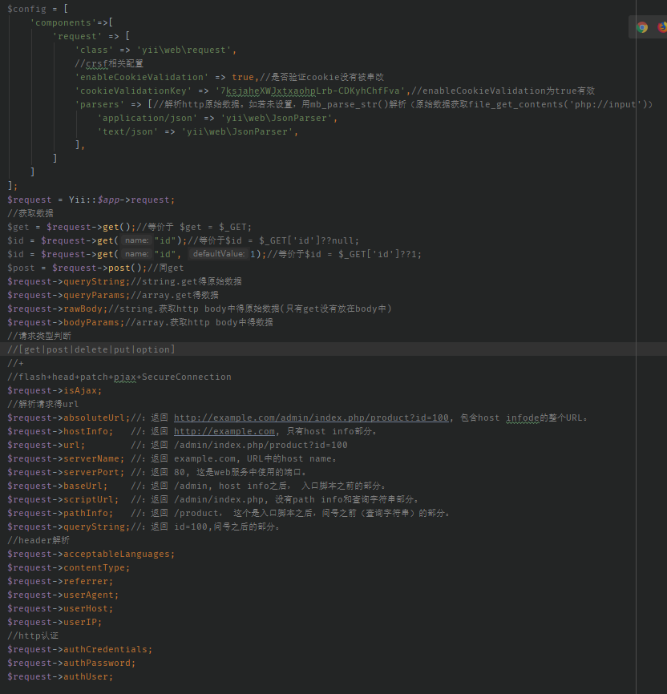

# 一、入门须知

## (一)、环境需求


## (二)、安装

### 1、composer(create-project)

### 2、归档文件(.rar)

## (三)、文档结构

### yii2-app-advanced

#### |+ backend (==模块==)

#### |+ frontend (==模块==)

​                        backend常用来作后台管理

​                        frontend常用来作前端接口。根本上来说，两者没区别，只是目录名称不一样

##### |			|+ assets

###### |			|		|- AppAsset.php

##### |			|+ config

###### |			|		|- .gitignore

###### |			|		|- bootstrap.php

###### |			|		|- main.php

###### |			|		|- params.php

###### |			|		|- test.php

##### |			|+ controllers

###### |			|		|- SiteController.php

##### |			|+ models

###### |			|		|- .gitkeep

##### |			|+ runtime

###### |			|		|- .gitignore

##### |			|+ tests

##### |			|+ views

###### |			|		|+ layouts

|			|		|		|- main.php

###### |			|		|- site

|			|		|		|- error.php

|			|		|		|- index.php

|			|		|		|- login.php

##### |			|+ web

###### |			|		|+ assets

###### |			|		|+ css

###### |			|		|- favicon.ico

##### |			|- codeception.yml

##### |			|- Dokerfile

#### |+ common (==公共==)

##### |			|+ config

###### |			|		|- .gitignore

###### |			|		|- bootstrap.php

###### |			|		|- main.php

###### |			|		|- params.php

###### |			|		|- test.php

##### |			|+ fixtures

###### |			|		|- UserFixture.php

##### |			|+ mail

###### |			|		|+ layouts

|			|		|		|- html.php

|			|		|		|- text.php

###### |			|		|- emailVerify-html.php

###### |			|		|- emailVerify-text.php 

###### |			|		|- passwordResetToken-html.php

###### |			|		|- passwordResetToken-text.php

##### |			|+ models

###### |			|		|- LoginForm.php

###### |			|		|- User.php

##### |			|+ tests

##### |			|+ widgets

##### |			|- codeception.yml

#### |+ console (==cli==)

##### |			|+ config

##### |			|+ controllers

##### |			|+ migrations

##### |			|+ models

##### |			|+ runtime

#### |+ environments

##### |			|+ dev

##### |			|+ prod

##### |			|- index.php

#### |+ vagrant

##### |			|+ config

##### |			|+ nginx

##### |			|+ provision

#### |- bowerrc 			

#### |- .gitignore

#### |- codeception.yml

#### |- composer.json

#### |- docker-compose.yml

#### |- init

#### |- init.bat

#### |- LICENSE.md

#### |- README.md

#### |- requirements.php

#### |- Vagrantfile

#### |- yii.bat

## (四)、hello world

## (五)、文档文献

**官网**

* https://www.yiichina.com/doc/guide/2.0

# 二、核心(3r+mvc+log)

一根藤(Yii)上接了无数个瓜(组件)


## (一)、路由router

**组件：urlManager**

### 1、自带路由格式

`/index.php?r=site/login&p1=a&p2=b`

### 2、缺省路由(默认controller和action)

* `/index.php?p1=a&p2=b`是`/index.php?r=site/login&p1=a&p2=b`的简写

详细见 【控制器controller】 -> 【设置默认controller和默认action】

>
>
>```php
>$config['defaultRoute']='site/index';
>//或
>$config['defaultRoute']='site';//仅默认控制器
>```
>
>

### 3、重写路由

/index.php?r=site/login&p1=a&p2=b（默认）

/index.php?site/login&p1=a&p2=b（干掉r）

/site/login&p1=a&p2=b（干掉index.php）

/sl&p1=a&p2=b（重写/美化）

#### (1)、配置

>```php
>$config['components']['urlManager']=[
>           'enablePrettyUrl' => true,//是否开启路由重写(美化)
>           'showScriptName' => false,//是否显示index.php,false-不显示；true-显示
>           'enableStrictParsing' => false,//是否开启严格解析
>     	  'suffix' => '.html',
>           'routeParam' => 'r'
>           'rules' => [
>     			//....
>            ],
>        
>           'normalizer' => [//url规范器
>                'class' => 'yii\web\UrlNormalizer',
>                // 调试时使用临时跳转代替永久跳转
>                'action' => UrlNormalizer::ACTION_REDIRECT_TEMPORARY,
>            ],
>           'cache' =>'cache',//在路由中使用到的缓存库（组件名称）
>           'ruleConfig' => ['class' => 'yii\web\UrlRule'] ,
>       ];
>    ```
>     
>     * 如果你在URL规则中不配置 `class` 选项，默认将使用类 [yii\web\UrlRule](https://www.yiichina.com/doc/api/2.0/yii-web-urlrule)。

##### a、什么是==严格解析==：

>* 如果设置为启用，请求的URL必须至少匹配 [规则](https://www.yiichina.com/doc/api/2.0/yii-web-urlmanager#$rules-detail) 中设定的一条规则作为正确请求， 否则系统将抛出 [yii\web\NotFoundHttpException](https://www.yiichina.com/doc/api/2.0/yii-web-notfoundhttpexception) 异常。
>
>* 如果严格解析被关闭，当 [规则](https://www.yiichina.com/doc/api/2.0/yii-web-urlmanager#$rules-detail) 中没有任何一条匹配时， 请求URL中的路径信息将被作为请求路由使用
>
>    * 比如
>    
>      >```php
>      >$config['components']['urlManager']['rules']=[
>      >	'posts/<year:\d{4}>/<category>' => 'post/index',
>      >];
>      >//url:/index.php/posts/php
>      >//严格解析时   因为rules中没有适合url的规则。故而抛出NotFoundHttpException
>      >//不严格时    posts会被当作controller。php当作action。
>      >
>      >==严格解析有点强制局限于rules的意思==
>      >```

##### b、路由规则是怎么解析的

* 如果你在URL规则中不配置 `class` 选项，默认将使用类 [yii\web\UrlRule](https://www.yiichina.com/doc/api/2.0/yii-web-urlrule)。

* yii\web\UrlRule支持参数

* > ```php
  > [
  >     'pattern' => '路由规则',
  >     'route' => '路由规则解析出的yii2路由',
  >     
  >     'defaults' => [],//默认参数  k-v
  >     'name' => '这条规则的名称',
  >     'host'=>'指定域名',
  >     'suffix' => '',
  >     'verb' => '',
  >     'mode' => '',
  >     'encodeParams' => true,
  >     'normalizer' => '',
  > ];
  > ```

##### c、规范器

> url规范器？什么东东？
>
> 1、http://www.baidu.com和http://www.baidu.com/这两个，到底要不要最后的那个斜杆？
>
> 2、http://www.baidu.com//search这中间双斜杠？？

#### (2)、路由规则

>```php
>$config['components']['urlManager']['rules']=[
>        'posts' => 'post/index', 
>        [
>            'pattern' => 'posts',
>            'route' => 'post/index',
>            'suffix' => '.json',
>        ],
>    /**----------命名参数-----*/    
>        'post/<id:\d+>' => 'post/view',
>    /**----------参数化路由----*/
>        //index.php/comment/99/update适合
>        '<controller:(post|comment)>/<id:\d+>/<action:(update|delete)>' =>'<controller>/<action>',
>        '<controller:(post|comment)>s' => '<controller>/index',//index.php/comments适用
>    
>    /**----------带域名的路由规则----*/
>        'http://www.example.com/login' => 'site/login',
>    
>    /**----------http method----*/
>        'PUT,POST post/<id:\d+>' => 'post/update',
>        'DELETE post/<id:\d+>' => 'post/delete',
>        'post/<id:\d+>' => 'post/view',
>];
>```
>

##### a、命名参数

​				规则后的参数没有key，所以需要命名。比如：/detail/99，这个99是指id=99？如何让程序清除知道呢？那就在路由规则的时候给参数命名。

* `'posts/<year:\d{4}>/<category>' => 'post/index',`
* * url为`/index.php/posts/2014/php`
  * 解析为/index.php/post/index?year=2014&category=php

##### b、参数化路由

> ```php
> //index.php/comment/99/update适合
> '<controller:(post|comment)>/<id:\d+>/<action:(update|delete)>' =>'<controller>/<action>',
> //index.php/comments适用
> '<controller:(post|comment)>s' => '<controller>/index',
> ```

##### c、带域名的路由规则

> ```php
> [
>     'http://admin.example.com/login' => 'admin/user/login',
>     'http://www.example.com/login' => 'site/login',
>     'http://<language:\w+>.example.com/posts' => 'post/index',//不分二级域名
>     '//www.example.com/login' => 'site/login',//不分http还是https
> ]
> ```
>
> 

##### d、http的method

> ```php
> 'PUT,POST post/<id:\d+>' => 'post/update',
> 'DELETE post/<id:\d+>' => 'post/delete',
> 'post/<id:\d+>' => 'post/view',
> ```
>
> /post/99   用post请求  对应  post/update
>
> /post/99   用get请求    对应   post/view

### 4、创建url

这里创建的url。是什么格式呢？是原生的带index.php带?带r=的呢？

##### (1)、依据mvc创建

> ```php
> use yii\helpers\Url;
> 
> // 创建一个普通的路由URL：/index.php?r=post%2Findex
> echo Url::to(['post/index']);
> 
> // 创建一个带路由参数的URL：/index.php?r=post%2Fview&id=100
> echo Url::to(['post/view', 'id' => 100]);
> 
> // 创建一个带锚定的URL：/index.php?r=post%2Fview&id=100#content
> echo Url::to(['post/view', 'id' => 100, '#' => 'content']);
> 
> // 创建一个绝对路径URL：http://www.example.com/index.php?r=post%2Findex
> echo Url::to(['post/index'], true);
> 
> // 创建一个带https协议的绝对路径URL：https://www.example.com/index.php?r=post%2Findex
> echo Url::to(['post/index'], 'https');
> ```
>
> 绝对路径是指：带有域名，完整得url
>
> ==这个域名怎么配？==


##### (2)、与mvc无关得

> ```php
> 
> //方法 yii\helpers\Url::to() 同时支持创建和任何路由不相关的 URL。 这种情况下，第一个参数不再传入一个数组，而是传入一个字符串。例如：
> 
> 
> // 当前请求URL：/index.php?r=admin%2Fpost%2Findex
> echo Url::to();
> 
> // 设定了别名的URL：http://example.com
> Yii::setAlias('@example', 'http://example.com/');
> echo Url::to('@example');
> 
> // 绝对URL：http://example.com/images/logo.gif
> echo Url::to('/images/logo.gif', true);
> 
> ```

##### (3)、其他

> ```php
> 
> // 主页URL：/index.php?r=site%2Findex
> echo Url::home();
> 
> // 根URL，如果程序部署到一个Web目录下的子目录时非常有用
> echo Url::base();
> 
> // 当前请求的权威规范URL
> // 参考 https://en.wikipedia.org/wiki/Canonical_link_element
> echo Url::canonical();
> 
> // 记住当前请求的URL并在以后获取
> Url::remember();
> echo Url::previous();
> ```
>
> 

### 5、全拦截catchAll

>```php
>$config['catchAll']=['site/offline'];
>//全部请求会调到SiteController::actionOffline
>```

## (二)、请求request




## (三)、响应response

> ```php
> $response = Yii::$app->getResponse();
> 
> //定义event：beforeSend  afterSend  afterPrepare
> //定义常量，支持的响应数据格式  FORMAT_RAW FORMAT_HTML FORMAT_JSON FORMAT_JSONP FORMAT_XML
> $response->format = Response::FORMAT_HTML;//默认
> $response->acceptMimeType;//人为填充或者【ContentNegotiator 内容协商】得结果填充
> $response->acceptParams = [];//ContentNegotiator
> $response->formatters = [];//响应格式 =》 解析响应格式的类
> $response->data;//需要被响应的原始数据
> $response->content;//$response->data根据响应格式转化后的内容
> $response->stream;//文件流
> $response->charset;//未设置则调用Application::charset(UTF-8)
> $response->statusText = "OK";
> $response->version;//http协议版本,若未设置则调用$_SERVER['SERVER_PROTOCOL']
> $response->isSent = false;//是否以发送响应。isSent=true表示以发送，则不再会触发send().send后会修改isSent=true
> die;
> $response->init();//1、未设置version则解析$_SERVER['SERVER_PROTOCOL']赋值；2、未设置charset则用Application::charset赋值。3、把默认的formatter与用户自定义的进行合并
> $response->getStatusCode();//获取设置的http的status code
> $response->setStatusCode($value, $text = null);//设置http的status code以及其对应的描述比如 Status code: 200 OK。就是这个200和OK
> $response->setStatusCodeByException($e);//用httpException的statusCode设置http的status code
> $response->getHeaders();//获取设置的http的header
> $response->getCookies();//获取已设置的响应中的cookie
> $response->send();//isSent=true则不发送.【prepare->sendHeaders->sendContent】
> $response->clear();//清空headers/cookies/data/content/stream,响应status code: 200 OK
> 
> $response->sendFile($filePath, $attachmentName = null, $options = []);//下载文件filePath。 调用sendStreamAsFile()
> $response->sendStreamAsFile($handle, $attachmentName, $options = []);//文件流下载
> $response->sendContentAsFile($content, $attachmentName, $options = []);//把content以文件格式下载
> $response->xSendFile($filePath, $attachmentName = null, $options = []);//
> $response->setDownloadHeaders($attachmentName, $mimeType = null, $inline = false, $contentLength = null);//
> 
> $response->redirect($url, $statusCode = 302, $checkAjax = true);//响应跳转
> $response->refresh($anchor = '');//刷新
> 
> $response->getIsInvalid();//判断设置的http status code是否符合区间 [100, 600)
> $response->getIsInformational();//判断设置的http status code是否符合区间 [100, 200)
> $response->getIsSuccessful();;//判断设置的http status code是否符合区间 [200, 300)
> $response->getIsRedirection();//判断设置的http status code是否符合区间 [300, 400)
> $response->getIsClientError();//判断设置的http status code是否符合区间 [400, 500)
> $response->getIsServerError();//判断设置的http status code是否符合区间 [500, 600)
> $response->getIsOk();//判断http status code 是否为 200
> $response->getIsForbidden();//判断http status code 是否为 403
> $response->getIsNotFound();//判断http status code 是否为 404
> $response->getIsEmpty();//判断http status code 是否为 [201, 204, 304]]
> //protected方法
> $response->getDispositionHeaderValue($disposition, $attachmentName);//
> $response->getHttpRange($fileSize);//
> $response->defaultFormatters();//默认的返回格式 => 格式解析类  $response->formatters
> //send() ---【prepare->sendHeaders[sendCookies]->sendContent】
> $response->prepare();
> $response->sendHeaders();//把header发送给client，然后发送cookie:$response->sendCookies().把headers数组循环执行header()函数;
> $response->sendContent();//把内容(content或stream[文件流])发送给client。
> $response->sendCookies();//把cookie发送给client.把cookie数组遍历执行setcookie()函数
> //        public function send()
> //        {
> //            if ($this->isSent) {
> //                return;
> //            }
> //            $this->trigger(self::EVENT_BEFORE_SEND);
> //            $this->prepare();
> //            $this->trigger(self::EVENT_AFTER_PREPARE);
> //            $this->sendHeaders();
> //            $this->sendContent();
> //            $this->trigger(self::EVENT_AFTER_SEND);
> //            $this->isSent = true;
> //        }
> ```
>


## (四)、模型model

| 类型    | 类                      | 父类                    | 注释 | 备注 |
| ------- | ----------------------- | ----------------------- | ---- | ---- |
| model   | yii\base\Model          | yii\base\Component      |      |      |
|         | yii\db\BaseActiveRecord | yii\base\Model          |      |      |
|         | yii\db\ActiveRecord     | yii\db\BaseActiveRecord |      |      |
|         |                         |                         |      |      |
| query   | yii\db\Query            | yii\base\Component      |      |      |
|         | yii\db\ActiveQuery      | yii\db\Query            |      |      |
|         |                         |                         |      |      |
| command | yii\db\Command          | yii\base\Component      |      |      |
|         |                         |                         |      |      |
| connect | yii\db\Connection       | yii\base\Component      |      |      |

>* model主要完成增删改
>* query主要完成查询
>* command主要完成增删改查的sql
>* connect主要完成数据库连接
>
>==注意：==
>
>* model中也有查询，调用的都是query
>* model和query中都调用的command，
>* command调用的connect

### 1、curd+事务

#### (1)、增

##### a、增一

| 序号 | 方法     | 获取错误          | 获取sql | 获取最新id                |
| ---- | -------- | ----------------- | ------- | ------------------------- |
| 1    | 逐一赋值 | `$o->getErrors()` | 不可    | `$id=$o->save()?$o->id:0` |
| 2    | 块赋值   | `$o->getErrors()` | 不可    | `$id=$o->save()?$o->id:0` |
| 3    | command  | 不可              | 不可    | 不可                      |

> * ```php
>   字段  a11  char(1)
>   ```
>
> * ```php
>   字段  a14 tinyint(3)
>   ```
>
> ```php
> /**---------逐一赋值---------*/
> $obj1 = new Xyz();//字符型严格对应字符型。数字型则随意
> //$obj1->a11 = 1;//a11是char型。会报错。：a1 must be a string
> $obj1->a11 = '1';
> $obj1->a14 = '1';
> if($obj1->save()){
>     $id = $obj1->id;
> }else{
> 	$obj1->getErrors()    
> }
> 
> /**----------块赋值------------*/
> $obj2 = new Xyz();
> $obj2->attributes = ['a11' => '2', 'a14' =>2];//或$obj2->setAttributes();
> if($obj2->save()){
>     $id = $obj2->id;
> }else{
> 	$obj2->getErrors()    
> }
> 
> /**----------command------------*/
> $res = Yii::$app->db->createCommand()->insert(Xyz::tableName(), ['a11' => 3, 'a14' => 3])->execute();
> var_dump($res);//插入的记录条数
> ```
>
> 

##### b、批量

| 序号 | 方法                | 备注           |
| ---- | ------------------- | -------------- |
| 1    | command             |                |
| 2    | 数据遍历+clone      | 批量变逐条新增 |
| 3    | 数据遍历+isNewReord | 批量变逐条新增 |

>
>
>```php
>/**---------command----------------*/
>Yii::$app->db->createCommand()->batchInsert(Xyz::tableName(), ['a11', 'a14'], [[4,41],[4,42]])->execute();
>
>/**---------数据遍历+clone-----------*/
>$data = [['a11' => '5', 'a14' =>51],['a11' => '5','a14' =>52],];
>$obj3 = new Xyz();
>foreach($data as $d)
>{
>    $_model = clone $obj3;
>    $_model->setAttributes($d);
>    $_model->save();
>}
>
>/**---------数据遍历+isNewReord-----------*/    
>$data = [['a11' => '6', 'a14' =>61],['a11' => '6','a14' =>62],];
>$obj4 = new Xyz();
>foreach($data as $i =>$attributes)
>{
>    $obj4->id=null;//这个是必须的。不然id会报错
>    $obj4->isNewRecord = true;
>    $obj4->setAttributes($attributes);
>    $obj4->save() ;
>}
>```
>
>

#### (2)、删

| 序号 | 方法             | 备注                              |
| ---- | ---------------- | --------------------------------- |
| 1    | `$M->delete()`   | 适用于`M::find()`和`M::findOne()` |
| 2    | `M::deleteAll()` |                                   |
| 3    | command          |                                   |


> ```php
> //删除指定某个
> if($record = Xyz::find()->where(['a11'=>4])->one()) $record->delete();
> if($record = Xyz::findOne(['a11' => 4])) $record->delete();
> //        if($record = Xyz::findAll(['a11' => 5])) $record->delete();不存在这个写法
> 
> //删除全部
> Xyz::deleteAll(['a11' => 5]);
> Yii::$app->db->createCommand()->delete(Xyz::tableName(), ['a11' => 4])->execute();
> ```
>
> 

#### (3)、改

| 序号 | 方法                                               | 备注                              |
| ---- | -------------------------------------------------- | --------------------------------- |
| 1    | `$M->save()`                                       | 适用于`M::find()`和`M::findOne()` |
| 2    | `M::updateAll()`                                   |                                   |
| 3    | `$M->updateCounters(['filed'=>+-1])`               | 字段自增自减                      |
| 4    | `M::updateAllCounters($counters, $condition = '')` |                                   |
| 5    | command                                            |                                   |

> ```php
> //修改指定某个
> if($record = Xyz::find()->where(['a11'=>4])->one()) {
>     $record->a11 = 5;
>     $record->save();
> }
> if($record = Xyz::findOne(['a11' => 4])) {
>     $record->a11 = 5;
>     $record->save();
> }
> 
> $post = Post::findOne($id);
> $post && $post->updateCounters(['view_count' => 1]);
> 
> //批量修改
> Xyz::updateAll(['a11' => 5], ['a11' => 4]);
> Yii::$app->db->createCommand()->update(Xyz::tableName(), ['a11' => 5], ['a11' => 4])->execute();
> ```
>
> 

#### (4)、查

>```php
>$o = (new Query())
>    ->from(Xyz::tableName()." x")
>    ->innerJoin(User::tableName(). ' u','u.id=x.id')
>    ->select(['x.a11', 'u.username', 'x.id', 'u.id'])
>    ->andWhere(['in', 'x.a11', [1,2,3]])
>    ->andWhere(['in', 'u.username', ['a', 'b', 'c']]);
>$o2 = (clone $o)->andWhere(['u.id'=>99]);
>$result = $o->union($o2)->all();
>var_dump($result);
>var_dump($o->createCommand()->getRawSql());
>
>
>/*
>(SELECT `x`.`a11`, `u`.`username`, `x`.`id`, `u`.`id` FROM `pre_xyz` `x` INNER JOIN `pre_user` `u` ON u.id=x.id WHERE (`x`.`a11` IN (1, 2, 3)) AND (`u`.`username` IN ('a', 'b', 'c'))) 
>UNION
>( SELECT `x`.`a11`, `u`.`username`, `x`.`id`, `u`.`id` FROM `pre_xyz` `x` INNER JOIN `pre_user` `u` ON u.id=x.id WHERE (`x`.`a11` IN (1, 2, 3)) AND (`u`.`username` IN ('a', 'b', 'c')) AND (`u`.`id`=99) )
>*/
>```
>
>

`$Q = new Query()`

`$AQ = new ActiveQuery()`

| sql功能    | yii2支持                                                     | 备注                                                         |
| ---------- | ------------------------------------------------------------ | ------------------------------------------------------------ |
| distinct   | `$Q->distinct($value=true)`                                  |                                                              |
| 修饰字段   | `$Q->select([字段], $option)`                                | option比如SQL_CALC_FOUND_ROWS                                |
| 字段       |                                                              |                                                              |
| table      | `$Q->from($tables)`                                          | tables可string可array                                        |
| alias      | `$Q->from(['table u'])`<br>`$Q->from('table');$AQ->alias('u')` |                                                              |
| where      | `$Q->where($condition)`<br>`$Q->andWhere($condition)`<br> `$Q->orWhere($condition)`<br/>`$Q->filterWhere($condition)`<br/>`$Q->andFilterWhere($condition)`<br/>`$Q->orFilterWhere($condition)`<br/> | filter当k-v中v为空，则会被过滤掉(四种)<br>`$value === ''`<br>`$value === []`<br>`$value === null`<br>`is_string($value) && trim($value) === ''` |
| group      | `$Q->groupBy($columns)`<br>`$Q->addGroupBy($columns)`        |                                                              |
| having     | `$Q->having($condition,$params=[])`<br/>`$Q->andHaving($condition,$params=[])`<br/> `$Q->orHaving($condition,$params=[])`<br/>`$Q->filterHaving(array $condition)`<br/>`$Q->andFilterHaving(array $condition)`<br/>`$Q->orFilterHaving(array $condition)`<br/> |                                                              |
| join       | `$Q->join($type, $table, $on = '', $params = [])`<br>`$Q->innerJoin($table, $on = '', $params = [])`<br>`$Q->leftJoin($table, $on = '', $params = [])`<br>`$Q->rightJoin($table, $on = '', $params = [])` |                                                              |
| union      | `$Q->union($sql, $all=false)`                                |                                                              |
| order      | `$Q->orderBy($columns)`<br/>`$Q->addOrderBy($columns)`       |                                                              |
| limit      | `$Q->limit($limit)`                                          |                                                              |
| offset     | `$Q->offset($offset)`                                        |                                                              |
| with       | `$Q->withQuery($query, $alias, $recursive = false)`          |                                                              |
|            |                                                              |                                                              |
| 求one      | `$Q->one($db=null)`                                          |                                                              |
| 求all      | `$Q->all($db=null)`                                          |                                                              |
|            |                                                              |                                                              |
| 批         | `$Q->batch($size=100,$db=null)`                              |                                                              |
|            | `$Q->each($size=100,$db=null)`                               |                                                              |
|            |                                                              |                                                              |
| 求标量     | `$Q->scalar($db=null)`                                       | 结果集第一行第一个字段得值                                   |
| 求列       | `$Q->column($db=null)`                                       | 结果集得第一个字段(一维数组)                                 |
|            |                                                              |                                                              |
| count(*)   | `$Q->count($q='*',$db=null)`                                 |                                                              |
| sum(field) | `$Q->sum($q,$db=null)`                                       |                                                              |
| avg(field) | `$Q->averge($q,$db=null)`                                    |                                                              |
| min(field) | `$Q->min($q,$db=null)`                                       |                                                              |
| max(field) | `$Q->max($q,$db=null)`                                       |                                                              |


#### (5)、事务

> ```php
> $odb = Yii::$app->db;
> $trans = $odb->beginTransaction();
> try{
>     $o = new Xyz();
>     $o->a11 = '1';
>     if(!$o->save()) throw new \Exception('错误1');
> 
>     $o = new Xyz();
>     $o->a11 = 2;//a11是char(1)， 验证失败
>     if(!$o->save()) throw new \Exception('错误2');
> 
>     $trans->commit();
> }catch (\Exception $e){
>     $trans->rollBack();//
>     var_dump($e->getMessage());
> }
> ```
>
> 

#### (6)、batch/each

取完100条，进行处理，处理完；再取100条，再处理，。。。直到query查不出数据了

> ```php
> foreach ($query->batch() as $users) {
>   //$user是array,是二维数组，是100条记录的集合
> }
> 
> // or to iterate the row one by one
> foreach ($query->each() as $user) {
>  //$user是array,是关联数组，是一条记录
>  //yii\db\BatchQueryResult
> }
> ```
>
> 

#### (7)、子查询

>
>
>```php
>//拼接sub sql切记不要写asArray\all\one等
>$subSql = CollectStrategy::find()->andWhere(["shop"=> $shop, "category"=> $collectCategory])->select(["id"]);
>CollectStrategyData::find()->andWhere(["strategy_id"=>$subSql])->all();
>```
>
>

#### (8)、queryScalar

>sub
>
>average
>
>min
>
>max
>
>count
>
>```php
>
>CollectStrategyData::find()->andWhere(["strategy_id"=>$subSql])->sum("subscribe")
>```
>
>

### 2、where

**书写方式：**

| 序号 | 书写格式           | 绑定参数 | field安全 | value安全                | 举例                                                         | 备注 |
| ---- | ------------------ | -------- | --------- | ------------------------ | ------------------------------------------------------------ | ---- |
| 1    | string             | 支持     | 不安全    | 绑参安全<br>不绑参不安全 | `where('a=11 and b=12')`<br>`where('a=:a and b=:b', [':a'=>13, ':b'=>14])` |      |
| 2    | hash(数组k-v)      | 自动绑参 | 不安全    | 安全                     | `where(['a'=>21,'b'=>22])`                                   |      |
| 3    | 操作符(数组非关联) | 自动绑参 | 不安全    | 安全                     | where(['=', 'a', 31])                                        |      |
| 4    | 对象               |          |           |                          |                                                              |      |

==在内部，上面描述的格式在构建 SQL 之前被隐式转换为对象格式==

#### (1)、string

> ```php
> SELECT * FROM `shop_cart` WHERE (a=1 and b=2) AND (c=3 and d=4)
>     
> $query = Cart::find();
> $query->andWhere('a=1 and b=2');
> $query->andWhere('c=:c and d=4', [':c' => 3]);
> var_dump($query->createCommand()->getRawSql());die;
> ```
>
> 

#### (2)、hash

==部分==查询可自动转化，==仅限部分==

> ```php
> SELECT * FROM `shop_cart` WHERE (`a`=1) AND (`b`='bbb') AND (`c` IS NULL) AND (`d` IN (4, 5)) AND (`e` IN (SELECT * FROM `shop_user` WHERE `id`=1))
> 
> $query = Cart::find();
> $query->andWhere([
>     'a' => 1,
>     'b' => 'bbb',
>     'c'=>null,                            //自动转化为 c is null
>     'd' => [4,5],                         //自动转化为 d in (4,5)
>     'e' => User::find()->where(['id' =>1])//自动转化为 d in (select ...)
> ]);
> var_dump($query->createCommand()->getRawSql());die;
> ```
>
> 

#### (3)、操作符

> ```php
> WHERE (`a` = 1) AND (`b` LIKE '%b%') AND (`c` IS NOT NULL)
> 
> $query = Cart::find();
> $query->andWhere(['=', 'a', 1])
>     ->andWhere(['like', 'b', 'b'])
>     ->andWhere(['is not', 'c', null]);
> 
> var_dump($query->createCommand()->getRawSql());die;
> ```
>
> * ==like只能是%b%，没法写成%b或b%==   除非用string方式写
> * 操作符支持and和or等逻辑运算符
> * * `where(['and', 'id=1', 'id=2'])`

| 序号 | 运算符                     | 举例                                                | sql                                                   | 备注             |
| ---- | -------------------------- | --------------------------------------------------- | ----------------------------------------------------- | ---------------- |
| 1    | and/or                     | where(['and', 'a=1', 'b=2'])                        | where a=1 and b=2                                     |                  |
| 2    | not                        | where(['not', 'a=1'])                               | where not (a=1)                                       | 数组中仅有两个， |
| 3    | [not] between              | where(['between', 'a', 1, 2])                       | where a between 1 and 2                               |                  |
| 4    | [not] in                   | where(['in', 'a', [1,2]])                           | where a in (1,2)                                      |                  |
| 5    | ==[or\|not\|or not] like== | where(['or not like', 'a', ['v1', 'v2']])           | where a not like '%v1%' OR a not like '%v2%'          |                  |
| 6    | [not] exists               | where(['exists', User::find()->where(['id' =>1]) ]) | where exists (SELECT * FROM `shop_user` WHERE `id`=1) |                  |
| 7    | [>\|>=\|<\|<=]             | where(['>', 'a', 1])                                | where a>1                                             |                  |

>```php
>SELECT * FROM `shop_cart` WHERE (a=1) OR (a2=11) OR ((`b`=2) AND (`c` LIKE '%c3%') AND (`d`<>4))
>
>$query = Cart::find();
>$query->andWhere([
>    'or',
>    'a=1',
>    'a2=:a2',
>    [	
>         'and',
>         ['b'=>2],
>         ['like', 'c', 'c3'],
>         new InCondition('d', 'like', 4)//incondition仅接受in和not in 。其他操作符会被转成=或<>
>    ]
>])->addParams([':a2'=>11]);
>
>var_dump($query->createCommand()->getRawSql());
>```
>
>

#### (4)、对象


> yii2\db\QueryBuilder
>
> ```php
> 'NOT' => 'yii\db\conditions\NotCondition',
> 'AND' => 'yii\db\conditions\AndCondition',
> 'OR' => 'yii\db\conditions\OrCondition',
> ['BETWEEN', 'NOT BETWEEN']                   => 'yii\db\conditions\BetweenCondition',
> ['IN', 'NOT IN']                             => 'yii\db\conditions\InCondition',
> ['LIKE', 'NOT LIKE','OR LIKE','OR NOT LIKE'] => 'yii\db\conditions\LikeCondition',
> ['EXISTS','NOT EXISTS']                      => 'yii\db\conditions\ExistsCondition',
>  
> ```


>```php
>WHERE (a=1) OR (a2='11') OR ((`b`=2) AND (`c` LIKE '%c3%') AND (`d`<>4))
>
>$query = Cart::find();
>$query->andWhere(new OrCondition([
>    'a=1',
>    'a2=:a2',
>    new AndCondition([
>        ['b'=>2],
>        ['like', 'c', 'c3'],
>        new InCondition('d', 'like', 4)//incondition仅接受in和not in 。其他操作符会被转成=或<>
>    ])
>]))->addParams([':a2'=>'11']);
>var_dump($query->createCommand()->getRawSql());die;
>```
>
>


| 运算符分类 | 运算符                                            | 表达式          | 举例 |
| ---------- | ------------------------------------------------- | --------------- | ---- |
| 比较       | `=` `<>` ``!=`<br>`>` ` >=` `!>`<br>`<` `<=` `!<` | `!>=` `!<=` ??? |      |
| 范围       | `between...and`<br>`not between...and`            |                 |      |
| 列表       | `in` `not in`                                     |                 |      |
| 匹配       | `like` `not like`                                 |                 |      |
| null       | `is null` `is not null`                           |                 |      |
| 逻辑       | `and ||` `or &&` `not !` `xor`                    |                 |      |
| 正则       | `regexp`                                          | ?????           |      |
| 存在       | `exists`                                          |                 |      |


```sql
expr:
    expr OR expr
  | expr || expr
  | expr XOR expr
  | expr AND expr
  | expr && expr
  | NOT expr
  | ! expr
  | boolean_primary IS [NOT] {TRUE | FALSE | UNKNOWN}
  | boolean_primary

boolean_primary:
    boolean_primary IS [NOT] NULL
  | boolean_primary <=> predicate
  | boolean_primary comparison_operator predicate
  | boolean_primary comparison_operator {ALL | ANY} (subquery)
  | predicate

comparison_operator: = | >= | > | <= | < | <> | !=

predicate:
    bit_expr [NOT] IN (subquery)
  | bit_expr [NOT] IN (expr [, expr] ...)
  | bit_expr [NOT] BETWEEN bit_expr AND predicate
  | bit_expr SOUNDS LIKE bit_expr
  | bit_expr [NOT] LIKE simple_expr [ESCAPE simple_expr]
  | bit_expr [NOT] REGEXP bit_expr
  | bit_expr

bit_expr:
    bit_expr | bit_expr
  | bit_expr & bit_expr
  | bit_expr << bit_expr
  | bit_expr >> bit_expr
  | bit_expr + bit_expr
  | bit_expr - bit_expr
  | bit_expr * bit_expr
  | bit_expr / bit_expr
  | bit_expr DIV bit_expr
  | bit_expr MOD bit_expr
  | bit_expr % bit_expr
  | bit_expr ^ bit_expr
  | bit_expr + interval_expr
  | bit_expr - interval_expr
  | simple_expr

simple_expr:
    literal
  | identifier
  | function_call
  | simple_expr COLLATE collation_name
  | param_marker
  | variable
  | simple_expr || simple_expr
  | + simple_expr
  | - simple_expr
  | ~ simple_expr
  | ! simple_expr
  | BINARY simple_expr
  | (expr [, expr] ...)
  | ROW (expr, expr [, expr] ...)
  | (subquery)
  | EXISTS (subquery)
  | {identifier expr}
  | match_expr
  | case_expr
  | interval_expr
```


### 3、自动验证

#### (1)、场景

>```php
> /**
>     * {@inheritdoc}
>     */
>public function rules()
>{
>    return [
>        [['a14', 'a15', 'a16', 'a17', 'a27', 'test'], 'integer','on' => 'scenario3'],
>        [['a19', 'a20', 'a21'], 'number','on' => 'scenario3'],
>        [['a22', 'a23', 'a24', 'a25'], 'safe','on' => 'scenario3'],
>        [['a13', 'a26'], 'string','on' => ['scenario3', 'scenario4']],//场景3和场景4
>        
>        [['a11'], 'string', 'max' => 1, 'on' => 'scenario1'],//仅场景1
>        [['a18'], 'number','on' => 'scenario2'],//仅场景2
>        [['a12'], 'string', 'max' => 255], //没有设定场景，所有场景共有
>    ];
>}
>
>
>
>
>//场景1两个字段（a11和a12）   a11 char(1)和a12 string()
>$data1 = [
>    "a11" => '1',
>    'a12' =>'2',
>    'a18' =>'aaaaaaa'
>];
>$o = new Xyz();
>$o->setScenario('scenario1');
>$o->setAttributes($data1);
>$o->validate() && $o->save();
>var_dump($o->getErrors());
>var_dump($o->activeAttributes());
>
>//场景2两个字段（a12和a18） a12 string() 和 a18 number()
>$data2 = [
>    "a11" => 1,  //多的字段被场景自动过滤，不会验证也不会写入库
>    'a12' => '2',
>    'a18' =>2,
>];
>$o = new Xyz();
>$o->setScenario('scenario2');
>$o->setAttributes($data2);
>$o->validate() && $o->save();
>var_dump($o->getErrors());
>var_dump($o->activeAttributes());
>```

#### (2)、规则

> yii2\validators\Validator
>
> ```php
> a1  'boolean' => 'yii\validators\BooleanValidator',
> a2  'captcha' => 'yii\captcha\CaptchaValidator',
> a3  'compare' => 'yii\validators\CompareValidator',
> a4  'date' => 'yii\validators\DateValidator',
> a5  'datetime' => [
>         'class' => 'yii\validators\DateValidator',
>         'type' => DateValidator::TYPE_DATETIME,
>     ],
> a6   'time' => [
>         'class' => 'yii\validators\DateValidator',
>         'type' => DateValidator::TYPE_TIME,
>     ],
> a7  'default' => 'yii\validators\DefaultValueValidator',
> a8  'double' => 'yii\validators\NumberValidator',
> a9  'each' => 'yii\validators\EachValidator',
> a10 'email' => 'yii\validators\EmailValidator',
> a11 'exist' => 'yii\validators\ExistValidator',
> a12 'file' => 'yii\validators\FileValidator',
> a13 'filter' => 'yii\validators\FilterValidator',
> a14 'image' => 'yii\validators\ImageValidator',
> a15 'in' => 'yii\validators\RangeValidator',
> a16 'integer' => [
>         'class' => 'yii\validators\NumberValidator',
>         'integerOnly' => true,
>     ],
> a17 'match' => 'yii\validators\RegularExpressionValidator',
> a18 'number' => 'yii\validators\NumberValidator',
> a19 'required' => 'yii\validators\RequiredValidator',
> a20 'safe' => 'yii\validators\SafeValidator',
> a21 'string' => 'yii\validators\StringValidator',
> a22 'trim' => [
>         'class' => 'yii\validators\FilterValidator',
>         'filter' => 'trim',
>         'skipOnArray' => true,
>     ],
> a23 'unique' => 'yii\validators\UniqueValidator',
> a24 'url' => 'yii\validators\UrlValidator',
> a25 'ip' => 'yii\validators\IpValidator',
> ```
>
> 

##### a1、boolean : 是否为一个布尔值

>```php
>['字段名', 'boolean', 'trueValue' => true, 'falseValue' => false, 'strict' => true]; #说明:CBooleanValidator 的别名 
>```

##### a2、captcha : 验证码

>```php
>['verificationCode', 'captcha']; #说明:CCaptchaValidator 的别名,确保了特性的值等于 CAPTCHA 显示出来的验证码. 
>```

##### a3、compare : 比较

>```php
>['age', 'compare', 'compareValue' => 30, 'operator' => '>=']; #说明:compareValue(比较常量值) - operator(比较操作符)  #说明:CCompareValidator 的别名,确保了特性的值等于另一个特性或常量. 
>```

##### a4、date : 日期

>```php
>[['from', 'to'], 'date'];
>```

##### a5、datetime

> ```php
> 
> ```

##### a6、time

> ```php
>  
> ```

##### a7、default: 默认值

> ```php
> ['age', 'default', 'value' => null]; #说明:CDefaultValueValidator 的别名, 为特性指派了一个默认值.
> ```

##### a8、double : 双精度浮点型

> ```php
> ['salary', 'double'];
> ```

##### a9、each

> ```php
> 
> ```

##### a10、email： 邮箱验证

> ```php
> [['字段名'],required,'requiredValue'=>'必填值','message'=>'提示信息']; #说明:CRequiredValidator 的别名, 确保了特性不为空.
> ```

##### a11、exist: 存在

> ```php
> ['username', 'exist']; #说明:CExistValidator 的别名,确保属性值存在于指定的数据表字段中. 
> ```

##### a12、file: 文件

> ```php
> ['primaryImage', 'file', 'extensions' => ['png', 'jpg', 'gif'], 'maxSize' => 1024*1024*1024]; #说明:CFileValidator 的别名, 确保了特性包含了一个上传文件的名称. 
> ```

##### a13、filter: 滤镜

> ```php
> [['username', 'email'], 'filter', 'filter' => 'trim', 'skipOnArray' => true]; #说明:CFilterValidator 的别名, 使用一个filter转换属性.
> ```

##### a14、image

> ```php
> 
> ```

##### a15、in : 范围

> ```php
> ['level', 'in', 'range' => [1, 2, 3]]; #说明:CRangeValidator 的别名,确保了特性出现在一个预订的值列表里. 
> ```

##### a16、integer : 整数

> ```php
> ['age', 'integer'];
> ```

##### a17、match：正则验证

> ```php
> [['字段名'],match,'pattern'=>'正则表达式','message'=>'提示信息'];      
> [['字段名'],match,'not'=>ture,'pattern'=>'正则表达式','message'=>'提示信息']; /*正则取反*/ #说明:CRegularExpressionValidator 的别名, 确保了特性匹配一个正则表达式. 
> ```

##### a18、number : 数字

> ```php
> ['salary', 'number'];
> ```

##### a19、required：必须值验证属性

> ```php
> [['字段名'],required,'requiredValue'=>'必填值','message'=>'提示信息']; #说明:CRequiredValidator 的别名, 确保了特性不为空.
> ```

##### a20、safe : 安全

> ```php
> ['description', 'safe'];
> ```

##### a21、string : 字符串

> ```php
> ['username', 'string', 'length' => [4, 24]];
> ```

##### a22、trim

> ```php
> 
> ```

##### a23、unique : 唯一性

> ```php
> ['username', 'unique'] #说明:CUniqueValidator 的别名,确保了特性在数据表字段中是唯一的. 
> ```

##### a24、url：网址

> ```php
> ['website', 'url', 'defaultScheme' => 'http']; #说明:CUrlValidator 的别名, 确保了特性是一个有效的路径.
> ```

##### a25、ip

> ```php
> 
> ```


### 4、自动完成

| 序号 | 方法           | 备注 |
| ---- | -------------- | ---- |
| 1    | behavior       |      |
| 2    | beforeSave     |      |
| 3    | beforeValidate |      |


==自动完成在场景之外==

* 如果场景中没有created_at、updated_at字段，但是在behaviors中设置了自动完成。created_at和updated_at也会被真实填充

#### (1)、behaviors

>```php
>public function behaviors()
>{
>    return [
>        [
>            'class' => TimestampBehavior::className(),
>            'attributes' => [
>                ActiveRecord::EVENT_BEFORE_INSERT => ['a23'],
>                ActiveRecord::EVENT_BEFORE_UPDATE => ['a23'],
>            ],
>            'value' => new Expression('NOW()'),
>        ]
>    ];
>}
>```


#### (2)、beforeSave

> ```php
> 
> public function beforeSave($insert)
> {
>     if($result = parent::beforeSave($insert)){ // TODO: Change the autogenerated stub
>         $this->a23 = date("Y-m-d H:i:s");
>     }
>     return $result;
> }
> ```


#### (3)、beforeValidate

>```php
>
>public function beforeValidate()
>{
>    if($result = parent::beforeValidate()){// TODO: Change the autogenerated stub
>        $this->a23 = date("Y-m-d H:i:s");
>    }
>    return $result;
>}
>```
>
>

### 5、属性标签

### 6、数据导出？

## (五)、视图view(略)

## (六)、控制器controller


| 分类                      | 父类                | 功能     | 备注 |
| ------------------------- | ------------------- | -------- | ---- |
| yii\base\Controller       | yii\base\Component  |          |      |
| yii\console\Controller    | yii\base\Controller | cli指令  |      |
| yii\web\Controller        | yii\base\Controller | 渲染输出 |      |
| yii\rest\Controller       | yii\web\Controller  | api接口  |      |
| yii\rest\ActiveController | yii\rest\Controller |          |      |


### 1、配置与获取

#### (1)、命名规则

| 类容       | 举例                       | 路由解析    | 解释                                                         |
| ---------- | -------------------------- | ----------- | ------------------------------------------------------------ |
| controller | HelloWorldController.php   | hello-world |                                                              |
| action     | `actionSayHello($p1, $p2)` | say-hello   | 1. 必须action开头<br>2.支持带参数。<br>参数来源可以是调用赋值，也可以是get传递 |


##### a、controller

##### b、action

#### (2)、设置默认controller和默认action

>设置默认controller和默认action的根本在于==设置默认路由==
>
>config/main.php
>
>* ```php
>  'defaultRoute' => 'hello-world',///或者hello-world/say-hello
>  ```
>```
>
>```
>
>```
>
>```
>
>```
>
>```
>
>```
>
>
>在controller中设置默认action
>
>* ```php
> class HelloWorldController extends \yii\web\Controller{
>  	public $defaultAction = 'say-hello';//设置默认方法
>  }
>```
>```
>
>```
>
>```
>
>```
>
>```
>
>```


#### (3)、相关变量获取

> ```php
> public function beforeAction($action){}
> ```
>
> | 调用                          | 示例           | 备注 |
> | ----------------------------- | -------------- | ---- |
> | `$this->action->actionMethod` | actionBindShop |      |
> | `$this->action->id`           | bind-shop      |      |
>
> 

### 2、web-controller

* **yii\web\Controller**

#### (1)、渲染view

| 方法                                      | 物理位置            | 功能                   |
| ----------------------------------------- | ------------------- | ---------------------- |
| `render($view, $params = [])`             | yii\base\Controller | 渲染view+layout        |
| `public function renderContent($content)` | yii\base\Controller | 渲染layout             |
| `renderPartial($view, $params = [])`      | yii\base\Controller | 渲染view               |
| `renderFile($file, $params = [])`         | yii\base\Controller | 渲染file。==根本方法== |
| `renderAjax($view, $params = [])`         | yii\web\Controller  | ajax渲染view           |

##### a、view怎么传值？支持以下：

>
>
>* `renderFile()`仅支持绝对路径
>
>* 其他都不支持绝对路径。绝对路径会被当作string
>
>
>
>`frontend\controllers\SiteController::actionIndex()`

>|            | 方式     | 解释                                         | 举例                                          | 对应路径                                                     |
>| ---------- | -------- | -------------------------------------------- | --------------------------------------------- | ------------------------------------------------------------ |
>|            | 绝对路径 | 起始目录是服务器根目录                       | `render('c:\code\index.php')`                 | ==仅renderFile()支持==，其他会被当作string                   |
>|            | 相对路径 | 起始目录是：<br>app/module/views/controller/ | `render('../index')`                          | app/frontend/views/site/../index.php                         |
>| 任意跨     | 别名@    | @路径+string                                 | `render('@frontend/index')`                   | app/frontend/index.php                                       |
>|            | //       | app/+string                                  |                                               |                                                              |
>| 跨控制器   | /        | app/module/views/+string                     | `render('/index')`<br>`render('/site/index')` | app/frontend/views/index.php<br>app/frontend/views/site/index.php |
>| 当前控制器 | string   | app/module/views/controller/+string          | `render('index')`                             | app/frontend/views/site/index.php                            |


##### (b)、找view文件

>源码分析：yii\base\View
>
>```php
>protected function findViewFile($view, $context = null)
>{
>if (strncmp($view, '@', 1) === 0) {
>// e.g. "@app/views/main"
>$file = Yii::getAlias($view);
>} elseif (strncmp($view, '//', 2) === 0) {
>// e.g. "//layouts/main"
>$file = Yii::$app->getViewPath() . DIRECTORY_SEPARATOR . ltrim($view, '/');
>} elseif (strncmp($view, '/', 1) === 0) {
>// e.g. "/site/index"
>if (Yii::$app->controller !== null) {
>  $file = Yii::$app->controller->module->getViewPath() . DIRECTORY_SEPARATOR . ltrim($view, '/');
>} else {
>  throw new InvalidCallException("Unable to locate view file for view '$view': no active controller.");
>}
>} elseif ($context instanceof ViewContextInterface) {
>$file = $context->getViewPath() . DIRECTORY_SEPARATOR . $view;
>} elseif (($currentViewFile = $this->getRequestedViewFile()) !== false) {
>$file = dirname($currentViewFile) . DIRECTORY_SEPARATOR . $view;
>} else {
>throw new InvalidCallException("Unable to resolve view file for view '$view': no active view context.");
>}
>
>if (pathinfo($file, PATHINFO_EXTENSION) !== '') {
>return $file;
>}
>$path = $file . '.' . $this->defaultExtension;
>if ($this->defaultExtension !== 'php' && !is_file($path)) {
>$path = $file . '.php';
>}
>
>return $path;
>}
>```


##### (c)、找到layout文件

* yii\base\Controller

>```PHP
>public function findLayoutFile($view)
>{
>   $module = $this->module;
>   if (is_string($this->layout)) {
>       $layout = $this->layout;
>   } elseif ($this->layout === null) {
>       while ($module !== null && $module->layout === null) {
>           $module = $module->module;
>       }
>       if ($module !== null && is_string($module->layout)) {
>           $layout = $module->layout;
>       }
>   }
>
>   if (!isset($layout)) {
>       return false;
>   }
>
>   if (strncmp($layout, '@', 1) === 0) {
>       $file = Yii::getAlias($layout);
>   } elseif (strncmp($layout, '/', 1) === 0) {
>       $file = Yii::$app->getLayoutPath() . DIRECTORY_SEPARATOR . substr($layout, 1);
>   } else {
>       $file = $module->getLayoutPath() . DIRECTORY_SEPARATOR . $layout;
>   }
>
>   if (pathinfo($file, PATHINFO_EXTENSION) !== '') {
>       return $file;
>   }
>   $path = $file . '.' . $view->defaultExtension;
>   if ($view->defaultExtension !== 'php' && !is_file($path)) {
>       $path = $file . '.php';
>   }
>
>   return $path;
>}
>```
>
>

#### (2)、跳转

| 方法                                | 物理位置           | 解释                 | 备注 |
| ----------------------------------- | ------------------ | -------------------- | ---- |
| `redirect($url, $statusCode = 302)` | yii\web\Controller |                      |      |
| `goHome()`                          | yii\web\Controller | 回到domain/index.php |      |
| `goBack($defaultUrl = null)`        | yii\web\Controller | 返回上一页           |      |
| `refresh($anchor = '')`             | yii\web\Controller | 刷新当前也           |      |

> `redirect($url, $statusCode)`
>
> * `$url`为数组：支持在当前模块中跳转。不能跨模块
>
> * `$url`为string：跳指定网站、或任意跳
>
>  ```php
>  //domain/index.php?r=site%2Findex2&id=12#ok
>  return $this->redirect(['site/index2', 'id'=>12,'#'=>'ok']);
>  
>  //domain/site/index2    （拼装好了可以任意跳）
>  return $this->redirect('site/index2');
>  //http://www.baidu.com
>  return $this->redirect('http://www.baidu.com');
>  ```
>
>  
>
> 
>
> 
>
> * yii\helpers\BaseUrl
>
> ```php
>    protected static function normalizeRoute($route)
>    {
>        $route = Yii::getAlias((string) $route);
>        if (strncmp($route, '/', 1) === 0) {
>            // absolute route
>            return ltrim($route, '/');
>        }
> 
>        // relative route
>        if (Yii::$app->controller === null) {
>            throw new InvalidArgumentException("Unable to resolve the relative route: $route. No active controller is available.");
>        }
> 
>        if (strpos($route, '/') === false) {
>            // empty or an action ID
>            return $route === '' ? Yii::$app->controller->getRoute() : Yii::$app->controller->getUniqueId() . '/' . $route;
>        }
> 
>        // relative to module
>        return ltrim(Yii::$app->controller->module->getUniqueId() . '/' . $route, '/');
>    }
> ```
>
> 

### 3、restfull-controller

参考文档：https://www.yiichina.com/tutorial/1606

* **yii\rest\Controller**

* **yii\rest\ActiveController** 资源的增删改查

  

  

### 4、behaviors+actions+verbs

| 功能          | 第一次出现物理位置  | 注释            | 备注                                                    |
| ------------- | ------------------- | --------------- | ------------------------------------------------------- |
| `behaviors()` | yii\base\Component  | 行为            | yii\rest\Controller加了四个havior                       |
| `actions()`   | yii\base\Controller | 接口            | yii\rest\ActiveController添加了增删改查接口             |
| `verbs()`     | yii\rest\Controller | http method过滤 | 来源自   yii\rest\Controller::behaviors()中的verbFilter |

>verbs()的执行：触发behaviors()中的VerFilter过滤器
>
>actions()的执行：yii\base\Controller :: runAction()->createAction()->actions()
>
>behaviors()的执行：yii\base\Component::`attachBehaviorInternal($name, $behavior)`

>

## (七)、日志log

>```php
>//Dispatcher::getLogger()调用Yii::getLogger()
>//yii\log\logger.php
>```

##### a、config

> ```php
> $config['components']['log'] => [
>      'class' => 'yii\log\Dispatcher',
>      'traceLevel' => YII_DEBUG ? 3 : 0,
>      'targets' => [//存储目标
>              [
>                  'class' => 'yii\log\DbTarget',
>                  'levels' => ['error', 'warning'],
>              ],
>              [
>                  'class' => 'yii\log\EmailTarget',
>                  'levels' => ['error'],
>                  'categories' => ['yii\db\*'],
>                  'message' => [
>                     'from' => ['log@example.com'],
>                     'to' => ['admin@example.com', 'developer@example.com'],
>                     'subject' => 'Database errors at example.com',
>                  ],
>              ],
>          ],
>  ]
> ```
>
> - [yii\log\DbTarget](https://www.yiichina.com/doc/api/2.0/yii-log-dbtarget)：在数据库表里存储日志消息。
> - [yii\log\EmailTarget](https://www.yiichina.com/doc/api/2.0/yii-log-emailtarget)：发送日志消息到预先指定的邮箱地址。
> - [yii\log\FileTarget](https://www.yiichina.com/doc/api/2.0/yii-log-filetarget)：保存日志消息到文件中.
> - [yii\log\SyslogTarget](https://www.yiichina.com/doc/api/2.0/yii-log-syslogtarget)：通过调用PHP函数 `syslog()` 将日志消息保存到系统日志里。


##### b、使用

```php
yii\log\logger.php
```

| 调用                                                         | targets.levels | 备注           |
| ------------------------------------------------------------ | -------------- | -------------- |
| [Yii::trace()](https://www.yiichina.com/doc/api/2.0/yii-baseyii#trace()-detail) | trace          | 官方不建议使用 |
| [Yii::debug()](https://www.yiichina.com/doc/api/2.0/yii-baseyii#trace()-detail) | trace          |                |
| [Yii::info()](https://www.yiichina.com/doc/api/2.0/yii-baseyii#info()-detail) | info           |                |
| [Yii::warning()](https://www.yiichina.com/doc/api/2.0/yii-baseyii#warning()-detail) | warning        |                |
| [Yii::error()](https://www.yiichina.com/doc/api/2.0/yii-baseyii#error()-detail) | error          |                |
| Yii::beginProfile()                                          | profile        |                |
| Yii::endProfile()                                            | profile        |                |

# 三、特色

## (一)、组件+behaviors

什么是组件？组装零件。相当于帮多个class或者叫对象，组装成一个class或对象。

更简洁的说就是把多个class合并成一个。


==组件依赖于从behaviors()中获取。故而组件和behaviors是一体的==


### 1、Component的部分代码。

> ```php
> class \yii\base\Component extends \yii\base\BaseObject
> {
>     public function __get($name)
>     {
>         $getter = 'get' . $name;
>         if (method_exists($this, $getter)) {
>             // read property, e.g. getName()
>             return $this->$getter();
>         }
> 
>         // behavior property
>         $this->ensureBehaviors();//调用$this->behaviors()
>         foreach ($this->_behaviors as $behavior) {
>             if ($behavior->canGetProperty($name)) {
>                 return $behavior->$name;
>             }
>         }
> 
>         if (method_exists($this, 'set' . $name)) {
>             throw new InvalidCallException('Getting write-only property: ' . get_class($this) . '::' . $name);
>         }
> 
>         throw new UnknownPropertyException('Getting unknown property: ' . get_class($this) . '::' . $name);
>     }
> 
> 
> 
>     public function __call($name, $params)
>     {
>         $this->ensureBehaviors();//调用$this->behaviors()
>         foreach ($this->_behaviors as $object) {
>             if ($object->hasMethod($name)) {
>                 return call_user_func_array([$object, $name], $params);
>             }
>         }
>         throw new UnknownMethodException('Calling unknown method: ' . get_class($this) . "::$name()");
>     }
> }
> ```


### 2、解析上面的核心代码

* 第一个循环是获取属性的。当自我属性中没有这个属性时，会去behaviors()中遍历，返回遇到的第一个。
* 第二个循环时获取方法的。原理同属性

>```php
>foreach ($this->_behaviors as $behavior) {
>    if ($behavior->canGetProperty($name)) {
>        return $behavior->$name;
>    }
>}
>
>foreach ($this->_behaviors as $object) {
>    if ($object->hasMethod($name)) {
>        return call_user_func_array([$object, $name], $params);
>    }
>}
>```

### 3、例子

在控制器中添加behaviors()        VerbFilter ----AccessControl

> ```php
> class SiteController extends Controller
> {
>     /**
>      * {@inheritdoc}
>      */
>     public function behaviors()
>     {
>         return [
>             'verbs' => [
>                 'class' => VerbFilter::className(),
>                 'actions' => [
>                     'logout' => ['post'],
>                 ],
>             ],
>             'access' => [
>                 'class' => AccessControl::className(),
>                 'rules' => [
>                     [
>                         'actions' => ['login', 'error'],
>                         'allow' => true,
>                     ],
>                     [
>                         'actions' => ['logout', 'index'],
>                         'allow' => true,
>                         'roles' => ['@'],
>                     ],
>                 ],
>             ],
>         ];
>     }
>     public function actionLogin()
>     {
>         var_dump($this->aa());
>         var_dump($this->bb());die;
>     }
> }
> ```


在 VerbFilter ----AccessControl 分别添加   aa()方法  和   bb()方法

>```php
>class AccessControl extends ActionFilter
>{
>    /.....
>        
>    public function aa(){
>        return "I am aa.its in".__CLASS__;
>    }
>    
>}
>```


> ```php
> class VerbFilter extends Behavior
> {
>     /....
>     public function bb(){
>         return "I am bb.its in".__CLASS__;
>     }
> }
> ```


执行site/log，结果输出：

>```html
>C:\app\backend\controllers\SiteController.php:45:string 'I am aa.its inyii\filters\AccessControl' (length=39)
>C:\app\backend\controllers\SiteController.php:46:string 'I am bb.its inyii\filters\VerbFilter' (length=36)
>```
>
>

## (二)、behavor-filter-event

### 1、behavor与组件关联


### 2、filter与behavior关联

### 3、event

==**一个事件可以有多个处理器。**==

==默认新附加的事件处理器排在已存在处理器队列的最后。 因此，这个处理器将在事件被触发时最后一个调用==

* 所谓的event。就是在某条件下触发某个独立的功能。比如：用户注册成功，同时发个邮件和短信。

* 注册成功是一个事件，发邮件和发短信这是两个处理器

  

#### (1)、绑定处理器  yii\base\Component::on() 

> ```php
> public function on($name, $handler, $data = null, $append = true);
> /*
> name    事件名
> handler 事件处理机制
> data    处理事件需要的参数
> append  一个事件多个触发器时。true:后来的后执行；false:后来的先执行
> 
> */
> 
> $Component->on(Foo::EVENT_HELLO, 'function_name');
> 
> // 处理器是对象方法
> $Component->on(Foo::EVENT_HELLO, [$object, 'methodName']);
> 
> // 处理器是静态类方法
> $Component->on(Foo::EVENT_HELLO, ['app\components\Bar', 'methodName']);
> 
> // 处理器是匿名函数
> $Component->on(Foo::EVENT_HELLO, function ($event) {
>  //事件处理逻辑
> });
> ```
>
> 

#### (2)、触发事件

> ```php
> $Component->trigger(self::EVENT_HELLO);
> ```

#### (3)、移除处理器

> ```php
> // 处理器是全局函数
> $Component->off(Foo::EVENT_HELLO, 'function_name');
> 
> // 处理器是对象方法
> $Component->off(Foo::EVENT_HELLO, [$object, 'methodName']);
> 
> // 处理器是静态类方法
> $Component->off(Foo::EVENT_HELLO, ['app\components\Bar', 'methodName']);
> 
> // 处理器是匿名函数
> $Component->off(Foo::EVENT_HELLO, $anonymousFunction);
> 
> //移除全部的处理器
> $Component->off(Foo::EVENT_HELLO);
> ```
>
> `// 处理器是匿名函数
> $Component->off(Foo::EVENT_HELLO, $anonymousFunction);`
>
> ==一个事件有多个匿名函数。如何确定谁是谁？==

#### (4)、类级别事件

以上部分，我们叙述了在*实例级别*如何附加处理器到事件。 有时想要一个类的*所有*实例而不是一个指定的实例都响应一个被触发的事件， 并不是一个个附加事件处理器到每个实例， 而是通过调用静态方法 [yii\base\Event::on()](https://www.yiichina.com/doc/api/2.0/yii-base-event#on()-detail) 在*类级别*附加处理器。


当对象触发事件时，它首先调用实例级别的处理器，然后才会调用类级别处理器。

可调用静态方法[yii\base\Event::trigger()](https://www.yiichina.com/doc/api/2.0/yii-base-event#trigger()-detail)来触发一个*类级别*事件。 类级别事件不与特定对象相关联。因此，它只会引起类级别事件处理器的调用。 如：

```php
use yii\base\Event;

Event::on(Foo::className(), Foo::EVENT_HELLO, function ($event) {
    var_dump($event->sender);  // 显示 "null"
});

Event::trigger(Foo::className(), Foo::EVENT_HELLO);
```

## (三)、migrate

## (四)、RBAC

https://www.yiiframework.com/doc/guide/2.0/en/security-authorization#role-based-access-control-rbac

# 四、vendor

## (一)、yiisoft/yii2-gii

## (二)、yiisoft/yii2-redis

## (三)、yiisoft/yii2-queue

# 五、功能

## (一)、session和cookie

## (二)、缓存cache

> ```php
> interface yii\caching\CacheInterface extends \ArrayAccess
> {
>  //覆盖式新增
> 	 public function set(mixed $key, mixed $value, $duration = null, $dependency = null);
>      public function multiSet($items, $duration = 0, $dependency = null);
>      //不存在key，才去新增
>      public function add(mixed $key, mixed $value, $duration = 0, $dependency = null);
>      public function multiAdd($items, $duration = 0, $dependency = null);
>      //判断key是否存在
>      public function exists(mixed $key);
>      //获取
>      public function get(mixed $key);
>      public function multiGet(string[] $keys);//$keys array
>      //删除
>      public function delete(mixed $key);
>      //清空全部cache
>      public function flush();
>      public function getOrSet($key, $callable, $duration = null, $dependency = null);
> 
> 
>      public function buildKey(mixed $key);//一般缓存组件底层自己调用。比如FileCache
> }
> ```
>
> * items   k-v
>
> * duration   过期时间  秒；0表示永不过期。
>
> * dependency   yii\caching\dependency
>
> * getOrSet
>
> * * >```php
>     >public function getTopProducts($count = 10) {
>     >$cache = $this->cache; // Could be Yii::$app->cache
>     >return $cache->getOrSet(['top-n-products', 'n' => $count], function ($cache) use ($count) {
>     >    return Products::find()->mostPopular()->limit($count)->all();
>     >}, 1000);
>     >}
>     >```


## (三)、文件

### 1、创建

### 2、读取

### 3、写入

### 4、删除

### 5、上传

### 6、下载(访问)

#### (1)、静态文件（web服务器）

>比如/root/static/a.png
>
>通过web服务器把www.a.com域名执行/roo/static
>
>则访问https://www.a.com/a.png

#### (2)、api接口访问

>举例：通过php的api生成相关的excel或者验证图片，然后直接输出给浏览器

##### (a)、示例

>```php
>public function actionEmailImage(){
>    $filepath = \Yii::getAlias("@common") . DIRECTORY_SEPARATOR . 'static'.DIRECTORY_SEPARATOR . '1x1.png';
>    \Yii::$app->getResponse()->getHeaders()
>        ->set('Pragma', 'public')
>        ->set('Expires', '0')
>        ->set('Cache-Control', 'must-revalidate, post-check=0, pre-check=0')
>        //            ->set('Content-Transfer-Encoding', 'binary')
>        ->set('Content-type', 'image/png');
>    \Yii::$app->response->format = Response::FORMAT_RAW;
>    return file_get_contents($filepath);
>}
>```

## (四)、web和restfull

## (五)、发送邮件

## (六)、支持跨域请求

## (七)、CSRF

()、()、()、()、()、()、()、()、()、()、

# 六、源码分析

## 基类

### 1、yii\base\BaseObject

>* 属性
>
>```php
>class \yii\base\BaseObject implements \yii\base\Configurable
>{
>    //构造函数
>    public function __construct($config = []){$this->init();}
>    public function init(){}
>    //获取类名(后期静态绑定get_called_class)
>    public static function className(){};
>    
>    //属性(只读)
>    public function __get($name){}
>    public function __isset($name){}    
>    //属性(只写)
>    public function __set($name, $value){}         
>    public function __unset($name){}//并没有删除，只是把值设位null了
>	//是否有某个属性
>    public function hasProperty($name, $checkVars = true){}
>    //是否有某个只读属性
>    public function canGetProperty($name, $checkVars = true){}
>    //是否有某个只写属性
>    public function canSetProperty($name, $checkVars = true){}
>    
>    //抛出UnknownMethodException
>    public function __call($name, $params){}
>    //判断method是否存在
>    public function hasMethod($name){}//method_exists
>}
>
>```


属性分为 ：set/get开头的+成员变量(直接声明定义的)

`$checkVars = true`把成员变量也作为属性

#### (1)、只读属性

>```php
>//从当前class获取只读属性 
>public function __get($name)
> {
>     $getter = 'get' . $name;
>     if (method_exists($this, $getter)) {
>         return $this->$getter();
>     } elseif (method_exists($this, 'set' . $name)) {
>         throw new InvalidCallException('Getting write-only property: ' . get_class($this) . '::' . $name);
>     }
>
>     throw new UnknownPropertyException('Getting unknown property: ' . get_class($this) . '::' . $name);
> }
>//判断变量是不是只读属性
>public function __isset($name)
>{
>    $getter = 'get' . $name;
>    if (method_exists($this, $getter)) {
>        return $this->$getter() !== null;
>    }
>    return false;
>}
>
>//判断变量是不是只读属性或成员变量
>public function canGetProperty($name, $checkVars = true)
>{
>    return method_exists($this, 'get' . $name) || $checkVars && property_exists($this, $name);
>}
>
>```
>
>

#### (2)、只写属性

> ```php
> //赋值只写属性
> public function __set($name, $value)
> {
>     $setter = 'set' . $name;
>     if (method_exists($this, $setter)) {
>         $this->$setter($value);
>     } elseif (method_exists($this, 'get' . $name)) {
>         throw new InvalidCallException('Setting read-only property: ' . get_class($this) . '::' . $name);
>     } else {
>         throw new UnknownPropertyException('Setting unknown property: ' . get_class($this) . '::' . $name);
>     }
> }
> //删除只写属性
> public function __unset($name)
> {
>     $setter = 'set' . $name;
>     if (method_exists($this, $setter)) {
>         $this->$setter(null);
>     } elseif (method_exists($this, 'get' . $name)) {
>         throw new InvalidCallException('Unsetting read-only property: ' . get_class($this) . '::' . $name);
>     }
> }
> //判断变量是不是只写属性或成员变量
> public function canSetProperty($name, $checkVars = true)
> {
>     return method_exists($this, 'set' . $name) || $checkVars && property_exists($this, $name);
> }
> ```
>
> 

### 2、yii\base\Component

>* 属性
>* event
>* behavior
>
>```php
>class \yii\base\Component extends \yii\base\BaseObject
>{
>    private $_events = [];//常规event     name => event
>    private $_eventWildcards = [];//存放通配符event    通配符 =>event
>    private $_behaviors;//存放绑定的behaviors
>
>    //从当前class或behaviors中获取只读属性
>    public function __get($name);
>    public function __set($name, $value);
>    
>     //从当前class或behaviors中改写只写属性
>    public function __isset($name);
>    public function __unset($name);
>    //从class和behaviors中判断属性是否存在
>    public function hasProperty($name, $checkVars = true, $checkBehaviors = true);
>    public function canGetProperty($name, $checkVars = true, $checkBehaviors = true);
>    public function canSetProperty($name, $checkVars = true, $checkBehaviors = true);
>
>    public function __clone();
>    //调用class中或behaviors中的方法
>    public function __call($name, $params);
>    //判断class中或behaviors中是否有method
>    public function hasMethod($name, $checkBehaviors = true);
>    
>    
>	//event    
>    public function hasEventHandlers($name);//是否注册了name的event
>    public function on($name, $handler, $data = null, $append = true);    //注册event
>    public function off($name, $handler = null);//删除event
>    public function trigger($name, Event $event = null);    //触发event
>   
>    //behaviors
>    public function behaviors();//定义behaviors  此处return []
>
>    public function ensureBehaviors();//确认behaviors()都在$_behaviors中
>    public function attachBehavior($name, $behavior);//把behavior注册到$_behaviors
>    public function attachBehaviors($behaviors);//把behaviors注册到$_behaviors
>    private function attachBehaviorInternal($name, $behavior)//把$behavior存入$_behaviors中(根本之法)
>    public function getBehavior($name);//获取behavior
>    public function getBehaviors();//获取全部behaviors
>    public function detachBehavior($name);//删除behavior
>    public function detachBehaviors();//删除全部behaviors
>        
>}
>```
>
>


## (三)、controller

| 分类                      | 父类                | 功能     | 备注 |
| ------------------------- | ------------------- | -------- | ---- |
| yii\base\Controller       | yii\base\Component  |          |      |
| yii\console\Controller    | yii\base\Controller | cli指令  |      |
| yii\web\Controller        | yii\base\Controller | 渲染输出 |      |
| yii\rest\Controller       | yii\web\Controller  | api接口  |      |
| yii\rest\ActiveController | yii\rest\Controller |          |      |

### 1、yii\base\Controller

>`http://yii2.frame/frontend/web/index.php?r=hello-world/say-hello&sql=dfsfdsf`
>
>```php
>class \yii\base\Controller extends \yii\base\Component implements \yii\base\ViewContextInterface
>{
>const EVENT_BEFORE_ACTION = 'beforeAction';
>const EVENT_AFTER_ACTION = 'afterAction';
>
>@property Module[] $modules
>@property string $route
>@property string $uniqueId
>@property View|\yii\web\View $view
>@property string $viewPath
>
>public $module;//yii\base\Module  当前模块对象
>public $id;//string   controllerID
>public $action;//yii\base\Action    当前action对象
>
>public $request = 'request';//yii\base\Request    request对象
>public $response = 'response';//yii\base\Response  response对象
>
>public $defaultAction = 'index';//string
>public $layout;//null|string|false  默认主题
>private $_view;//yii\base\View
>private $_viewPath;//string
>//构造函数
>public function __construct($id, $module, $config = []){}
>public function init(){}
>    
>//runAction()->createAction()->actions()
>public function actions(){}//定义接口  次数 return []; 
>    
>//运行action
>public function runAction($id, $params = []){}
>public function run($route, $params = []){}
>public function bindActionParams($action, $params){}
>public function createAction($id){}
>//前置和后置操作
>public function beforeAction($action){}
>public function afterAction($action, $result){}
>//模块、控制器、路由
>public function getModules(){}
>public function getUniqueId(){}
>public function getRoute(){}
>//view
>public function render($view, $params = []){}
>public function renderContent($content){}
>public function renderPartial($view, $params = []){}
>public function renderFile($file, $params = []){}
>public function getView(){}
>public function setView($view){}
>public function getViewPath(){}
>public function setViewPath($path){}
>public function findLayoutFile($view){}
>
>final protected function bindInjectedParams(\ReflectionType $type, $name, &$args, &$requestedParams){}
>}
>```


### 2、yii\web\Controller

>
>
>```php
>class \yii\web\Controller extends \yii\base\Controller{
>    public $enableCsrfValidation = true;
>    public $actionParams = [];
>    
>    public function renderAjax($view, $params = []){}
>    public function bindActionParams($action, $params){}
>    public function beforeAction($action){}
>    //响应数据格式
>    public function asJson($data){}
>    public function asXml($data){}
>    //跳转
>    public function redirect($url, $statusCode = 302){}
>    public function goHome(){}
>    public function goBack($defaultUrl = null){}
>    public function refresh($anchor = ''){}
>}
>```
>
>18090306878

### 3、yii\rest\Controller

>
>
>```php
>class \yii\restController extends \yii\web\Controller
>{
>    public $serializer = 'yii\rest\Serializer';
>    public $enableCsrfValidation = false;
>    //绑定haviors
>    public function behaviors(){}
>    //后置操作把result序列化
>    public function afterAction($action, $result){}
>    protected function verbs(){}
>    protected function serializeData($data){}
>}
>```
>
> 
>
> 
>
>```php
>
>public function behaviors()
>{
>    return [
>        'contentNegotiator' => [//响应协商行为
>            'class' => ContentNegotiator::className(),
>            'formats' => [
>                'application/json' => Response::FORMAT_JSON,
>                'application/xml' => Response::FORMAT_XML,
>            ],
>        ],
>        'verbFilter' => [//
>            'class' => VerbFilter::className(),
>            'actions' => $this->verbs(),
>        ],
>        'authenticator' => [
>            'class' => CompositeAuth::className(),
>        ],
>        'rateLimiter' => [
>            'class' => RateLimiter::className(),
>        ],
>    ];
>}
>
>public function afterAction($action, $result)
>{
>    $result = parent::afterAction($action, $result);
>    return $this->serializeData($result);
>}
>
>protected function verbs()
>{
>    return [];
>}
>
>
>protected function serializeData($data)
>{
>    return Yii::createObject($this->serializer)->serialize($data);
>}
>```
>
>


### 4、yii\rest\ActiveController

>
>
>```php
>class \yii\rest\ActiveController extends \yii\rest\Controller
>{
>    public $modelClass;
>    public $updateScenario = Model::SCENARIO_DEFAULT;
>    public $createScenario = Model::SCENARIO_DEFAULT;
>    //初始化强制验证modelClass
>    public function init(){}
>    public function actions(){}//yii\base\Controller
>    protected function verbs(){}//yii\rest\Controller
>    public function checkAccess($action, $model = null, $params = []){}
>}
>```
>
> 
>
> 
>
>```php
>public function init()
>{
>    parent::init();
>    if ($this->modelClass === null) {
>        throw new InvalidConfigException('The "modelClass" property must be set.');
>    }
>}
>//增删改查
>public function actions()
>{
>    return [
>        'index' => [
>            'class' => 'yii\rest\IndexAction',
>            'modelClass' => $this->modelClass,
>            'checkAccess' => [$this, 'checkAccess'],
>        ],
>        'view' => [
>            'class' => 'yii\rest\ViewAction',
>            'modelClass' => $this->modelClass,
>            'checkAccess' => [$this, 'checkAccess'],
>        ],
>        'create' => [
>            'class' => 'yii\rest\CreateAction',
>            'modelClass' => $this->modelClass,
>            'checkAccess' => [$this, 'checkAccess'],
>            'scenario' => $this->createScenario,
>        ],
>        'update' => [
>            'class' => 'yii\rest\UpdateAction',
>            'modelClass' => $this->modelClass,
>            'checkAccess' => [$this, 'checkAccess'],
>            'scenario' => $this->updateScenario,
>        ],
>        'delete' => [
>            'class' => 'yii\rest\DeleteAction',
>            'modelClass' => $this->modelClass,
>            'checkAccess' => [$this, 'checkAccess'],
>        ],
>        'options' => [
>            'class' => 'yii\rest\OptionsAction',
>        ],
>    ];
>}
>
>
>protected function verbs()
>{
>    return [
>        'index' => ['GET', 'HEAD'],
>        'view' => ['GET', 'HEAD'],
>        'create' => ['POST'],
>        'update' => ['PUT', 'PATCH'],
>        'delete' => ['DELETE'],
>    ];
>}
>
>    public function checkAccess($action, $model = null, $params = [])
>    {
>    }
>```
>
>


## (四)、model

| 类型          | 类                                    | 父类                    | 注释             | 备注 |
| ------------- | ------------------------------------- | ----------------------- | ---------------- | ---- |
| model         | yii\base\Model                        | yii\base\Component      | validate         |      |
|               | ==abstract==::yii\db\BaseActiveRecord | yii\base\Model          | abstract不可调用 |      |
|               | yii\db\ActiveRecord                   | yii\db\BaseActiveRecord |                  |      |
|               |                                       |                         |                  |      |
| query         | yii\db\Query                          | yii\base\Component      |                  |      |
|               | yii\db\ActiveQuery                    | yii\db\Query            |                  |      |
|               |                                       |                         |                  |      |
| query_builder | yii\db\QueryBuilder                   | yii\base\BaseObject     |                  |      |
|               | yii\db\mysql\QueryBuilder             | yii\db\QueryBuilder     |                  |      |
|               |                                       |                         |                  |      |
| schema        | yii\db\Schema                         | yii\base\BaseObject     |                  |      |
|               | yii\db\mysql\Schema                   | yii\db\Schema           |                  |      |
|               |                                       |                         |                  |      |
| command       | yii\db\Command                        | yii\base\Component      |                  |      |
|               |                                       |                         |                  |      |
| connect       | yii\db\Connection                     | yii\base\Component      |                  |      |

### 1、model

#### (1)、yii\base\Model

>```php
>class \yii\base\Model extends \yii\base\Component implements StaticInstanceInterface, IteratorAggregate, ArrayAccess, Arrayable
>{
>    use \yii\base\ArrayableTrait;
>    use \yii\base\StaticInstanceTrait;
>
>    const SCENARIO_DEFAULT = 'default';             //验证场景
>    const EVENT_BEFORE_VALIDATE = 'beforeValidate'; //验证前置事件
>    const EVENT_AFTER_VALIDATE = 'afterValidate';   //验证后置事件
>    
>    private $_errors;
>    private $_validators;
>    private $_scenario = self::SCENARIO_DEFAULT;
>    
>    public function attributes(){}//返回全部字段（all public non-static properties of the class ）
>    public function fields(){}//基于attributes()
>    public function activeAttributes(){}//基于attributes()获取当前场景下得所有字段
>    
>    public function rules(){}      //验证规则(字段+条件+场景)
>    public function scenarios(){}  //场景规则（场景->字段）
>    public function isAttributeRequired($attribute){}//字段是否在rules中required
>    public function isAttributeSafe($attribute){}    //字段是否在rules中sage
>    public function isAttributeActive($attribute){}  //字段是否在rules当前scenario场景中使用
>
>/*
>validate(){
>	clearErrors();         //清空全部错误
>	beforeValidate();      //前置操作
>	scenarios();	       //获取当前场景
>	getScenario();
>	activeAttributes();	   //获取当前场景下得所有字段
>	getActiveValidators(){ //获取验证器(对象)
>    	getValidators() => createValidators()
>    };
>	validateAttributes();  //验证属性(字段)
>	afterValidate();	   //后置操作
>	return !hasErrors();   //返回错误
>}
>*/
>    //设置rules-> 设置scenarios-> 导入数据-> 开始验证-> 返回错误
>    public function load($data, $formName = null){}//$data(kv)或$data[$formName=>[kv]]
>    public function getScenario(){}//获取当前场景
>    public function setScenario($value){}//设置当前场景
>    public function validate($attributeNames = null, $clearErrors = true){}
>    public function beforeValidate(){}//触发前置事件
>    public function afterValidate(){}//触发后置事件
>    public function getActiveValidators($attribute = null){}
>    public function getValidators(){}
>    public function createValidators(){}
>
>    public function clearErrors($attribute = null){}//强清错误
>    public function hasErrors($attribute = null){}//bool.判断(字段/全部)是否有错
>    public function getErrors($attribute = null){}//array.返回(某个字段/全部)错误
>    public function getFirstErrors(){}//array.返回第一个验证错误
>    public function getFirstError($attribute){}//string.返回某个字段得第一个错误
>    public function getErrorSummary($showAllErrors){}//以一维数组返回(true?全部：每个字段第一个)错误
>    public function addError($attribute, $error = ''){}//塞入错误
>    public function addErrors(array $items){}//批量塞入错误
>    
>    //表单(form)中显示
>    public function formName(){}
>    public function attributeLabels(){}//字段(中文)标识
>	public function attributeHints(){}//字段(中文)提示信息
>    public function getAttributeLabel($attribute){}//获取某个标识
>    public function getAttributeHint($attribute){}//获取某个提示信息
>    public function generateAttributeLabel($name){}//'department_name' 或者 'DepartmentName' 转成 'Department Name'
>    
>    public function getAttributes($names = null, $except = []){}
>    public function setAttributes($values, $safeOnly = true){}
>    public function onUnsafeAttribute($name, $value){}
>    public function safeAttributes(){}
>    public static function loadMultiple($models, $data, $formName = null){}
>    public static function validateMultiple($models, $attributeNames = null){}
>  
>    public function getIterator(){}
>    public function offsetExists($offset){}
>    public function offsetGet($offset){}
>    public function offsetSet($offset, $item){}
>    public function offsetUnset($offset){}  
>}
>//rules
>[
>     // built-in "required" validator
>     [['username', 'password'], 'required'],
>     // built-in "string" validator customized with "min" and "max" properties
>     ['username', 'string', 'min' => 3, 'max' => 12，'on'=>['register','login']],
>     // built-in "compare" validator that is used in "register" scenario only
>     ['password', 'compare', 'compareAttribute' => 'password2', 'on' => 'register'],
>     // an inline validator defined via the "authenticate()" method in the model class
>     ['password', 'authenticate', 'on' => 'login'],
>     // a validator of class "DateRangeValidator"
>     ['dateRange', 'DateRangeValidator'],
> ];
>//没有on表事所有场景都会验证
>//on为string表示只是string场景才验证
>//on为array表示，存在array中得所有场景都需要验证
>
>
>
>//scenarios()
>[
>     'scenario1' => ['attribute11', 'attribute12', ...],
>     'scenario2' => ['attribute21', 'attribute22', ...],
> ]
>```
>
> 
>
> 
>
>\yii\base\ArrayableTrait
>
>```php
>trait yii\base\ArrayableTrait
>{
>    public function fields(){}
>    public function extraFields(){}//return [];
>    public function toArray(array $fields = [], array $expand = [], $recursive = true){}
>    
>    protected function extractRootFields(array $fields){}
>    protected function extractFieldsFor(array $fields, $rootField){}
>    protected function resolveFields(array $fields, array $expand){}
>}
>```
>
> 
>
>yii\base\StaticInstanceTrait
>
>```php
>trait StaticInstanceTrait
>{
>    private static $_instances = [];
>    public static function instance($refresh = false)
>}
>```
>
>


#### (2)、yii\db\BaseActiveRecord


> ```php
> abstract class \yii\db\BaseActiveRecord extends \yii\base\Model implements ActiveRecordInterface
> {
>  const EVENT_INIT = 'init';
>  const EVENT_AFTER_REFRESH = 'afterRefresh';
>  const EVENT_AFTER_FIND = 'afterFind';      //select事件
>  const EVENT_BEFORE_INSERT = 'beforeInsert';//insert事件
>  const EVENT_AFTER_INSERT = 'afterInsert';
>  const EVENT_BEFORE_UPDATE = 'beforeUpdate';//update事件
>  const EVENT_AFTER_UPDATE = 'afterUpdate';
>  const EVENT_BEFORE_DELETE = 'beforeDelete';//delete事件
>  const EVENT_AFTER_DELETE = 'afterDelete';
>  
>  private $_attributes = [];
>  private $_oldAttributes;
>  private $_related = [];
>  private $_relationsDependencies = [];
>  
>  public static function findOne($condition){}//object|null.findByCondition()->one()
>  public static function findAll($condition){}//[object]}null.findByCondition()->all()
>  protected static function findByCondition($condition){}//static::find()->andWhere();
> 
>  public function optimisticLock(){return null;}
>  
>  //多了个属性判断  $this->hasAttribute($name)
>  public function canGetProperty($name, $checkVars = true, $checkBehaviors = true){}
>  public function canSetProperty($name, $checkVars = true, $checkBehaviors = true){}
>  public function __get($name){}
>  public function __set($name, $value){}
>  public function __isset($name){}
>  public function __unset($name){}
>  
>  public function hasOne($class, $link){}//createRelationQuery()
>  public function hasMany($class, $link){}//createRelationQuery()
>  protected function createRelationQuery($class, $link, $multiple){}
>  
>  public function populateRelation($name, $records){}
>  public function isRelationPopulated($name){}
>  public function getRelatedRecords(){}
>  
>  public function hasAttribute($name){}
>  public function getAttribute($name){}
>  public function setAttribute($name, $value){}
>  public function getOldAttributes(){}
>  public function setOldAttributes($values){}
>  public function getOldAttribute($name){}
>  public function setOldAttribute($name, $value){}
>  public function markAttributeDirty($name){}
>  public function isAttributeChanged($name, $identical = true){}
>  public function getDirtyAttributes($names = null){}
>  
>  public function save($runValidation = true, $attributeNames = null){}//insert()和update()
>  public function update($runValidation = true, $attributeNames = null){}//updateInternal()
>  public function updateAttributes($attributes){}//getDirtyAttributes()和updateAll()
>  protected function updateInternal($attributes = null){}//updateAll()
>  public function updateCounters($counters){}//updateAllCounters()
>  public function delete(){}//deleteAll()
>  public function getIsNewRecord(){}
>  public function setIsNewRecord($value){}
>  //绑定事件
>  public function init(){}
>  public function afterFind(){}
>  public function beforeSave($insert){}
>  public function afterSave($insert, $changedAttributes){}
>  public function beforeDelete(){}
>  public function afterDelete(){}
>  
>  public function refresh(){}//刷新查询到得数据(重查)
>  protected function refreshInternal($record){}//刷新(重新赋值)
>  public function afterRefresh(){}
>     
>  public function equals($record){}//判断两个record-object是否相等(primarykey)
>  public function getPrimaryKey($asArray = false){}//获取primarykey对应得值
>  public function getOldPrimaryKey($asArray = false){}
>  public static function populateRecord($record, $row){}
>  public static function instantiate($row){}
>  public function offsetExists($offset){}
>  public function getRelation($name, $throwException = true){}
>  public function link($name, $model, $extraColumns = []){}
>  public function unlink($name, $model, $delete = false){}
>  public function unlinkAll($name, $delete = false){}
>  private function bindModels($link, $foreignModel, $primaryModel){}
>  public static function isPrimaryKey($keys){}
>  public function getAttributeLabel($attribute){}
>  public function getAttributeHint($attribute){}
>  public function fields(){}
>  public function extraFields(){}
>  public function offsetUnset($offset){}
>  private function resetDependentRelations($attribute){}
>  private function setRelationDependencies($name, $relation, $viaRelationName = null){}
>  
>  
>  
>  
>  public static function updateAll($attributes, $condition = ''){}//未实现
>  public static function updateAllCounters($counters, $condition = ''){}//未实现
>  public static function deleteAll($condition = null){}//未实现
> }
> ```
>
> 

#### (3)、yii\db\ActiveRecord

>
>
>```php
>class \yii\db\ActiveRecord extends \yii\db\BaseActiveRecord
>{
>    const OP_INSERT = 0x01;
>    const OP_UPDATE = 0x02;
>    const OP_DELETE = 0x04;
>    const OP_ALL = 0x07;
>    
>    public function loadDefaultValues($skipIfSet = true){}
>    public static function getDb(){}
>    public static function findBySql($sql, $params = []){}
>    protected static function findByCondition($condition){}
>    protected static function filterValidAliases(Query $query){}
>    protected static function filterCondition(array $condition, array $aliases = []){}
>    protected static function filterValidColumnNames($db, array $aliases){}
>    public function refresh(){}
>    public static function updateAll($attributes, $condition = '', $params = []){}
>    public static function updateAllCounters($counters, $condition = '', $params = []){}
>    public static function deleteAll($condition = null, $params = []){}
>    public static function find(){}//return Yii::createObject(ActiveQuery::className(), [get_called_class()]);
>    public static function tableName(){}
>    public static function getTableSchema(){}
>    public static function primaryKey(){}
>    public function attributes(){}
>    public function transactions(){}
>    public static function populateRecord($record, $row){}
>    public function insert($runValidation = true, $attributes = null){}
>    protected function insertInternal($attributes = null){}
>    public function update($runValidation = true, $attributeNames = null){}
>    public function delete(){}
>    protected function deleteInternal(){}
>    public function equals($record){}
>    public function isTransactional($operation){}
>}
>```
>
>

### 2、query

#### (1)、yii\db\Query

>
>
>```php
>class yii\db\Query extends yii\db\Component implements QueryInterface, ExpressionInterface
>{
>    use yii\db\QueryTrait;
>
>    public $selectOption;
>    public $distinct;
>    public $select;//字段
>    public $from; //table
>    public $groupBy;//group
>    public $having;//having
>    public $join;  //join  
>    public $union; //union
>    public $withQueries;
>    public $params = [];//参数实体
>    public $queryCacheDuration;
>    public $queryCacheDependency;
>    public function createCommand($db = null){}//yii\db\Connection
>    public function prepare($builder){}
>    public function populate($rows){}//处理查询结果集与indexBy相关
>    
>    //字段修饰
>    public function distinct($value = true){}
>    //字段
>    public function select($columns, $option = null){}
>    public function addSelect($columns){}
>    //table
>    public function from($tables){}
>    //where
>    public function where($condition, $params = []){}
>    public function andWhere($condition, $params = []){}
>    public function orWhere($condition, $params = []){}
>    //group
>    public function groupBy($columns){}
>    public function addGroupBy($columns){}
>    //having
>    public function having($condition, $params = []){}
>    public function andHaving($condition, $params = []){}
>    public function orHaving($condition, $params = []){}
>    public function filterHaving(array $condition){}
>    public function andFilterHaving(array $condition){}
>    public function orFilterHaving(array $condition){}
>    //join
>    public function join($type, $table, $on = '', $params = []){}
>    public function innerJoin($table, $on = '', $params = []){}
>    public function leftJoin($table, $on = '', $params = []){}
>    public function rightJoin($table, $on = '', $params = []){}
>    //union
>    public function union($sql, $all = false){}
>    //with
>    public function withQuery($query, $alias, $recursive = false){}
>    //params
>    public function params($params){}
>    public function addParams($params){}
>    //cache
>    public function cache($duration = true, $dependency = null){}
>    public function noCache(){}
>
>	//执行查询。
>    public function all($db = null){}//yii\db\Connection->queryAll()
>    public function one($db = null){}//yii\db\Connection->queryOne()
>    //用batch或each查询
>    public function batch($batchSize = 100, $db = null){}//[]
>    public function each($batchSize = 100, $db = null){}//
>    
>    //取某个字段得某个值
>    public function scalar($db = null){}//获取标量，结果集第一个字段第一行得值
>    //取某列得数组(一维数组)
>    public function column($db = null){}//结果集得第一个字段结果集。一维数组
>    //sql函数
>    public function count($q = '*', $db = null){}//count(*)
>    public function sum($q, $db = null){}//sum(field)
>    public function average($q, $db = null){}//avg(field)
>    public function min($q, $db = null){}//min(field)
>    public function max($q, $db = null){}//max(field)
>
>    public function exists($db = null){}//??
>    public function getTablesUsedInFrom(){}
>    public function andFilterCompare($name, $value, $defaultOperator = '='){}
>    public static function create($from){}
>    public function __toString(){}
>
>    protected function queryScalar($selectExpression, $db){}
>    protected function cleanUpTableNames($tableNames){}
>    private function ensureNameQuoted($name){}
>    protected function normalizeSelect($columns){}
>    protected function getUniqueColumns($columns){}
>    protected function getUnaliasedColumnsFromSelect(){}
>    protected function setCommandCache($command){}
>}
>```

##### a、yii\db\QueryTrait

>```php
>trait yii\db\QueryTrait
>{
>    public $where;
>    public $limit;
>    public $offset;
>    public $orderBy;
>    public $indexBy;
>    public $emulateExecution = false;
>    //indexBy    按这些字段组装关联数组  并不是强制使用索引
>    public function indexBy($column){}
>    //where
>    public function where($condition){}
>    public function andWhere($condition){}
>    public function orWhere($condition){}
>    public function filterWhere(array $condition){}
>    public function andFilterWhere(array $condition){}
>    public function orFilterWhere(array $condition){}
>    //orderBy
>    public function orderBy($columns){}
>    public function addOrderBy($columns){}
>    //limit
>    public function limit($limit){}
>    //offset
>    public function offset($offset){}
>    
>    public function emulateExecution($value = true){}
>    
>    protected function filterCondition($condition){}
>    protected function isEmpty($value){}
>    protected function normalizeOrderBy($columns){}
>}
>```
>
>

#### (2)、yii\db\ActiveQuery

>```php
>class yii\db\ActiveQuery extends yii\db\Query implements ActiveQueryInterface
>{
>    use yii\db\ActiveQueryTrait;
>    use yii\db\ActiveRelationTrait;
>    const EVENT_INIT = 'init';
>    public $sql;
>    public $on;
>    public $joinWith;
>
>
>    public function prepare($builder){}
>    public function populate($rows){}
>    
>    public function all($db = null){}
>    public function one($db = null){}
>    
>    public function createCommand($db = null){}
>    public function joinWith($with, $eagerLoading = true, $joinType = 'LEFT JOIN'){}
>    public function innerJoinWith($with, $eagerLoading = true){}
>    public function onCondition($condition, $params = []){}
>    public function andOnCondition($condition, $params = []){}
>    public function orOnCondition($condition, $params = []){}
>    public function viaTable($tableName, $link, callable $callable = null){}
>    public function alias($alias){}
>    public function getTablesUsedInFrom(){}
>    
>    protected function getPrimaryTableName(){}
>    protected function queryScalar($selectExpression, $db){}
>    private function buildJoinWith(){}
>    private function joinWithRelations($model, $with, $joinType){}
>    private function getJoinType($joinType, $name){}
>    protected function getTableNameAndAlias(){}
>    private function joinWithRelation($parent, $child, $joinType){}
>    private function removeDuplicatedModels($models){}
>}
>```

##### a、yii\db\ActiveQueryTrait

>```php
>trait yii\db\ActiveQueryTrait
>{
>public $modelClass;
>public $with;
>public $asArray;
>
>public function asArray($value = true){}
>public function with(){}
>public function findWith($with, &$models){}
>    
>protected function createModels($rows){}
>private function normalizeRelations($model, $with){}    
>}
>```
>

##### b、yii\db\ActiveRelationTrait

>```php
>trait yii\db\ActiveRelationTrait
>{
>public $multiple;
>public $primaryModel;
>public $link;
>public $via;
>public $inverseOf;
>private $viaMap;
>
>public function __clone()
>public function via($relationName, callable $callable = null){}
>public function inverseOf($relationName){}
>public function findFor($name, $model){}
>public function populateRelation($name, &$primaryModels){}
>    
>private function addInverseRelations(&$result){}
>private function populateInverseRelation(&$primaryModels, $models, $primaryName, $name){}
>private function buildBuckets($models, $link, $viaModels = null, $viaQuery = null, $checkMultiple = true){}
>private function mapVia($map, $viaMap){}
>private function indexBuckets($buckets, $indexBy){}
>private function prefixKeyColumns($attributes){}
>private function filterByModels($models){}
>private function getModelKey($model, $attributes){}
>private function normalizeModelKey($value){}
>private function findJunctionRows($primaryModels){}
>}
>```
>

#### (3)、核心代码

##### a、Query::createCommand

> ```php
> 
>     public function Query::createCommand($db = null)
>     {
>         if ($db === null) {
>             $db = Yii::$app->getDb(); //yii2\db\connection
>         }
>         list($sql, $params) = $db->getQueryBuilder()->build($this);
> 
>         $command = $db->createCommand($sql, $params);
>         $this->setCommandCache($command);
> 
>         return $command;
>     }
> ```
>


##### b、Query::create

> ```php
>     public static function create($from)
>     {
>         return new self([
>             'where' => $from->where,
>             'limit' => $from->limit,
>             'offset' => $from->offset,
>             'orderBy' => $from->orderBy,
>             'indexBy' => $from->indexBy,
>             'select' => $from->select,
>             'selectOption' => $from->selectOption,
>             'distinct' => $from->distinct,
>             'from' => $from->from,
>             'groupBy' => $from->groupBy,
>             'join' => $from->join,
>             'having' => $from->having,
>             'union' => $from->union,
>             'params' => $from->params,
>         ]);
>     }
> ```

### 3、command

(1)、yii\db\Command

### 4、connect

(1)、yii\db\Connection

()()()()()()()()()()()()()()()()()()()()()()()()()()()()()

## 组件+behaviors

### yii\base\Application.php

> ```php
>     public function preInit(&$config)
>     {
>         if (!isset($config['id'])) {
>             throw new InvalidConfigException('The "id" configuration for the Application is required.');
>         }
>         if (isset($config['basePath'])) {
>             $this->setBasePath($config['basePath']);
>             unset($config['basePath']);
>         } else {
>             throw new InvalidConfigException('The "basePath" configuration for the Application is required.');
>         }
> 
>         if (isset($config['vendorPath'])) {
>             $this->setVendorPath($config['vendorPath']);
>             unset($config['vendorPath']);
>         } else {
>             // set "@vendor"
>             $this->getVendorPath();
>         }
>         if (isset($config['runtimePath'])) {
>             $this->setRuntimePath($config['runtimePath']);
>             unset($config['runtimePath']);
>         } else {
>             // set "@runtime"
>             $this->getRuntimePath();
>         }
> 
>         if (isset($config['timeZone'])) {
>             $this->setTimeZone($config['timeZone']);
>             unset($config['timeZone']);
>         } elseif (!ini_get('date.timezone')) {
>             $this->setTimeZone('UTC');
>         }
> 
>         if (isset($config['container'])) {
>             $this->setContainer($config['container']);
> 
>             unset($config['container']);
>         }
> 
>         // merge core components with custom components
>         foreach ($this->coreComponents() as $id => $component) {
>             if (!isset($config['components'][$id])) {
>                 $config['components'][$id] = $component;
>             } elseif (is_array($config['components'][$id]) && !isset($config['components'][$id]['class'])) {
>                 $config['components'][$id]['class'] = $component['class'];
>             }
>         }
>     }
> ```


### 核心组件 yii\base\Application.php 

> ```php
>     public function coreComponents()
>     {
>         return [
>             'log' => ['class' => 'yii\log\Dispatcher'],
>             'view' => ['class' => 'yii\web\View'],
>             'formatter' => ['class' => 'yii\i18n\Formatter'],
>             'i18n' => ['class' => 'yii\i18n\I18N'],
>             'mailer' => ['class' => 'yii\swiftmailer\Mailer'],
>             'urlManager' => ['class' => 'yii\web\UrlManager'],
>             'assetManager' => ['class' => 'yii\web\AssetManager'],
>             'security' => ['class' => 'yii\base\Security'],
>         ];
>     }
> ```
>
> 

### 其他组件

> ```php
> $config['components']=[
>     'errorHandler' => [
>         'class' => 'yii\web\ErrorHandler',
>     ],
>     'cache' => [
>         'class' => 'yii\caching\FileCache',
>     ],
>     'db' => [
>         'class' => 'yii\db\Connection',
>         'dsn' => 'mysql:host=localhost;dbname=yii2advanced',
>         'username' => '',
>         'passworld' => '',
>         'charset' => 'utf8',
>         'tablePrefix'=>'tp_'
>     ],
>     'mailer' => [
>         'class' => 'yii\swiftmailer\Mailer',
>         'viewPath'=>'@common/mail'
>     ],
>     'request' => [
>         'class' => 'yii\web\Request',
>         'csrfParam' => '_csrf-frontend',
>         'cookieValidationKey' => '随便自己写'
>     ],
>     'session' => [
>         'class' => 'yii\web\Session',
>         'name'=>'advanced-frontend'
>     ],
>     'user' => [
>         'class' => 'yii\web\User',
>         'identityClass' => 'common\models\User',
>         'enableAutoLogin' => TRUE,
>         'identityCookie'=>['name' => '_identity-frontend', 'httpOnly' => true]
>     ],
>     'log' => [
>         'class' => 'yii\log\Dispatcher',
>         'targets' => [//存储目标
>                 [
>                     'class' => 'yii\log\DbTarget',
>                     'levels' => ['error', 'warning'],
>                 ],
>                 [
>                     'class' => 'yii\log\EmailTarget',
>                     'levels' => ['error'],
>                     'categories' => ['yii\db\*'],
>                     'message' => [
>                        'from' => ['log@example.com'],
>                        'to' => ['admin@example.com', 'developer@example.com'],
>                        'subject' => 'Database errors at example.com',
>                     ],
>                 ],
>             ],
>     ]
> ];
> ```
>
> 

## last


