# 图片1

>* 右边墙体：白色+墙砖印  经典白+朴实
>* 四周吊顶：可以藏电线                  ==吊顶太过于方方正正了==
>* 吊顶上的灯：一装饰灯效果，二是换修电线可以通过装饰灯空进行操作，而不会影响墙体

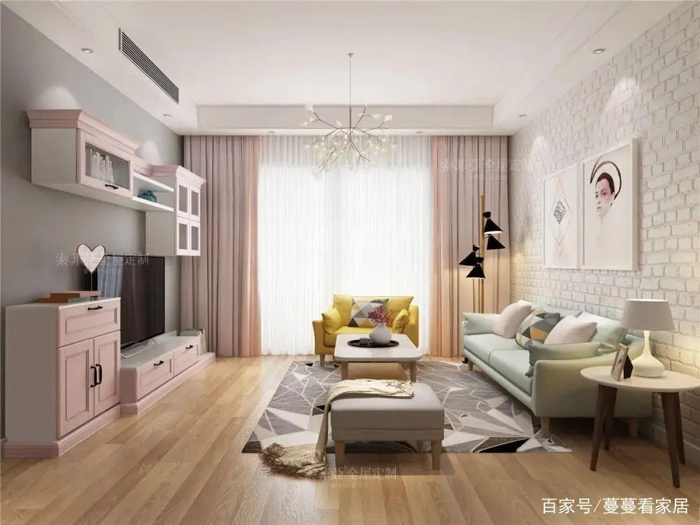

# 主色调

> * 主题色调   杉木原色
> * 地板统一杉木原色，房顶和墙体略带有，避免单调

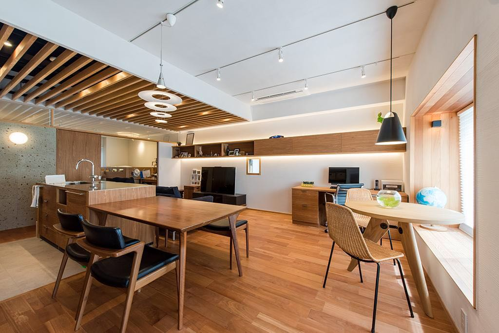

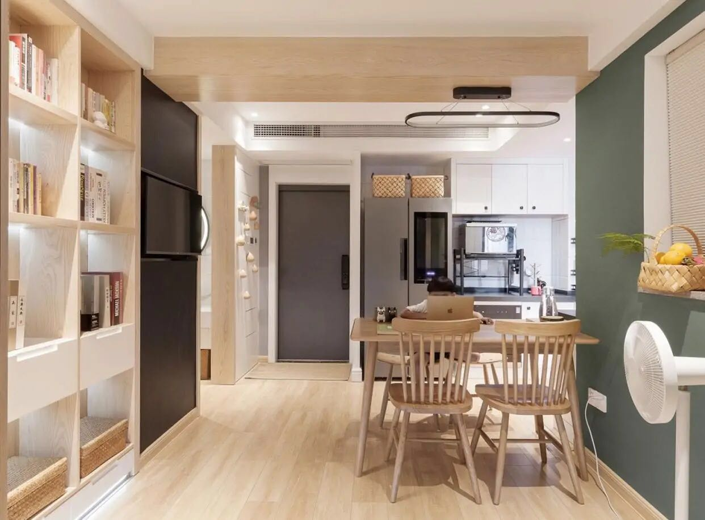

# 客厅

>
>
>* 吊顶效果

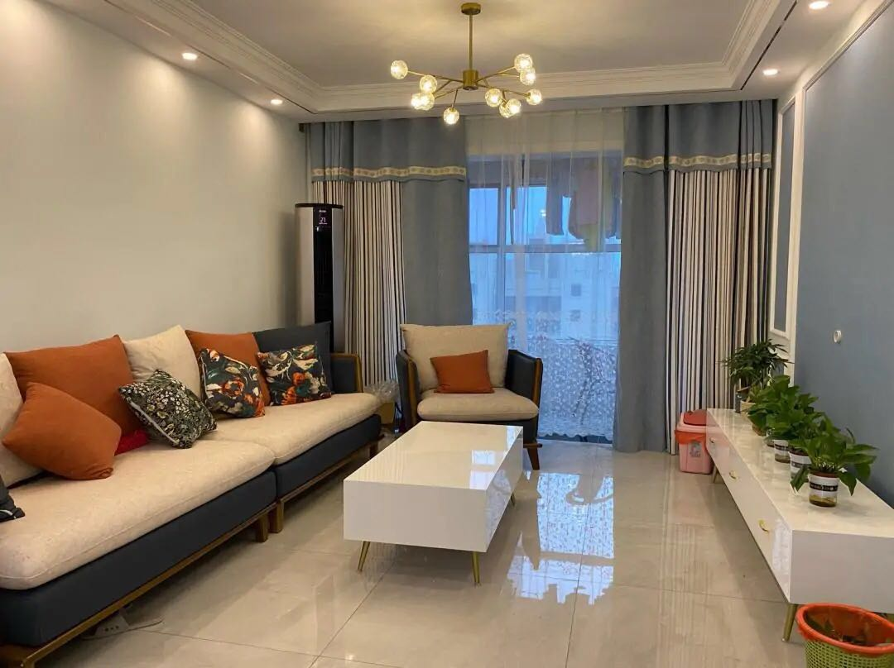

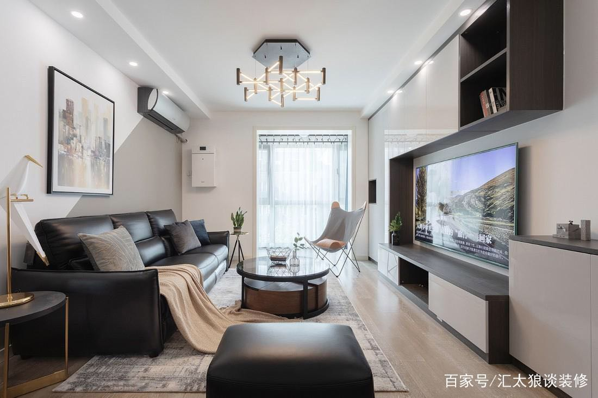

# 厨房

## 全开放式厨房

进门到就是厨房门。

洗碗柜后面就是餐桌

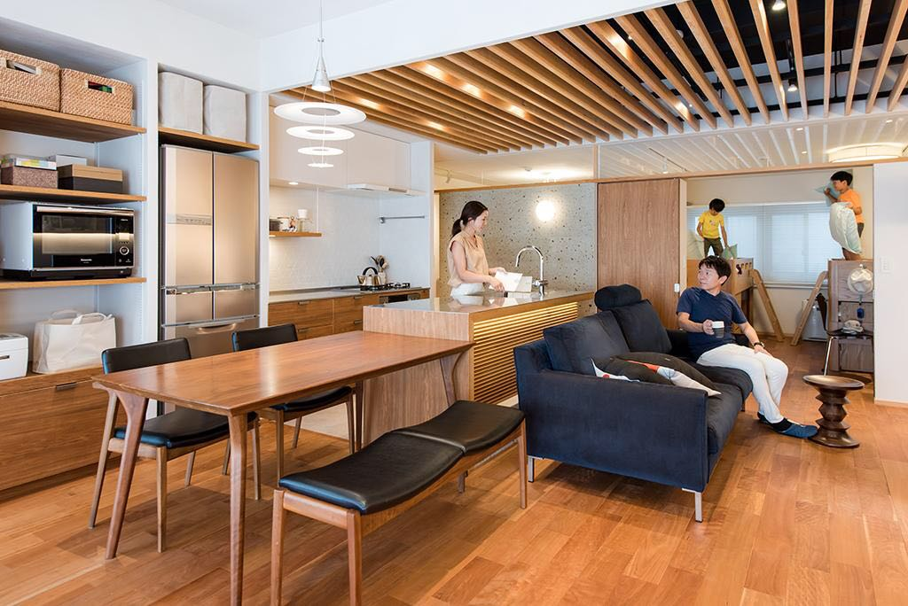

## 半开放式厨房

半开放式：

* 如果门在进门出，感觉开放意义不大
* 如果门在餐桌那边，感觉进门那里有堵墙，也不是太习惯
* * 墙体挨着餐桌那里不搞垂直，可以搞S或）型
  * 进门墙体挨着4号房那边可以做鞋柜，挨着厨房这边1.5以下可以做衣帽挂件，小装饰品；厨房内侧的1.5m上可以做橱柜

​		

# 主卧参考

>* 可以参考那个小书柜

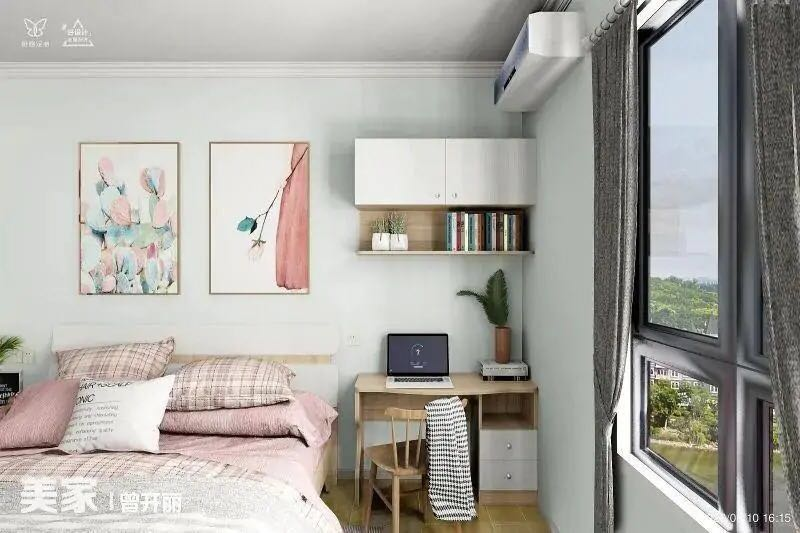

# 厕所参考

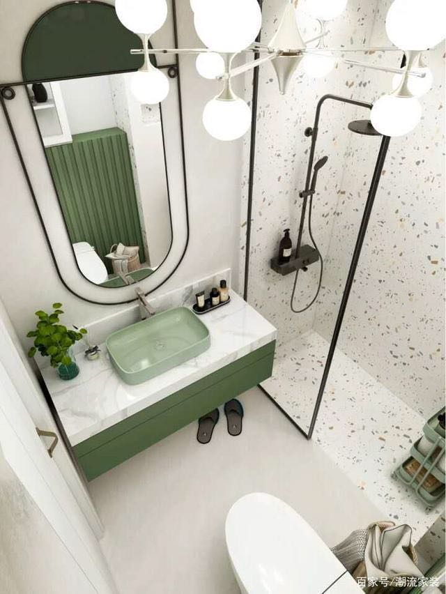

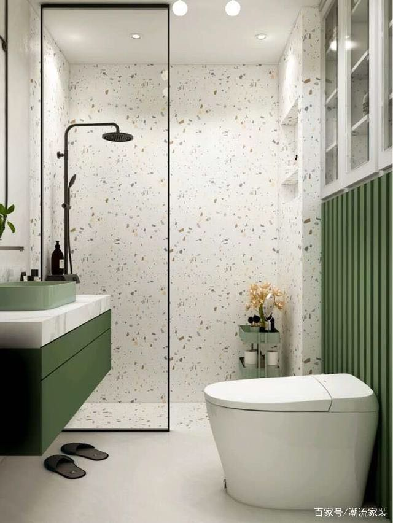

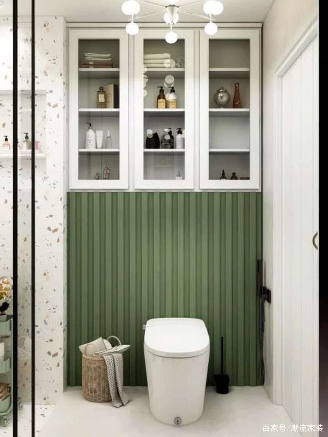

​										**地板可以参考**

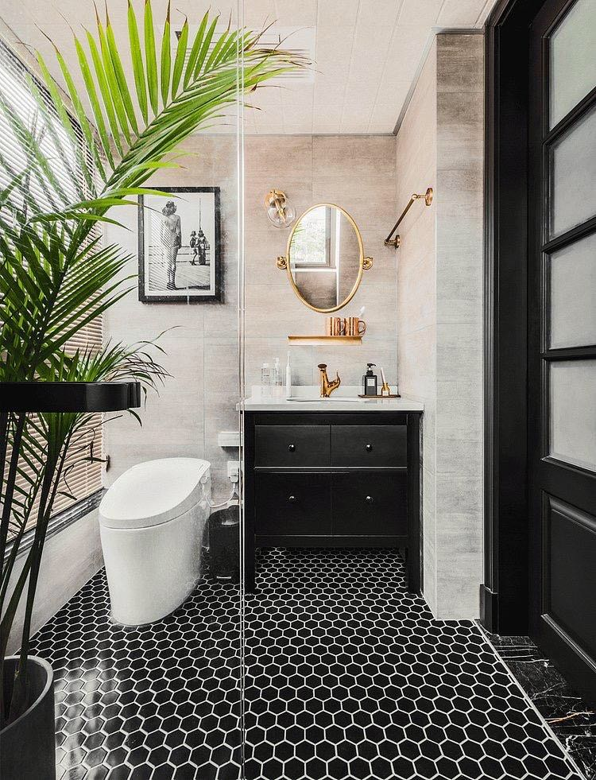

# 洗衣机

## 如果洗衣机放在阳台，可以参考

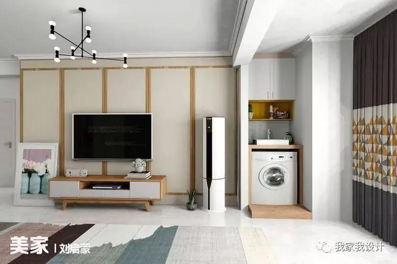

