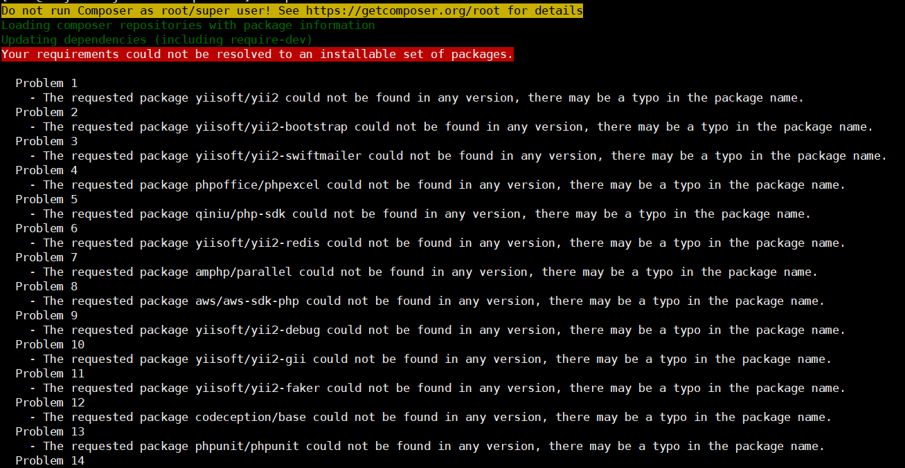
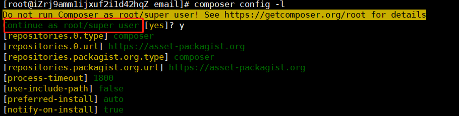

# composer

## 安装

## 配置

### 设仓库源

composer config -g repo.packagist composer https://mirrors.aliyun.com/composer/

阿里云 https://mirrors.aliyun.com/composer/

国内    https://packagist.phpcomposer.com

原本    https://asset-packagist.org     ？？？

## 版本写法 

>  
>
> 
>
> | 名称         | 实例                                    | 描述                                                         |
> | ------------ | --------------------------------------- | ------------------------------------------------------------ |
> | 确切的版本号 | `1.0.2`                                 | 你可以指定包的确切版本。                                     |
> | 范围         | `>=1.0` `>=1.0,<2.0` `>=1.0,<1.1|>=1.2` | 通过使用比较操作符可以指定有效的版本范围。 有效的运算符：`>`、`>=`、`<`、`<=`、`!=`。 你可以定义多个范围，用逗号隔开，这将被视为一个**逻辑AND**处理。一个管道符号`|`将作为**逻辑OR**处理。 AND 的优先级高于 OR。 |
> | 通配符       | `1.0.*`                                 | 你可以使用通配符`*`来指定一种模式。`1.0.*`与`>=1.0,<1.1`是等效的。 |
> | 赋值运算符   | `~1.2`                                  | 这对于遵循语义化版本号的项目非常有用。`~1.2`相当于`>=1.2,<2.0`。想要了解更多，请阅读下一小节。 |

## 遇到问题的处理步骤

1、诊断

composer diagnose

2、升级composer

composer self-update

3、清除缓存

composer clear

更新composer.lock文件

4、composer update --lock

查看composer配置

5、composer config -l

### could not be found in any version

### Continue as root/super user [yes]?

## 执行composer.json

只有一个composer.json。没有其他，甚至没有composer.lock

## 更新项目

## 更新某个项目	

composer update norkunas/onesignal-php-api:2.1.0

Fatal error: Allowed memory size of 1610612736 bytes exhausted (tried to allocate 4096 bytes) in phar://C:/ProgramData/ComposerSetup/bin/composer.phar/src/Composer/DependencyResolver/Solver.php on line 223

Check https://getcomposer.org/doc/articles/troubleshooting.md#memory-limit-errors for more info on how to handle out of memory errors.
C:\code\company\stream\ExitIntent>php -r "echo ini_get('memory_limit').PHP_EOL;"
128M

# wamp

## 安装扩展

> 
>
>PHP+Apache+Mysql+MariaDB的集成软件。
>
> 
>
>官网：http://www.wampserver.com/
>
>扩展包：https://sourceforge.net/projects/wampserver/
>
> 
>
> 
>
> 
>
> 
>
># 任意添加php版本   mysql版本等
>
>扩展包：https://sourceforge.net/projects/wampserver/
>
> 
>
>进入扩展网站
>
>搜索【Project Activity】
>
>点击【Project Activity】板块的右下角【See All Activity 】
>
>下载需要安装的扩展
>
>把wampserver关掉
>
>点击运行扩展.exe文件