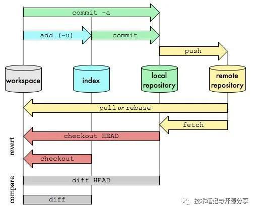

# git

| 步骤   | 位置 | 简称 | 英文       |
| ------ | ---- | ---- | ---------- |
| 工作区 | 本地 | 工作 | workspace  |
| 暂存区 | 本地 | 暂存 | index      |
| 仓库   | 本地 | 本仓 | repository |
| 仓库   | 远程 | 远仓 | remote     |

## 正序

### 工作-暂存

### 工作-本仓

### 工作-远仓

## 反序

### 暂存-工作

### 本仓-工作

### 远仓-工作

## 分支合并与冲突处理

### 分支合并

### 冲突

#### 文件相交、行相交

#### 文件相交，行不相交

​			ab当前是同一个版本。a改了10行，提交至远程仓库。b在a提交后改了20行，也往远程仓库提交。

#### 文件不相交

## 其他指令

### 查看命令执行记录

前后执行了哪些命令

git reflog

# composer

## 安装

## 配置

### 设仓库源

阿里云 https://mirrors.aliyun.com/composer/

国内    https://packagist.phpcomposer.com

原本    https://asset-packagist.org

## 执行composer.json

只有一个composer.json。没有其他，甚至没有composer.lock

## 更新项目

## 更新某个项目	

composer update norkunas/onesignal-php-api:2.1.0

# wamp

## 安装扩展

> 
>
>PHP+Apache+Mysql+MariaDB的集成软件。
>
> 
>
>官网：http://www.wampserver.com/
>
>扩展包：https://sourceforge.net/projects/wampserver/
>
> 
>
> 
>
> 
>
> 
>
># 任意添加php版本   mysql版本等
>
>扩展包：https://sourceforge.net/projects/wampserver/
>
> 
>
>进入扩展网站
>
>搜索【Project Activity】
>
>点击【Project Activity】板块的右下角【See All Activity 】
>
>下载需要安装的扩展
>
>把wampserver关掉
>
>点击运行扩展.exe文件