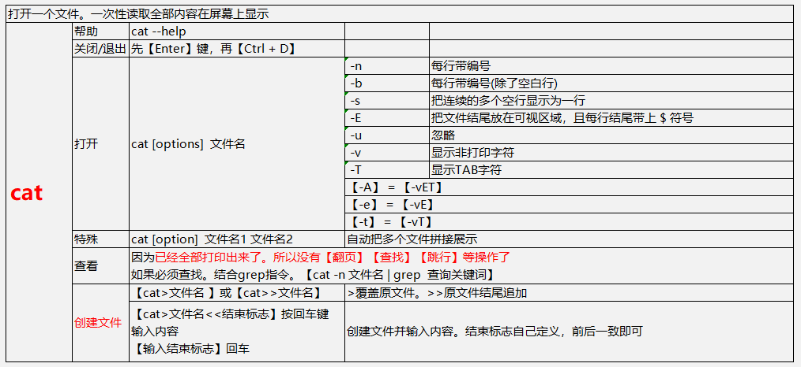
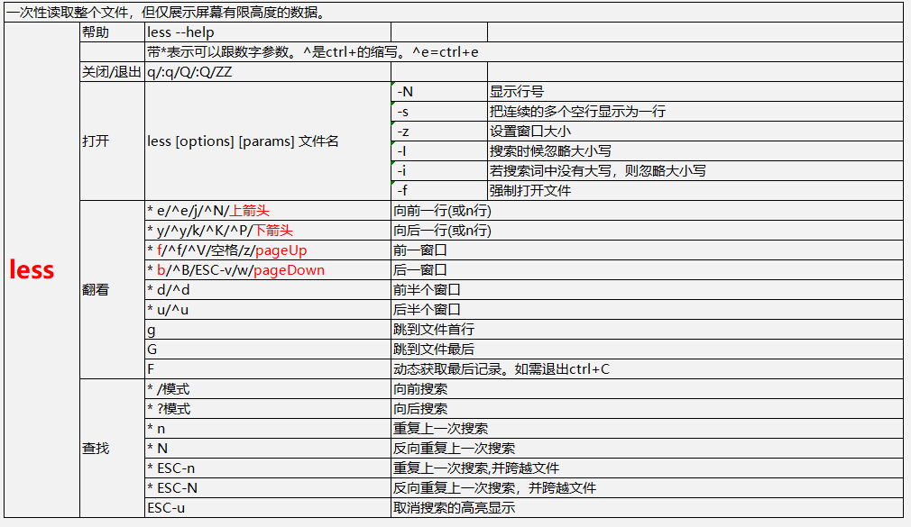
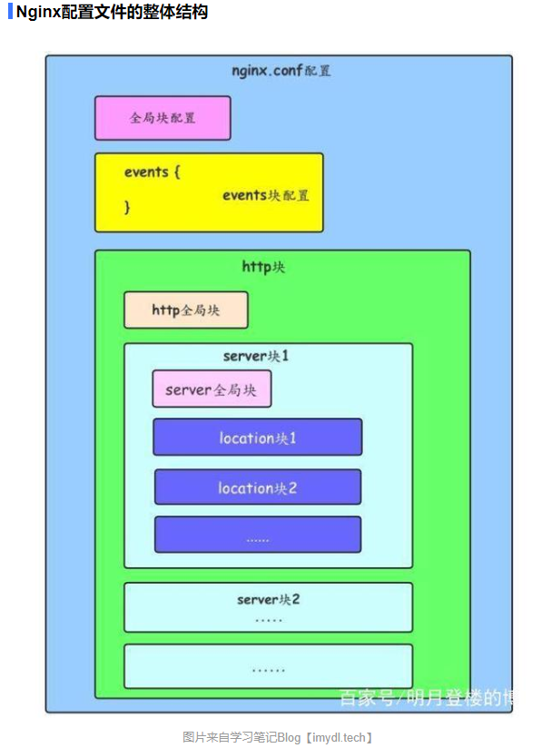

# linux常用命令

很好的中文linux命令：https://man.linuxde.net/


>**yum -y update  #更新yum**
>
>
>
>#history   ==查看执行过的历史命令==
>
>
>
>**系统**
>
>\# uname -a           # 查看内核/操作系统/CPU信息
>\# head -n 1 /etc/issue  # 查看操作系统版本
>\# cat /proc/cpuinfo    # 查看CPU信息
>\# hostname         # 查看计算机名
>\# lspci -tv           # 列出所有PCI设备
>\# lsusb -tv           # 列出所有USB设备
>\# lsmod            # 列出加载的内核模块
>\# env              # 查看环境变量
>
>**资源**
>
>```
># free -m                # 查看内存使用量和交换区使用量
># df -h                  # 查看各分区使用情况
># du -sh <目录名>        # 查看指定目录的大小
># grep MemTotal /proc/meminfo   # 查看内存总量
># grep MemFree /proc/meminfo    # 查看空闲内存量
># uptime                 # 查看系统运行时间、用户数、负载
># cat /proc/loadavg      # 查看系统负载
>```
>
>**磁盘和分区**
>
>```
># mount | column -t      # 查看挂接的分区状态
># fdisk -l               # 查看所有分区
># swapon -s              # 查看所有交换分区
># hdparm -i /dev/hda     # 查看磁盘参数(仅适用于IDE设备)
># dmesg | grep IDE       # 查看启动时IDE设备检测状况
>```
>
>**网络**
>
>```
># ifconfig               # 查看所有网络接口的属性
># iptables -L            # 查看防火墙设置
># route -n               # 查看路由表
># netstat -lntp          # 查看所有监听端口
># netstat -antp          # 查看所有已经建立的连接
># netstat -s             # 查看网络统计信息  
>
>```
>
>**进程** 
>
>```
># ps -ef # 查看所有进程 
># top # 实时显示进程状态  
>
>```
>
>**用户** 
>\# w                  # 查看活动用户
>\# id  <用户名>           # 查看指定用户信息
>\#  last                # 查看用户登录日志
>\# cut -d:  -f1 /etc/passwd  # 查看系统所有用户
>\# cut -d: -f1 /etc/group    # 查看系统所有组
>\# crontab -l           #  查看当前用户的计划任务 
>
>
>**服务** 
>\# chkconfig  --list         # 列出所有系统服务
>\# chkconfig --list |  grep on  # 列出所有启动的系统服务 
>
>
>**程序**  
>\# rpm  -qa        # 查看所有安装的软件包 
>
>
>
>
>我要进入操作系统安装nginx: 
>
>1、这是什么系统？centos?ubuntu? 
>
>2、判断是否已经安装了nginx? 
>
>3、如果安装，存储空间是否足够（这个是磁盘吧）?  【查看内存# free -m  查看磁盘 #df -h】 
>
>4、安装过程，判断某端口是否被占用？以及某端口在防火墙中是否打开？ 
>
>https://man.linuxde.net/ 
>
>
>
>命令界面：
>
>​         [root@iZbp1aehdis8zyu6qm4w48Z www]# vim  a.txt 
>
>​         root 当前正在使用的用户 
>
>​         iZbp1aehdis8zyu6qm4w48Z 主机名 
>
>​         (~/www) 代表当前目录 
>
>​         $普通用户 #root用户
>
>
>
>
>
>1、 查看当前目录  pwd（Print Working Directory）
>
>​    查看当前shell  $SHELL
>
>​    查看当前用户  who / id
>
>2、切换工作目录  cd （Change Directory）
>
>​     （1）格式：cd [目录位置]
>
>​    　　特殊目录：
>
>​    　    　.当前目录
>
>　        　..上一级目录
>
>　　        ~用户主目录
>
>　　        -上个工作目录
>
>​    （2）cd ~==cd 回到家目录（快速返回家目录：cd ）
>
>​    （3）cd ~user1 切换到user1的家目录
>
>3、 创建新的目录   mkdir（Make Directory）
>
>​    （1）格式：mkdir [-p] [/路径名/] 目录名
>
>　　        -p：mkdir命令会自动检查目录名前边的路径中的每一层是否存在，如果不存在，将自动创建
>
>​    （2）例：　mkdir -p /opt/mp3 创建目录mp3
>
>4、创建新得文件  vim/touch
>
>​    vim不能创建带有不存在得目录得文件 如 vim /13sui/web/index.php   目录13sui与web有一个不存在
>
>5、删除空的目录   rmdir （只能删除空目录）（Remove Directory）
>
>6、 删除文件或目录  rm（删除目录必须用-r选项，删除非目录类型的文件，可以用也可以不用-r选项。建议：删除文件不要用-r选项。）
>
>​    （1）格式： rm [选项]...文件或目录
>
>　　    -f：强行删除文件或目录，不进行提醒
>
>　　    -r：递归删除整个目录树
>
>7、复制文件或目录 cp （copy）
>
>​    （1）格式：cp[选项]... 源文件或目录...目标文件或目录
>
>​    　　-r：递归复制整个目录树
>
>​    　　-a：复制时保留链接、文件属性，并递归的复制目录　　-a选线包含-r选项的功能，也包含了-p选项的功能
>
>​    　　-p：保留原来文件的权限
>
>​    　　-i：覆盖前会提醒
>
>​    　　-f：强制
>
>​    （2）例：
>
>　　    cp /etc/passwd /opt  将/etc/passwd文件复制到/opt目录下,没有改名
>
>　　    cp /etc/passwd /opt/a.txt  将/etc/passwd文件复制到/opt目录下并改名为a.txt
>
>​        cp -r /opt /tmp  将/opt目录或者文件都复制到/tmp目录下，这里要注意复制目录必须使用-r选项
>
>8、移动文件或目录  mv  （move） 如果目标位置和源位置相同，则相当于改名
>
>​    （1）格式：mv  [选项]...源文件或目录... 目标文件或目录
>
>​    （2）例：
>
>　　    mv  passwd /opt 将当前目录的passwd移动到/opt下，没有改名
>
>​    　　mv  passwd /opt/b.txt 将当前目录的passwd移动到/opt下,并改名为b.txt
>
>　　    mv opt  /home 将当前目录下的opt移动到/home目录下，没有改名
>
>不管是cp还是mv，如果有多个源文件或者目录，那就目标必须是存在的目录
>
>
>
>
>
>
>
>
>
>
>
>


## (一)、网络/接口

| 序号 | 指令     | centos默认 | 功能                                     | 备注 |
| ---- | -------- | ---------- | ---------------------------------------- | ---- |
| 1    | ping     | 有         |                                          |      |
| 2    | telnet   | 无         | 远程网络                                 |      |
| 3    | Netstat  | 有         | 本地网络                                 |      |
| 4    | route    | 有         |                                          |      |
| 5    | nslookup | 无         | 查DNS信息                                |      |
| 6    | arp      |            | 操作主机的arp缓冲区。ip地址和MAC对应关系 |      |


### 1、ping

`ping domain/ip 参数`

| 序号 | 参数    | 功能                 | 备注 |
| ---- | ------- | -------------------- | ---- |
| 1    | `-c 10` | 丢几次数据包         |      |
| 2    | `-i 5`  | 每个数据包的间隔时间 |      |

### 2、telnet

### 3、Netstat

Linux中网络系统的状态信息，可让你得知整个Linux系统的网络情况

| 序号 | 参数 | 功能                       | 备注 |
| ---- | ---- | -------------------------- | ---- |
| 1    | `-a` | 显示所有连线中的Socket     |      |
| 2    | `-t` | 显示TCP传输协议的连线状况  |      |
| 3    | `-u` | 显示UDP传输协议的连线状况  |      |
| 4    | `-c` | 每秒刷新结果               |      |
| 5    | `-l` | 显示监控中的服务器的Socket |      |

### 4、route

### 5、nslookup

### 6、arp

## 开虚拟内存swap

> ```shell
> free -m
> mkdir -p /var/_swap_
> cd /var/_swap_
> #Here, 1M * 2000 ~= 2GB of swap memory
> dd if=/dev/zero of=swapfile bs=1M count=2000
> mkswap swapfile
> swapon swapfile
> echo “/var/_swap_/swapfile none swap sw 0 0” >> /etc/fstab
> #cat /proc/meminfo
> free -m
> ```
>
> 


## 文件

### 查看文件

#### cat




#### tail


#### head


#### more


#### less




### 文件权限

查看文件权限

ls -l [目录/文件]路径

 

[root@iZbp1aehdis8zyu6qm4w48Z etc]# ls -l /etc/passwd
-rw-r--r-- 1 root root 1119 Mar 13 15:13  /etc/passwd


| -rw-r--r-- |      | 1            |      | root |      | root |      | 1119 Mar  13 13:13 |      | /etc/passwd |
| ---------- | ---- | ------------ | ---- | ---- | ---- | ---- | ---- | ------------------ | ---- | ----------- |
| 权限       |      | 文件硬链接数 |      | 用户 |      | 群组 |      | 创建日期           |      | 文件名      |


 

权限：[-] [rw-] [r--]  [r--]     r-可读(4)；w-可写(2)；x-可执行(1)

> [-]     文件类型
>
> [rw-]   用户拥有的权限
>
> [r--]    用户所在群组拥有的权限
>
> [r--]    其他用户拥有的权限

> r:  读
>
> w: 写
>
> x: 执行
>
> s: 特殊 ls -ld /tmp
>
> t:  特殊 ls -l /usr/bin/passwd

​    文件类型

> | -    | 普通文件     |                        |
> | ---- | ------------ | ---------------------- |
> | d    | 目录         |                        |
> | l    | 链接文件     |                        |
> | b    | 块设备文件   | 硬盘、光盘             |
> | c    | 字符设备文件 | 键盘等                 |
> | p    | 命令管道文件 | 与shell编程 有关的文件 |
> | s    | sock文件     |                        |

 

#### 修改文件/目录权限chmod

##### 方式一：chmod  [ugoa][+-][rwx] 文件

> u：用户
>
> g：群组
>
> o：其他
>
> a：全部【包含用户、群组、其他】
>
>  
>
> +：加权限
>
> -：减权限

比如：chmod u+wx a.txt 给a.txt的用户(拥有者)添加写和执行的权限

​      chmod o-x a.txt  全部用户不能执行这个文件

 

##### 方式二：chmod 777  a.txt   7= 4读+2写+1执行

##### 方式三：chmod -R  777 /www   递归把/www及其目录下的全部文件和目录

 

#### 修改文件/目录的拥有者chown

## 用户-群组

优秀链接：https://blog.csdn.net/freeking101/article/details/78201539

**前言：**

  本篇讲解用户和群组，根据linux的历史他的开发起点就是满足多个用户使用同一台机器的想法，所以linux有一套非常完美的用户管理系统。 

**粗解：**

 linux下会将一个用户分配到一个用户组内，进行统一管理，所以，linux下会建立一个passwd表和group表，这两个表负责管理用户和用户组，并且会将两个表中的密码进行单独提出，分配两个表分别是shadow负责管理用户密码和gshadow负责管理用户组密码。

### **核心文件**

> /etc/login.defs       创建用户的一些默认限制的配置 
>
> /etc/skel           用户启动文件的目录(这里是模板，创建用户会自动复制) ls -la /etc/skel 
>
> /etc/default/useradd   通过useradd添加用户时的规则文件 
>
>  
>
> /etc/passwd        用户文件 
>
> /etc/shadow        用户密码文件 
>
> /etc/group         群组文件 
>
> /etc/gshadow       群组密码文件 

### **用户操作**

> useradd     添加用户【[d]起始目录/[e|f]账号有效期/[g|G]归属群组/[s]登录shell命令】--【还有一个叫密码有效期】 
>
> usermod　  修改用户【添加的都可以修改】　   
>
> userdel     删除用户 

### **群组操作**

> groupadd   添加群组【[f]如果群组名存在，强制覆盖】 
>
> groupmod　修改群组【[n]修改群组名字】　　
>
> groupdel　  删除群组 

 

chgrp chown su gpasswd 

su   su默认切到root

#### **su user 与su -  user的区别** 

​    su  只改变用户角色 

​    su  - 改变用户角色并改变shell环境 

 

查看全部用户 

​    cut -d : -f 1  /etc/passwd 

​    cat /etc/passwd |awk -F  \: '{print $1}' 

​    cat /etc/passwd 

1、查看某个user加入了哪些群组？  

​    usermod -G 群组1,群组2  用户   

​     groups 用户名 

   cat /etc/group | grep 用户 

2、查看某个group中加入了哪些用户 

​    

3、修改file/document的用户 

​    

4、修改file/document的群组 

​    

5、用户账户有效期 

   【添加】useradd -e 2030-12-31 用户名 

​     【修改】usermod -e 2031-12-31 用户名 

​    【查看】  chage -l 用户名 

6、用户密码有效期 

​     【添加】 

​     【修改】  

​    【查看】  chage -l 用户名 


## 找文件

##### which  nginx 

##### whereis  nginx 

##### locate  php.ini       找文件 （yum install mlocate/updatedb）

 

出于各种原因，要判断实际需要的东西在哪个软件包里，需要有点儿小技巧。

可以使用`which`命令来查找相关的二进制程序是否在搜索路径中:

```
$ which gcc/opt/pware/bin/gcc
```

如果`which`没有找到要找的命令，那么可以试试`whereis`；该命令可以搜素更大范围的系统目录，与shell的搜索路径无关。

另外可以使用`locate`命令，它参照预先编译好的一个文件系统索引，以此确定与特定模式相匹配的文件名。`locate`的搜索并不只针对命令或者软件包，而是能够找到任何类型的文件。例如，如果读者不知道头文件`signal.h`在哪里：

```shell
$ locate signal.h
/usr/include/signal.h
/usr/include/asm/signal.h
/usr/include/asm-generic/signal.h
/usr/include/linux/signal.h
```

`locate`命令需要维持一个数据库，这个数据库通常由`updatedb`命令定期更新，这条命令由`cron`运行。因此，执行locate的结果并不总是能反应最近文件系统的变化。

如果用户知道要查找的软件包的名字，也可以使用系统上的软件包工具来直接检查是否存在该软件包。例如，在Red  Hat或者SUSE系统上，可以使用鲜面的命令检查是否有Python：

```shell
$ rpm -q python
python-2.4.3-21.e15
```

如果使用Debian系统，可以使用`dpkg  -s`或者`dpkg-query`命令.

# shell程序

## (一)、入门须知

### 1、文件命名

比如my.sh 以.sh结尾

### 2、文件格式

以输出hello world为例

>```shell
>#!/bin/bash
>echo "hello world"
>
>```

### 3、注释方式

#### (1)、单行注释

> * `#`
>
>   ```shell
>   #!/bin/bash
>   #我是注释
>   ```
>
>   

#### (2)、多行注释

### 4、行结束标志

每行用什么标志表示该行结束

### 5、文档文献

### 6、文件参数

>指令行输入如下：
>
>```shell
>#  sh test.sh 1 2 3
>```
>
>test.sh内部该如何接收参数？
>
>* 在test.sh中，
>* * \$0代表执行文件按名:test.sh；
>* * \$1代表1；\$2代表2；\$3代表3。

如何要求在文档运行中途必须传入参数？

>```shell
>#!/bin/bash
>echo 'please enter your name:'
>read yourName
>```
>
>运行sh ./test.sh 
>
>提示：please enter your name:
>
>输入....回车。输入的内容被变量`yourName`接收
>
>文件继续往下走....

## (二)、语法

### 1、数据类型

#### (1)、类型列表

| 序号 | 类型  | 举例          | 备注                       |
| ---- | ----- | ------------- | -------------------------- |
|      | array | (1 2 'a' 'b') | 调用`${array_name[index]}` |


#### (2)、细说数据类型

#### (3)、类型强转化

### 2、运算符

#### 运算符优先级

#### (1)、算数运算符

加减乘除求模求幂

#### (2)、比较运算符

#### (3)、逻辑运算符

### 3、流程控制

#### (1)、循环

for / while等

#### (2)、判断

if等

#### (3)、引入文件

#### (4)、异常

##### (5)、其他


goto

### 4、变量(区分大小写)

#### 命名规则

#### 声明定义、赋值(初始化)、调用

正确举例

>```shell
>var='hello world'
>var='hello china'
>var2=$var
>echo $var2#输出hello china
>```

错误举例

>```shell
>var = 'hello world'#错误 等号两边不能有空格
>$var='hello world'#错误，声明定义和赋值变量时都不用$,只有调用才需要$
>```

未知

>
>
>```shell
>echo var3
>echo $var4
>```
>
>

### 5、function

1、命名规则

2、声明定义和初始化


### 6、对象

### 7、进程性指令

### 8、其他语法

### 错误处理errors

## 预定义

(一)、预定义数据载体

(二)、预定义异常

## 常用功能扩展

更新git-yii

>
>
>```shell
>#!/bin/bash
>PROJECT='Collection'
>CONID='fengjinliang' 
>CONKEY='aaaaa' 
>GITBRANCH = 'dev'
>
>
>echo "please enter your project:"
>read projectName2
>
>cd /root/project/weshare/dev/Collection
>git checkout ${GITBRANCH}
>expect -c "spawn git pull origin ${GITBRANCH}; expect \"*Username*\" { send \"${CONID}\n\"; exp_continue } \"*Password*\" { send \"${CONKEY}\n\" }; interact"
>expect -c "spawn php yii migrate; expect \"*Apply the above migration*\" { send \"yes\r\"; }; interact"
>```
>
>


# FTP TFTP  SFTP

# nginx

中文文档：https://www.nginx.cn/doc/

官方文档：http://nginx.org/en/docs/

官方文档：https://docs.nginx.com/nginx/admin-guide


| 配置文件     | 作用                              |
| ------------ | --------------------------------- |
| nginx.conf   | nginx的基本配置文件               |
| fastcgi.conf | 与fastcgi相关的配置文件           |
| mime.types   | MIME类型关联的扩展文件            |
| proxy.conf   | 与proxy相关的配置                 |
| sites.conf   | 配置nginx提供的网站，包括虚拟主机 |


## nginx安装

### 1、二进制安装

#### (1)、下载安装包

>
>
>官方下载地址：http://nginx.org/en/download.html
>
>下载        wget  http://nginx.org/download/nginx-1.18.0.tar.gz

#### (2)、解压到当前目录

>tar  zxvf  nginx-1.18.0.tar.gz

#### (3)、开始安装

##### (a)、configure

>进入到解压后的nginx-1.18.0目录（==目的是找到configure文件==）
>
>
>
>尝试直接安装，缺少扩展会有提示，缺啥补啥  
>
>./configure --prefix=/usr/local/nginx
>
>


configure安装成功后的输出

> ```shell
> Configuration summary
>   + using system PCRE library
>   + OpenSSL library is not used
>   + using system zlib library
> 
>   nginx path prefix: "/usr/local/nginx"
>   nginx binary file: "/usr/local/nginx/sbin/nginx"
>   nginx modules path: "/usr/local/nginx/modules"
>   nginx configuration prefix: "/usr/local/nginx/conf"
>   nginx configuration file: "/usr/local/nginx/conf/nginx.conf"
>   nginx pid file: "/usr/local/nginx/logs/nginx.pid"
>   nginx error log file: "/usr/local/nginx/logs/error.log"
>   nginx http access log file: "/usr/local/nginx/logs/access.log"
>   nginx http client request body temporary files: "client_body_temp"
>   nginx http proxy temporary files: "proxy_temp"
>   nginx http fastcgi temporary files: "fastcgi_temp"
>   nginx http uwsgi temporary files: "uwsgi_temp"
>   nginx http scgi temporary files: "scgi_temp"
> 
> ```

##### (b)、make && make install（编译）

> 依旧在configure文件的目录，运行  
>
> make && make install

编译成功

>```shell
>make[1]: Leaving directory `/fff/nginx-1.18.0'
>```

#### (4)、安装成功

>根据configue确定安装目录是  /usr/local/nginx
>
>安装目录下有四个文件
>
>conf    配置文件
>
>html   页面(500,404等)
>
>logs    日志
>
>sbin    进程文件（启动文件）
>
>

#### 其他杂货

##### (a)、查看正在监听的全部端口

>netstat -antp

##### (b)、查看80端口是否占用

>ps aux|grep 80
>
>ps aux|grep nginx

##### (a)、pcre

>./configure: error: the HTTP rewrite module requires the PCRE library.
>You can either disable the module by using --without-http_rewrite_module
>option, or install the PCRE library into the system, or build the PCRE library
>statically from the source with nginx by using --with-pcre=<path> option.
>
>意思是==没有安装pcre==，这个是在路由重写(rewrite)需要使用正则的，必须要

解决：

>yum install -y pcre pcre-devel

##### (b)、zlib

>./configure: error: the HTTP gzip module requires the zlib library.
>You can either disable the module by using --without-http_gzip_module
>option, or install the zlib library into the system, or build the zlib library
>statically from the source with nginx by using --with-zlib=<path> option.
>
>==压缩的时候需要zlib==

解决:

>yum install -y zlib-devel


()、

## nginx指令

官方文档： https://www.nginx.com/resources/wiki/start/topics/tutorials/commandline/

### 1、启动

> ```shell
> /usr/local/nginx/sbin/nginx
> 
> /usr/local/nginx/sbin/nginx -t -c ~/mynginx.conf -g "pid /var/run/nginx.pid; worker_processes 2;"
> ```

| 参数 | 注释                                            |
| ---- | ----------------------------------------------- |
| `-h` | 帮助                                            |
| `-v` | 打印版本号                                      |
| `-V` | 打印NGINX版本，编译器版本并配置参数。           |
| `-t` | 只测试配置文件                                  |
| `-q` | 不显示错误                                      |
| `-s` | signal（stop, quit, reopen, reload）            |
| `-p` |                                                 |
| `-c` | 指定NGINX应该使用哪个配置文件代替默认配置文件。 |
| `-g` | 设置conf中的全局指令                            |

### 2、signal（关闭/重启/日志等）

| nginx           | kill                 | 注释                            |
| --------------- | -------------------- | ------------------------------- |
| nginx -s stop   | kill -INT nginxPID   | 立即停止                        |
| nginx -s quit   | kill -QUIT nginxPID  | 优雅停止                        |
| nginx -s reopen | kill -USER1 nginxPID | 日志写在新文件中(日志分割)      |
| nginx -s reload | kill -HUP nginxPID   | 加载最新配置                    |
|                 | kill -USER2 nginxPID | nginx平滑升级                   |
|                 | kill -WINCH nginxPID | 优雅关闭进程，配合user2平滑升级 |

>如何找到nginxPID？？？
>
>方法一：
>
>​			locate nginx.pid
>
>方法二：
>
>​			ps aux|grep nginx


==nginxPID可以手写数字，也可以读nginx.pid文件==

比如： 

> ```shell
>  kill -TERM $(cat /usr/local/nginx/logs/nginx.pid)
> ```
>
> 或
>
> ```shell
> kill -TERM `cat /usr/local/nginx/logs/nginx.pid`
> ```


## nginx.conf

### 1、预定义变量

官方文档： http://nginx.org/en/docs/varindex.html

#### (1)、通用

>| [$ancient_browser](http://nginx.org/en/docs/http/ngx_http_browser_module.html#var_ancient_browser) |      |
>| ------------------------------------------------------------ | ---- |
>| [$arg_](http://nginx.org/en/docs/http/ngx_http_core_module.html#var_arg_) |      |
>| [$args](http://nginx.org/en/docs/http/ngx_http_core_module.html#var_args) |      |
>| [$body_bytes_sent](http://nginx.org/en/docs/http/ngx_http_core_module.html#var_body_bytes_sent) |      |
>| [$bytes_received](http://nginx.org/en/docs/stream/ngx_stream_core_module.html#var_bytes_received) |      |
>| [$connections_active](http://nginx.org/en/docs/http/ngx_http_stub_status_module.html#var_connections_active) |      |
>| [$connections_reading](http://nginx.org/en/docs/http/ngx_http_stub_status_module.html#var_connections_reading) |      |
>| [$connections_waiting](http://nginx.org/en/docs/http/ngx_http_stub_status_module.html#var_connections_waiting) |      |
>| [$connections_writing](http://nginx.org/en/docs/http/ngx_http_stub_status_module.html#var_connections_writing) |      |
>| [$content_length](http://nginx.org/en/docs/http/ngx_http_core_module.html#var_content_length) |      |
>| [$content_type](http://nginx.org/en/docs/http/ngx_http_core_module.html#var_content_type) |      |
>| [$cookie_](http://nginx.org/en/docs/http/ngx_http_core_module.html#var_cookie_) |      |
>| [$date_gmt](http://nginx.org/en/docs/http/ngx_http_ssi_module.html#var_date_gmt) |      |
>| [$date_local](http://nginx.org/en/docs/http/ngx_http_ssi_module.html#var_date_local) |      |
>| [$document_root](http://nginx.org/en/docs/http/ngx_http_core_module.html#var_document_root) |      |
>| [$document_uri](http://nginx.org/en/docs/http/ngx_http_core_module.html#var_document_uri) |      |
>| [$fastcgi_path_info](http://nginx.org/en/docs/http/ngx_http_fastcgi_module.html#var_fastcgi_path_info) |      |
>| [$fastcgi_script_name](http://nginx.org/en/docs/http/ngx_http_fastcgi_module.html#var_fastcgi_script_name) |      |
>| [$gzip_ratio](http://nginx.org/en/docs/http/ngx_http_gzip_module.html#var_gzip_ratio) |      |
>| [$host](http://nginx.org/en/docs/http/ngx_http_core_module.html#var_host) |      |
>| [$http2](http://nginx.org/en/docs/http/ngx_http_v2_module.html#var_http2) |      |
>| [$http_](http://nginx.org/en/docs/http/ngx_http_core_module.html#var_http_) |      |
>| [$https](http://nginx.org/en/docs/http/ngx_http_core_module.html#var_https) |      |
>| [$invalid_referer](http://nginx.org/en/docs/http/ngx_http_referer_module.html#var_invalid_referer) |      |
>| [$is_args](http://nginx.org/en/docs/http/ngx_http_core_module.html#var_is_args) |      |
>| [$jwt_claim_](http://nginx.org/en/docs/http/ngx_http_auth_jwt_module.html#var_jwt_claim_) |      |
>| [$jwt_header_](http://nginx.org/en/docs/http/ngx_http_auth_jwt_module.html#var_jwt_header_) |      |
>| [$limit_rate](http://nginx.org/en/docs/http/ngx_http_core_module.html#var_limit_rate) |      |
>| [$limit_req_status](http://nginx.org/en/docs/http/ngx_http_limit_req_module.html#var_limit_req_status) |      |
>| [$memcached_key](http://nginx.org/en/docs/http/ngx_http_memcached_module.html#var_memcached_key) |      |
>| [$modern_browser](http://nginx.org/en/docs/http/ngx_http_browser_module.html#var_modern_browser) |      |
>| [$msie](http://nginx.org/en/docs/http/ngx_http_browser_module.html#var_msie) |      |
>| [$protocol](http://nginx.org/en/docs/stream/ngx_stream_core_module.html#var_protocol) |      |
>| [$proxy_add_x_forwarded_for](http://nginx.org/en/docs/http/ngx_http_proxy_module.html#var_proxy_add_x_forwarded_for) |      |
>| [$proxy_host](http://nginx.org/en/docs/http/ngx_http_proxy_module.html#var_proxy_host) |      |
>| [$proxy_port](http://nginx.org/en/docs/http/ngx_http_proxy_module.html#var_proxy_port) |      |
>| [$query_string](http://nginx.org/en/docs/http/ngx_http_core_module.html#var_query_string) |      |
>| [$realpath_root](http://nginx.org/en/docs/http/ngx_http_core_module.html#var_realpath_root) |      |
>| [$remote_user](http://nginx.org/en/docs/http/ngx_http_core_module.html#var_remote_user) |      |
>| [$request](http://nginx.org/en/docs/http/ngx_http_core_module.html#var_request) |      |
>| [$request_body](http://nginx.org/en/docs/http/ngx_http_core_module.html#var_request_body) |      |
>| [$request_body_file](http://nginx.org/en/docs/http/ngx_http_core_module.html#var_request_body_file) |      |
>| [$request_completion](http://nginx.org/en/docs/http/ngx_http_core_module.html#var_request_completion) |      |
>| [$request_filename](http://nginx.org/en/docs/http/ngx_http_core_module.html#var_request_filename) |      |
>| [$request_id](http://nginx.org/en/docs/http/ngx_http_core_module.html#var_request_id) |      |
>| [$request_method](http://nginx.org/en/docs/http/ngx_http_core_module.html#var_request_method) |      |
>| [$request_uri](http://nginx.org/en/docs/http/ngx_http_core_module.html#var_request_uri) |      |
>| [$scheme](http://nginx.org/en/docs/http/ngx_http_core_module.html#var_scheme) |      |
>| [$secure_link](http://nginx.org/en/docs/http/ngx_http_secure_link_module.html#var_secure_link) |      |
>| [$secure_link_expires](http://nginx.org/en/docs/http/ngx_http_secure_link_module.html#var_secure_link_expires) |      |
>| [$sent_http_](http://nginx.org/en/docs/http/ngx_http_core_module.html#var_sent_http_) |      |
>| [$sent_trailer_](http://nginx.org/en/docs/http/ngx_http_core_module.html#var_sent_trailer_) |      |
>| [$server_name](http://nginx.org/en/docs/http/ngx_http_core_module.html#var_server_name) |      |
>| [$server_protocol](http://nginx.org/en/docs/http/ngx_http_core_module.html#var_server_protocol) |      |
>| [$session_log_binary_id](http://nginx.org/en/docs/http/ngx_http_session_log_module.html#var_session_log_binary_id) |      |
>| [$session_log_id](http://nginx.org/en/docs/http/ngx_http_session_log_module.html#var_session_log_id) |      |
>| [$session_time](http://nginx.org/en/docs/stream/ngx_stream_core_module.html#var_session_time) |      |
>| [$slice_range](http://nginx.org/en/docs/http/ngx_http_slice_module.html#var_slice_range) |      |
>| [$spdy](http://nginx.org/en/docs/http/ngx_http_spdy_module.html#var_spdy) |      |
>| [$spdy_request_priority](http://nginx.org/en/docs/http/ngx_http_spdy_module.html#var_spdy_request_priority) |      |
>| [$ssl_client_escaped_cert](http://nginx.org/en/docs/http/ngx_http_ssl_module.html#var_ssl_client_escaped_cert) |      |
>| [$ssl_client_i_dn_legacy](http://nginx.org/en/docs/http/ngx_http_ssl_module.html#var_ssl_client_i_dn_legacy) |      |
>| [$ssl_client_s_dn_legacy](http://nginx.org/en/docs/http/ngx_http_ssl_module.html#var_ssl_client_s_dn_legacy) |      |
>| [$ssl_early_data](http://nginx.org/en/docs/http/ngx_http_ssl_module.html#var_ssl_early_data) |      |
>| [$ssl_preread_alpn_protocols](http://nginx.org/en/docs/stream/ngx_stream_ssl_preread_module.html#var_ssl_preread_alpn_protocols) |      |
>| [$ssl_preread_protocol](http://nginx.org/en/docs/stream/ngx_stream_ssl_preread_module.html#var_ssl_preread_protocol) |      |
>| [$ssl_preread_server_name](http://nginx.org/en/docs/stream/ngx_stream_ssl_preread_module.html#var_ssl_preread_server_name) |      |
>| [$tcpinfo_rtt](http://nginx.org/en/docs/http/ngx_http_core_module.html#var_tcpinfo_) |      |
>| [$tcpinfo_rttvar](http://nginx.org/en/docs/http/ngx_http_core_module.html#var_tcpinfo_) |      |
>| [$tcpinfo_snd_cwnd](http://nginx.org/en/docs/http/ngx_http_core_module.html#var_tcpinfo_) |      |
>| [$tcpinfo_rcv_space](http://nginx.org/en/docs/http/ngx_http_core_module.html#var_tcpinfo_) |      |
>| [$uid_got](http://nginx.org/en/docs/http/ngx_http_userid_module.html#var_uid_got) |      |
>| [$uid_reset](http://nginx.org/en/docs/http/ngx_http_userid_module.html#var_uid_reset) |      |
>| [$uid_set](http://nginx.org/en/docs/http/ngx_http_userid_module.html#var_uid_set) |      |
>| [$upstream_cache_status](http://nginx.org/en/docs/http/ngx_http_upstream_module.html#var_upstream_cache_status) |      |
>| [$upstream_cookie_](http://nginx.org/en/docs/http/ngx_http_upstream_module.html#var_upstream_cookie_) |      |
>| [$upstream_first_byte_time](http://nginx.org/en/docs/stream/ngx_stream_upstream_module.html#var_upstream_first_byte_time) |      |
>| [$upstream_header_time](http://nginx.org/en/docs/http/ngx_http_upstream_module.html#var_upstream_header_time) |      |
>| [$upstream_http_](http://nginx.org/en/docs/http/ngx_http_upstream_module.html#var_upstream_http_) |      |
>| [$upstream_queue_time](http://nginx.org/en/docs/http/ngx_http_upstream_module.html#var_upstream_queue_time) |      |
>| [$upstream_response_length](http://nginx.org/en/docs/http/ngx_http_upstream_module.html#var_upstream_response_length) |      |
>| [$upstream_response_time](http://nginx.org/en/docs/http/ngx_http_upstream_module.html#var_upstream_response_time) |      |
>| [$upstream_session_time](http://nginx.org/en/docs/stream/ngx_stream_upstream_module.html#var_upstream_session_time) |      |
>| [$upstream_status](http://nginx.org/en/docs/http/ngx_http_upstream_module.html#var_upstream_status) |      |
>| [$upstream_trailer_](http://nginx.org/en/docs/http/ngx_http_upstream_module.html#var_upstream_trailer_) |      |
>| [$uri](http://nginx.org/en/docs/http/ngx_http_core_module.html#var_uri) |      |

#### (2)、ngx_http_core_module

>
>
>| [$binary_remote_addr ](http://nginx.org/en/docs/http/ngx_http_core_module.html#var_binary_remote_addr) | ngx_http_core_module |
>| ------------------------------------------------------------ | -------------------- |
>| [$bytes_sent ](http://nginx.org/en/docs/http/ngx_http_core_module.html#var_bytes_sent) | ngx_http_core_module |
>| [$connection ](http://nginx.org/en/docs/http/ngx_http_core_module.html#var_connection) | ngx_http_core_module |
>| [$connection_requests ](http://nginx.org/en/docs/http/ngx_http_core_module.html#var_connection_requests) | ngx_http_core_module |
>| [$hostname ](http://nginx.org/en/docs/http/ngx_http_core_module.html#var_hostname) | ngx_http_core_module |
>| [$msec ](http://nginx.org/en/docs/http/ngx_http_core_module.html#var_msec) | ngx_http_core_module |
>| [$nginx_version ](http://nginx.org/en/docs/http/ngx_http_core_module.html#var_nginx_version) | ngx_http_core_module |
>| [$pid ](http://nginx.org/en/docs/http/ngx_http_core_module.html#var_pid) | ngx_http_core_module |
>| [$pipe ](http://nginx.org/en/docs/http/ngx_http_core_module.html#var_pipe) | ngx_http_core_module |
>| [$proxy_protocol_addr ](http://nginx.org/en/docs/http/ngx_http_core_module.html#var_proxy_protocol_addr) | ngx_http_core_module |
>| [$proxy_protocol_port ](http://nginx.org/en/docs/http/ngx_http_core_module.html#var_proxy_protocol_port) | ngx_http_core_module |
>| [$proxy_protocol_server_addr ](http://nginx.org/en/docs/http/ngx_http_core_module.html#var_proxy_protocol_server_addr) | ngx_http_core_module |
>| [$proxy_protocol_server_port ](http://nginx.org/en/docs/http/ngx_http_core_module.html#var_proxy_protocol_server_port) | ngx_http_core_module |
>| [$remote_addr ](http://nginx.org/en/docs/http/ngx_http_core_module.html#var_remote_addr) | ngx_http_core_module |
>| [$remote_port ](http://nginx.org/en/docs/http/ngx_http_core_module.html#var_remote_port) | ngx_http_core_module |
>| [$request_length ](http://nginx.org/en/docs/http/ngx_http_core_module.html#var_request_length) | ngx_http_core_module |
>| [$request_time ](http://nginx.org/en/docs/http/ngx_http_core_module.html#var_request_time) | ngx_http_core_module |
>| [$server_addr ](http://nginx.org/en/docs/http/ngx_http_core_module.html#var_server_addr) | ngx_http_core_module |
>| [$server_port ](http://nginx.org/en/docs/http/ngx_http_core_module.html#var_server_port) | ngx_http_core_module |
>| [$status ](http://nginx.org/en/docs/http/ngx_http_core_module.html#var_status) | ngx_http_core_module |
>| [$time_iso8601 ](http://nginx.org/en/docs/http/ngx_http_core_module.html#var_time_iso8601) | ngx_http_core_module |
>| [$time_local ](http://nginx.org/en/docs/http/ngx_http_core_module.html#var_time_local) | ngx_http_core_module |

#### (3)、ngx_http_geoip_module

>| [$geoip_area_code ](http://nginx.org/en/docs/http/ngx_http_geoip_module.html#var_geoip_area_code) | ngx_http_geoip_module |
>| ------------------------------------------------------------ | --------------------- |
>| [$geoip_city ](http://nginx.org/en/docs/http/ngx_http_geoip_module.html#var_geoip_city) | ngx_http_geoip_module |
>| [$geoip_city_continent_code ](http://nginx.org/en/docs/http/ngx_http_geoip_module.html#var_geoip_city_continent_code) | ngx_http_geoip_module |
>| [$geoip_city_country_code ](http://nginx.org/en/docs/http/ngx_http_geoip_module.html#var_geoip_city_country_code) | ngx_http_geoip_module |
>| [$geoip_city_country_code3 ](http://nginx.org/en/docs/http/ngx_http_geoip_module.html#var_geoip_city_country_code3) | ngx_http_geoip_module |
>| [$geoip_city_country_name ](http://nginx.org/en/docs/http/ngx_http_geoip_module.html#var_geoip_city_country_name) | ngx_http_geoip_module |
>| [$geoip_country_code ](http://nginx.org/en/docs/http/ngx_http_geoip_module.html#var_geoip_country_code) | ngx_http_geoip_module |
>| [$geoip_country_code3 ](http://nginx.org/en/docs/http/ngx_http_geoip_module.html#var_geoip_country_code3) | ngx_http_geoip_module |
>| [$geoip_country_name ](http://nginx.org/en/docs/http/ngx_http_geoip_module.html#var_geoip_country_name) | ngx_http_geoip_module |
>| [$geoip_dma_code ](http://nginx.org/en/docs/http/ngx_http_geoip_module.html#var_geoip_dma_code) | ngx_http_geoip_module |
>| [$geoip_latitude ](http://nginx.org/en/docs/http/ngx_http_geoip_module.html#var_geoip_latitude) | ngx_http_geoip_module |
>| [$geoip_longitude ](http://nginx.org/en/docs/http/ngx_http_geoip_module.html#var_geoip_longitude) | ngx_http_geoip_module |
>| [$geoip_org ](http://nginx.org/en/docs/http/ngx_http_geoip_module.html#var_geoip_org) | ngx_http_geoip_module |
>| [$geoip_postal_code ](http://nginx.org/en/docs/http/ngx_http_geoip_module.html#var_geoip_postal_code) | ngx_http_geoip_module |
>| [$geoip_region ](http://nginx.org/en/docs/http/ngx_http_geoip_module.html#var_geoip_region) | ngx_http_geoip_module |
>| [$geoip_region_name ](http://nginx.org/en/docs/http/ngx_http_geoip_module.html#var_geoip_region_name) | ngx_http_geoip_module |

#### (4)、ngx_http_limit_conn_module

>| [$limit_conn_status ](http://nginx.org/en/docs/http/ngx_http_limit_conn_module.html#var_limit_conn_status) | ngx_http_limit_conn_module |
>| ------------------------------------------------------------ | -------------------------- |
>|                                                              |                            |

#### (5)、ngx_http_log_module

>| [$bytes_sent ](http://nginx.org/en/docs/http/ngx_http_log_module.html#var_bytes_sent) | ngx_http_log_module |
>| ------------------------------------------------------------ | ------------------- |
>| [$connection ](http://nginx.org/en/docs/http/ngx_http_log_module.html#var_connection) | ngx_http_log_module |
>| [$connection_requests ](http://nginx.org/en/docs/http/ngx_http_log_module.html#var_connection_requests) | ngx_http_log_module |
>| [$msec ](http://nginx.org/en/docs/http/ngx_http_log_module.html#var_msec) | ngx_http_log_module |
>| [$pipe ](http://nginx.org/en/docs/http/ngx_http_log_module.html#var_pipe) | ngx_http_log_module |
>| [$request_length ](http://nginx.org/en/docs/http/ngx_http_log_module.html#var_request_length) | ngx_http_log_module |
>| [$request_time ](http://nginx.org/en/docs/http/ngx_http_log_module.html#var_request_time) | ngx_http_log_module |
>| [$status ](http://nginx.org/en/docs/http/ngx_http_log_module.html#var_status) | ngx_http_log_module |
>| [$time_iso8601 ](http://nginx.org/en/docs/http/ngx_http_log_module.html#var_time_iso8601) | ngx_http_log_module |
>| [$time_local ](http://nginx.org/en/docs/http/ngx_http_log_module.html#var_time_local) | ngx_http_log_module |

#### (6)、ngx_http_realip_module

>| [$realip_remote_addr ](http://nginx.org/en/docs/http/ngx_http_realip_module.html#var_realip_remote_addr) | ngx_http_realip_module |
>| ------------------------------------------------------------ | ---------------------- |
>| [$realip_remote_port ](http://nginx.org/en/docs/http/ngx_http_realip_module.html#var_realip_remote_port) | ngx_http_realip_module |

#### (7)、ngx_http_ssl_module

>| [$ssl_cipher ](http://nginx.org/en/docs/http/ngx_http_ssl_module.html#var_ssl_cipher) | ngx_http_ssl_module |
>| ------------------------------------------------------------ | ------------------- |
>| [$ssl_ciphers ](http://nginx.org/en/docs/http/ngx_http_ssl_module.html#var_ssl_ciphers) | ngx_http_ssl_module |
>| [$ssl_client_cert ](http://nginx.org/en/docs/http/ngx_http_ssl_module.html#var_ssl_client_cert) | ngx_http_ssl_module |
>| [$ssl_client_fingerprint ](http://nginx.org/en/docs/http/ngx_http_ssl_module.html#var_ssl_client_fingerprint) | ngx_http_ssl_module |
>| [$ssl_client_i_dn ](http://nginx.org/en/docs/http/ngx_http_ssl_module.html#var_ssl_client_i_dn) | ngx_http_ssl_module |
>| [$ssl_client_raw_cert ](http://nginx.org/en/docs/http/ngx_http_ssl_module.html#var_ssl_client_raw_cert) | ngx_http_ssl_module |
>| [$ssl_client_s_dn ](http://nginx.org/en/docs/http/ngx_http_ssl_module.html#var_ssl_client_s_dn) | ngx_http_ssl_module |
>| [$ssl_client_serial ](http://nginx.org/en/docs/http/ngx_http_ssl_module.html#var_ssl_client_serial) | ngx_http_ssl_module |
>| [$ssl_client_v_end ](http://nginx.org/en/docs/http/ngx_http_ssl_module.html#var_ssl_client_v_end) | ngx_http_ssl_module |
>| [$ssl_client_v_remain ](http://nginx.org/en/docs/http/ngx_http_ssl_module.html#var_ssl_client_v_remain) | ngx_http_ssl_module |
>| [$ssl_client_v_start ](http://nginx.org/en/docs/http/ngx_http_ssl_module.html#var_ssl_client_v_start) | ngx_http_ssl_module |
>| [$ssl_client_verify ](http://nginx.org/en/docs/http/ngx_http_ssl_module.html#var_ssl_client_verify) | ngx_http_ssl_module |
>| [$ssl_curves ](http://nginx.org/en/docs/http/ngx_http_ssl_module.html#var_ssl_curves) | ngx_http_ssl_module |
>| [$ssl_protocol ](http://nginx.org/en/docs/http/ngx_http_ssl_module.html#var_ssl_protocol) | ngx_http_ssl_module |
>| [$ssl_server_name ](http://nginx.org/en/docs/http/ngx_http_ssl_module.html#var_ssl_server_name) | ngx_http_ssl_module |
>| [$ssl_session_id ](http://nginx.org/en/docs/http/ngx_http_ssl_module.html#var_ssl_session_id) | ngx_http_ssl_module |
>| [$ssl_session_reused ](http://nginx.org/en/docs/http/ngx_http_ssl_module.html#var_ssl_session_reused) | ngx_http_ssl_module |

#### (8)、ngx_http_upstream_module

>| [$upstream_addr ](http://nginx.org/en/docs/http/ngx_http_upstream_module.html#var_upstream_addr) | ngx_http_upstream_module |
>| ------------------------------------------------------------ | ------------------------ |
>| [$upstream_bytes_received ](http://nginx.org/en/docs/http/ngx_http_upstream_module.html#var_upstream_bytes_received) | ngx_http_upstream_module |
>| [$upstream_bytes_sent ](http://nginx.org/en/docs/http/ngx_http_upstream_module.html#var_upstream_bytes_sent) | ngx_http_upstream_module |
>| [$upstream_connect_time ](http://nginx.org/en/docs/http/ngx_http_upstream_module.html#var_upstream_connect_time) | ngx_http_upstream_module |

#### (9)、ngx_stream_core_module

>| [$binary_remote_addr ](http://nginx.org/en/docs/stream/ngx_stream_core_module.html#var_binary_remote_addr) | ngx_stream_core_module |
>| ------------------------------------------------------------ | ---------------------- |
>| [$bytes_sent ](http://nginx.org/en/docs/stream/ngx_stream_core_module.html#var_bytes_sent) | ngx_stream_core_module |
>| [$connection ](http://nginx.org/en/docs/stream/ngx_stream_core_module.html#var_connection) | ngx_stream_core_module |
>| [$hostname ](http://nginx.org/en/docs/stream/ngx_stream_core_module.html#var_hostname) | ngx_stream_core_module |
>| [$msec ](http://nginx.org/en/docs/stream/ngx_stream_core_module.html#var_msec) | ngx_stream_core_module |
>| [$nginx_version ](http://nginx.org/en/docs/stream/ngx_stream_core_module.html#var_nginx_version) | ngx_stream_core_module |
>| [$pid ](http://nginx.org/en/docs/stream/ngx_stream_core_module.html#var_pid) | ngx_stream_core_module |
>| [$proxy_protocol_addr ](http://nginx.org/en/docs/stream/ngx_stream_core_module.html#var_proxy_protocol_addr) | ngx_stream_core_module |
>| [$proxy_protocol_port ](http://nginx.org/en/docs/stream/ngx_stream_core_module.html#var_proxy_protocol_port) | ngx_stream_core_module |
>| [$proxy_protocol_server_addr ](http://nginx.org/en/docs/stream/ngx_stream_core_module.html#var_proxy_protocol_server_addr) | ngx_stream_core_module |
>| [$proxy_protocol_server_port ](http://nginx.org/en/docs/stream/ngx_stream_core_module.html#var_proxy_protocol_server_port) | ngx_stream_core_module |
>| [$remote_addr ](http://nginx.org/en/docs/stream/ngx_stream_core_module.html#var_remote_addr) | ngx_stream_core_module |
>| [$remote_port ](http://nginx.org/en/docs/stream/ngx_stream_core_module.html#var_remote_port) | ngx_stream_core_module |
>| [$server_addr ](http://nginx.org/en/docs/stream/ngx_stream_core_module.html#var_server_addr) | ngx_stream_core_module |
>| [$server_port ](http://nginx.org/en/docs/stream/ngx_stream_core_module.html#var_server_port) | ngx_stream_core_module |
>| [$status ](http://nginx.org/en/docs/stream/ngx_stream_core_module.html#var_status) | ngx_stream_core_module |
>| [$time_iso8601 ](http://nginx.org/en/docs/stream/ngx_stream_core_module.html#var_time_iso8601) | ngx_stream_core_module |
>| [$time_local ](http://nginx.org/en/docs/stream/ngx_stream_core_module.html#var_time_local) | ngx_stream_core_module |

#### (10)、ngx_stream_geoip_module

>| [$geoip_area_code ](http://nginx.org/en/docs/stream/ngx_stream_geoip_module.html#var_geoip_area_code) | ngx_stream_geoip_module |
>| ------------------------------------------------------------ | ----------------------- |
>| [$geoip_city ](http://nginx.org/en/docs/stream/ngx_stream_geoip_module.html#var_geoip_city) | ngx_stream_geoip_module |
>| [$geoip_city_continent_code ](http://nginx.org/en/docs/stream/ngx_stream_geoip_module.html#var_geoip_city_continent_code) | ngx_stream_geoip_module |
>| [$geoip_city_country_code ](http://nginx.org/en/docs/stream/ngx_stream_geoip_module.html#var_geoip_city_country_code) | ngx_stream_geoip_module |
>| [$geoip_city_country_code3 ](http://nginx.org/en/docs/stream/ngx_stream_geoip_module.html#var_geoip_city_country_code3) | ngx_stream_geoip_module |
>| [$geoip_city_country_name ](http://nginx.org/en/docs/stream/ngx_stream_geoip_module.html#var_geoip_city_country_name) | ngx_stream_geoip_module |
>| [$geoip_country_code ](http://nginx.org/en/docs/stream/ngx_stream_geoip_module.html#var_geoip_country_code) | ngx_stream_geoip_module |
>| [$geoip_country_code3 ](http://nginx.org/en/docs/stream/ngx_stream_geoip_module.html#var_geoip_country_code3) | ngx_stream_geoip_module |
>| [$geoip_country_name ](http://nginx.org/en/docs/stream/ngx_stream_geoip_module.html#var_geoip_country_name) | ngx_stream_geoip_module |
>| [$geoip_dma_code ](http://nginx.org/en/docs/stream/ngx_stream_geoip_module.html#var_geoip_dma_code) | ngx_stream_geoip_module |
>| [$geoip_latitude ](http://nginx.org/en/docs/stream/ngx_stream_geoip_module.html#var_geoip_latitude) | ngx_stream_geoip_module |
>| [$geoip_longitude ](http://nginx.org/en/docs/stream/ngx_stream_geoip_module.html#var_geoip_longitude) | ngx_stream_geoip_module |
>| [$geoip_org ](http://nginx.org/en/docs/stream/ngx_stream_geoip_module.html#var_geoip_org) | ngx_stream_geoip_module |
>| [$geoip_postal_code ](http://nginx.org/en/docs/stream/ngx_stream_geoip_module.html#var_geoip_postal_code) | ngx_stream_geoip_module |
>| [$geoip_region ](http://nginx.org/en/docs/stream/ngx_stream_geoip_module.html#var_geoip_region) | ngx_stream_geoip_module |
>| [$geoip_region_name ](http://nginx.org/en/docs/stream/ngx_stream_geoip_module.html#var_geoip_region_name) | ngx_stream_geoip_module |

#### (11)、ngx_stream_limit_conn_module

>| [$limit_conn_status ](http://nginx.org/en/docs/stream/ngx_stream_limit_conn_module.html#var_limit_conn_status) | ngx_stream_limit_conn_module |
>| ------------------------------------------------------------ | ---------------------------- |
>|                                                              |                              |

#### (12)、ngx_stream_realip_module

>| [$realip_remote_addr ](http://nginx.org/en/docs/stream/ngx_stream_realip_module.html#var_realip_remote_addr) | ngx_stream_realip_module |
>| ------------------------------------------------------------ | ------------------------ |
>| [$realip_remote_port ](http://nginx.org/en/docs/stream/ngx_stream_realip_module.html#var_realip_remote_port) | ngx_stream_realip_module |

#### (13)、ngx_stream_ssl_module

>| [$ssl_cipher ](http://nginx.org/en/docs/stream/ngx_stream_ssl_module.html#var_ssl_cipher) | ngx_stream_ssl_module |
>| ------------------------------------------------------------ | --------------------- |
>| [$ssl_ciphers ](http://nginx.org/en/docs/stream/ngx_stream_ssl_module.html#var_ssl_ciphers) | ngx_stream_ssl_module |
>| [$ssl_client_cert ](http://nginx.org/en/docs/stream/ngx_stream_ssl_module.html#var_ssl_client_cert) | ngx_stream_ssl_module |
>| [$ssl_client_fingerprint ](http://nginx.org/en/docs/stream/ngx_stream_ssl_module.html#var_ssl_client_fingerprint) | ngx_stream_ssl_module |
>| [$ssl_client_i_dn ](http://nginx.org/en/docs/stream/ngx_stream_ssl_module.html#var_ssl_client_i_dn) | ngx_stream_ssl_module |
>| [$ssl_client_raw_cert ](http://nginx.org/en/docs/stream/ngx_stream_ssl_module.html#var_ssl_client_raw_cert) | ngx_stream_ssl_module |
>| [$ssl_client_s_dn ](http://nginx.org/en/docs/stream/ngx_stream_ssl_module.html#var_ssl_client_s_dn) | ngx_stream_ssl_module |
>| [$ssl_client_serial ](http://nginx.org/en/docs/stream/ngx_stream_ssl_module.html#var_ssl_client_serial) | ngx_stream_ssl_module |
>| [$ssl_client_v_end ](http://nginx.org/en/docs/stream/ngx_stream_ssl_module.html#var_ssl_client_v_end) | ngx_stream_ssl_module |
>| [$ssl_client_v_remain ](http://nginx.org/en/docs/stream/ngx_stream_ssl_module.html#var_ssl_client_v_remain) | ngx_stream_ssl_module |
>| [$ssl_client_v_start ](http://nginx.org/en/docs/stream/ngx_stream_ssl_module.html#var_ssl_client_v_start) | ngx_stream_ssl_module |
>| [$ssl_client_verify ](http://nginx.org/en/docs/stream/ngx_stream_ssl_module.html#var_ssl_client_verify) | ngx_stream_ssl_module |
>| [$ssl_curves ](http://nginx.org/en/docs/stream/ngx_stream_ssl_module.html#var_ssl_curves) | ngx_stream_ssl_module |
>| [$ssl_protocol ](http://nginx.org/en/docs/stream/ngx_stream_ssl_module.html#var_ssl_protocol) | ngx_stream_ssl_module |
>| [$ssl_server_name ](http://nginx.org/en/docs/stream/ngx_stream_ssl_module.html#var_ssl_server_name) | ngx_stream_ssl_module |
>| [$ssl_session_id ](http://nginx.org/en/docs/stream/ngx_stream_ssl_module.html#var_ssl_session_id) | ngx_stream_ssl_module |
>| [$ssl_session_reused ](http://nginx.org/en/docs/stream/ngx_stream_ssl_module.html#var_ssl_session_reused) | ngx_stream_ssl_module |

#### (14)、ngx_stream_upstream_module

>| [$upstream_addr ](http://nginx.org/en/docs/stream/ngx_stream_upstream_module.html#var_upstream_addr) | ngx_stream_upstream_module |
>| ------------------------------------------------------------ | -------------------------- |
>| [$upstream_bytes_received ](http://nginx.org/en/docs/stream/ngx_stream_upstream_module.html#var_upstream_bytes_received) | ngx_stream_upstream_module |
>| [$upstream_bytes_sent ](http://nginx.org/en/docs/stream/ngx_stream_upstream_module.html#var_upstream_bytes_sent) | ngx_stream_upstream_module |
>| [$upstream_connect_time ](http://nginx.org/en/docs/stream/ngx_stream_upstream_module.html#var_upstream_connect_time) | ngx_stream_upstream_module |


### 2、conf结构



- 支持==使用变量==：
  - 内置变量：模块会提供内置变量
  - 自定义变量：如下

> **set var_name value**
>
>  
>
> ```
> ++ 一些可用的全局变量
> $args
> $content_length
> $content_type
> $document_root
> $document_uri
> $host
> $http_user_agent
> $http_cookie
> $limit_rate
> $request_body_file
> $request_method
> $remote_addr
> $remote_port
> $remote_user
> $request_filename
> $request_uri
> $query_string
> $scheme
> $server_protocol
> $server_addr
> $server_name
> $server_port
> $uri
> ```

| 位置       | 注释                      |
| ---------- | ------------------------- |
| 全局块配置 | nginx运行和进程相关       |
| events     | nginx工作模式和单进程设置 |
| http块     | http服务器                |


| 位置       | 注释 |
| ---------- | ---- |
| http全局块 |      |
| server块   |      |


| 位置         | 注释 |
| ------------ | ---- |
| server全局块 |      |
| location块   |      |


##### (1)、全局块

设置nginx的进程相关


建议值中：p-pro正式环境；d-dev测试环境

==每行指令用分号结束==

| key-value                                 | 注释                                         | 建议值     |
| ----------------------------------------- | -------------------------------------------- | ---------- |
| `user USER [GROUP];`                      | 指定运行worker的用户组                       |            |
| `worker_processse N;`                     | 启动N个worker进程。建议为cpu的总核数         |            |
| `worker_cpu_affinity CPUMASK [CPUMASK…];` | 将进程绑定到某个CPU中，避免频繁刷新缓存      |            |
| `daemon [on|off];`                        | 以守护进程==运行==nginx                      | p-on/d-off |
| `master_process [on|off];`                | 以master/worker模型来==运行==nginx           | p-on/d-off |
| `error_log 存储位置 级别;`                | 配置错误日志                                 |            |
| `pid /path/to/pid_file;`                  | 指定nginx守护进程的pid文件                   |            |
| `worker_rlimit_nofile NUMBER;`            | 所有worker进程最大可以打开的文件数，默认1024 |            |


1. **日志存储位置**
   file
   stderr
   syslog:server=address[,parameter=value]
   memory:size 

2. **日志级别**（级别的从大到小排列）

   debug：若要使用debug级别，需要在编译nginx时使用- -with-debug选项
   info
   notice
   warn
   error
   crit
   alert
   emerg

3、CPUMASK：使用8位二进制表示CPU核心

​		第一颗CPU核心：00000001
​		第二颗CPU核心：00000010
​		第三颗CPU核心：00000100
​		第四颗CPU核心：00001000
​		第五颗CPU核心：00010000
​		第六颗CPU核心：00100000
​		第七颗CPU核心：01000000
​		第八颗CPU核心：10000000 

##### (2)、events

工作模式与连接数上限

| key-value                        | 注释                         | 建议值 |
| -------------------------------- | ---------------------------- | ------ |
| `use [epoll|rtsig|select|poll];` | 指明使用的事件模型           |        |
| `worker_connections NUMBER;`     | 每个进程能够接受的最大连接数 |        |
| `accept_mutex [on|off];`         |                              |        |
| `lock_file FILEPATH;`            |                              |        |
| `multi_accept on;`               |                              |        |


##### (3)、http

| key-value                                                    | 注释                                                         |
| ------------------------------------------------------------ | ------------------------------------------------------------ |
| `include mime.types;`                                        | 文件扩展名与文件类型映射表                                   |
| `default_type application/octet-stream;`                     | 默认文件类型                                                 |
| `keepalive_timeout 120;`                                     | 连接超长时间                                                 |
|                                                              |                                                              |
|                                                              |                                                              |
| client_header_buffer_size 32k；                              | 上传文件大小限制                                             |
| sendfile on;                                                 | sendfile传输文件                                             |
| autoindex [on\|off];                                         | 启目录列表访问，合适下载服务器，默认关闭                     |
| tcp_nopush on;                                               | 防止网络阻塞                                                 |
| tcp_nodelay on;                                              | 防止网络阻塞                                                 |
|                                                              |                                                              |
|                                                              |                                                              |
| `fastcgi_connect_timeout 300;`                               |                                                              |
| `fastcgi_send_timeout 300;`                                  |                                                              |
| `fastcgi_read_timeout 300;`                                  |                                                              |
| `fastcgi_buffer_size 64k;`                                   |                                                              |
| `fastcgi_buffers 4 64k;`                                     |                                                              |
| `fastcgi_busy_buffers_size 128k;`                            |                                                              |
| `fastcgi_temp_file_write_size 128k;`                         |                                                              |
|                                                              |                                                              |
| gzip on;                                                     | 开启gzip压缩输出                                             |
| gzip_min_length 1k;                                          | 最小压缩文件大小                                             |
| gzip_buffers 4 16k;                                          | 压缩缓冲区                                                   |
| gzip_http_version 1.0;                                       | 压缩版本（默认1.1，前端如果是squid2.5请使用1.0）             |
| gzip_comp_level 2;                                           | 压缩等级                                                     |
| gzip_types text/plain application/x-javascript text/css application/xml; | 压缩类型，默认就已经包含text/html，所以下面就不用再写了，写上去也不会有问题，但是会有一个warn。 |
| gzip_vary on;                                                |                                                              |
|                                                              |                                                              |
| upstream DOMAIN{}                                            | 负载均衡                                                     |
|                                                              |                                                              |


###### (a)、server全局块

| key-value                             | 注释                       |
| ------------------------------------- | -------------------------- |
| listen 80;                            | 监听端口                   |
| `server_name www.a.com www.b.com;`    | 域名可以有多个，用空格隔开 |
| index index.html index.htm index.php; |                            |
|                                       |                            |
|                                       |                            |
|                                       |                            |
|                                       |                            |
|                                       |                            |
|                                       |                            |
|                                       |                            |
|                                       |                            |


###### (b)、location块

官方文档：http://nginx.org/en/docs/http/ngx_http_core_module.html#location

>```shell
>location [ = | ~ | ~* | ^~ ] uri { ... }
>location @name { ... }
>```
>
>修饰符 `[ = | ~ | ~* | ^~ | @ ]`
>
>==nginx不对url做编码==
>
>`= `      要求路径完全匹配
>
>`~`      正则匹配(不分大小)
>
>`~*`    正则匹配(区分大小)
>
>`^~`    正则(判断开头)
>
>`@`


| a        | a                 |
| -------- | ----------------- |
| 精准匹配 | location = uri {} |
| 一般匹配 | location uri {}   |
| 正则匹配 | location ~ uri {} |


### 3、配置log

#### (1)、可配置的位置

> ​	全局配置 和 server全局

#### (2)、log格式

官方的

> ```shell
> #log_format  main  '$remote_addr - $remote_user [$time_local] "$request" '
> #                  '$status $body_bytes_sent "$http_referer" '
> #                  '"$http_user_agent" "$http_x_forwarded_for"';
> 
> #access_log  logs/access.log  main;
> 
> ```

#### (3)、日志分割

split_nginx_log.sh         加入定时器，每小时跑

> ```shell
> #!/bin/bash
> LOGFILE=/usr/local/nginx/logs/access.log#nginx产生日志
> 
> DISTPATH=/data/nginx_log/$(date -d yesterday +%Y%m)#迁移日志的目录
> mkdir -p $DISTPATH#生成迁移目录
> NEWLOGFILE=$DISTPATH/$(date -d yesterday +%d%H%M).access.log#迁移文件名
> 
> mv $LOGPATH $LOGFILE#迁移
> touch $LOGFILE#老地方也创建一个空log文件
> kill -USER1 `cat /usr/local/nginx/logs/nginx.pid`#调用nginx命令日志分割
> ```
>
> 

### 6、场景配置

(1)、php

(2)、动静分离

(3)、路由重写rewrite

(4)、防盗链

(5)、禁止访问目录

## 反向代理proxy_pass

>```shell
>location / {
>    add_header Cache-Control no-cache;#测试的时候最好加这个，不然浏览器主动会去缓存
>    proxy_pass http://www.baidu.com:80;#代理支持【域名】和【ip】
>}
>```
>


### 代理缓存

| 指令                              | 说明                                                         |
| --------------------------------- | ------------------------------------------------------------ |
| proxy_cache                       | 定义缓存的共享内存区域                                       |
| proxy_cache_bypass                | 一个或者多个字符串变量，变量的值为非空或者非零将会导致响应从上游服务器获取而不是缓存 |
| proxy_cache_key                   | 用来区分缓存文件的key，作为缓存key的一个字符串，用于存储或者获取缓存值。默认值为$scheme$proxy_host$uri$is_args$args |
| proxy_cache_lock                  | 启用这个指令，当多个客户端请求一个缓存中不存在的文件（或称之为一个MISS），只有这些请求中的第一个被允许发送至服务器。其他请求在第一个请求得到满意结果之后在缓存中得到文件。 |
| proxy_cache_lock_timeout          | 等待一个请求将出现在缓存或者proxy_cache_lock锁释放的时间长度 |
| proxy_cache_min_uses              | 在一个响应被缓存为一个key之前需要请求的最小次数              |
| proxy_cache_path                  | 一个放置缓存响应和共享zone（keys_zone=name:size）的目录，用于存放key和响应的元数据。 |
| proxy_cache_path:keys_zone        | 设置一个共享内存区，用于存储缓存键和元数据，有些类似计时器的用途。 |
| proxy_cache_path:levels           | 冒号用于分隔在每个级别（1或2）的子目录名长度，最多三级深；   |
| proxy_cache_path:inactive         | 在一个不活动的响应被驱除出缓存之前待在缓存中的最大时间长度；例如设置如60m，则文件如果在60分钟之内没有被请求，则缓存管理会自动将其在内存中删除，不管文件是否过期。 |
| proxy_cache_path:max_size         | 缓存的最大值，当大小超过这个值，缓存管理器溢出最近最少使用的缓存条目； |
| proxy_cache_path:loader_files     | 缓存文件的最大数量，它们的元数据被每个缓存载入进程迭代载入； |
| proxy_cache_path:loader_sleep     | 在每个迭代缓存载入进程之间停顿的毫秒数；                     |
| proxy_cache_path:loader_threshold | 缓存载入进程迭代花去时间的最大值                             |
| proxy_cache_use_stale             | 在访问上游服务器的时候发生错误，在这种情况下接受提供过期的缓存数据。参数updating告知NGINX在客户端请求的项目的更新正在原服务器中下载时发送旧内容，而不是向服务器转发重复的请求 |
| proxy_cache_valid                 | 缓存的有效期；指定对200、301或者302有效代码缓存的时间长度。特定参数any表示对任何响应都缓存一定时间长度。 |
| proxy_cache_methods               | 缓存支持的方法，默认为GET，可以改为POST，OPTIONS等           |

## 负载均衡

### **1、负载均衡的实现（DNS > 数据链路层 > IP层 > Http层）**

#### (1)、**DNS域名解析负载均衡（延迟）**


利用DNS处理域名解析请求的同时进行负载均衡是另一种常用的方案。在DNS服务器中配置多个A记录，如：www.mysite.com IN A 114.100.80.1、www.mysite.com IN A 114.100.80.2、www.mysite.com IN A 114.100.80.3.

每次域名解析请求都会根据负载均衡算法计算一个不同的IP地址返回，这样A记录中配置的多个服务器就构成一个集群，并可以实现负载均衡。

DNS域名解析负载均衡的优点是将负载均衡工作交给DNS，省略掉了网络管理的麻烦，缺点就是**DNS可能缓存A记录，不受网站控制**。事实上，大型网站总是部分使用DNS域名解析，作为第一级负载均衡手段，然后再在内部做第二级负载均衡。


#### (2)、**数据链路层负载均衡(LVS)**

.jpg)


数据链路层负载均衡是指在通信协议的数据链路层修改mac地址进行负载均衡。

这种数据传输方式又称作三角传输模式，负载均衡数据分发过程中不修改IP地址，**只修改目的的mac地址**，通过配置真实物理服务器集群所有机器虚拟IP和负载均衡服务器IP地址一样，从而达到负载均衡，这种负载均衡方式又称为直接路由方式（DR）.

在上图中，用户请求到达负载均衡服务器后，负载均衡服务器将请求数据的目的mac地址修改为真是WEB服务器的mac地址，并不修改数据包目标IP地址，因此数据可以正常到达目标WEB服务器，该服务器在处理完数据后可以经过网管服务器而不是负载均衡服务器直接到达用户浏览器。

使用三角传输模式的链路层负载均衡是目前大型网站所使用的最广的一种负载均衡手段。在linux平台上最好的链路层负载均衡开源产品是LVS(linux virtual server)。


#### (3)、**IP负载均衡(SNAT)**

.jpg)

IP负载均衡：即**在网络层通过修改请求目标地址**进行负载均衡。

用户请求数据包到达负载均衡服务器后，负载均衡服务器在操作系统内核进行获取网络数据包，根据负载均衡算法计算得到一台真实的WEB服务器地址，然后将数据包的IP地址修改为真实的WEB服务器地址，不需要通过用户进程处理。真实的WEB服务器处理完毕后，相应数据包回到负载均衡服务器，负载均衡服务器再将数据包源地址修改为自身的IP地址发送给用户浏览器。

这里的关键在于真实WEB服务器相应数据包如何返回给负载均衡服务器，一种是负载均衡服务器在修改目的IP地址的同时修改源地址，将数据包源地址改为自身的IP，即源地址转换（SNAT），另一种方案是将负载均衡服务器同时作为真实物理服务器的网关服务器，这样所有的数据都会到达负载均衡服务器。

IP负载均衡在内核进程完成数据分发，较反向代理均衡有更好的处理性能。但由于所有请求响应的数据包都需要经过负载均衡服务器，**因此负载均衡的网卡带宽成为系统的瓶颈**。


#### (4)、**HTTP重定向负载均衡(少见)**


HTTP重定向服务器是一台普通的应用服务器，其唯一的功能就是根据用户的HTTP请求计算一台真实的服务器地址，并将真实的服务器地址写入HTTP重定向响应中（响应状态吗302）返回给浏览器，然后浏览器再自动请求真实的服务器。

这种负载均衡方案的优点是比较简单，缺点是浏览器需要每次请求两次服务器才能拿完成一次访问，性能较差；使用HTTP302响应码重定向，可能是搜索引擎判断为SEO作弊，降低搜索排名。重定向服务器自身的处理能力有可能成为瓶颈。因此这种方案在实际使用中并不见多。


#### (5)、**反向代理负载均衡(nginx)**

.jpg)


传统代理服务器位于浏览器一端，代理浏览器将HTTP请求发送到互联网上。而反向代理服务器则位于网站机房一侧，代理网站web服务器接收http请求。

反向代理的作用是保护网站安全，所有互联网的请求都必须经过代理服务器，相当于在web服务器和可能的网络攻击之间建立了一个屏障。

除此之外，代理服务器也可以配置缓存加速web请求。当用户第一次访问静态内容的时候，静态内存就被缓存在反向代理服务器上，这样当其他用户访问该静态内容时，就可以直接从反向代理服务器返回，加速web请求响应速度，减轻web服务器负载压力。

另外，反向代理服务器也可以实现负载均衡的功能。


#### 杂货

##### 负载均衡的分类


1）二层负载均衡（mac）

根据OSI模型分的二层负载，一般是用虚拟mac地址方式，外部对虚拟MAC地址请求，负载均衡接收后分配后端实际的MAC地址响应）

2）三层负载均衡（ip）

一般采用虚拟IP地址方式，外部对虚拟的ip地址请求，负载均衡接收后分配后端实际的IP地址响应）

3）四层负载均衡（tcp）

在三次负载均衡的基础上，用ip+port接收请求，再转发到对应的机器。

4）七层负载均衡（http）

根据虚拟的url或IP，主机名接收请求，再转向相应的处理服务器。

##### 最常见的四层和七层负载均衡

1）四层的负载均衡就是基于IP+端口的负载均衡：在三层负载均衡的基础上，通过发布三层的IP地址（VIP），然后加四层的端口号，来决定哪些流量需要做负载均衡。

对应的负载均衡器称为四层交换机（L4 switch），主要分析IP层及TCP/UDP层，实现四层负载均衡。此种负载均衡器不理解应用协议（如HTTP/FTP/MySQL等等）。

**实现四层负载均衡的软件有：**

- F5：硬件负载均衡器，功能很好，但是成本很高。
- lvs：重量级的四层负载软件
- nginx：轻量级的四层负载软件，带缓存功能，正则表达式较灵活
- haproxy：模拟四层转发，较灵活

2）七层的负载均衡就是基于虚拟的URL或主机IP的负载均衡

对应的负载均衡器称为七层交换机（L7 switch），除了支持四层负载均衡以外，还有分析应用层的信息，如HTTP协议URI或Cookie信息，实现七层负载均衡。此种负载均衡器能理解应用协议。

**实现七层负载均衡的软件有：**

- haproxy：天生负载均衡技能，全面支持七层代理，会话保持，标记，路径转移；
- nginx：只在http协议和mail协议上功能比较好，性能与haproxy差不多；
- apache：功能较差
- Mysql proxy：功能尚可。

总的来说，一般是lvs做4层负载；nginx做7层负载；haproxy比较灵活，4层和7层负载均衡都能做。


### 2、**负载均衡(nginx)**[upstream+proxy_pass]

#### (1)、upstream

官方文档：http://nginx.org/en/docs/http/ngx_http_upstream_module.html


>```shell
>http{
>    upstream myupstream {
>        #[least_conn|ip_hash];
>        zone upstream_dynamic 64k;#定义共享内存区域的name和size【商业】
>        server example.com:8080;
>        server 192.168.0.101:8080;
>        server 192.168.0.102:8080 weight=2;
>        server 192.168.0.103:8080 max_fails=3 fail_timeout=15;
>        server 192.168.0.104:8080 backup;
>        server 192.168.0.105:8080 down;
>        server 192.168.0.106:8080 max_conns=1000;
>    }
>}
>```


| 序号 | 类型     | KEY              | 注释                             |
| ---- | -------- | ---------------- | -------------------------------- |
|      | 轮询     |                  | 默认                             |
|      | 最少连接 | least_conn       | 优先分配给连接数少的             |
|      | 会话持续 | ip_hash          | 同一个用户保证一直在同一台机子上 |
|      | 权重     |                  | 权重大的分配活儿更多，占比       |
|      |          | 第三方的暂未考虑 |                                  |

##### server配置

| key          | value  | 注释                                                         | 默认 | 备注                                                         |
| ------------ | ------ | ------------------------------------------------------------ | ---- | ------------------------------------------------------------ |
| weight       | number | 设置服务器的权重                                             | 1    |                                                              |
| max_conns    | number | 限制number到代理服务器的同时活动连接的最大数量。0表示无限制  | 0    | V1.11.5                                                      |
| max_fails    | number | 允许请求失败的次数默认为1.当超过最大次数时，返回 `proxy_next_upstream`模块定义的错误 | 1    |                                                              |
| fail_timeout | time   |                                                              | 10   | 单位秒                                                       |
| backup       |        | 备用服务器                                                   |      | 不可与这些共同使用：[hash](http://nginx.org/en/docs/http/ngx_http_upstream_module.html#hash), [ip_hash](http://nginx.org/en/docs/http/ngx_http_upstream_module.html#ip_hash), and [random](http://nginx.org/en/docs/http/ngx_http_upstream_module.html#random) |
| down         |        | 停用                                                         |      |                                                              |
| resolve      |        | 监视与服务器域名相对应的IP地址的更改，并自动修改上游配置，而无需重新启动nginx |      | 商业                                                         |
| route        | string | 设置服务器路由名称                                           |      | 商业                                                         |
| service      | name   |                                                              |      | 商业                                                         |
| slow_start   | time   |                                                              |      | 商业                                                         |
| drain        |        |                                                              |      | 商业                                                         |


#### (2)、proxy_pass

> ```shell
> http{
>     server {
>         location / {
>             proxy_pass http://myupstream;
>             health_check;
>         }
>     }
> }
> ```
>
> 

## 动静分离

所谓的动静分离，就是对请求进行分拣


||||||||


静态

> ```shell
> location ~* .*\.(jpg|png|gif)$ {
> 	root /code/images;
> }
> ```
>
> 


## 问题：

### 403 Forbidden

>在配置静态文件时，location配置没有问题，确始终在提示403 Forbidden问题
>
>user nginx;
>
>....
>
>....
>
>location / {
>                root /root/www;
>                autoindex on;
>                #index index.html index.htm;
>        }

问题根源：linux用户user nginx对目录/root/www没有权限。

解决方法：解决/root/www的权限归属即可。


## nginx下关于缓存控制cache-control的配置说明

 

HTTP协议的Cache -Control指定请求和响应遵循的缓存机制。在请求消息或响应消息中设置 Cache-Control并不会影响另一个消息处理过程中的缓存处理过程。
**请求时的缓存指令**包括: no-cache、no-store、max-age、 max-stale、min-fresh、only-if-cached等。
**响应消息中的指令**包括: public、private、no-cache、no- store、no-transform、must-revalidate、proxy-revalidate、max-age。

下面做一详细总结, 方便在以后的运维工作中理解和运用.

### **一.  浏览器中关于Cache的3属性:**

#### **1. Cache-Control:**

设置相对过期时间, max-age指明以秒为单位的缓存时间. 若对静态资源只缓存一次, 可以设置max-age的值为315360000000 (一万年). 比如对于提交的订单，为了防止浏览器回退重新提交，可以使用Cache-Control之no-store绝对禁止缓存，即便浏览器回退依然请求的是服务器，进而判断订单的状态给出相应的提示信息！

**Http协议的cache-control的常见取值及其组合释义:**
no-cache: 数据内容不能被缓存, 每次请求都重新访问服务器, 若有max-age, 则缓存期间不访问服务器.
no-store: 不仅不能缓存, 连暂存也不可以(即: 临时文件夹中不能暂存该资源).
private(默认): 只能在浏览器中缓存, 只有在第一次请求的时候才访问服务器, 若有max-age, 则缓存期间不访问服务器.
public: 可以被任何缓存区缓存, 如: 浏览器、服务器、代理服务器等.
max-age: 相对过期时间, 即以秒为单位的缓存时间.
no-cache, private: 打开新窗口时候重新访问服务器, 若设置max-age, 则缓存期间不访问服务器.
\- private, 正数的max-age: 后退时候不会访问服务器.
\- no-cache, 正数的max-age: 后退时会访问服务器.

#### **2. Expires:**

设置以分钟为单位的绝对过期时间, 优先级比Cache-Control低, 同时设置Expires和Cache-Control则后者生效. **也就是说要注意一点: Cache-Control的优先级高于Expires**

expires起到控制页面缓存的作用，合理配置expires可以减少很多服务器的请求, expires的配置可以在http段中或者server段中或者location段中. 比如控制图片等过期时间为30天, 可以配置如下:

```
location ~ \.(gif|jpg|jpeg|png|bmp|ico)$ {``      ``root ``/var/www/img/``;``      ``expires 30d;``    ``}
```

再比如:

```
location ~ \.(wma|wmv|asf|mp3|mmf|zip|rar|swf|flv)$ {``       ``root ``/var/www/upload/``;``       ``expires max;``   ``}
```

#### **3. Last-Modified:**

该资源的最后修改时间, 在浏览器下一次请求资源时, 浏览器将先发送一个请求到服务器上, 并附上If-Unmodified-Since头来说明浏览器所缓存资源的最后修改时间, 如果服务器发现没有修改, 则直接返回304(Not Modified)回应信息给浏览器(内容很少), 如果服务器对比时间发现修改了, 则照常返回所请求的资源. 

**需要注意:**
1) Last-Modified属性通常和Expires或Cache-Control属性配合使用, 因为即使浏览器设置缓存, 当用户点击”刷新”按钮时, 浏览器会忽略缓存继续向服务器发送请求, 这时Last-Modified将能够很好的减小回应开销.

2) ETag将返回给浏览器一个资源ID, 如果有了新版本则正常发送并附上新ID, 否则返回304， 但是在服务器集群情况下, 每个服务器将返回不同的ID, 因此不建议使用ETag.

以上描述的客户端浏览器缓存是指存储位置在客户端浏览器, 但是对客户端浏览器缓存的实际设置工作是在服务器上的资源中完成的. 虽然上面介绍了有关于客户端浏览器缓存的属性, 但是实际上对这些属性的设置工作都需要在服务器的资源中做设置. 通常有两种操作手段对浏览器缓存进行设置, 一个是通过页面指令声明来设置, 另外一个是通过编程方式来设置.

下面是相关页面设置Cache-Control头信息的几个简单配置:
例一:

```
if` `($request_uri ~* ``"^/$|^/search/.+/|^/company/.+/"``) {``  ``add_header  Cache-Control max-age=3600;`` ``}
```

个人理解的max-age意思是：客户端本地的缓存，在配置的生存时间内的，客户端可以直接使用，超出生存时间的，到服务器上取新数据。当然这些还要看客户端浏览器的设置。

例二:

```
location ~ .*\.(css|js|swf|php|htm|html )$ {``   ``add_header Cache-Control no-store;``}
```

例三:

```
location ~ .*\.(js|css)$ {``   ``expires 10d;``}
```

例四: 将html结尾的请求加上no-cache

```
location / {``  ``access_log ``/data/nginx/log/xxx``.log api;``  ``root ``/home/www/html``;``  ``if` `($request_filename ~ .*\.(htm|html)$)``   ``{``      ``add_header Cache-Control no-cache;``   ``}``}
```

### **二.  http Headers模块 (设置HTTP报文的头标)**

Nginx的ngx_http_headers_module模块可以对Cache-Control头相关的东西进行配置, 比如:

```
expires   24h;``expires   0;``expires   -1;``expires   epoch;``add_header Cache-Control private;
```

**指令**

#### add_header add_header

#### expires expires

**增加头标**
语法： add_header name value
默认值： none
作用域： http, server, location
当HTTP应答状态码为 200、204、301、302 或 304 的时候，增加指定的HTTP头标。其中头标的值可以使用变量。

**expires**
语法： expires [time|epoch|max|off
默认值： expires off
作用域： http, server, location
使用本指令可以控制HTTP应答中的“Expires”和“Cache-Control”的头标,（起到控制页面缓存的作用）。

可以在time值中使用正数或负数。“Expires”头标的值将通过当前系统时间加上您设定的 time 值来获得。

```
epoch
```

指定“Expires”的值为 1 January, 1970, 00:00:01 GMT。

```
max
```

指定“Expires”的值为 31 December 2037 23:59:59 GMT，“Cache-Control”的值为10年。

 

指定“Expires”的值为 服务器当前时间 -1s,即永远过期.

"Cache-Control"头标的值由您指定的时间来决定：
  \- 负数

```
Cache-Control: no-cache
```

  \- 正数或零

```
Cache-Control: max-age = ``#
```

\# 为您指定时间的秒数。

"off" 表示不修改“Expires”和“Cache-Control”的值;

### **三.  Cache-Control**

Cache-Control 通用消息头字段被用于在http 请求和响应中通过指定指令来实现缓存机制。缓存指令是单向的, 这意味着在请求设置的指令，在响应中不一定包含相同的指令。

响应头：Cache-Control：no-cache，强制每次请求直接发送给源服务器，而不经过本地缓存版本的校验。这对于需要确认认证应用很有用（可以和public结合使用），或者严格要求使用最新数据 的应用（不惜牺牲使用缓存的所有好处）. 通俗解释：浏览器通知服务器，本地没有缓存数据.

cache-control :
    max-age>0时 直接从游览器缓存中提取;
    max-age<=0 时向server发送http请求确认 ,该资源是否有修改, 有的话 返回200 , 无的话 返回304。

通俗解释：响应头中的 Cache-Control:max-age=315360000 是通知浏览器: 315360000 秒之内不要烦我, 就自己从缓冲区中刷新。

**语法**
指令不区分大小写，并且具有可选参数，可以用令牌或者带引号的字符串语法。多个指令以逗号分隔。

**指令**
**-  可缓存性**
public
   表明响应可以被任何对象（包括：发送请求的客户端，代理服务器，等等）缓存。表示相应会被缓存，并且在多用户间共享。默认是public。
private
   表明响应只能被单个用户缓存，不能作为共享缓存（即代理服务器不能缓存它）,可以缓存响应内容。响应只作为私有的缓存，不能在用户间共享。如果要求HTTP认证，响应会自动设置为private。
no-cache
   在释放缓存副本之前，强制高速缓存将请求提交给原始服务器进行验证。指定不缓存响应，表明资源不进行缓存。但是设置了no-cache之后并不代表浏览器不缓存，而是在缓存前要向服务器确认资源是否被更改。因此有的时候只设置no-cache防止缓存还是不够保险，还可以加上private指令，将过期时间设为过去的时间。
only-if-cached
   表明客户端只接受已缓存的响应，并且不要向原始服务器检查是否有更新的拷贝.

**-  到期**
max-age=<seconds>
   设置缓存存储的最大周期，超过这个时间缓存被认为过期(单位秒)。与Expires相反，时间是相对于请求的时间。max-age会覆盖掉Expires。
s-maxage=<seconds>
   覆盖max-age 或者 Expires 头，但是仅适用于共享缓存(比如各个代理)，并且私有缓存中它被忽略。也就是说s-maxage只用于共享缓存，比如CDN缓存（s -> share）。与max-age 的区别是：     max-age用于普通缓存，而s-maxage用于代理缓存。如果存在s-maxage,则会覆盖max-age 和 Expires.
max-stale[=<seconds>]
   表明客户端愿意接收一个已经过期的资源。 可选的设置一个时间(单位秒)，表示响应不能超过的过时时间。
min-fresh=<seconds>
   表示客户端希望在指定的时间内获取最新的响应。
stale-while-revalidate=<seconds>
   表明客户端愿意接受陈旧的响应，同时在后台异步检查新的响应。秒值指示客户愿意接受陈旧响应的时间长度。
stale-if-error=<seconds>
   表示如果新的检查失败，则客户愿意接受陈旧的响应。秒数值表示客户在初始到期后愿意接受陈旧响应的时间。

**-  重新验证和重新加载**
must-revalidate
   缓存必须在使用之前验证旧资源的状态，并且不可使用过期资源。表示如果页面过期，则去服务器进行获取。
proxy-revalidate
   与must-revalidate作用相同，但它仅适用于共享缓存（例如代理），并被私有缓存忽略。
immutable
   表示响应正文不会随时间而改变。资源（如果未过期）在服务器上不发生改变，因此客户端不应发送重新验证请求头（例如If-None-Match或If-Modified-Since）来检查更新，即使用户显式地刷新页面。在Firefox中，immutable只能被用在 https:// transactions.

**-  其他**
no-store
   缓存不应存储有关客户端请求或服务器响应的任何内容。表示绝对禁止缓存!
no-transform
   不得对资源进行转换或转变。Content-Encoding, Content-Range, Content-Type等HTTP头不能由代理修改。例如，非透明代理可以对图像格式进行转换，以便节省缓存空间或者减少缓慢链路上的流量。 no-transform指令不允许这样做。

**两个小示例**
\- 禁止缓存
发送如下指令可以关闭缓存。此外，可以参考Expires 和 Pragma 标题。

```
Cache-Control: no-cache, no-store, must-revalidate
```

\- 缓存静态资源节
对于应用程序中不会改变的文件，通常可以在发送响应头前添加积极缓存。这包括例如由应用程序提供的静态文件，例如图像，CSS文件和JavaScript文件。另请参阅Expires标题。

```
Cache-Control:public, max-age=31536000
```

**这里扩展一下:**
**HTTP1.0**
HTTP1.0中通过Pragma 控制页面缓存，通常设置的值为no- cache，不过这个值不这么保险，通常还加上Expires置为0来达到目的。但是如我们刻意需要浏览器或缓存服务器缓存住我们的页面这个值则要设置为 Pragma。

**HTTP1.1**
HTTP1.1中启用Cache-Control 来控制页面的缓存与否，Cache-Control是http1.1 中的标准，可以看成是 expires 的补充, 使用的是相对时间的概念。注意几个常用的参数：
no-cache: 浏览器和缓存服务器都不应该缓存页面信息；
public: 浏览器和缓存服务器都可以缓存页面信息；
no-store: 请求和响应的信息都不应该被存储在对方的磁盘系统中；
must-revalidate: 对于客户机的每次请求，代理服务器必须想服务器验证缓存是否过时

目前Cache-Control请求字段被各个浏览器支持的较好，其优先级也比较高，当和别的字段（如Expires）一起用时，会覆盖其他字段。

### **四. nginx配置管理浏览器静态缓存策略**

浏览器缓存: **expires**, **cache-control**, **last-modified**, **etag**.  先来看一张图:


每个状态的详细说明如下：
**1、Last-Modified**
在浏览器第一次请求某一个URL时，服务器端的返回状态会是200，内容是你请求的资源，同时有一个Last-Modified的属性标记(HttpReponse Header)此文件在服务期端最后被修改的时间，格式类似这样:

```
Last-Modified:Tue, 24 Feb 2019 08:01:04 GMT
```

客户端第二次请求此URL时，根据HTTP协议的规定，浏览器会向服务器传送If-Modified-Since报头(HttpRequest Header)，询问该时间之后文件是否有被修改过:

```
If-Modified-Since:Tue, 24 Feb 2019 08:01:04 GMT
```

如果服务器端的资源没有变化，则自动返回HTTP304（NotChanged.）状态码，内容为空，这样就节省了传输数据量。当服务器端代码发生改变或者重启服务器时，则重新发出资源，返回和第一次请求时类似。从而保证不向客户端重复发出资源，也保证当服务器有变化时，客户端能够得到最新的资源。

**注意:** 如果If-Modified-Since的时间比服务器当前时间(当前的请求时间request_time)还晚，会认为是个非法请求

**2、Etag工作原理**
HTTP协议规格说明定义ETag为“被请求变量的实体标记”（参见14.19）。简单点即服务器响应时给请求URL标记，并在HTTP响应头中将其传送到客户端，类似服务器端返回的格式:

```
Etag:“5d8c72a5edda8d6a:3239″
```

客户端的查询更新格式是这样的:

```
If-None-Match:“5d8c72a5edda8d6a:3239″
```

如果ETag没改变，则返回状态304。即: 在客户端发出请求后，HttpReponse Header中包含Etag:“5d8c72a5edda8d6a:3239″
标识，等于告诉Client端，你拿到的这个的资源有表示ID：5d8c72a5edda8d6a:3239。当下次需要发Request索要同一个URI的时候，浏览器同时发出一个If-None-Match报头(Http RequestHeader)此时包头中信息包含上次访问得到的Etag:“5d8c72a5edda8d6a:3239″标识。

```
If-None-Match:“5d8c72a5edda8d6a:3239“
```

这样，Client端等于Cache了两份，服务器端就会比对2者的etag。如果If-None-Match为False，不返回200，返回304(Not Modified) Response。

**3、Expires**
给出的日期/时间后，被响应认为是过时。如 Expires:Thu, 02 Apr 2009 05:14:08 GMT需和Last-Modified结合使用。用于控制请求文件的有效时间，当请求数据在有效期内时客户端浏览器从缓存请求数据而不是服务器端.当缓存中数据失效或过期，才决定从服务器更新数据。

**4、Last-Modified和Expires**
Last-Modified标识能够节省一点带宽，但是还是逃不掉发一个HTTP请求出去，而且要和Expires一起用。而Expires标识却使得浏览器干脆连HTTP请求都不用发，比如当用户F5或者点击Refresh按钮的时候就算对于有Expires的URI，一样也会发一个HTTP请求出去，所以，Last-Modified还是要用的，而且要和Expires一起用。

**5、Etag和Expires**
如果服务器端同时设置了Etag和Expires时，Etag原理同样，即与 Last-Modified/Etag 对应的 HttpRequestHeader:If-Modified-Since 和 If-None-Match。我们可以看到这两个Header的值和WebServer发出的Last-Modified,Etag值完全一样；在完全匹配If-Modified-Since和If-None-Match即检查完修改时间和Etag之后，服务器才能返回304.

**6、Last-Modified和Etag**
分布式系统里多台机器间文件的last-modified必须保持一致，以免负载均衡到不同机器导致比对失败. 分布式系统尽量关闭掉Etag(每台机器生成的etag都会不一样)

Last-Modified和ETags请求的http报头一起使用，服务器首先产生Last-Modified/Etag标记，服务器可在稍后使用它来判断页面是否已经被修改，来决定文件是否继续缓存

过程如下:
1) 客户端请求一个页面（A）。
2) 服务器返回页面A，并在给A加上一个Last-Modified/ETag。
3) 客户端展现该页面，并将页面连同Last-Modified/ETag一起缓存。
4) 客户再次请求页面A，并将上次请求时服务器返回的Last-Modified/ETag一起传递给服务器。
5) 服务器检查该Last-Modified或ETag，并判断出该页面自上次客户端请求之后还未被修改，直接返回响应304和一个空的响应体。

需要注意:
1) Last-Modified和Etag头都是由WebServer发出的HttpReponse Header，WebServer应该同时支持这两种头。
2) WebServer发送完Last-Modified/Etag头给客户端后，客户端会缓存这些头；
3) 客户端再次发起相同页面的请求时，将分别发送与Last-Modified/Etag对应的HttpRequestHeader:If-Modified-Since和If-None-Match。我们可以看到这两个Header的值和WebServer发出的Last-Modified,Etag值完全一样；
4) 通过上述值到服务器端检查，判断文件是否继续缓存；

**7、关于 Cache-Control: max-age=秒 和 Expires**
Expires = 时间，HTTP 1.0 版本，缓存的载止时间，允许客户端在这个时间之前不去检查（发请求）
max-age = 秒，HTTP 1.1版本，资源在本地缓存多少秒。
如果max-age和Expires同时存在，则被Cache-Control的max-age覆盖。

**Expires 的一个缺点**: 就是返回的到期时间是服务器端的时间，这样存在一个问题，如果客户端的时间与服务器的时间相差很大，那么误差就很大，所以在HTTP 1.1版开始，使用Cache-Control: max-age=秒替代。

Expires =max-age + “每次下载时的当前的request时间”

所以一旦重新下载的页面后，expires就重新计算一次，但last-modified不会变化.

**8、基于nginx配置使用总结**
分布式系统(有ng-ha 和 应用的负载均衡),最好使用Last-Modified和Expires,把Etag关闭掉。
1) 关闭etag

```
http {``    ``etag off;
```

关闭etag, 使用Last-Modified和Expires

2) 配置last-modified(默认开启)和expires

```
location ~.*\.(gif|jpg|jpeg|png|bmp|swf)$``    ``{``        ``expires   30d;``    ``}` `location ~.*\.(js|css)?$``    ``{``        ``expires   12h;``    ``}
```

对于配置了多个location(upstream)的，可以:

```
location ``/filebase/` `{``      ``root ``/hskj/file/``;``      ``autoindex on;` `      ``if` `($request_filename ~* ^.*?\.(txt|doc|pdf|rar|gz|zip|docx|exe|xlsx|ppt|pptx)$){``        ``add_header Content-Disposition: ``'attachment;'``;``      ``}` `      ``if` `($request_filename ~* ^.*?\.(gif|jpg|jpeg|png|bmp|swf)$){``        ``expires   30d;``      ``}` `      ``if` `($request_filename ~* ^.*?\.(js|css)$){``        ``expires   12h;``      ``}``}
```

效果如下：


​                           **这里顺便看一个配置实例: nginx设置不使用缓存 add_header Cache-Control no-cache**                         

```
server {``  ``listen    443;``  ``server_name www.kevin.com;``  ``charset utf-8;` `  ``ssl         on;``  ``ssl_certificate   ``/daka/program/nginx/conf/server``.cer;``  ``ssl_certificate_key ``/daka/program/nginx/conf/server``.key;``  ``ssl_session_timeout 5m;``  ``ssl_protocols SSLv2 SSLv3 TLSv1;``  ``ssl_ciphers HIGH:!aNULL:!MD5;``  ``ssl_prefer_server_ciphers  on;` `  ``#设置浏览器缓存``  ``add_header Cache-Control no-cache;``  ``add_header Cache-Control private;`` ` ` ` `  ``location ``/yp` `{``    ``proxy_redirect off;``    ``proxy_set_header Host $host;``    ``proxy_set_header X-Real-IP $remote_addr;``    ``proxy_set_header X-Forwarded-For $proxy_add_x_forwarded_for;``    ``proxy_pass http:``//192``.168.0.221:8082``/yp/yp``;`` ` `    ``if` `($request_filename ~* .*.(html|htm)$)``     ``{``     ``expires -1s;``     ``}` `     ``if` `($request_filename ~* .*.(gif|jpg|jpeg|png|bmp|swf)$)``     ``{``     ``expires 30d;``     ``}` `     ``if` `($request_filename ~ .*.(js|css)$)``     ``{``     ``expires 12h;``     ``}``  ``}` `    ``location ``/static` `{``    ``proxy_redirect off;``    ``proxy_set_header Host $host;``    ``proxy_set_header X-Real-IP $remote_addr;``    ``proxy_set_header X-Forwarded-For $proxy_add_x_forwarded_for;``    ``proxy_pass http:``//192``.168.0.221:8082``/static``;`` ` `    ``if` `($request_filename ~* .*.(html|htm)$)``     ``{``     ``expires -1s;``     ``}` `     ``if` `($request_filename ~* .*.(gif|jpg|jpeg|png|bmp|swf)$)``     ``{``     ``expires 30d;``     ``}` `     ``if` `($request_filename ~ .*.(js|css)$)``     ``{``     ``expires 12h;``     ``}` `  ``}`` ` `  ``location / {``    ``proxy_redirect off;``    ``proxy_set_header Host $host;``    ``proxy_set_header X-Real-IP $remote_addr;``    ``proxy_set_header X-Forwarded-For $proxy_add_x_forwarded_for;``    ``proxy_pass http:``//192``.168.0.221:8080/;``#     if (-e $request_filename){``#      rewrite ^/$ https://www.kevin.com:443/invest/index.jhtml permanent;``#     }`` ` ` ` `    ``if` `($request_filename ~* .*.(html|htm)$)``     ``{``#     expires -1s;``     ``}` `     ``if` `($request_filename ~* .*.(gif|jpg|jpeg|png|bmp|swf)$)``     ``{``     ``expires 30d;``     ``}` `     ``if` `($request_filename ~ .*.(js|css)$)``     ``{``     ``expires 12h;``     ``}``     ` `  ``}``}
```

​                                  **运维****案例分享: Nginx增加缓存控制字段cache-control**                              
下面是开发部门同事发过来的配置需求:
1) 禁用html文件缓存，即cache control设置为no-cache;
2) 对于js，图片，css，字体等，设置max-age=2592000. 也就是30天;

注意点:
  \- 缓存控制字段cache-control的配置(add_header)要放在http, server, location区域, 或是放在location的if判断里, 例如"add_header Cache-Control no-cache;".
  \- 如果前面有LB负载代理层, 则缓存控制字段cache-control配置要放在后端的真实服务器nginx的location区域, 并且要指定root根路径, 否则访问会出现404 (即找不到访问路径);

针对上面的案例需求, 操作记录如下:
**1) 本案中在实际场景中, 有LB层. LB层的nginx配置不需要配置, 这里只是粘贴下负载配置:**

```
[root@fvtlb01 ~]``# cat /data/nginx/conf/vhosts/fvtkevin-web.kevin.com.conf``upstream fvtkevin-web-inc {``   ``ip_hash;``   ``server 172.16.50.73:80 max_fails=3 fail_timeout=15s;``   ``server 172.16.50.74:80 max_fails=3 fail_timeout=15s;``}` ` ``server {``   ``listen   80;``   ``server_name fvtkevin-web.kevin.com;``  ` `   ``access_log ``/data/nginx/logs/fvtkevin-web``.kevin.com-access.log main;``   ``error_log ``/data/nginx/logs/fvtkevin-web``.kevin.com-error.log;` ` ``location / {``     ``proxy_pass http:``//fvtkevin-web-inc``;``     ``proxy_redirect off ;``     ``proxy_set_header Host $host;``     ``proxy_set_header X-Real-IP $remote_addr;``     ``proxy_set_header REMOTE-HOST $remote_addr;``     ``proxy_set_header X-Forwarded-For $proxy_add_x_forwarded_for;``     ``proxy_connect_timeout 300;``     ``proxy_send_timeout 300;``     ``proxy_read_timeout 600;``     ``proxy_buffer_size 256k;``     ``proxy_buffers 4 256k;``     ``proxy_busy_buffers_size 256k;``     ``proxy_temp_file_write_size 256k;``     ``proxy_next_upstream error timeout invalid_header http_500 http_502 http_503 http_504 http_404;``     ``proxy_max_temp_file_size 128m;``     ``#proxy_cache mycache;                ``     ``#proxy_cache_valid 200 302 1h;``     ``#proxy_cache_valid 301 1d;``     ``#proxy_cache_valid any 1m;``}``} 　
```

**2) 缓存控制字段cache-control的配置要放在后端两台真实服务器172.16.50.73和172.16.50.74上.**
a) 172.16.60.73 (即fvtkevin-dmz01.kevin.com)服务器上缓存控制字段cache-control的配置如下:

```
[root@fvtkevin-dmz01 ~]``# cat /data/nginx/conf/vhosts/fvtkevin-web01.kevin.com.conf``server {``   ``listen   80;``   ``server_name fvtkevin-dmz01.kevin.com;``  ` `   ``access_log ``/data/nginx/logs/fvtkevin-dmz01``.kevin.com-access.log main;``   ``error_log ``/data/nginx/logs/fvtkevin-dmz01``.kevin.com-error.log;` `   ``location / {``   ``root ``/data/web/kevin``;``   ``index index.php index.html index.htm;``   ``}` `   ``location ~ \.(css|js|gif|jpg|jpeg|png|bmp|swf|ttf|woff|otf|ttc|pfa)$ {``   ``root ``/data/web/kevin``;``      ``expires 30d;``    ``}` `   ``location ~ \.(html|htm)$ {``     ``root ``/data/web/kevin``;``     ``add_header Cache-Control no-cache;``    ``}` `   ``location ``/document/` `{``   ``alias` `/data/web/document/``;``   ``}` `   ``location ~ \.(css|js|gif|jpg|jpeg|png|bmp|swf|ttf|woff|otf|ttc|pfa)$ {``   ``root ``/data/web/document``;``      ``expires 30d;``    ``}` `   ``location ~ \.(html|htm)$ {``     ``root ``/data/web/document``;``     ``add_header Cache-Control no-cache;``    ``}` ` ``}
```

b) 172.16.60.74 (即fvtkevin-dmz02.kevin.com)服务器上缓存控制字段cache-control的配置如下:

```
[root@fvtkevin-dmz02 ~]``# cat /data/nginx/conf/vhosts/fvtkevin-web02.kevin.com.conf``server {``   ``listen   80;``   ``server_name fvtkevin-web02.kevin.com;``  ` `   ``access_log ``/data/nginx/logs/fvtkevin-web02``.kevin.com-access.log main;``   ``error_log ``/data/nginx/logs/fvtkevin-web02``.kevin.com-error.log;``  ` `   ``location / {``   ``root ``/data/web/kevin``;``   ``index index.php index.html index.htm;``   ``}` `   ``location ~ \.(css|js|gif|jpg|jpeg|png|bmp|swf|ttf|woff|otf|ttc|pfa)$ {``   ``root ``/data/web/kevin``;``      ``expires 30d;``    ``}` `   ``location ~ \.(html|htm)$ {``   ``root ``/data/web/kevin``;``   ``add_header Cache-Control no-cache;``    ``}` `   ``location ``/document/` `{``   ``alias` `/data/web/document/``;``   ``}` `   ``location ~ \.(css|js|gif|jpg|jpeg|png|bmp|swf|ttf|woff|otf|ttc|pfa)$ {``   ``root ``/data/web/document``;``      ``expires 30d;``    ``}` `   ``location ~ \.(html|htm)$ {``     ``root ``/data/web/document``;``     ``add_header Cache-Control no-cache;``    ``}` ` ``}
```

以上配置中, 关于缓存控制字段cache-control的配置主要有两个:
1) http://fvtkevin-web.kevin.com/ 下:
   对于html, html格式的文件，cache control设置为no-cache;
   对于js，图片，css，字体等，设置max-age=2592000;
   这是基于/data/web/kevin的root根目录下的
2) http://fvtkevin-web.kevin.com/document 下:
   对于html, html格式的文件，cache control设置为no-cache;
   对于js，图片，css，字体等，设置max-age=2592000;
   这是基于/data/web/document的root根目录下的

以上配置后, 访问http://fvtkevin-web.kevin.com/ 或者 http://fvtkevin-web.kevin.com/document 进行验证. 这里验证下http://fvtkevin-web.kevin.com/, 效果如下:

 

上面显示了http://fvtkevin-web.kevin.com/ 首页(即index.html文件)访问头部信息里有"no-cache"信息! 


上面显示了http://fvtkevin-web.kevin.com/*.js文件访问的头部信息里的缓存时间设置! 