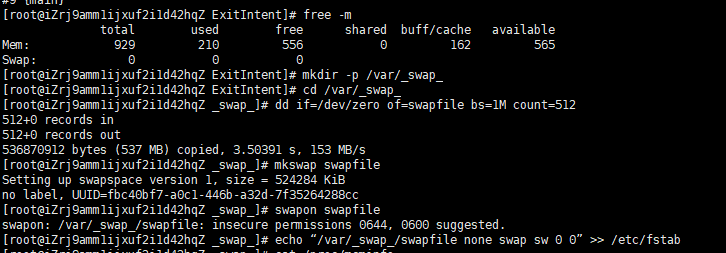
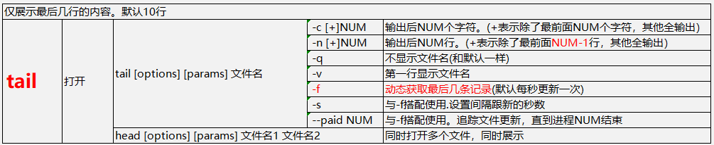

# linux常用命令

很好的中文linux命令：https://man.linuxde.net/


>**yum -y update  #更新yum**
>
> 
>
>**系统**
>
>\# uname -a           # 查看内核/操作系统/CPU信息
>\# head -n 1 /etc/issue  # 查看操作系统版本
>\# cat /proc/cpuinfo    # 查看CPU信息
>\# hostname         # 查看计算机名
>\# lspci -tv           # 列出所有PCI设备
>\# lsusb -tv           # 列出所有USB设备
>\# lsmod            # 列出加载的内核模块
>\# env              # 查看环境变量
>
>**资源**
>
>```
># free -m                # 查看内存使用量和交换区使用量
># df -h                  # 查看各分区使用情况
># du -sh <目录名>        # 查看指定目录的大小
># grep MemTotal /proc/meminfo   # 查看内存总量
># grep MemFree /proc/meminfo    # 查看空闲内存量
># uptime                 # 查看系统运行时间、用户数、负载
># cat /proc/loadavg      # 查看系统负载
>```
>
>**磁盘和分区**
>
>```
># mount | column -t      # 查看挂接的分区状态
># fdisk -l               # 查看所有分区
># swapon -s              # 查看所有交换分区
># hdparm -i /dev/hda     # 查看磁盘参数(仅适用于IDE设备)
># dmesg | grep IDE       # 查看启动时IDE设备检测状况
>```
>
>**网络**
>
>```
># ifconfig               # 查看所有网络接口的属性
># iptables -L            # 查看防火墙设置
># route -n               # 查看路由表
># netstat -lntp          # 查看所有监听端口
># netstat -antp          # 查看所有已经建立的连接
># netstat -s             # 查看网络统计信息  
>  
>```
>
>**进程** 
>
>```
># ps -ef # 查看所有进程 
># top # 实时显示进程状态  
>  
>```
>
>**用户** 
>\# w                  # 查看活动用户
>\# id  <用户名>           # 查看指定用户信息
>\#  last                # 查看用户登录日志
>\# cut -d:  -f1 /etc/passwd  # 查看系统所有用户
>\# cut -d: -f1 /etc/group    # 查看系统所有组
>\# crontab -l           #  查看当前用户的计划任务 
> 
>
>**服务** 
>\# chkconfig  --list         # 列出所有系统服务
>\# chkconfig --list |  grep on  # 列出所有启动的系统服务 
> 
>
>**程序**  
>\# rpm  -qa        # 查看所有安装的软件包 
> 
>
> 
>
>我要进入操作系统安装nginx: 
>
>1、这是什么系统？centos?ubuntu? 
>
>2、判断是否已经安装了nginx? 
>
>3、如果安装，存储空间是否足够（这个是磁盘吧）?  【查看内存# free -m  查看磁盘 #df -h】 
>
>4、安装过程，判断某端口是否被占用？以及某端口在防火墙中是否打开？ 
>
>https://man.linuxde.net/ 
>
> 
>
>  命令界面：
>
>​         [root@iZbp1aehdis8zyu6qm4w48Z www]# vim  a.txt 
>
>​         root 当前正在使用的用户 
>
>​         iZbp1aehdis8zyu6qm4w48Z 主机名 
>
>​         (~/www) 代表当前目录 
>
>​         $普通用户 #root用户
>
> 
>
> 
>
>1、 查看当前目录  pwd（Print Working Directory）
>
>​    查看当前shell  $SHELL
>
>​    查看当前用户  who / id
>
>2、切换工作目录  cd （Change Directory）
>
>​     （1）格式：cd [目录位置]
>
>​    　　特殊目录：
>
>​    　    　.当前目录
>
>　        　..上一级目录
>
>　　        ~用户主目录
>
>　　        -上个工作目录
>
>​    （2）cd ~==cd 回到家目录（快速返回家目录：cd ）
>
>​    （3）cd ~user1 切换到user1的家目录
>
>3、 创建新的目录   mkdir（Make Directory）
>
>​    （1）格式：mkdir [-p] [/路径名/] 目录名
>
>　　        -p：mkdir命令会自动检查目录名前边的路径中的每一层是否存在，如果不存在，将自动创建
>
>​    （2）例：　mkdir -p /opt/mp3 创建目录mp3
>
>4、创建新得文件  vim/touch
>
>​    vim不能创建带有不存在得目录得文件 如 vim /13sui/web/index.php   目录13sui与web有一个不存在
>
>5、删除空的目录   rmdir （只能删除空目录）（Remove Directory）
>
>6、 删除文件或目录  rm（删除目录必须用-r选项，删除非目录类型的文件，可以用也可以不用-r选项。建议：删除文件不要用-r选项。）
>
>​    （1）格式： rm [选项]...文件或目录
>
>　　    -f：强行删除文件或目录，不进行提醒
>
>　　    -r：递归删除整个目录树
>
>7、复制文件或目录 cp （copy）
>
>​    （1）格式：cp[选项]... 源文件或目录...目标文件或目录
>
>​    　　-r：递归复制整个目录树
>
>​    　　-a：复制时保留链接、文件属性，并递归的复制目录　　-a选线包含-r选项的功能，也包含了-p选项的功能
>
>​    　　-p：保留原来文件的权限
>
>​    　　-i：覆盖前会提醒
>
>​    　　-f：强制
>
>​    （2）例：
>
>　　    cp /etc/passwd /opt  将/etc/passwd文件复制到/opt目录下,没有改名
>
>　　    cp /etc/passwd /opt/a.txt  将/etc/passwd文件复制到/opt目录下并改名为a.txt
>
>​        cp -r /opt /tmp  将/opt目录或者文件都复制到/tmp目录下，这里要注意复制目录必须使用-r选项
>
>8、移动文件或目录  mv  （move） 如果目标位置和源位置相同，则相当于改名
>
>​    （1）格式：mv  [选项]...源文件或目录... 目标文件或目录
>
>​    （2）例：
>
>　　    mv  passwd /opt 将当前目录的passwd移动到/opt下，没有改名
>
>​    　　mv  passwd /opt/b.txt 将当前目录的passwd移动到/opt下,并改名为b.txt
>
>　　    mv opt  /home 将当前目录下的opt移动到/home目录下，没有改名
>
>不管是cp还是mv，如果有多个源文件或者目录，那就目标必须是存在的目录
>
> 
>
> 
>
> 
>
> 
>
> 
>
> 


## (一)、网络/接口

| 序号 | 指令     | centos默认 | 功能                                     | 备注 |
| ---- | -------- | ---------- | ---------------------------------------- | ---- |
| 1    | ping     | 有         |                                          |      |
| 2    | telnet   | 无         | 远程网络                                 |      |
| 3    | Netstat  | 有         | 本地网络                                 |      |
| 4    | route    | 有         |                                          |      |
| 5    | nslookup | 无         | 查DNS信息                                |      |
| 6    | arp      |            | 操作主机的arp缓冲区。ip地址和MAC对应关系 |      |


### 1、ping

`ping domain/ip 参数`

| 序号 | 参数    | 功能                 | 备注 |
| ---- | ------- | -------------------- | ---- |
| 1    | `-c 10` | 丢几次数据包         |      |
| 2    | `-i 5`  | 每个数据包的间隔时间 |      |

### 2、telnet

### 3、Netstat

Linux中网络系统的状态信息，可让你得知整个Linux系统的网络情况

| 序号 | 参数 | 功能                       | 备注 |
| ---- | ---- | -------------------------- | ---- |
| 1    | `-a` | 显示所有连线中的Socket     |      |
| 2    | `-t` | 显示TCP传输协议的连线状况  |      |
| 3    | `-u` | 显示UDP传输协议的连线状况  |      |
| 4    | `-c` | 每秒刷新结果               |      |
| 5    | `-l` | 显示监控中的服务器的Socket |      |

### 4、route

### 5、nslookup

### 6、arp

## 开虚拟内存swap

> ```shell
> free -m
> mkdir -p /var/_swap_
> cd /var/_swap_
> #Here, 1M * 2000 ~= 2GB of swap memory
> dd if=/dev/zero of=swapfile bs=1M count=2000
> mkswap swapfile
> swapon swapfile
> echo “/var/_swap_/swapfile none swap sw 0 0” >> /etc/fstab
> #cat /proc/meminfo
> free -m
> ```
>
> 



## 文件

### 查看文件

#### cat


#### tail



#### head


#### more


#### less


### 文件权限

查看文件权限

ls -l [目录/文件]路径

 

[root@iZbp1aehdis8zyu6qm4w48Z etc]# ls -l /etc/passwd
-rw-r--r-- 1 root root 1119 Mar 13 15:13  /etc/passwd


| -rw-r--r-- |      | 1            |      | root |      | root |      | 1119 Mar  13 13:13 |      | /etc/passwd |
| ---------- | ---- | ------------ | ---- | ---- | ---- | ---- | ---- | ------------------ | ---- | ----------- |
| 权限       |      | 文件硬链接数 |      | 用户 |      | 群组 |      | 创建日期           |      | 文件名      |


 

权限：[-] [rw-] [r--]  [r--]     r-可读(4)；w-可写(2)；x-可执行(1)

> [-]     文件类型
>
> [rw-]   用户拥有的权限
>
> [r--]    用户所在群组拥有的权限
>
> [r--]    其他用户拥有的权限

> r:  读
>
> w: 写
>
> x: 执行
>
> s: 特殊 ls -ld /tmp
>
> t:  特殊 ls -l /usr/bin/passwd

​    文件类型

> | -    | 普通文件     |                        |
> | ---- | ------------ | ---------------------- |
> | d    | 目录         |                        |
> | l    | 链接文件     |                        |
> | b    | 块设备文件   | 硬盘、光盘             |
> | c    | 字符设备文件 | 键盘等                 |
> | p    | 命令管道文件 | 与shell编程 有关的文件 |
> | s    | sock文件     |                        |

 

#### 修改文件/目录权限chmod

##### 方式一：chmod  [ugoa][+-][rwx] 文件

> u：用户
>
> g：群组
>
> o：其他
>
> a：全部【包含用户、群组、其他】
>
>  
>
> +：加权限
>
> -：减权限

比如：chmod u+wx a.txt 给a.txt的用户(拥有者)添加写和执行的权限

​      chmod o-x a.txt  全部用户不能执行这个文件

 

##### 方式二：chmod 777  a.txt   7= 4读+2写+1执行

##### 方式三：chmod -R  777 /www   递归把/www及其目录下的全部文件和目录

 

#### 修改文件/目录的拥有者chown

## 用户-群组

优秀链接：https://blog.csdn.net/freeking101/article/details/78201539

**前言：**

  本篇讲解用户和群组，根据linux的历史他的开发起点就是满足多个用户使用同一台机器的想法，所以linux有一套非常完美的用户管理系统。 

**粗解：**

 linux下会将一个用户分配到一个用户组内，进行统一管理，所以，linux下会建立一个passwd表和group表，这两个表负责管理用户和用户组，并且会将两个表中的密码进行单独提出，分配两个表分别是shadow负责管理用户密码和gshadow负责管理用户组密码。

### **核心文件**

> /etc/login.defs       创建用户的一些默认限制的配置 
>
> /etc/skel           用户启动文件的目录(这里是模板，创建用户会自动复制) ls -la /etc/skel 
>
> /etc/default/useradd   通过useradd添加用户时的规则文件 
>
>  
>
> /etc/passwd        用户文件 
>
> /etc/shadow        用户密码文件 
>
> /etc/group         群组文件 
>
> /etc/gshadow       群组密码文件 

### **用户操作**

> useradd     添加用户【[d]起始目录/[e|f]账号有效期/[g|G]归属群组/[s]登录shell命令】--【还有一个叫密码有效期】 
>
> usermod　  修改用户【添加的都可以修改】　   
>
> userdel     删除用户 

### **群组操作**

> groupadd   添加群组【[f]如果群组名存在，强制覆盖】 
>
> groupmod　修改群组【[n]修改群组名字】　　
>
> groupdel　  删除群组 

 

chgrp chown su gpasswd 

su   su默认切到root

#### **su user 与su -  user的区别** 

​    su  只改变用户角色 

​    su  - 改变用户角色并改变shell环境 

 

查看全部用户 

​    cut -d : -f 1  /etc/passwd 

​    cat /etc/passwd |awk -F  \: '{print $1}' 

​    cat /etc/passwd 

1、查看某个user加入了哪些群组？  

​    usermod -G 群组1,群组2  用户   

​     groups 用户名 

   cat /etc/group | grep 用户 

2、查看某个group中加入了哪些用户 

​    

3、修改file/document的用户 

​    

4、修改file/document的群组 

​    

5、用户账户有效期 

   【添加】useradd -e 2030-12-31 用户名 

​     【修改】usermod -e 2031-12-31 用户名 

​    【查看】  chage -l 用户名 

6、用户密码有效期 

​     【添加】 

​     【修改】  

​    【查看】  chage -l 用户名 


## 找文件

##### which  nginx 

##### whereis  nginx 

##### locate  php.ini       找文件 （yum install mlocate/updatedb）

 

出于各种原因，要判断实际需要的东西在哪个软件包里，需要有点儿小技巧。

可以使用`which`命令来查找相关的二进制程序是否在搜索路径中:

```
$ which gcc/opt/pware/bin/gcc
```

如果`which`没有找到要找的命令，那么可以试试`whereis`；该命令可以搜素更大范围的系统目录，与shell的搜索路径无关。

另外可以使用`locate`命令，它参照预先编译好的一个文件系统索引，以此确定与特定模式相匹配的文件名。`locate`的搜索并不只针对命令或者软件包，而是能够找到任何类型的文件。例如，如果读者不知道头文件`signal.h`在哪里：

```shell
$ locate signal.h
/usr/include/signal.h
/usr/include/asm/signal.h
/usr/include/asm-generic/signal.h
/usr/include/linux/signal.h
```

`locate`命令需要维持一个数据库，这个数据库通常由`updatedb`命令定期更新，这条命令由`cron`运行。因此，执行locate的结果并不总是能反应最近文件系统的变化。

如果用户知道要查找的软件包的名字，也可以使用系统上的软件包工具来直接检查是否存在该软件包。例如，在Red  Hat或者SUSE系统上，可以使用鲜面的命令检查是否有Python：

```shell
$ rpm -q python
python-2.4.3-21.e15
```

如果使用Debian系统，可以使用`dpkg  -s`或者`dpkg-query`命令.

# shell程序

## (一)、入门须知

### 1、文件命名

比如my.sh 以.sh结尾

### 2、文件格式

以输出hello world为例

>```shell
>#!/bin/bash
>echo "hello world"
>
>```

### 3、注释方式

#### (1)、单行注释

> * `#`
>
>   ```shell
>   #!/bin/bash
>   #我是注释
>   ```
>
>   

#### (2)、多行注释

### 4、行结束标志

每行用什么标志表示该行结束

### 5、文档文献

### 6、文件参数

>指令行输入如下：
>
>```shell
>#  sh test.sh 1 2 3
>```
>
>test.sh内部该如何接收参数？
>
>* 在test.sh中，
>* * \$0代表执行文件按名:test.sh；
>* * \$1代表1；\$2代表2；\$3代表3。

如何要求在文档运行中途必须传入参数？

>```shell
>#!/bin/bash
>echo 'please enter your name:'
>read yourName
>```
>
>运行sh ./test.sh 
>
>提示：please enter your name:
>
>输入....回车。输入的内容被变量`yourName`接收
>
>文件继续往下走....

## (二)、语法

### 1、数据类型

#### (1)、类型列表

| 序号 | 类型  | 举例          | 备注                       |
| ---- | ----- | ------------- | -------------------------- |
|      | array | (1 2 'a' 'b') | 调用`${array_name[index]}` |


#### (2)、细说数据类型

#### (3)、类型强转化

### 2、运算符

#### 运算符优先级

#### (1)、算数运算符

加减乘除求模求幂

#### (2)、比较运算符

#### (3)、逻辑运算符

### 3、流程控制

#### (1)、循环

for / while等

#### (2)、判断

if等

#### (3)、引入文件

#### (4)、异常

##### (5)、其他


goto

### 4、变量(区分大小写)

#### 命名规则

#### 声明定义、赋值(初始化)、调用

正确举例

>```shell
>var='hello world'
>var='hello china'
>var2=$var
>echo $var2#输出hello china
>```

错误举例

>```shell
>var = 'hello world'#错误 等号两边不能有空格
>$var='hello world'#错误，声明定义和赋值变量时都不用$,只有调用才需要$
>```

未知

>
>
>```shell
>echo var3
>echo $var4
>```
>
>

### 5、function

1、命名规则

2、声明定义和初始化


### 6、对象

### 7、进程性指令

### 8、其他语法

### 错误处理errors

## 预定义

(一)、预定义数据载体

(二)、预定义异常

## 常用功能扩展

更新git-yii

>
>
>```shell
>#!/bin/bash
>PROJECT='Collection'
>CONID='fengjinliang' 
>CONKEY='aaaaa' 
>GITBRANCH = 'dev'
>
>
>echo "please enter your project:"
>read projectName2
>
>cd /root/project/weshare/dev/Collection
>git checkout ${GITBRANCH}
>expect -c "spawn git pull origin ${GITBRANCH}; expect \"*Username*\" { send \"${CONID}\n\"; exp_continue } \"*Password*\" { send \"${CONKEY}\n\" }; interact"
>expect -c "spawn php yii migrate; expect \"*Apply the above migration*\" { send \"yes\r\"; }; interact"
>```
>
>


# FTP TFTP  SFTP

# nginx

中文文档： https://www.nginx.cn/doc/